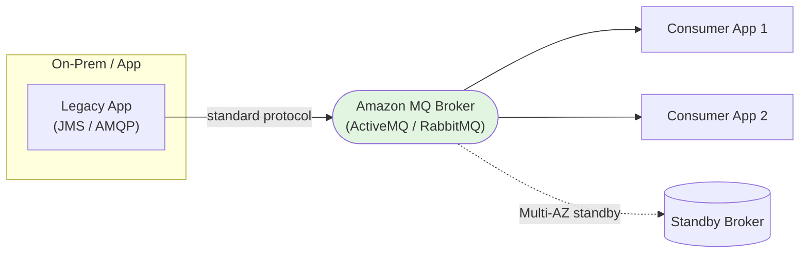

# Amazon MQ - Fundamentals & Deep Dive (SAA-C03)

> Amazon **MQ** is a managed **message broker** for **Apache ActiveMQ** and **RabbitMQ**. It exists for one exam reason: **migrating existing on-premises apps that use industry-standard protocols (JMS, AMQP, MQTT, STOMP, OpenWire, WebSocket)** to AWS **without rewriting** them to use SQS/SNS.

See also: [02 - Amazon MQ Architecture & Examples](02%20-%20Amazon%20MQ%20Architecture%20%26%20Examples.md) · [03 - Amazon MQ Scenarios, Best Practices & Troubleshooting](03%20-%20Amazon%20MQ%20Scenarios%2C%20Best%20Practices%20%26%20Troubleshooting.md) · [01 - SQS Fundamentals & Deep Dive](01%20-%20SQS%20Fundamentals%20%26%20Deep%20Dive.md) · [01 - SNS Fundamentals & Deep Dive](01%20-%20SNS%20Fundamentals%20%26%20Deep%20Dive.md)

---

## Table of Contents

- [1. What Is Amazon MQ and Why It Exists](#1-what-is-amazon-mq-and-why-it-exists)
- [2. The Decision: Amazon MQ vs SQS/SNS](#2-the-decision-amazon-mq-vs-sqssns)
- [3. ActiveMQ vs RabbitMQ](#3-activemq-vs-rabbitmq)
- [4. Broker Architecture & Deployment Modes](#4-broker-architecture--deployment-modes)
- [5. High Availability & Failover](#5-high-availability--failover)
- [6. Protocols Supported](#6-protocols-supported)
- [7. Networking & Connectivity](#7-networking--connectivity)
- [8. Security](#8-security)
- [9. Storage & Performance](#9-storage--performance)
- [10. Key Takeaways](#10-key-takeaways)

---

---

## 1. What Is Amazon MQ and Why It Exists

Amazon MQ is a **managed message broker** that runs **ActiveMQ** or **RabbitMQ** for you (provisioning, patching, HA, monitoring). SQS and SNS are AWS-proprietary - your app must use the AWS SDK. **Amazon MQ speaks open standard protocols**, so an existing app already using JMS/AMQP/MQTT can connect with **little or no code change**.

> **The one-sentence exam trigger:** "Migrate an **existing** on-premises application that uses a **standard messaging protocol/broker** to AWS **without rewriting** it." → **Amazon MQ.**

If you were building **new** on AWS, you'd choose **SQS/SNS** (serverless, cheaper, infinitely scalable). Amazon MQ is the **lift-and-shift / migration** choice.

[⬆ Back to top](#table-of-contents)

---

## 2. The Decision: Amazon MQ vs SQS/SNS

| Factor                 | **Amazon MQ**                                     | **SQS / SNS**                                 |
| :--------------------- | :------------------------------------------------ | :-------------------------------------------- |
| **Use case**           | Migrate existing broker-based apps                | New cloud-native apps                         |
| **Protocols**          | JMS, AMQP 0-9-1, MQTT, STOMP, OpenWire, WebSocket | AWS SDK/API (HTTPS) only                      |
| **Management**         | You pick instance size; AWS manages broker        | Fully serverless, no sizing                   |
| **Scaling**            | Limited to broker instance capacity (vertical)    | Virtually unlimited (SQS)                     |
| **HA**                 | Active/standby or cluster, Multi-AZ               | Built-in across AZs                           |
| **Both queue & topic** | **Yes** (queues + pub/sub topics in one broker)   | SQS = queue, SNS = topic (separate)           |
| **Cost**               | Pay for running broker instances                  | Pay per request (cheaper at low/spiky volume) |

> **Default answer:** unless the question says "existing broker / standard protocol / migrate without rewriting," prefer **SQS/SNS**.

[⬆ Back to top](#table-of-contents)

---

## 3. ActiveMQ vs RabbitMQ

Amazon MQ supports two engines:

|                   | **Apache ActiveMQ**                             | **RabbitMQ**                            |
| :---------------- | :---------------------------------------------- | :-------------------------------------- |
| **Protocols**     | JMS, AMQP, MQTT, STOMP, OpenWire, WebSocket     | AMQP 0-9-1 (primarily)                  |
| **Model**         | Queues + topics; JMS-centric                    | Exchanges + queues; flexible routing    |
| **Common origin** | Java/JMS enterprise apps                        | AMQP microservices                      |
| **HA**            | Active/standby (with EFS) or network of brokers | Cluster deployment (3 nodes across AZs) |

Pick the engine that **matches the app you're migrating** (don't change the broker type during a lift-and-shift).

[⬆ Back to top](#table-of-contents)

---

## 4. Broker Architecture & Deployment Modes

A **broker** is the managed message broker environment (one or more instances).

| Mode                                 | Description                                                                        | Use                        |
| :----------------------------------- | :--------------------------------------------------------------------------------- | :------------------------- |
| **Single-instance broker**           | One broker in one AZ                                                               | Dev/test; no HA            |
| **Active/standby broker (ActiveMQ)** | Two brokers across **2 AZs** sharing **Amazon EFS**; standby takes over on failure | Production HA              |
| **Cluster deployment (RabbitMQ)**    | **3 broker nodes** across multiple AZs                                             | Production HA + throughput |

- **Broker instance types** (e.g., `mq.m5.large`) define CPU/memory - you size them (unlike serverless SQS).

[⬆ Back to top](#table-of-contents)

---

## 5. High Availability & Failover

- **ActiveMQ active/standby:** Two instances in different AZs share storage via **EFS**. If the active fails, the standby becomes active. A brief failover pause occurs while clients reconnect.
- **RabbitMQ cluster:** 3 nodes mirror queues across AZs for resilience.
- Clients should use the **failover transport** / multiple endpoints to reconnect automatically.

> **Exam:** "Make Amazon MQ highly available across AZs." → **Active/standby (ActiveMQ)** or **cluster (RabbitMQ)** Multi-AZ deployment.

[⬆ Back to top](#table-of-contents)

---

## 6. Protocols Supported

This is the reason Amazon MQ exists - **open wire protocols**:

- **JMS** (Java Message Service)
- **AMQP 0-9-1** (Advanced Message Queuing Protocol)
- **MQTT** (IoT / lightweight pub/sub)
- **STOMP** (Simple Text Oriented Messaging Protocol)
- **OpenWire** (ActiveMQ native)
- **WebSocket**

> **Exam keyword mapping:** see **JMS / AMQP / MQTT / STOMP** in a question → think **Amazon MQ**, not SQS/SNS.

[⬆ Back to top](#table-of-contents)

---

## 7. Networking & Connectivity

- Amazon MQ brokers run **inside your VPC** (private subnets recommended).
- Connect from on-prem via **VPN or Direct Connect**; from apps via VPC networking.
- Brokers can be **publicly accessible** (not recommended) or **private** (recommended).
- Clients connect using broker endpoints (e.g., `ssl://...:61617` for OpenWire).

[⬆ Back to top](#table-of-contents)

---

## 8. Security

| Layer                     | Mechanism                                                          |
| :------------------------ | :----------------------------------------------------------------- |
| **Network**               | VPC + **security groups**; private subnets.                        |
| **Encryption in transit** | TLS for all supported protocols.                                   |
| **Encryption at rest**    | **KMS** (AWS-managed or customer-managed keys).                    |
| **Authentication**        | Native broker users (username/password) or **LDAP** integration.   |
| **Authorization**         | Broker-level (ActiveMQ authorization maps / RabbitMQ permissions). |

> Note: Amazon MQ uses **broker-native auth (or LDAP)**, not IAM, for message-level access (IAM controls the **management** API).

[⬆ Back to top](#table-of-contents)

---

## 9. Storage & Performance

- **Storage types:** durability-optimized (EFS-backed, Multi-AZ for ActiveMQ HA) vs throughput-optimized (EBS, single-instance, higher performance).
- **Throughput is bounded by the broker instance size** (vertical scaling) - unlike SQS's unlimited horizontal scale.
- For very high throughput / spiky workloads, SQS/SNS is usually better; Amazon MQ trades scale for protocol compatibility.

[⬆ Back to top](#table-of-contents)

---

## 10. Key Takeaways

| Concept           | Must-Know                                                                         |
| :---------------- | :-------------------------------------------------------------------------------- |
| **Purpose**       | Managed ActiveMQ/RabbitMQ for **migrating existing broker apps** without rewrite. |
| **Trigger words** | JMS, AMQP, MQTT, STOMP, OpenWire, "existing broker", "without code change".       |
| **vs SQS/SNS**    | New cloud-native → SQS/SNS; migration/standard protocols → Amazon MQ.             |
| **Both models**   | One broker provides **queues and topics**.                                        |
| **HA**            | ActiveMQ active/standby (EFS, 2 AZ) or RabbitMQ cluster (3 nodes).                |
| **Scaling**       | Vertical (instance size), not unlimited like SQS.                                 |
| **Security**      | VPC + SG, TLS, KMS, broker/LDAP auth (not IAM for messages).                      |

[⬆ Back to top](#table-of-contents)
