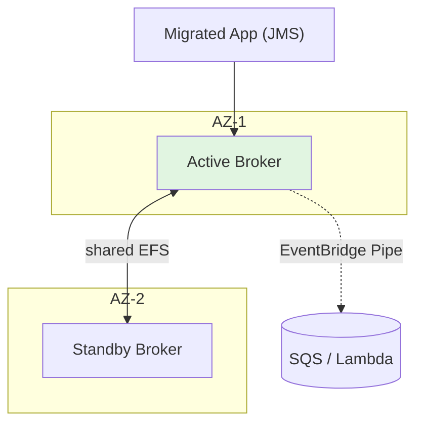

# Amazon MQ - Architecture Patterns & Examples (SAA-C03)

> Amazon MQ patterns are mostly **migration** patterns. Recognize the lift-and-shift shapes and the HA topologies.

See also: [01 - Amazon MQ Fundamentals & Deep Dive](01%20-%20Amazon%20MQ%20Fundamentals%20%26%20Deep%20Dive.md) · [03 - Amazon MQ Scenarios, Best Practices & Troubleshooting](03%20-%20Amazon%20MQ%20Scenarios%2C%20Best%20Practices%20%26%20Troubleshooting.md) · [02 - SQS Architecture & Examples](02%20-%20SQS%20Architecture%20%26%20Examples.md)

---

## Table of Contents

- [1. Lift-and-Shift Migration](#1-lift-and-shift-migration)
- [2. Hybrid (On-Prem ↔ Cloud) Messaging](#2-hybrid-on-prem--cloud-messaging)
- [3. High-Availability Topologies](#3-high-availability-topologies)
- [4. Bridging Amazon MQ to SQS/SNS/Lambda](#4-bridging-amazon-mq-to-sqssnslambda)
- [5. Queue vs Topic in One Broker](#5-queue-vs-topic-in-one-broker)
- [6. Code & IaC Examples](#6-code--iac-examples)
- [7. Pattern Selection Cheat Sheet](#7-pattern-selection-cheat-sheet)

---



---

## 1. Lift-and-Shift Migration

The core use case: an on-prem app using ActiveMQ/RabbitMQ moves to AWS.

- Stand up an **Amazon MQ broker** with the **same engine**.
- Repoint the app's broker endpoint - **no code rewrite** because the protocol (JMS/AMQP) is unchanged.
- Optionally migrate consumers gradually.

> **Exam:** "Move an existing JMS/AMQP app to AWS quickly, minimal changes." → **Amazon MQ.**

[⬆ Back to top](#table-of-contents)

---

## 2. Hybrid (On-Prem ↔ Cloud) Messaging

During migration, on-prem and cloud components coexist:

- Connect on-prem producers to the cloud broker over **Direct Connect / VPN**.
- Brokers in a **network of brokers** (ActiveMQ) can bridge on-prem and AWS during transition.

[⬆ Back to top](#table-of-contents)

---

## 3. High-Availability Topologies

| Engine       | HA Topology                                                                  |
| :----------- | :--------------------------------------------------------------------------- |
| **ActiveMQ** | **Active/standby** across 2 AZs, shared **EFS** storage; automatic failover. |
| **RabbitMQ** | **Cluster** of 3 nodes across AZs with mirrored queues.                      |

Clients use **failover URLs** (e.g., `failover:(ssl://b1,ssl://b2)`) to reconnect automatically after failover.

[⬆ Back to top](#table-of-contents)

---

## 4. Bridging Amazon MQ to SQS/SNS/Lambda

To modernize gradually, bridge the broker to native AWS services:

- **EventBridge Pipes** supports **Amazon MQ as a source** → filter/enrich → SQS/SNS/Lambda/Step Functions.
- **Lambda** can consume from Amazon MQ (ActiveMQ/RabbitMQ) via an **event source mapping**.

> **Exam:** "Trigger Lambda from messages on an existing ActiveMQ/RabbitMQ broker." → **Lambda event source mapping for Amazon MQ** (or EventBridge Pipes).

[⬆ Back to top](#table-of-contents)

---

## 5. Queue vs Topic in One Broker

Unlike AWS-native (SQS = queue, SNS = topic, separate services), a **single Amazon MQ broker** provides **both**:

- **Queues** for point-to-point (one consumer per message).
- **Topics** for publish/subscribe (fan-out to subscribers).

This matches apps that already use both JMS queues and topics.

[⬆ Back to top](#table-of-contents)

---

## 6. Code & IaC Examples

**Create a broker (CLI):**

```bash
aws mq create-broker \
  --broker-name orders-broker \
  --engine-type ACTIVEMQ \
  --engine-version 5.17.6 \
  --host-instance-type mq.m5.large \
  --deployment-mode ACTIVE_STANDBY_MULTI_AZ \
  --publicly-accessible false \
  --subnet-ids subnet-aaa subnet-bbb \
  --security-groups sg-123 \
  --users '[{"Username":"appuser","Password":"<secret>","ConsoleAccess":true}]'
```

**Active/standby broker (Terraform):**

```hcl
resource "aws_mq_broker" "orders" {
  broker_name         = "orders-broker"
  engine_type         = "ActiveMQ"
  engine_version      = "5.17.6"
  host_instance_type  = "mq.m5.large"
  deployment_mode     = "ACTIVE_STANDBY_MULTI_AZ"
  publicly_accessible = false
  subnet_ids          = [aws_subnet.a.id, aws_subnet.b.id]
  security_groups     = [aws_security_group.mq.id]

  encryption_options { use_aws_owned_key = false; kms_key_id = aws_kms_key.mq.arn }

  user {
    username = "appuser"
    password = var.mq_password
  }
}
```

**JMS failover connection string (client):**

```
failover:(ssl://b-1.mq.us-east-1.amazonaws.com:61617,ssl://b-2.mq.us-east-1.amazonaws.com:61617)
```

[⬆ Back to top](#table-of-contents)

---

## 7. Pattern Selection Cheat Sheet

| Requirement                             | Pattern                                         |
| :-------------------------------------- | :---------------------------------------------- |
| Migrate existing JMS/AMQP app           | **Amazon MQ** lift-and-shift                    |
| HA broker across AZs (ActiveMQ)         | **Active/standby Multi-AZ** (EFS)               |
| HA broker (RabbitMQ)                    | **3-node cluster**                              |
| Trigger Lambda from broker messages     | **Lambda event source** / **EventBridge Pipes** |
| Need both queue + pub/sub in one broker | Single Amazon MQ broker (queues + topics)       |
| New cloud-native messaging              | Use **SQS/SNS**, not Amazon MQ                  |

[⬆ Back to top](#table-of-contents)
