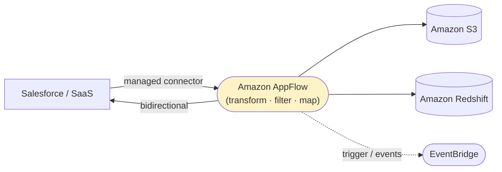

# Amazon AppFlow - Fundamentals & Deep Dive (SAA-C03)

> Amazon **AppFlow** is a fully managed **integration / data-transfer** service that moves data **bidirectionally between SaaS applications** (Salesforce, ServiceNow, Slack, Google Analytics, Zendesk…) **and AWS services** (S3, Redshift) **without writing custom API integration code**.

See also: [02 - AppFlow Architecture & Examples](02%20-%20AppFlow%20Architecture%20%26%20Examples.md) · [03 - AppFlow Scenarios, Best Practices & Troubleshooting](03%20-%20AppFlow%20Scenarios%2C%20Best%20Practices%20%26%20Troubleshooting.md) · [01 - EventBridge Fundamentals & Deep Dive](01%20-%20EventBridge%20Fundamentals%20%26%20Deep%20Dive.md) · [01 - Amazon Redshift Fundamentals & Deep Dive](01%20-%20Amazon%20Redshift%20Fundamentals%20%26%20Deep%20Dive.md)

---

## Table of Contents

- [1. What Is AppFlow and Why It Exists](#1-what-is-appflow-and-why-it-exists)
- [2. Core Concepts: Flows, Connections, Mappings](#2-core-concepts-flows-connections-mappings)
- [3. Supported Sources & Destinations](#3-supported-sources--destinations)
- [4. Triggers: Run On-Demand, Scheduled, Event-Driven](#4-triggers-run-on-demand-scheduled-event-driven)
- [5. Data Transformation & Filtering](#5-data-transformation--filtering)
- [6. Security & Private Connectivity](#6-security--private-connectivity)
- [7. AppFlow vs Glue vs DMS vs EventBridge](#7-appflow-vs-glue-vs-dms-vs-eventbridge)
- [8. Pricing](#8-pricing)
- [9. Key Takeaways](#9-key-takeaways)

---

---

## 1. What Is AppFlow and Why It Exists

Integrating a SaaS app (e.g., Salesforce) with AWS normally means writing and maintaining **custom code** against the SaaS API: auth, pagination, rate limits, retries, schema mapping. **AppFlow does all of that for you** with **pre-built managed connectors** and a **no-code** flow designer.

- **No-code / low-code:** Configure a "flow" in the console - no API integration code.
- **Bidirectional:** Pull data **from** SaaS into AWS, or push **from** AWS to SaaS.
- **Managed:** Auth, throttling, retries, and pagination handled for you.

> **Exam trigger:** "Securely transfer data **between a SaaS application and AWS (S3/Redshift)** **without building/maintaining custom integration code**." → **Amazon AppFlow.**

[⬆ Back to top](#table-of-contents)

---

## 2. Core Concepts: Flows, Connections, Mappings

| Concept                    | Meaning                                                                                    |
| :------------------------- | :----------------------------------------------------------------------------------------- |
| **Flow**                   | A configured data transfer: source → (transform/filter/map) → destination, with a trigger. |
| **Connection / Connector** | The managed integration to a SaaS app or AWS service (stores credentials/OAuth).           |
| **Field mapping**          | Map source fields to destination fields (rename, concatenate, mask).                       |
| **Filters**                | Only transfer records meeting criteria (e.g., `status = closed`).                          |
| **Transformations**        | Mask, truncate, validate, arithmetic, concatenation at transfer time.                      |

[⬆ Back to top](#table-of-contents)

---

## 3. Supported Sources & Destinations

**Sources (examples):** Salesforce, ServiceNow, Slack, Google Analytics, Marketo, Zendesk, SAP, Datadog, Singular, Trend Micro, Amplitude, plus **S3**.

**Destinations (examples):** **Amazon S3**, **Amazon Redshift**, Salesforce, Snowflake, Upsolver, Zendesk, Marketo, SAP, and more.

- **S3 and Redshift** are the most exam-relevant AWS destinations (build a data lake / warehouse from SaaS data).
- Many connectors are **bidirectional** (can be source or destination).

[⬆ Back to top](#table-of-contents)

---

## 4. Triggers: Run On-Demand, Scheduled, Event-Driven

| Trigger             | Behavior                                                                            |
| :------------------ | :---------------------------------------------------------------------------------- |
| **Run on demand**   | Manual / API-initiated single run.                                                  |
| **Run on schedule** | Recurring (e.g., every hour) - incremental or full transfers.                       |
| **Run on event**    | Triggered by a SaaS event (e.g., a new Salesforce record) for near-real-time flows. |

Flows can do **full** or **incremental** transfers (only changed records since last run).

[⬆ Back to top](#table-of-contents)

---

## 5. Data Transformation & Filtering

AppFlow can transform data **in-flight**, so you often don't need a separate ETL step for simple cases:

- **Filtering:** transfer only matching records.
- **Mapping:** rename/restructure fields.
- **Masking & truncation:** hide sensitive fields (PII) during transfer.
- **Validation:** drop or flag records failing rules.
- **Concatenation / arithmetic:** simple derived fields.

For heavy/complex transformations, land raw data in **S3** and use **Glue**.

[⬆ Back to top](#table-of-contents)

---

## 6. Security & Private Connectivity

| Layer                | Mechanism                                                                                                         |
| :------------------- | :---------------------------------------------------------------------------------------------------------------- |
| **Encryption**       | TLS in transit; **KMS** at rest (AWS-managed or CMK).                                                             |
| **Auth to SaaS**     | OAuth / API keys stored securely by AWS (often via Secrets Manager).                                              |
| **Private transfer** | **AWS PrivateLink** - data flows over the AWS network, not the public internet (where the connector supports it). |
| **Access control**   | IAM controls who can create/run flows.                                                                            |

> **Exam:** "Transfer SaaS data to AWS **privately, without traversing the public internet**." → AppFlow over **PrivateLink**.

[⬆ Back to top](#table-of-contents)

---

## 7. AppFlow vs Glue vs DMS vs EventBridge

| Service                       | Primary Job                                                           |
| :---------------------------- | :-------------------------------------------------------------------- |
| **AppFlow**                   | **SaaS ↔ AWS** data transfer, no-code, with light transform.          |
| **AWS Glue**                  | Serverless **ETL** (heavy transform, catalog) within AWS data stores. |
| **AWS DMS**                   | **Database migration/replication** (RDBMS, NoSQL) to AWS.             |
| **EventBridge (partner bus)** | **Event** routing from SaaS (per-event), not bulk record transfer.    |

> **Discriminators:** SaaS bulk/record transfer with no code → **AppFlow**. Heavy ETL → **Glue**. Database replication → **DMS**. SaaS _events_ into an event-driven flow → **EventBridge partner bus**.

[⬆ Back to top](#table-of-contents)

---

## 8. Pricing

- Pay **per flow run** plus **data processed** (per GB). No infrastructure to manage.
- Cost-effective vs building and operating custom integration code.

[⬆ Back to top](#table-of-contents)

---

## 9. Key Takeaways

| Concept           | Must-Know                                                          |
| :---------------- | :----------------------------------------------------------------- |
| **Purpose**       | No-code, bidirectional **SaaS ↔ AWS** data transfer.               |
| **Trigger words** | Salesforce/ServiceNow/Slack/SaaS + S3/Redshift + "no custom code". |
| **Triggers**      | On-demand, scheduled, or event-driven.                             |
| **Transform**     | Filter, map, mask, validate in-flight.                             |
| **Private**       | PrivateLink for non-internet transfer.                             |
| **vs Glue/DMS**   | Glue = ETL, DMS = DB migration, AppFlow = SaaS connectors.         |
| **Destinations**  | S3 and Redshift are most exam-relevant.                            |

[⬆ Back to top](#table-of-contents)
