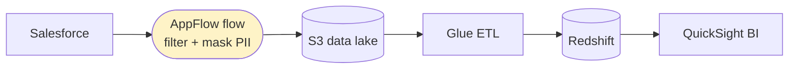

# Amazon AppFlow - Architecture, Scenarios & SRE Troubleshooting (SAA-C03)

> AppFlow is a narrow but high-yield exam topic: recognize "SaaS ↔ AWS, no code" and pick it over Glue/DMS/Lambda. This file is patterns + scenarios + troubleshooting.

See also: [01 - AppFlow Fundamentals & Deep Dive](01%20-%20AppFlow%20Fundamentals%20%26%20Deep%20Dive.md) · [02 - EventBridge Architecture & Examples](02%20-%20EventBridge%20Architecture%20%26%20Examples.md) · [01 - Amazon Redshift Fundamentals & Deep Dive](01%20-%20Amazon%20Redshift%20Fundamentals%20%26%20Deep%20Dive.md)

---

## Table of Contents

- [1. Architecture Patterns](#1-architecture-patterns)
- [2. Code & IaC Examples](#2-code--iac-examples)
- [3. Scenario-Based Questions](#3-scenario-based-questions)
- [4. Best Practices](#4-best-practices)
- [5. Common Errors & Troubleshooting (SRE View)](#5-common-errors--troubleshooting-sre-view)
- [6. Rapid-Fire Facts](#6-rapid-fire-facts)

---



---

## 1. Architecture Patterns

**A. SaaS → S3 data lake.** Pull Salesforce/Zendesk records on a schedule into S3 (raw zone); Glue/Athena/Redshift query downstream. The canonical analytics ingestion pattern.

**B. SaaS → Redshift warehouse.** Land SaaS data directly into Redshift for BI dashboards (QuickSight).

**C. Event-driven sync.** A new SaaS record triggers an **event-based flow** for near-real-time updates into AWS.

**D. AWS → SaaS push.** Send curated data from S3 back **into** a SaaS app (e.g., enriched leads back to Salesforce) - bidirectional.

**E. PII-safe transfer.** Mask/truncate sensitive fields in-flight so raw PII never lands in S3.

[⬆ Back to top](#table-of-contents)

---

## 2. Code & IaC Examples

**Create a Salesforce → S3 flow (Terraform):**

```hcl
resource "aws_appflow_flow" "sf_to_s3" {
  name = "salesforce-accounts-to-s3"

  source_flow_config {
    connector_type         = "Salesforce"
    connector_profile_name = aws_appflow_connector_profile.sf.name
    source_connector_properties {
      salesforce { object = "Account" }
    }
  }

  destination_flow_config {
    connector_type = "S3"
    destination_connector_properties {
      s3 {
        bucket_name   = aws_s3_bucket.lake.bucket
        bucket_prefix = "salesforce/accounts"
        s3_output_format_config { file_type = "PARQUET" }
      }
    }
  }

  task {
    task_type     = "Filter"
    source_fields = ["BillingCountry"]
    connector_operator { salesforce = "EQUAL_TO" }
  }

  trigger_config {
    trigger_type = "Scheduled"
    trigger_properties {
      scheduled { schedule_expression = "rate(1hours)" }
    }
  }
}
```

**Start a flow on demand (CLI):**

```bash
aws appflow start-flow --flow-name salesforce-accounts-to-s3
```

[⬆ Back to top](#table-of-contents)

---

## 3. Scenario-Based Questions

**Q1.** A company wants to copy Salesforce opportunities into S3 hourly for analytics, without writing/maintaining API code.
**A.** **Amazon AppFlow** scheduled flow Salesforce → S3.

---

**Q2.** Sensitive PII fields must be masked before SaaS data lands in S3.
**A.** AppFlow **in-flight transformation** (mask/truncate fields).

---

**Q3.** SaaS data must reach AWS **without traversing the public internet**.
**A.** AppFlow over **AWS PrivateLink**.

---

**Q4.** They need heavy joins/aggregations across many datasets after ingestion.
**A.** AppFlow to **S3**, then **AWS Glue** for the heavy ETL (AppFlow only does light transforms).

---

**Q5.** Replicate an on-prem **Oracle database** to AWS continuously.
**A.** **AWS DMS** (not AppFlow - that's for SaaS apps, not databases).

---

**Q6.** React to each new ServiceNow ticket as an event in an event-driven workflow.
**A.** **EventBridge partner event bus** (per-event), or AppFlow **event-triggered** flow if you need the record data transferred.

---

**Q7.** Push curated customer segments from a Redshift/S3 dataset back into Salesforce.
**A.** AppFlow **bidirectional** flow (AWS → Salesforce).

[⬆ Back to top](#table-of-contents)

---

## 4. Best Practices

| Area                | Best Practice                                                           |
| :------------------ | :---------------------------------------------------------------------- |
| **Right tool**      | AppFlow for SaaS connectors; Glue for ETL; DMS for DB replication.      |
| **Incremental**     | Use incremental transfers to reduce volume/cost.                        |
| **Mask PII early**  | Transform/mask in-flight so raw PII never lands.                        |
| **Private**         | Use PrivateLink for sensitive transfers.                                |
| **Land raw in S3**  | Keep a raw zone; do heavy transforms downstream with Glue.              |
| **Encryption**      | KMS CMK for at-rest control and audit.                                  |
| **Monitor runs**    | Alarm on failed flow runs; AppFlow publishes run status to EventBridge. |
| **Least privilege** | Scope IAM for flow creation/run; store SaaS creds securely.             |

[⬆ Back to top](#table-of-contents)

---

## 5. Common Errors & Troubleshooting (SRE View)

| Symptom                           | Likely Cause                                  | Resolution                                                                |
| :-------------------------------- | :-------------------------------------------- | :------------------------------------------------------------------------ |
| **Flow fails: auth error**        | Expired OAuth token / revoked SaaS credential | Reconnect the connector profile; refresh OAuth                            |
| **Partial / missing records**     | SaaS API rate limits or pagination edge       | AppFlow retries; reduce frequency; use incremental; check SaaS API limits |
| **Throttled by SaaS**             | Too-frequent schedule                         | Lengthen schedule interval; use event triggers                            |
| **Destination write denied**      | IAM/KMS perms on S3/Redshift                  | Grant AppFlow role `s3:PutObject` + `kms:GenerateDataKey`                 |
| **Schema mismatch**               | Source fields changed                         | Update field mappings; re-validate schema                                 |
| **PII leaked to S3**              | Masking task not configured                   | Add mask/truncate transformation tasks                                    |
| **Data on public internet**       | PrivateLink not enabled/supported             | Enable private connection where the connector supports it                 |
| **Large/complex transform fails** | Expecting AppFlow to do heavy ETL             | Offload heavy transforms to **Glue** post-landing                         |

**SRE note:** AppFlow failures are usually **upstream SaaS issues** (token expiry, API rate limits, schema drift), not AWS. Build alerting on flow-run failure events (AppFlow → EventBridge) and treat SaaS credential rotation as a first-class operational task.

[⬆ Back to top](#table-of-contents)

---

## 6. Rapid-Fire Facts

- No-code **SaaS ↔ AWS** data transfer; pre-built managed connectors.
- **Bidirectional**; triggers: **on-demand, scheduled, event-driven**.
- In-flight **filter/map/mask/validate**; heavy ETL → **Glue**.
- Top AWS destinations: **S3, Redshift**.
- **PrivateLink** for non-internet transfer; **KMS** at rest.
- vs **DMS** (databases) and **EventBridge partner bus** (per-event).
- Pay per **flow run + GB processed**.

[⬆ Back to top](#table-of-contents)
