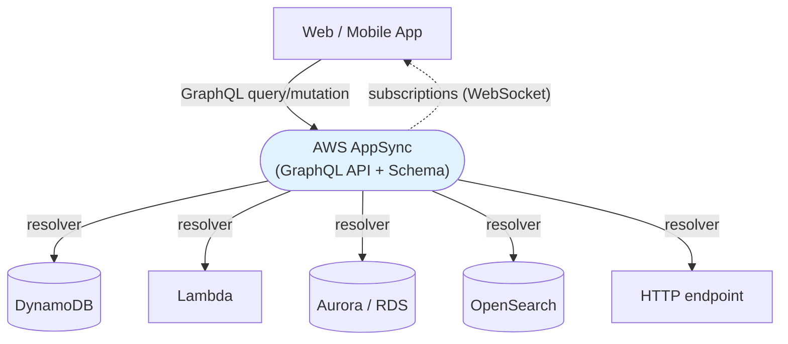

# AWS AppSync - Fundamentals & Deep Dive (SAA-C03)

> AWS **AppSync** is a managed **GraphQL** (and Pub/Sub WebSocket) API service. It lets a single API fetch/combine data from many sources (DynamoDB, Lambda, RDS/Aurora, OpenSearch, HTTP) and gives mobile/web apps **real-time subscriptions** and **offline sync**. Exam: think "managed GraphQL / real-time / mobile backend."

See also: [02 - AppSync Scenarios, Examples & Troubleshooting](02%20-%20AppSync%20Scenarios%2C%20Examples%20%26%20Troubleshooting.md) · [01 - EventBridge Fundamentals & Deep Dive](01%20-%20EventBridge%20Fundamentals%20%26%20Deep%20Dive.md) · [01 - Step Functions Fundamentals & Deep Dive](01%20-%20Step%20Functions%20Fundamentals%20%26%20Deep%20Dive.md)

---

## Table of Contents

- [1. What Is AppSync and GraphQL](#1-what-is-appsync-and-graphql)
- [2. Core Concepts: Schema, Resolvers, Data Sources](#2-core-concepts-schema-resolvers-data-sources)
- [3. Operation Types: Query, Mutation, Subscription](#3-operation-types-query-mutation-subscription)
- [4. Real-Time Subscriptions & Offline Sync](#4-real-time-subscriptions--offline-sync)
- [5. Data Sources & Resolvers](#5-data-sources--resolvers)
- [6. Authorization Modes (Exam Important)](#6-authorization-modes-exam-important)
- [7. Caching, Throttling & Performance](#7-caching-throttling--performance)
- [8. AppSync vs API Gateway](#8-appsync-vs-api-gateway)
- [9. Security & Networking](#9-security--networking)
- [10. Key Takeaways](#10-key-takeaways)

---



---

## 1. What Is AppSync and GraphQL

**GraphQL** is an API query language where the **client asks for exactly the fields it needs** in a single request - avoiding REST's over-fetching (too much data) and under-fetching (many round-trips). **AppSync** is AWS's fully managed GraphQL service: you define a schema, connect data sources, and AppSync handles execution, scaling, real-time, and offline.

- **Single endpoint, many sources:** one GraphQL query can pull from DynamoDB + Lambda + RDS at once.
- **Real-time built in:** GraphQL **subscriptions** push live updates over WebSockets.
- **Mobile-friendly:** offline data access and sync (via Amplify DataStore).

> **Exam trigger:** "Build a **mobile/web backend** that needs **real-time updates**, **offline sync**, or to **combine multiple data sources** in one API." → **AWS AppSync (GraphQL).**

[⬆ Back to top](#table-of-contents)

---

## 2. Core Concepts: Schema, Resolvers, Data Sources

| Concept          | Meaning                                                                                                              |
| :--------------- | :------------------------------------------------------------------------------------------------------------------- |
| **Schema**       | GraphQL type definitions (SDL) describing the data and operations.                                                   |
| **Data source**  | Backend AppSync reads/writes: DynamoDB, Lambda, RDS (Aurora Serverless via Data API), OpenSearch, HTTP, EventBridge. |
| **Resolver**     | The glue mapping a GraphQL field to a data source (VTL templates or **JavaScript resolvers**).                       |
| **Query**        | Read operation.                                                                                                      |
| **Mutation**     | Write operation.                                                                                                     |
| **Subscription** | Real-time push over WebSocket.                                                                                       |

[⬆ Back to top](#table-of-contents)

---

## 3. Operation Types: Query, Mutation, Subscription

```graphql
type Query {
  getPost(id: ID!): Post
}
type Mutation {
  addPost(title: String!): Post
}
type Subscription {
  onAddPost: Post @aws_subscribe(mutations: ["addPost"])
}
```

- **Query** = fetch data (read).
- **Mutation** = change data (create/update/delete).
- **Subscription** = clients automatically receive new data when a related mutation occurs (real-time).

[⬆ Back to top](#table-of-contents)

---

## 4. Real-Time Subscriptions & Offline Sync

- **Subscriptions:** When `addPost` runs, every client subscribed to `onAddPost` gets the new post pushed over a **WebSocket** - no polling. Great for chat, live scores, dashboards, collaborative apps.
- **Offline / conflict resolution:** With **Amplify DataStore**, clients can read/write offline and **sync** when reconnected, with **conflict detection and resolution** (optimistic concurrency, auto-merge, custom Lambda).

> **Exam:** "Mobile app needs live updates and to work offline, syncing later." → **AppSync** (subscriptions + offline sync).

[⬆ Back to top](#table-of-contents)

---

## 5. Data Sources & Resolvers

| Data Source                 | Typical Use                                                  |
| :-------------------------- | :----------------------------------------------------------- |
| **DynamoDB**                | Primary key-value/document store for app data (most common). |
| **Lambda**                  | Custom business logic / call anything.                       |
| **Aurora / RDS (Data API)** | Relational data via GraphQL.                                 |
| **OpenSearch**              | Full-text search results.                                    |
| **HTTP**                    | Any REST/HTTP backend.                                       |
| **EventBridge**             | Emit events from mutations.                                  |

**Resolvers** connect a field to a data source. AppSync supports **JavaScript (APPSYNC_JS)** resolvers and **pipeline resolvers** (chain multiple functions, e.g., authorize → fetch → transform).

[⬆ Back to top](#table-of-contents)

---

## 6. Authorization Modes (Exam Important)

AppSync supports **multiple auth modes**, and you can combine them per type/field:

| Mode                          | Use                                                            |
| :---------------------------- | :------------------------------------------------------------- |
| **API key**                   | Simple, public/dev access (expires).                           |
| **IAM**                       | Sign requests with SigV4 (AWS principals, backend-to-backend). |
| **Amazon Cognito User Pools** | User sign-in; group/role-based access (common for apps).       |
| **OpenID Connect (OIDC)**     | Third-party identity providers.                                |
| **Lambda authorizer**         | Custom auth logic.                                             |

> **Exam:** "Authenticate mobile users and authorize GraphQL fields by group." → **Cognito User Pools** auth mode in AppSync. **API key** is for simple/public access only.

[⬆ Back to top](#table-of-contents)

---

## 7. Caching, Throttling & Performance

- **Server-side caching:** AppSync can cache resolver results (per-API or per-resolver) to cut latency and backend load (TTL-based, encrypted).
- **Throttling / quotas** protect backends.
- **Subscriptions scale** to millions of connected clients (managed WebSockets).

[⬆ Back to top](#table-of-contents)

---

## 8. AppSync vs API Gateway

|                                  | **AppSync**                                   | **API Gateway**                                      |
| :------------------------------- | :-------------------------------------------- | :--------------------------------------------------- |
| **API style**                    | **GraphQL** (+ Pub/Sub)                       | **REST** and **WebSocket** / HTTP                    |
| **Data shaping**                 | Client requests exact fields                  | Fixed per-endpoint responses                         |
| **Multiple sources in one call** | **Yes** (native)                              | Manual (aggregation logic)                           |
| **Real-time**                    | **Subscriptions** built in                    | WebSocket APIs (more manual)                         |
| **Offline sync**                 | **Yes** (Amplify DataStore)                   | No                                                   |
| **Best for**                     | Mobile/web data APIs, real-time, multi-source | General REST APIs, request/response, broad protocols |

> **Exam:** GraphQL / real-time / offline / combine sources → **AppSync**. Classic REST endpoints / Lambda proxy / wide integration → **API Gateway**.

[⬆ Back to top](#table-of-contents)

---

## 9. Security & Networking

- **Auth:** the five modes above (combine per field).
- **Encryption:** TLS in transit; cache encrypted at rest.
- **Private APIs:** **Private AppSync APIs** accessible only from within a VPC via interface endpoints.
- **WAF:** attach **AWS WAF** to protect the GraphQL endpoint.
- **Fine-grained access:** authorize at the **field/type** level (e.g., only owners see certain fields).

[⬆ Back to top](#table-of-contents)

---

## 10. Key Takeaways

| Concept            | Must-Know                                                     |
| :----------------- | :------------------------------------------------------------ |
| **Service**        | Managed **GraphQL** API + real-time + offline.                |
| **Operations**     | Query (read), Mutation (write), Subscription (real-time).     |
| **Data sources**   | DynamoDB, Lambda, Aurora/RDS, OpenSearch, HTTP, EventBridge.  |
| **Resolvers**      | Map fields to sources (JS / pipeline resolvers).              |
| **Auth modes**     | API key, IAM, **Cognito**, OIDC, Lambda authorizer.           |
| **Real-time**      | Subscriptions over WebSocket; offline sync via Amplify.       |
| **vs API Gateway** | GraphQL/real-time/multi-source → AppSync; REST → API Gateway. |
| **Security**       | Field-level auth, private APIs, WAF, caching.                 |

[⬆ Back to top](#table-of-contents)
