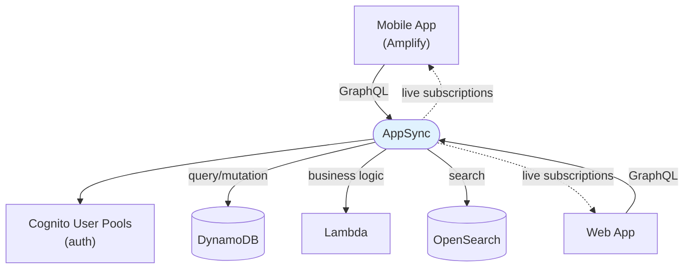

# AWS AppSync - Architecture, Scenarios & SRE Troubleshooting (SAA-C03)

> AppSync exam questions hinge on three signals: **GraphQL**, **real-time/offline mobile**, and **combine multiple data sources**. This file gives the patterns, scenarios, and operational gotchas.

See also: [01 - AppSync Fundamentals & Deep Dive](01%20-%20AppSync%20Fundamentals%20%26%20Deep%20Dive.md) · [01 - EventBridge Fundamentals & Deep Dive](01%20-%20EventBridge%20Fundamentals%20%26%20Deep%20Dive.md)

---

## Table of Contents

- [1. Architecture Patterns](#1-architecture-patterns)
- [2. Example Schema & Resolver](#2-example-schema--resolver)
- [3. Scenario-Based Questions](#3-scenario-based-questions)
- [4. Best Practices](#4-best-practices)
- [5. Common Errors & Troubleshooting (SRE View)](#5-common-errors--troubleshooting-sre-view)
- [6. Key Metrics](#6-key-metrics)
- [7. Rapid-Fire Facts](#7-rapid-fire-facts)

---



---

## 1. Architecture Patterns

**A. Real-time collaborative app (chat / live dashboard).** Clients subscribe; a mutation pushes updates to all subscribers over WebSocket. No polling.

**B. Mobile backend with offline.** Amplify DataStore + AppSync gives offline read/write and automatic sync + conflict resolution on reconnect.

**C. Backend-for-frontend aggregation.** One GraphQL query fans out via resolvers to DynamoDB (profile), Lambda (recommendations), and OpenSearch (search) - the client gets exactly the fields it asked for in one round-trip.

**D. Secure multi-tenant API.** Cognito User Pools auth + **field-level authorization** so users only see their own data.

**E. Event emission.** Mutations write to DynamoDB and emit events (DynamoDB Streams / EventBridge) for downstream processing.

[⬆ Back to top](#table-of-contents)

---

## 2. Example Schema & Resolver

**Schema (SDL):**

```graphql
type Todo {
  id: ID!
  title: String!
  owner: String
  done: Boolean
}

type Query {
  listTodos: [Todo]
}
type Mutation {
  addTodo(title: String!): Todo
}
type Subscription {
  onAddTodo: Todo @aws_subscribe(mutations: ["addTodo"])
}
```

**JavaScript resolver (DynamoDB PutItem for addTodo):**

```js
import { util } from "@aws-appsync/utils";

export function request(ctx) {
  const id = util.autoId();
  return {
    operation: "PutItem",
    key: util.dynamodb.toMapValues({ id }),
    attributeValues: util.dynamodb.toMapValues({
      title: ctx.args.title,
      owner: ctx.identity.username,
      done: false,
    }),
  };
}
export function response(ctx) {
  return ctx.result;
}
```

**Create API + DynamoDB data source (CLI, abbreviated):**

```bash
aws appsync create-graphql-api --name todos-api \
  --authentication-type AMAZON_COGNITO_USER_POOLS \
  --user-pool-config userPoolId=us-east-1_abc,awsRegion=us-east-1,defaultAction=ALLOW
```

[⬆ Back to top](#table-of-contents)

---

## 3. Scenario-Based Questions

**Q1.** A mobile app needs **live updates** pushed to all users when data changes, with no polling.
**A.** **AppSync GraphQL subscriptions** (WebSocket).

---

**Q2.** Users must use the app **offline** and have changes sync when back online, resolving conflicts.
**A.** **AppSync + Amplify DataStore** (offline sync + conflict resolution).

---

**Q3.** A screen needs data from DynamoDB, a Lambda, and OpenSearch in **one request**, returning only needed fields.
**A.** **AppSync GraphQL** with multiple resolvers (avoids REST over/under-fetching).

---

**Q4.** Authenticate app users and authorize specific GraphQL fields by group.
**A.** **Cognito User Pools** auth mode + **field-level authorization**.

---

**Q5.** Reduce latency and backend load for frequently requested, slowly-changing data.
**A.** Enable **AppSync server-side caching** (per-resolver TTL).

---

**Q6.** Expose a GraphQL API only inside the corporate VPC.
**A.** **Private AppSync API** via interface VPC endpoints.

---

**Q7.** They just need a standard REST API in front of Lambda.
**A.** **API Gateway** (not AppSync - GraphQL/real-time isn't required).

[⬆ Back to top](#table-of-contents)

---

## 4. Best Practices

| Area                     | Best Practice                                                |
| :----------------------- | :----------------------------------------------------------- |
| **Auth**                 | Use Cognito/OIDC for user apps; API key only for public/dev. |
| **Field-level authz**    | Restrict sensitive fields per type/field.                    |
| **Caching**              | Cache hot, slow-changing resolvers; set sensible TTLs.       |
| **Pipeline resolvers**   | Chain authorize → fetch → transform in resolvers.            |
| **Protect endpoint**     | Attach **WAF**; use private APIs for internal use.           |
| **Least privilege**      | Scope the AppSync service role to exact data-source actions. |
| **Idempotent mutations** | Handle retries gracefully.                                   |
| **Observability**        | Enable CloudWatch logging + X-Ray for resolver tracing.      |

[⬆ Back to top](#table-of-contents)

---

## 5. Common Errors & Troubleshooting (SRE View)

| Symptom                         | Likely Cause                                             | Resolution                                                                 |
| :------------------------------ | :------------------------------------------------------- | :------------------------------------------------------------------------- |
| **`Unauthorized` on a field**   | Auth mode/field rule mismatch                            | Verify auth mode (Cognito/IAM) + field-level directives                    |
| **Subscriptions not received**  | Subscription not tied to the mutation; WebSocket blocked | Add `@aws_subscribe`; ensure client maintains WebSocket; check WAF/network |
| **Resolver returns null**       | Mapping/template error or missing data-source perms      | Check resolver request/response; grant role access to the source           |
| **High DynamoDB cost/throttle** | Hot partition / inefficient query in resolver            | Optimize keys; add caching; use pagination                                 |
| **Stale data served**           | Cache TTL too long                                       | Lower TTL or invalidate cache on mutation                                  |
| **API key expired**             | Keys auto-expire                                         | Rotate API key or move to Cognito/IAM                                      |
| **Slow aggregate queries**      | Many sequential resolvers                                | Use pipeline resolvers / parallelize; cache                                |
| **Offline sync conflicts**      | Concurrent edits                                         | Configure conflict resolution (auto-merge / Lambda)                        |
| **Private API unreachable**     | Missing VPC endpoint                                     | Create interface endpoint; check SG/DNS                                    |

**SRE note:** AppSync's most common production issues are **authorization misconfig** (multiple auth modes interacting per field) and **backend hotspots** surfaced through resolvers (a single expensive GraphQL field can hammer DynamoDB). Treat resolvers as the performance boundary: trace with X-Ray, cache hot reads, and paginate.

[⬆ Back to top](#table-of-contents)

---

## 6. Key Metrics

| Metric                                | Tells You                                 |
| :------------------------------------ | :---------------------------------------- |
| `Latency`                             | End-to-end GraphQL request latency        |
| `4XXError` / `5XXError`               | Client (auth/validation) vs server errors |
| `ConnectSuccess` / `SubscribeSuccess` | WebSocket/subscription health             |
| Resolver/`TokenCount` metrics         | Backend resolver behavior and throttling  |

[⬆ Back to top](#table-of-contents)

---

## 7. Rapid-Fire Facts

- Managed **GraphQL** API: Query, Mutation, **Subscription** (real-time WebSocket).
- **Offline sync** + conflict resolution via **Amplify DataStore**.
- Data sources: **DynamoDB, Lambda, Aurora/RDS, OpenSearch, HTTP, EventBridge**.
- Resolvers: **JavaScript** + **pipeline** resolvers.
- Auth modes: **API key, IAM, Cognito User Pools, OIDC, Lambda authorizer** (combinable, field-level).
- **Server-side caching**, **WAF**, **private APIs**.
- vs **API Gateway**: GraphQL/real-time/multi-source → AppSync; REST → API Gateway.

[⬆ Back to top](#table-of-contents)
