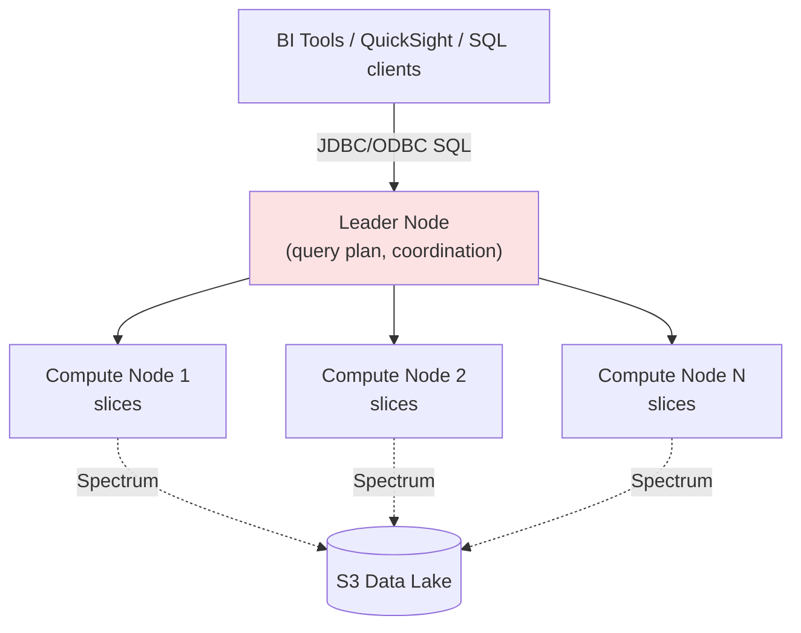

# Amazon Redshift - Fundamentals & Deep Dive (SAA-C03)

> Amazon **Redshift** is AWS's fully managed, petabyte-scale **cloud data warehouse** built for **OLAP** (analytics) - columnar storage, massively parallel processing (MPP), and SQL. Exam: know it's for **analytics/BI on large structured data**, not transactional (OLTP) workloads, and how it compares to Athena, RDS, and DynamoDB.

> Note: Redshift is an Analytics/Database service; it's grouped here per the study request. See also the Databases section for OLTP options.

See also: [02 - Redshift Architecture & Examples](02%20-%20Redshift%20Architecture%20%26%20Examples.md) · [03 - Redshift Scenarios, Best Practices & Troubleshooting](03%20-%20Redshift%20Scenarios%2C%20Best%20Practices%20%26%20Troubleshooting.md) · [01 - AppFlow Fundamentals & Deep Dive](01%20-%20AppFlow%20Fundamentals%20%26%20Deep%20Dive.md)

---

## Table of Contents

- [1. What Is Redshift and OLAP vs OLTP](#1-what-is-redshift-and-olap-vs-oltp)
- [2. MPP Architecture: Leader & Compute Nodes](#2-mpp-architecture-leader--compute-nodes)
- [3. Columnar Storage & Compression](#3-columnar-storage--compression)
- [4. Node Types & Redshift Serverless](#4-node-types--redshift-serverless)
- [5. Distribution Styles & Sort Keys (Exam Critical)](#5-distribution-styles--sort-keys-exam-critical)
- [6. Loading Data (COPY) & Unloading (UNLOAD)](#6-loading-data-copy--unloading-unload)
- [7. Redshift Spectrum (Query S3 Directly)](#7-redshift-spectrum-query-s3-directly)
- [8. Data Sharing, Concurrency Scaling & Materialized Views](#8-data-sharing-concurrency-scaling--materialized-views)
- [9. Durability, Backups & Resilience](#9-durability-backups--resilience)
- [10. Security](#10-security)
- [11. Redshift vs Athena vs RDS vs EMR](#11-redshift-vs-athena-vs-rds-vs-emr)
- [12. Key Takeaways](#12-key-takeaways)

---

---

## 1. What Is Redshift and OLAP vs OLTP

Redshift is a **data warehouse** optimized for **analytical queries** over huge datasets - aggregations, joins, and scans across billions of rows for reporting and BI.

|                 | **OLAP (Redshift)**                  | **OLTP (RDS/DynamoDB)**      |
| :-------------- | :----------------------------------- | :--------------------------- |
| **Workload**    | Analytics, reporting, BI             | Transactions, app CRUD       |
| **Query shape** | Few large complex queries            | Many small fast queries      |
| **Storage**     | **Columnar**                         | Row-based / key-value        |
| **Scale**       | Petabytes                            | GB-TB (per instance/table)   |
| **Example**     | "Total sales by region last 5 years" | "Get/insert one user record" |

> **Exam rule:** "data warehouse / analytics / BI / complex SQL aggregations on large structured data" → **Redshift**. "high-volume transactions / single-row lookups" → **RDS/Aurora or DynamoDB**.

[⬆ Back to top](#table-of-contents)

---

## 2. MPP Architecture: Leader & Compute Nodes

Redshift uses **Massively Parallel Processing (MPP)** - a cluster splits work across many nodes.

| Component         | Role                                                                                                                                         |
| :---------------- | :------------------------------------------------------------------------------------------------------------------------------------------- |
| **Leader node**   | Receives SQL, builds the query plan, distributes work to compute nodes, aggregates results. No charge for the leader on multi-node clusters. |
| **Compute nodes** | Execute query fragments on their portion of data in parallel.                                                                                |
| **Slices**        | Each compute node is divided into slices; each slice processes a chunk of data in parallel.                                                  |

More nodes/slices = more parallelism = faster queries on big data.

[⬆ Back to top](#table-of-contents)

---

## 3. Columnar Storage & Compression

Redshift stores data **by column**, not by row. For analytics this is a huge win:

- A query like `SELECT AVG(price)` reads **only the price column**, not whole rows → far less I/O.
- Columns of similar values **compress** extremely well (column encodings), reducing storage and I/O further.
- **Zone maps** track min/max per block to skip blocks that can't match (block pruning).

> **Exam:** "Why is Redshift fast for analytics?" → **columnar storage + compression + MPP** minimize I/O and parallelize.

[⬆ Back to top](#table-of-contents)

---

## 4. Node Types & Redshift Serverless

| Option                  | Description                                                                                                                              |
| :---------------------- | :--------------------------------------------------------------------------------------------------------------------------------------- |
| **RA3 nodes**           | Compute + **managed storage (S3-backed)** - **scale compute and storage independently**. Current recommended provisioned type.           |
| **DC2 nodes**           | Dense compute, local SSD - small, performance-intensive datasets.                                                                        |
| **(DS2 - legacy)**      | Dense storage HDD - superseded by RA3.                                                                                                   |
| **Redshift Serverless** | **No clusters to manage**; auto-scales capacity (RPUs), pay for what you use. Best for variable/unpredictable or intermittent workloads. |

> **Exam:** "Unpredictable/spiky analytics, don't want to manage clusters" → **Redshift Serverless**. "Need to scale storage separately from compute" → **RA3**.

[⬆ Back to top](#table-of-contents)

---

## 5. Distribution Styles & Sort Keys (Exam Critical)

How data is laid out across nodes determines performance.

**Distribution styles** (how rows spread across slices):

| Style    | Behavior                                          | Use                                                       |
| :------- | :------------------------------------------------ | :-------------------------------------------------------- |
| **KEY**  | Rows with the same key value go to the same slice | Co-locate rows that join on that key (avoid data shuffle) |
| **ALL**  | Full copy of the table on every node              | Small dimension tables used in many joins                 |
| **EVEN** | Round-robin across slices                         | No clear join/group key                                   |
| **AUTO** | Redshift chooses (default)                        | Let Redshift optimize                                     |

**Sort keys** (physical order of rows on disk):

- Speed up range-restricted scans and `ORDER BY` by letting Redshift **skip blocks** (zone maps).
- **Compound** (prefix order matters) vs **Interleaved** (equal weight to multiple columns).

> **Exam:** "Slow joins / data redistribution across nodes" → choose a good **distribution key** (KEY for large joins, ALL for small dimensions). "Slow time-range queries" → set a **sort key** on the date column.

[⬆ Back to top](#table-of-contents)

---

## 6. Loading Data (COPY) & Unloading (UNLOAD)

- **`COPY`** is the efficient bulk-load command - loads from **S3, DynamoDB, EMR, or remote hosts** in **parallel** across slices. Always prefer COPY over row-by-row `INSERT`.
- **`UNLOAD`** exports query results back to **S3** (e.g., Parquet) in parallel.
- Best practice: split input into multiple files (a multiple of the slice count) so all slices load in parallel.

> **Exam:** "Fastest way to bulk-load data into Redshift from S3." → **`COPY`** with multiple split files.

[⬆ Back to top](#table-of-contents)

---

## 7. Redshift Spectrum (Query S3 Directly)

**Redshift Spectrum** lets you run Redshift SQL **directly against data in S3** - without loading it into the cluster.

- Joins warehouse tables with **exabytes** of S3 data in one query.
- Compute runs on a separate Spectrum fleet, scaling independently.
- Uses the **Glue Data Catalog** for schema.

> **Exam:** "Query data in the S3 data lake from Redshift without loading it." → **Redshift Spectrum**. (Compare: **Athena** queries S3 too, but is serverless/ad-hoc and doesn't need a Redshift cluster.)

[⬆ Back to top](#table-of-contents)

---

## 8. Data Sharing, Concurrency Scaling & Materialized Views

- **Data Sharing:** Share live data **across clusters/accounts** (e.g., producer ETL cluster → consumer BI clusters) **without copying** - read-only access to the same data.
- **Concurrency Scaling:** Automatically adds **transient compute** to handle bursts of concurrent queries, then removes it - so dashboards don't queue during peaks.
- **Materialized views:** Precompute expensive joins/aggregations; auto-refresh - speeds up repeated dashboard queries.
- **Federated query:** Query live data in **RDS/Aurora (PostgreSQL/MySQL)** directly from Redshift.

> **Exam:** "Many users run dashboards at 9am and queries queue." → **Concurrency Scaling**. "Share warehouse data with another team's cluster without ETL copies." → **Data Sharing**.

[⬆ Back to top](#table-of-contents)

---

## 9. Durability, Backups & Resilience

| Feature                        | Detail                                                                                      |
| :----------------------------- | :------------------------------------------------------------------------------------------ |
| **Replication**                | Data replicated within the cluster; RA3 managed storage is S3-backed (durable).             |
| **Snapshots**                  | Automated + manual snapshots to **S3**; incremental.                                        |
| **Cross-Region snapshot copy** | For DR.                                                                                     |
| **Single-AZ (classic)**        | A provisioned cluster runs in **one AZ**; use snapshots/Multi-AZ for resilience.            |
| **Multi-AZ (RA3)**             | Redshift supports **Multi-AZ** deployments for high availability (recover from AZ failure). |
| **Relocation**                 | Can relocate a cluster to another AZ after failure.                                         |

> **Exam note:** Classic Redshift was single-AZ; modern **RA3 Multi-AZ** addresses HA. For DR, use **cross-region snapshot copy**.

[⬆ Back to top](#table-of-contents)

---

## 10. Security

| Layer                           | Mechanism                                                                                                       |
| :------------------------------ | :-------------------------------------------------------------------------------------------------------------- |
| **Network**                     | Runs in a **VPC**; security groups; can be private.                                                             |
| **Encryption at rest**          | **KMS** or HSM; encrypts cluster + snapshots.                                                                   |
| **Encryption in transit**       | SSL/TLS for connections.                                                                                        |
| **Access**                      | IAM for management; **database users/groups** for SQL-level; IAM role for `COPY`/`UNLOAD`/Spectrum (S3 access). |
| **Column / row-level security** | Restrict columns and rows per user/role.                                                                        |
| **Audit**                       | Logging to S3/CloudWatch; CloudTrail for API.                                                                   |

[⬆ Back to top](#table-of-contents)

---

## 11. Redshift vs Athena vs RDS vs EMR

|                  | **Redshift**                                   | **Athena**                      | **RDS/Aurora**     | **EMR**                        |
| :--------------- | :--------------------------------------------- | :------------------------------ | :----------------- | :----------------------------- |
| **Type**         | Data warehouse (MPP, columnar)                 | Serverless SQL on S3            | OLTP relational DB | Managed Hadoop/Spark           |
| **Best for**     | Large, recurring, complex BI/analytics         | Ad-hoc/occasional queries on S3 | Transactional apps | Big-data processing/ML         |
| **Provisioning** | Cluster or Serverless                          | None (serverless)               | Instances          | Clusters                       |
| **Cost model**   | Node-hours / RPUs                              | Per TB scanned                  | Instance-hours     | Cluster-hours                  |
| **Pick when**    | Steady heavy analytics, joins across warehouse | Infrequent, pay-per-query on S3 | Single-row CRUD    | Custom frameworks (Spark/Hive) |

> **Exam discriminators:** Heavy, recurring analytics → **Redshift**. Occasional ad-hoc S3 queries, no infra → **Athena**. Transactions → **RDS/Aurora**. Spark/Hadoop → **EMR**.

[⬆ Back to top](#table-of-contents)

---

## 12. Key Takeaways

| Concept              | Must-Know                                                   |
| :------------------- | :---------------------------------------------------------- |
| **Purpose**          | Petabyte-scale **OLAP** data warehouse (not OLTP).          |
| **Why fast**         | Columnar + compression + **MPP** (leader/compute/slices).   |
| **Nodes**            | **RA3** (separate compute/storage), DC2, or **Serverless**. |
| **Performance keys** | **Distribution style** (KEY/ALL/EVEN/AUTO) + **sort keys**. |
| **Load**             | **`COPY`** from S3 in parallel; `UNLOAD` to S3.             |
| **Spectrum**         | Query S3 directly without loading.                          |
| **Scale/share**      | Concurrency Scaling, Data Sharing, materialized views.      |
| **Resilience**       | Snapshots to S3, cross-region copy, RA3 Multi-AZ.           |
| **vs others**        | Athena (ad-hoc S3), RDS (OLTP), EMR (Spark/Hadoop).         |

[⬆ Back to top](#table-of-contents)
