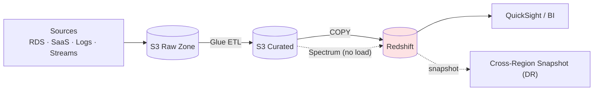

# Amazon Redshift - Architecture Patterns & Examples (SAA-C03)

> The analytics architectures the exam expects: data-lake ingestion, ETL/ELT into the warehouse, BI serving, and DR. Plus copy-ready SQL/IaC.

See also: [01 - Redshift Fundamentals & Deep Dive](01%20-%20Redshift%20Fundamentals%20%26%20Deep%20Dive.md) · [03 - Redshift Scenarios, Best Practices & Troubleshooting](03%20-%20Redshift%20Scenarios%2C%20Best%20Practices%20%26%20Troubleshooting.md) · [02 - AppFlow Scenarios, Examples & Troubleshooting](02%20-%20AppFlow%20Scenarios%2C%20Examples%20%26%20Troubleshooting.md)

---

## Table of Contents

- [1. The Analytics Pipeline (Ingest → Warehouse → BI)](#1-the-analytics-pipeline-ingest--warehouse--bi)
- [2. Data Lake + Redshift Spectrum](#2-data-lake--redshift-spectrum)
- [3. ETL/ELT Loading Patterns](#3-etlelt-loading-patterns)
- [4. SaaS & Operational Data into Redshift](#4-saas--operational-data-into-redshift)
- [5. Concurrency Scaling for Bursty BI](#5-concurrency-scaling-for-bursty-bi)
- [6. Data Sharing Across Teams/Accounts](#6-data-sharing-across-teamsaccounts)
- [7. DR & High Availability](#7-dr--high-availability)
- [8. Code & IaC Examples](#8-code--iac-examples)
- [9. Pattern Selection Cheat Sheet](#9-pattern-selection-cheat-sheet)

---



---

## 1. The Analytics Pipeline (Ingest → Warehouse → BI)

The classic shape:

1. **Ingest** raw data to **S3** (from RDS, logs, streams, SaaS).
2. **Transform** with **Glue** (or ELT inside Redshift).
3. **Load** curated data into Redshift via **`COPY`**.
4. **Serve** BI tools (QuickSight, Tableau) via JDBC/ODBC.

This decouples storage (S3) from compute (Redshift) and keeps a replayable raw zone.

[⬆ Back to top](#table-of-contents)

---

## 2. Data Lake + Redshift Spectrum

Keep cold/large data in **S3** and only load hot data into the cluster:

- Frequently queried recent data → loaded Redshift tables (fast).
- Historical/cold data → stay in S3, queried via **Spectrum**.
- One SQL query can **join** loaded tables with S3 data.

> **Exam:** "Query years of historical data in S3 alongside current warehouse tables, cost-effectively." → **Redshift Spectrum** (don't load everything).

[⬆ Back to top](#table-of-contents)

---

## 3. ETL/ELT Loading Patterns

- **ELT (modern):** Load raw into Redshift staging, then transform with SQL inside Redshift (leverages MPP).
- **ETL:** Transform in **Glue/EMR** first, then `COPY` curated data.
- **Streaming ingestion:** Redshift **streaming ingestion** from **Kinesis Data Streams / MSK** for near-real-time analytics.
- Split load files into a multiple of the slice count for **parallel `COPY`**.

[⬆ Back to top](#table-of-contents)

---

## 4. SaaS & Operational Data into Redshift

- **SaaS data** (Salesforce, etc.) → **AppFlow** → S3/Redshift. See [01 - AppFlow Fundamentals & Deep Dive](01%20-%20AppFlow%20Fundamentals%20%26%20Deep%20Dive.md).
- **Operational DB** (RDS/Aurora) → **federated query** (live) or **DMS**/zero-ETL → Redshift for analytics without hammering the OLTP DB.
- **Aurora zero-ETL to Redshift** replicates transactional data into Redshift automatically for analytics (know it exists).

[⬆ Back to top](#table-of-contents)

---

## 5. Concurrency Scaling for Bursty BI

When many analysts hit dashboards at once, queries queue. **Concurrency Scaling** spins up transient clusters to absorb the burst and removes them after - consistent performance without permanently over-provisioning.

[⬆ Back to top](#table-of-contents)

---

## 6. Data Sharing Across Teams/Accounts

A central **producer** cluster (ETL) shares live, read-only data with multiple **consumer** clusters (finance, marketing) - no copies, no ETL duplication, each team scales its own compute.

[⬆ Back to top](#table-of-contents)

---

## 7. DR & High Availability

- **Automated snapshots** to S3 + **cross-region snapshot copy** for DR.
- **RA3 Multi-AZ** for AZ-failure resilience.
- Restore a cluster from snapshot in another region during a regional event.

[⬆ Back to top](#table-of-contents)

---

## 8. Code & IaC Examples

**Parallel bulk load from S3 (SQL):**

```sql
COPY sales
FROM 's3://my-bucket/curated/sales/'
IAM_ROLE 'arn:aws:iam::123456789012:role/RedshiftCopyRole'
FORMAT AS PARQUET;
```

**Create table with distribution + sort key (SQL):**

```sql
CREATE TABLE sales (
    sale_id     BIGINT,
    customer_id BIGINT,
    sale_date   DATE,
    amount      DECIMAL(10,2)
)
DISTSTYLE KEY
DISTKEY (customer_id)      -- co-locate joins on customer_id
SORTKEY (sale_date);       -- speed up date-range scans
```

**Export results to S3 (SQL):**

```sql
UNLOAD ('SELECT * FROM sales WHERE sale_date >= ''2026-01-01''')
TO 's3://my-bucket/exports/sales_2026_'
IAM_ROLE 'arn:aws:iam::123456789012:role/RedshiftCopyRole'
FORMAT AS PARQUET PARALLEL ON;
```

**Redshift Serverless (Terraform):**

```hcl
resource "aws_redshiftserverless_namespace" "analytics" {
  namespace_name      = "analytics"
  admin_username      = "admin"
  admin_user_password = var.admin_password
  kms_key_id          = aws_kms_key.rs.arn
}

resource "aws_redshiftserverless_workgroup" "analytics" {
  namespace_name = aws_redshiftserverless_namespace.analytics.namespace_name
  workgroup_name = "analytics-wg"
  base_capacity  = 32   # RPUs
  publicly_accessible = false
}
```

[⬆ Back to top](#table-of-contents)

---

## 9. Pattern Selection Cheat Sheet

| Requirement                                      | Pattern                                       |
| :----------------------------------------------- | :-------------------------------------------- |
| Recurring heavy BI on large structured data      | **Redshift** warehouse                        |
| Query cold/historical data in S3 without loading | **Redshift Spectrum**                         |
| Bursty concurrent dashboards                     | **Concurrency Scaling**                       |
| Share data across teams/accounts, no copies      | **Data Sharing**                              |
| Analytics on operational DB without load         | **Federated query / zero-ETL**                |
| Near-real-time analytics                         | **Streaming ingestion** (Kinesis/MSK)         |
| SaaS data into warehouse                         | **AppFlow → S3/Redshift**                     |
| DR                                               | **Cross-region snapshot copy** / RA3 Multi-AZ |
| Don't manage clusters / variable load            | **Redshift Serverless**                       |

[⬆ Back to top](#table-of-contents)
