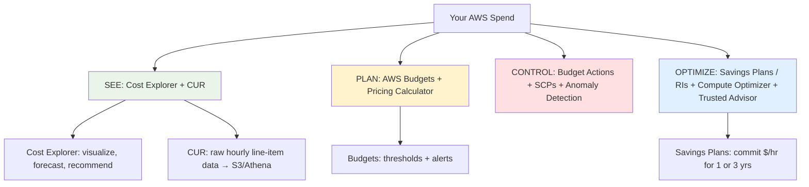
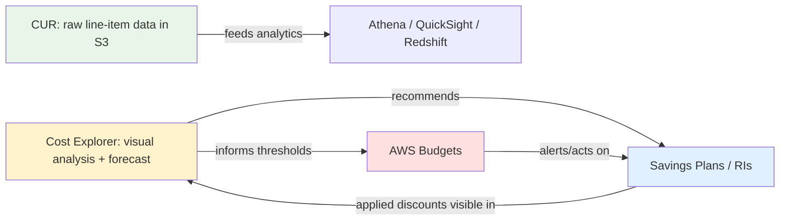
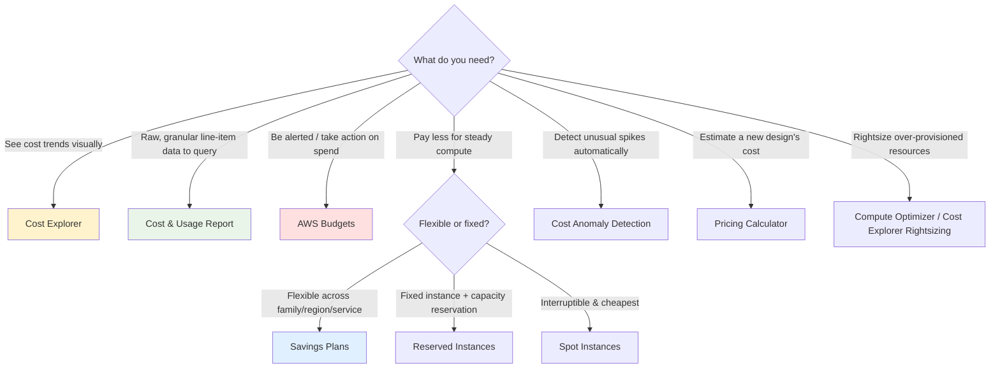

# AWS Cost Management Overview - SAA-C03 Deep Dive

> AWS Cost Management is the family of tools that lets you **see, plan, control, and optimize** your AWS spend. The four exam-critical pillars are **Cost Explorer** (visualize & analyze), **AWS Budgets** (alert & act), **Cost and Usage Report / CUR** (raw line-item data), and **Savings Plans / RIs** (commitment-based discounts).

See also: [01 - AWS Budgets Fundamentals & Architecture](01%20-%20AWS%20Budgets%20Fundamentals%20%26%20Architecture.md) · [01 - CUR Fundamentals & Architecture](01%20-%20CUR%20Fundamentals%20%26%20Architecture.md) · [01 - Cost Explorer Fundamentals & Architecture](01%20-%20Cost%20Explorer%20Fundamentals%20%26%20Architecture.md) · [01 - Savings Plans Fundamentals & Architecture](01%20-%20Savings%20Plans%20Fundamentals%20%26%20Architecture.md)

---

## Table of Contents

- [Why Cost Management Is on the SAA-C03 Exam](#why-cost-management-is-on-the-saa-c03-exam)
- [The Cost Management Mental Model (See → Plan → Control → Optimize)](#the-cost-management-mental-model-see--plan--control--optimize)
- [The Full Toolset at a Glance](#the-full-toolset-at-a-glance)
- [The Four Pillars in Depth](#the-four-pillars-in-depth)
- [Consolidated Billing & AWS Organizations](#consolidated-billing--aws-organizations)
- [Cost Allocation Tags](#cost-allocation-tags)
- [Decision Tree: Which Cost Tool Do I Reach For?](#decision-tree-which-cost-tool-do-i-reach-for)
- [Free vs Paid: What Each Tool Costs](#free-vs-paid-what-each-tool-costs)
- [Summary: Key Takeaways for SAA-C03](#summary-key-takeaways-for-saa-c03)

---

---

Cost management questions appear across multiple SAA-C03 domains, most heavily in **Domain 4: Design Cost-Optimized Architectures** (≈20% of the exam). The exam rarely tests deep billing arithmetic; instead it tests **which tool you reach for** in a given scenario. This overview gives you that decision map; the per-service notes go deep.

---

## Why Cost Management Is on the SAA-C03 Exam

The SAA-C03 blueprint expects a Solutions Architect to **design cost-optimized architectures**, not just performant or secure ones. That means you must be able to:

- **Pick the right tool** to answer a cost question ("which service shows hourly granularity?", "how do I get raw line-item data?").
- **Select the right pricing model** (On-Demand vs Savings Plans vs Reserved Instances vs Spot).
- **Set up governance** so teams don't overspend (Budgets + alerts + actions).
- **Attribute cost** to teams/projects (cost allocation tags, consolidated billing).

> **Exam Tip:** When a question describes a _symptom_ ("we got surprised by a large bill", "finance needs a per-team breakdown", "we want to be alerted before we exceed $X"), map the symptom to the tool. That mapping is the whole game.

[⬆ Back to top](#table-of-contents)

---

## The Cost Management Mental Model (See → Plan → Control → Optimize)

Think of cost management as a four-stage loop. Each stage has a primary tool.

| Stage        | Question It Answers                                           | Primary Tool(s)                                                               |
| :----------- | :------------------------------------------------------------ | :---------------------------------------------------------------------------- |
| **See**      | "Where is my money going, and what will I spend?"             | **Cost Explorer** (charts, forecast), **CUR** (raw data)                      |
| **Plan**     | "How much _should_ I spend, and what will a new design cost?" | **AWS Budgets**, **AWS Pricing Calculator**                                   |
| **Control**  | "How do I stop overspend automatically?"                      | **Budget Actions**, **SCPs**, **Cost Anomaly Detection**                      |
| **Optimize** | "How do I pay less for the same workload?"                    | **Savings Plans / RIs**, **Compute Optimizer**, **Trusted Advisor**, **Spot** |

The loop is continuous: you **see** spend in Cost Explorer, **plan** a budget, **control** it with alerts/actions, **optimize** with commitments, then go back to **see** whether it worked.

[⬆ Back to top](#table-of-contents)

---

## The Full Toolset at a Glance

Beyond the four pillars, the exam may name-drop these supporting tools. Know the one-liner for each.

| Tool                                     | One-Line Purpose                                                              | Exam Trigger Phrase                                            |
| :--------------------------------------- | :---------------------------------------------------------------------------- | :------------------------------------------------------------- |
| **AWS Cost Explorer**                    | Visualize/analyze cost & usage; forecast; rightsizing & RI/SP recommendations | "visualize", "trend over time", "forecast", "recommendation"   |
| **AWS Budgets**                          | Set thresholds; alert (and act) when cost/usage crosses them                  | "alert me when", "notify before exceeding", "stop spend"       |
| **AWS Cost and Usage Report (CUR)**      | Most granular billing data (hourly, resource-level) delivered to S3           | "raw data", "line item", "query with Athena", "most detailed"  |
| **Savings Plans**                        | Commit to $/hour of compute for 1/3 yrs → up to 72% off                       | "consistent compute usage", "flexible discount", "commit"      |
| **Reserved Instances (RIs)**             | Commit to specific instance type/region for 1/3 yrs → discount                | "steady-state", "specific instance", "capacity reservation"    |
| **Spot Instances**                       | Spare EC2 capacity up to 90% off; can be reclaimed                            | "fault-tolerant", "interruptible", "batch", "cheapest compute" |
| **Cost Anomaly Detection**               | ML-based detection of unusual spend spikes                                    | "automatically detect unusual spend", "anomaly"                |
| **AWS Compute Optimizer**                | ML rightsizing recommendations for EC2/EBS/Lambda/ASG                         | "rightsize", "over-provisioned", "ML recommendation"           |
| **AWS Trusted Advisor**                  | Best-practice checks incl. cost optimization (idle resources)                 | "idle/underutilized resources", "best-practice checks"         |
| **AWS Pricing Calculator**               | Estimate cost of a planned architecture _before_ building                     | "estimate cost before deploying", "model a new workload"       |
| **AWS Billing Conductor**                | Customized billing/showback for resellers & internal chargeback               | "customized pro-forma billing", "reseller chargeback"          |
| **Consolidated Billing (Organizations)** | One bill for many accounts + volume discounts + shared commitments            | "single payer", "combine usage for discounts"                  |
| **Cost Allocation Tags**                 | Tag resources to break cost down by team/project/env                          | "break down cost by department/project"                        |

> **Exam Trap:** **Cost Explorer** vs **CUR** is the most common confusion. Cost Explorer = _visual, interactive, in-console, summarized_. CUR = _raw, exhaustive, delivered-to-S3, query-with-Athena_. If the question says "most detailed/granular data" or "query the data yourself", it's **CUR**.

[⬆ Back to top](#table-of-contents)

---

## The Four Pillars in Depth

Each pillar has a dedicated deep-dive folder. Here is how they relate.

- **[AWS Budgets](01%20-%20AWS%20Budgets%20Fundamentals%20%26%20Architecture.md)** — Proactive guardrails. Set a cost/usage/RI/SP threshold; get alerted (SNS/email/Chatbot) on actual _or forecasted_ breach; optionally trigger **budget actions** (apply an IAM/SCP deny, stop EC2/RDS). The "plan & control" pillar.
- **[Cost and Usage Report (CUR)](01%20-%20CUR%20Fundamentals%20%26%20Architecture.md)** — The system of record. The most comprehensive billing dataset AWS produces: every line item, hourly/daily/monthly, resource-level, delivered to an S3 bucket and queryable via Athena/Redshift/QuickSight. The "see (raw)" pillar.
- **[Cost Explorer](01%20-%20Cost%20Explorer%20Fundamentals%20%26%20Architecture.md)** — The dashboard. Interactive charts of up to 12 months history + 12 months forecast, filtering/grouping, plus **rightsizing** and **RI/Savings Plans recommendations**. The "see (visual)" pillar.
- **[Savings Plans](01%20-%20Savings%20Plans%20Fundamentals%20%26%20Architecture.md)** — The discount engine. Commit to a steady **$/hour of compute** for 1 or 3 years in exchange for up to **72%** off On-Demand. The "optimize" pillar (alongside RIs and Spot).

[⬆ Back to top](#table-of-contents)

---

## Consolidated Billing & AWS Organizations

Cost management is far more powerful at the **organization** level.

- **Single payer account** receives one consolidated bill for all member accounts.
- **Volume pricing tiers** are calculated across the _combined_ usage of all accounts — so the whole org reaches discount tiers faster (e.g., S3 tiered pricing, data-transfer tiers).
- **Reserved Instances and Savings Plans are shared** across accounts by default (RI/SP discount sharing can be turned off per account). An unused commitment in one account automatically benefits another.

> **Exam Tip:** "We have many accounts and want to maximize volume discounts and share Savings Plans across them" → **Consolidated Billing via AWS Organizations**. The shared-commitment behavior is a frequent distractor: by default a Savings Plan purchased in Account A _can_ cover eligible usage in Account B.

See [06 - IAM Identity Center & Organizations](06%20-%20IAM%20Identity%20Center%20%26%20Organizations.md) for the Organizations mechanics.

[⬆ Back to top](#table-of-contents)

---

## Cost Allocation Tags

Tags are the primary mechanism for **attributing cost** to teams, projects, or environments.

| Tag Type          | Who Creates It                                     | Prefix             |
| :---------------- | :------------------------------------------------- | :----------------- |
| **AWS-generated** | AWS (e.g., `aws:createdBy`)                        | `aws:`             |
| **User-defined**  | You (e.g., `CostCenter`, `Project`, `Environment`) | none (your choice) |

**Key facts:**

- Tags must be **activated** in the Billing console before they appear in Cost Explorer / Budgets / CUR — and activation is **not retroactive** (cost data is only broken out by a tag _from the activation date forward_).
- Once activated, you can **group and filter** by tag in Cost Explorer and **scope budgets** by tag.
- A common pattern: enforce a mandatory `CostCenter` tag with a **Tag Policy** (Organizations) or an SCP, so every resource is attributable.

> **Exam Tip:** "Finance needs a per-department / per-project cost breakdown" → **activate user-defined cost allocation tags**, then view in Cost Explorer or CUR. Remember the _not retroactive_ gotcha.

[⬆ Back to top](#table-of-contents)

---

## Decision Tree: Which Cost Tool Do I Reach For?

**Plain-English mapping for the exam:**

| Scenario phrase                                                      | Answer                                    |
| :------------------------------------------------------------------- | :---------------------------------------- |
| "Visualize spend over the last 6 months / forecast next 3"           | **Cost Explorer**                         |
| "Most granular / line-item / resource-level data, query with Athena" | **CUR**                                   |
| "Notify us when monthly spend is forecast to exceed $X"              | **AWS Budgets** (forecasted alert)        |
| "Automatically stop or restrict resources when over budget"          | **Budget Actions** (IAM/SCP/stop EC2-RDS) |
| "Detect unusual spend without setting a threshold"                   | **Cost Anomaly Detection**                |
| "Reduce cost for predictable, steady compute, keep flexibility"      | **Compute Savings Plans**                 |
| "Cheapest compute for fault-tolerant batch jobs"                     | **Spot Instances**                        |
| "Estimate cost before we build"                                      | **Pricing Calculator**                    |

[⬆ Back to top](#table-of-contents)

---

## Free vs Paid: What Each Tool Costs

A subtle but testable detail — several of these tools have a free tier and a paid mode.

| Tool                       | Free                             | Paid                                                                                                                        |
| :------------------------- | :------------------------------- | :-------------------------------------------------------------------------------------------------------------------------- |
| **Cost Explorer**          | Console UI + monthly granularity | **Cost Explorer API** ($0.01/request); hourly & resource-level granularity has an extra charge                              |
| **AWS Budgets**            | First **2** budgets free         | $0.02/budget/day after the first 2; **action-enabled** budgets free for first 2 budget-action evaluations then small charge |
| **Cost and Usage Report**  | The report itself is free        | You pay for the **S3 storage** + any **Athena/Redshift/QuickSight** queries                                                 |
| **Savings Plans / RIs**    | N/A (they _save_ money)          | The commitment itself; you pay the committed rate whether or not you use it                                                 |
| **Cost Anomaly Detection** | Free                             | Free                                                                                                                        |
| **Compute Optimizer**      | Free (basic)                     | Enhanced metrics (3-month lookback, external metrics) cost extra                                                            |

> **Exam Tip:** "First two budgets are free" and "Cost Explorer hourly/resource-level granularity costs extra" are both fair-game trivia. CUR is free but the _storage and queries_ are not.

[⬆ Back to top](#table-of-contents)

---

## Summary: Key Takeaways for SAA-C03

| Concept                  | What You Must Know                                                                                        |
| :----------------------- | :-------------------------------------------------------------------------------------------------------- |
| **Cost Explorer**        | Visual, interactive analysis; 12-mo history + 12-mo forecast; rightsizing & RI/SP recommendations         |
| **CUR**                  | Most granular billing data; hourly/resource-level; delivered to S3; query with Athena/Redshift/QuickSight |
| **AWS Budgets**          | Threshold alerts on actual _or forecasted_ cost/usage; budget actions can enforce limits                  |
| **Savings Plans**        | Commit $/hr for 1/3 yrs → up to 72% off; Compute SP = most flexible                                       |
| **CE vs CUR**            | "Visualize" → Cost Explorer; "raw/granular/query" → CUR                                                   |
| **Consolidated Billing** | Org-wide volume discounts + shared RIs/SPs across accounts                                                |
| **Cost Allocation Tags** | Attribute cost by team/project; must be activated; **not retroactive**                                    |
| **Anomaly Detection**    | ML spike detection without manual thresholds                                                              |
| **Free tiers**           | First 2 budgets free; CUR free (pay storage/query); CE hourly granularity costs extra                     |

[⬆ Back to top](#table-of-contents)

---
