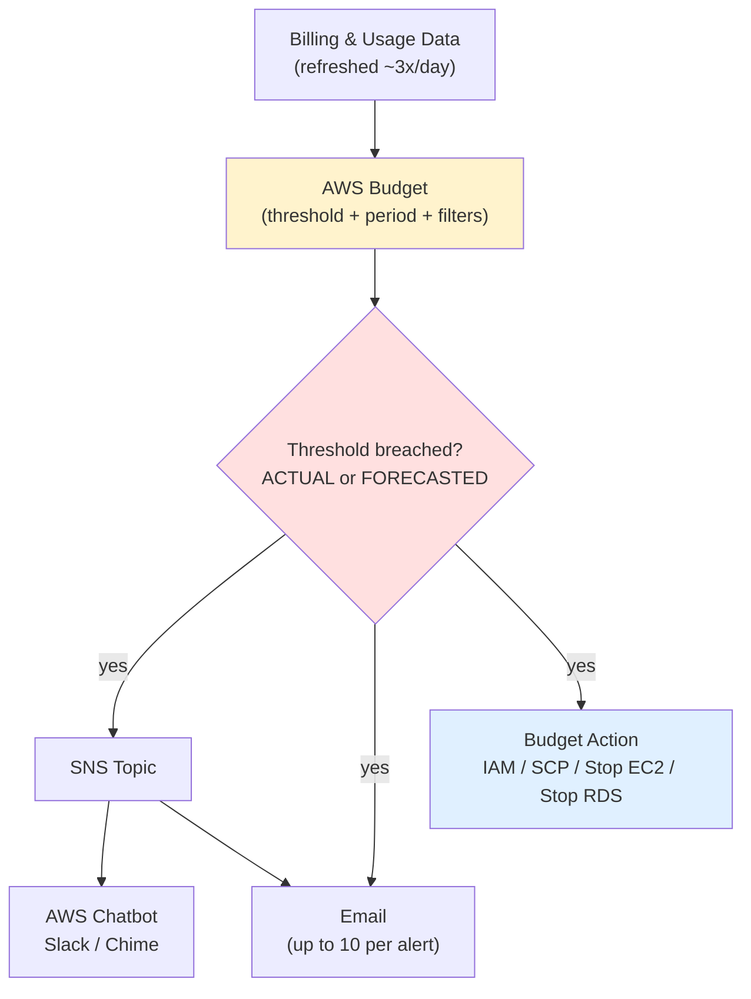
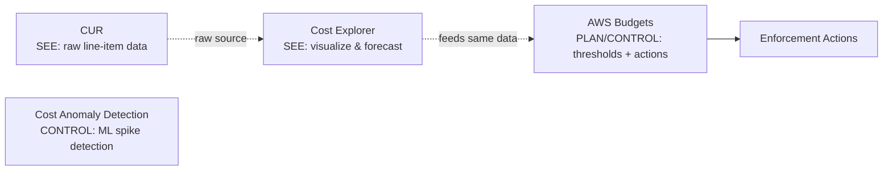
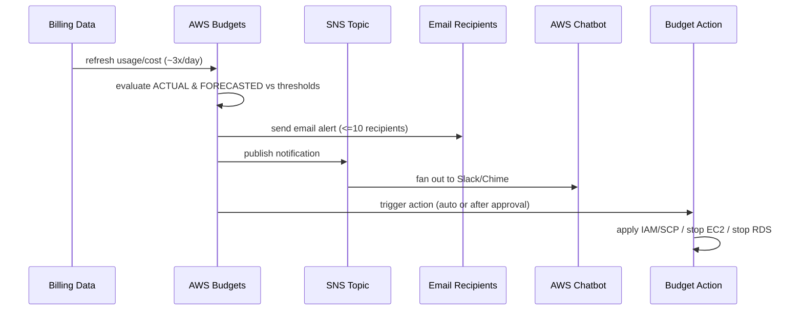
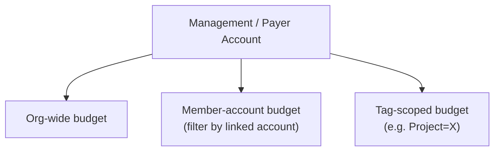

# AWS Budgets Fundamentals & Architecture - SAA-C03 Deep Dive

> AWS Budgets lets you set **custom cost and usage thresholds** and get alerted when your **actual OR forecasted** spend/usage breaches them — the proactive "set a limit and tell me before I blow past it" tool in the AWS cost family.

See also: [02 - Budget Types, Actions & Alerts](02%20-%20Budget%20Types%2C%20Actions%20%26%20Alerts.md) · [03 - AWS Budgets Exam Scenarios & Cheat Sheet](03%20-%20AWS%20Budgets%20Exam%20Scenarios%20%26%20Cheat%20Sheet.md) · [00 - Cost Management Overview](00%20-%20Cost%20Management%20Overview.md)

---

## Table of Contents

- [What Is AWS Budgets?](#what-is-aws-budgets)
- [The Problem It Solves](#the-problem-it-solves)
- [Where Budgets Sits Among the Cost Tools](#where-budgets-sits-among-the-cost-tools)
- [Architecture & Data Flow](#architecture--data-flow)
- [Data Refresh Cadence (Not Real-Time)](#data-refresh-cadence-not-real-time)
- [Granularity & Budget Periods](#granularity--budget-periods)
- [Scope & Filters](#scope--filters)
- [Where Budgets Live: Management Account & Organizations](#where-budgets-live-management-account--organizations)
- [Pricing](#pricing)
- [Budgets vs Cost Explorer vs CUR vs Anomaly Detection](#budgets-vs-cost-explorer-vs-cur-vs-anomaly-detection)
- [Quick-Start Templates](#quick-start-templates)
- [Summary: Key Takeaways for SAA-C03](#summary-key-takeaways-for-saa-c03)

---

---

AWS Budgets is the **planning and guardrail** pillar of AWS Cost Management. You declare a target (a dollar amount or a usage quantity), tell Budgets what slice of spend to watch, and Budgets evaluates that target a few times a day, firing notifications — and optionally enforcement actions — when you cross a threshold. This file covers what it is, how the data flows, its refresh cadence, scoping, pricing, and how it differs from the other cost tools.

---

## What Is AWS Budgets?

AWS Budgets is a service that lets you **define custom budgets** for cost or usage and **monitor them against actual and forecasted values**. When a budget crosses a threshold you set, Budgets can:

- Send a **notification** (email and/or via an SNS topic, which can fan out to AWS Chatbot for Slack/Chime).
- Trigger a **Budget Action** to enforce a hard guardrail (apply an IAM policy or SCP, stop EC2 or RDS instances).

The defining characteristic for the exam: **you set the threshold**. Budgets is _proactive and prescriptive_ — it does exactly what you told it to. (Contrast this with Cost Anomaly Detection, which uses ML to find spikes you did _not_ anticipate.)

> **Exam Tip:** If a question says "alert me **before** I exceed $X" or "notify finance when forecasted spend will pass the limit," the answer is **AWS Budgets** — it is the only core tool that supports **forecasted** threshold alerts.

[⬆ Back to top](#table-of-contents)

---

## The Problem It Solves

Without Budgets, the typical failure mode is the **end-of-month bill shock**: spend creeps up across many accounts and services, and nobody notices until the invoice lands. Budgets solves this by:

| Pain point                             | How Budgets addresses it                               |
| -------------------------------------- | ------------------------------------------------------ |
| Surprise bills                         | Threshold alerts on **actual** spend as it accrues     |
| Catching overruns _before_ they happen | Alerts on **forecasted** end-of-period spend           |
| Runaway dev/test environments          | **Budget Actions** that stop EC2/RDS or deny new spend |
| Per-team / per-project overspend       | Filtered budgets scoped by tag, account, or service    |
| Wasted commitments                     | RI / Savings Plans **utilization & coverage** budgets  |

> **Exam Tip:** "We were surprised by a large bill" → if they want a **threshold-based** alert, choose Budgets. If they want **automatic anomaly detection with no threshold**, choose Cost Anomaly Detection.

[⬆ Back to top](#table-of-contents)

---

## Where Budgets Sits Among the Cost Tools

- **Cost Explorer** — visualize, analyze, forecast (a dashboard, not an alerter).
- **CUR (Cost & Usage Report)** — the raw, hourly, line-item source of truth delivered to S3.
- **AWS Budgets** — you set targets and get alerted / take action.
- **Cost Anomaly Detection** — ML finds unexpected spikes without you setting a number.

[⬆ Back to top](#table-of-contents)

---

## Architecture & Data Flow

The end-to-end pipeline:

1. **Billing & usage data** is ingested from your account(s).
2. Each **budget** is evaluated against its threshold(s) on a schedule (a few times per day).
3. When an **ACTUAL** or **FORECASTED** value crosses a threshold:
   - An **email** is sent (up to 10 recipients per alert), and/or
   - An **SNS topic** is published to (which can route to **AWS Chatbot** → Slack/Chime, Lambda, etc.), and/or
   - A **Budget Action** runs (IAM/SCP/stop EC2/stop RDS), automatically or after manual approval.

> **Exam Tip:** SNS is the integration glue. To get budget alerts into **Slack**, you wire **Budgets → SNS → AWS Chatbot → Slack**. Budgets does not talk to Slack directly.

> **Exam Trap:** The SNS **topic access policy must allow** `budgets.amazonaws.com` to publish. If you forget the topic policy, the alert silently never arrives even though everything else is configured.

[⬆ Back to top](#table-of-contents)

---

## Data Refresh Cadence (Not Real-Time)

This is the single biggest SRE gotcha. AWS Budgets data refreshes **up to ~3 times per day** (roughly every **8–12 hours**) — it is **NOT real-time**.

| Property          | Value                                        |
| ----------------- | -------------------------------------------- |
| Refresh frequency | Up to ~3x/day (~every 8–12h)                 |
| Real-time?        | No                                           |
| Implication       | Alerts can **lag** the actual spend by hours |

> **Exam Trap:** If you need _instant_ notification the moment a resource launches, Budgets is the wrong tool — its evaluation lags. For near-real-time enforcement you'd combine other mechanisms (e.g., EventBridge + Lambda, or SCP guardrails). Budgets is for **threshold governance**, not millisecond response.

[⬆ Back to top](#table-of-contents)

---

## Granularity & Budget Periods

Budgets support multiple **time periods** and **amount models**:

| Period    | Supported                  |
| --------- | -------------------------- |
| Daily     | Yes (cost & usage budgets) |
| Monthly   | Yes                        |
| Quarterly | Yes                        |
| Annual    | Yes                        |

**Amount models:**

- **Fixed amount** — same target every period (e.g., $1,000/month).
- **Planned / variable monthly amounts** — different target per month (e.g., higher in December).

> **Exam Tip:** Daily granularity is useful for catching runaway costs faster than waiting for a monthly window, but remember the data-refresh lag still applies.

[⬆ Back to top](#table-of-contents)

---

## Scope & Filters

A budget watches only the slice of spend you point it at. You can **filter / scope** a budget by:

- **Service** (e.g., only Amazon EC2)
- **Linked / member account** (within an Organization)
- **Tag** (cost allocation tags — must be activated first)
- **Availability Zone**
- **Instance type**
- **Region**
- **Usage type / usage type group**
- **Charge type** (e.g., recurring, one-time, tax, credit)
- **Purchase option, API operation, billing entity**, and more

> **Exam Tip:** "Track spend for the _Marketing_ team across all services" → scope a budget by the **cost allocation tag** `Team=Marketing`. Remember tags must be **activated** in the Billing console before they can be used as a filter, and activation is **not retroactive**.

[⬆ Back to top](#table-of-contents)

---

## Where Budgets Live: Management Account & Organizations

- Budgets are typically created in the **management (payer) account** of an AWS Organization.
- From there, a budget can track **org-wide** spend or be scoped to a **specific member account**.
- This lets central FinOps/SRE teams set guardrails across the whole org without logging into each member account.

> **Exam Tip:** Member-account spend can be monitored centrally **from the management account**. Individual accounts can also have their own budgets.

[⬆ Back to top](#table-of-contents)

---

## Pricing

| Item                               | Cost                                                                                 |
| ---------------------------------- | ------------------------------------------------------------------------------------ |
| First **2 budgets**                | **Free**                                                                             |
| Each additional budget             | **$0.02 per budget per day**                                                         |
| **Budget Actions**                 | Charged separately (per action-enabled budget)                                       |
| Viewing data in management account | Lets you track member-account spend (no extra Budgets fee for the visibility itself) |

> **Exam Tip:** "Cheapest way to get a single cost alert" → one budget is **free** (within the first two). You do **not** need Cost Explorer's paid API or CUR + Athena just to get a threshold alert.

[⬆ Back to top](#table-of-contents)

---

## Budgets vs Cost Explorer vs CUR vs Anomaly Detection

| Tool                       | Primary job                 | Threshold?           | Alerts?                 | Forecast?                 | Raw data?                   |
| -------------------------- | --------------------------- | -------------------- | ----------------------- | ------------------------- | --------------------------- |
| **AWS Budgets**            | Set targets, alert, **act** | **You set it**       | Yes (email/SNS/Chatbot) | Yes (actual & forecasted) | No                          |
| **Cost Explorer**          | Visualize & analyze         | No                   | No (it visualizes)      | Yes (charts)              | No (aggregated)             |
| **CUR**                    | Raw line-item data to S3    | No                   | No                      | No                        | **Yes** (hourly line items) |
| **Cost Anomaly Detection** | ML spike detection          | **None (ML learns)** | Yes                     | Implicit                  | No                          |

> **Exam Trap:** Cost Explorer can _show_ a forecast but it does **not send alerts**. If the question wants a **notification** on a forecasted breach, it's **Budgets**, not Cost Explorer.

[⬆ Back to top](#table-of-contents)

---

## Quick-Start Templates

AWS provides templates to spin up common budgets fast:

- **Zero-spend budget** — alerts as soon as you incur **any** cost beyond Free Tier ($0.01+). Great for sandbox/free-tier accounts.
- **Monthly cost budget** — a simple fixed monthly dollar target with default alert thresholds.

> **Exam Tip:** "Alert me if my free-tier account ever incurs a charge" → the **zero-spend budget template**.

[⬆ Back to top](#table-of-contents)

---

## Summary: Key Takeaways for SAA-C03

| Concept         | Key fact                                                                       |
| --------------- | ------------------------------------------------------------------------------ |
| Core purpose    | Set custom cost/usage **thresholds**; alert on **actual OR forecasted** breach |
| Proactive       | **You** define the threshold (vs Anomaly Detection's ML)                       |
| Refresh cadence | Up to **~3x/day** (~8–12h) — **NOT real-time** (SRE gotcha)                    |
| Periods         | Daily, monthly, quarterly, annual; fixed or planned/variable                   |
| Filters         | Service, account, tag, AZ, instance type, region, usage type, charge type      |
| Notifications   | Email (≤10/alert) + SNS → AWS Chatbot (Slack/Chime)                            |
| SNS gotcha      | Topic policy must allow `budgets.amazonaws.com`                                |
| Org placement   | Created in **management/payer** account; tracks org-wide or member spend       |
| Pricing         | First **2 free**, then **$0.02/budget/day**; Actions billed separately         |
| Forecast alerts | Need **~5 weeks** of history (see file 02)                                     |
| Templates       | Zero-spend, monthly-cost                                                       |

[⬆ Back to top](#table-of-contents)

---
