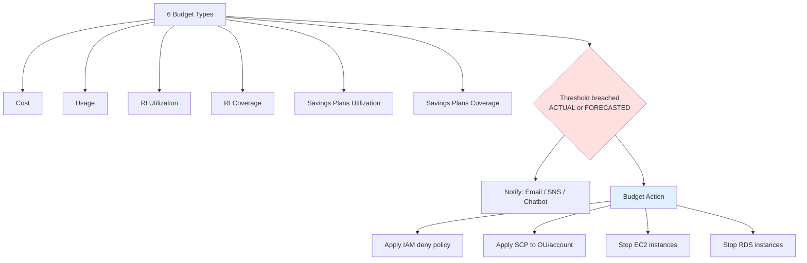
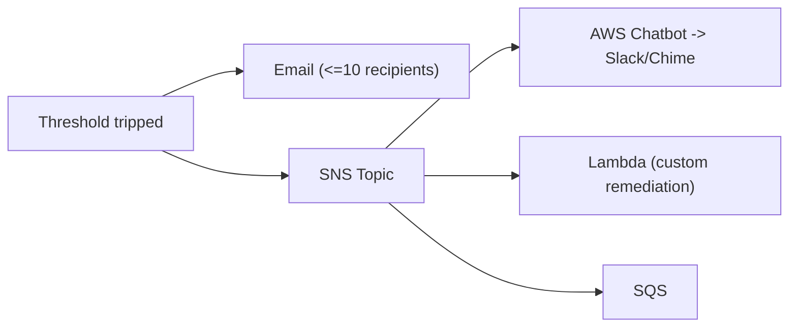

# Budget Types, Actions & Alerts - SAA-C03 Deep Dive

> A deep dive into the **six budget types**, **actual vs forecasted** alert thresholds, the **notification pipeline**, and **Budget Actions** (IAM / SCP / stop EC2 / stop RDS) that turn a budget from a passive alert into a hard enforcement guardrail.

See also: [01 - AWS Budgets Fundamentals & Architecture](01%20-%20AWS%20Budgets%20Fundamentals%20%26%20Architecture.md) · [03 - AWS Budgets Exam Scenarios & Cheat Sheet](03%20-%20AWS%20Budgets%20Exam%20Scenarios%20%26%20Cheat%20Sheet.md) · [00 - Cost Management Overview](00%20-%20Cost%20Management%20Overview.md)

---

## Table of Contents

- [The Six Budget Types](#the-six-budget-types)
- [When to Use Each Budget Type](#when-to-use-each-budget-type)
- [Actual vs Forecasted Alerts](#actual-vs-forecasted-alerts)
- [The Alert / Notification Pipeline](#the-alert--notification-pipeline)
- [Budget Actions: Hard Guardrails](#budget-actions-hard-guardrails)
- [Action Type 1 & 2: Apply IAM Policy or SCP](#action-type-1--2-apply-iam-policy-or-scp)
- [Action Type 3 & 4: Stop EC2 / Stop RDS](#action-type-3--4-stop-ec2--stop-rds)
- [Approval Models: Automatic vs Manual](#approval-models-automatic-vs-manual)
- [CLI Examples](#cli-examples)
- [Best Practices](#best-practices)
- [Summary: Key Takeaways for SAA-C03](#summary-key-takeaways-for-saa-c03)

---



---

This file moves from _what you can budget_ (the six types) to _how you get warned_ (actual vs forecasted alerts and the SNS pipeline) to _how you enforce_ (Budget Actions). The exam loves the difference between **cost vs usage**, **utilization vs coverage**, and **alert vs action**.

---

## The Six Budget Types

Know all six. They split into three families:

| #   | Budget type                          | Family        | Measures                                   |
| --- | ------------------------------------ | ------------- | ------------------------------------------ |
| 1   | **Cost budget**                      | Cost/Usage    | Dollars spent against a target             |
| 2   | **Usage budget**                     | Cost/Usage    | Usage quantity (e.g., GB, hours, requests) |
| 3   | **RI utilization budget**            | Reservation   | % of your RIs actually being **used**      |
| 4   | **RI coverage budget**               | Reservation   | % of eligible usage **covered** by RIs     |
| 5   | **Savings Plans utilization budget** | Savings Plans | % of your SP commitment being **used**     |
| 6   | **Savings Plans coverage budget**    | Savings Plans | % of eligible usage **covered** by SPs     |

**Utilization vs Coverage — the classic trap:**

- **Utilization** = "Of the commitment I bought, how much am I _using_?" (Low utilization = wasted money on idle reservations.)
- **Coverage** = "Of my eligible on-demand usage, how much is _covered_ by a commitment?" (Low coverage = you're paying on-demand prices where a commitment could save money.)

> **Exam Trap:** _Utilization_ watches the **commitment** (am I wasting what I bought?). _Coverage_ watches the **usage** (am I leaving savings on the table?). They are opposite viewpoints.

[⬆ Back to top](#table-of-contents)

---

## When to Use Each Budget Type

| Goal / scenario                                  | Budget type               |
| ------------------------------------------------ | ------------------------- |
| Cap monthly dollar spend for a team/account      | **Cost budget**           |
| Limit GB of S3 / data-transfer / EC2 hours       | **Usage budget**          |
| Alert if my Reserved Instances sit idle          | **RI utilization budget** |
| Alert if too much on-demand isn't covered by RIs | **RI coverage budget**    |
| Alert if my Savings Plan commitment is underused | **SP utilization budget** |
| Alert if eligible usage isn't covered by SPs     | **SP coverage budget**    |

> **Exam Tip:** A **usage budget** can alert on quantities, which lets you stay inside the **Free Tier** (e.g., alert before exceeding the free 750 EC2 hours) — though the zero-spend cost-budget template is the more common Free-Tier answer.

[⬆ Back to top](#table-of-contents)

---

## Actual vs Forecasted Alerts

Each budget supports **up to 5 alert thresholds**, and **each threshold can be set on ACTUAL or FORECASTED** values.

| Threshold basis | Fires when                                    | Use it for                      |
| --------------- | --------------------------------------------- | ------------------------------- |
| **ACTUAL**      | Real accrued spend/usage crosses % of budget  | Confirming you _have_ overspent |
| **FORECASTED**  | AWS predicts end-of-period value will cross % | Warning _before_ you overspend  |

**Forecasting prerequisite:** forecasted alerts need roughly **5 weeks of historical usage** before AWS can produce a reliable forecast. New accounts or brand-new budgets won't fire forecasted alerts until enough history accrues.

> **Exam Trap:** "We set a forecasted alert but it never fired" → likely the budget/account has **less than ~5 weeks of history**, so no forecast exists yet. Also possible: data-refresh lag or wrong scope (covered in file 03).

A common pattern is to set multiple thresholds on one budget, e.g.:

- 80% **forecasted** → "heads up, you'll likely exceed."
- 100% **actual** → "you have exceeded."
- 120% **actual** → "hard breach, trigger an action."

[⬆ Back to top](#table-of-contents)

---

## The Alert / Notification Pipeline

When a threshold trips, the notification can go to:

| Channel           | Limit / detail                                 |
| ----------------- | ---------------------------------------------- |
| **Email**         | Up to **10 email recipients per alert**        |
| **SNS topic**     | One topic per alert; fans out to subscribers   |
| **AWS Chatbot**   | Via SNS → Slack or Amazon Chime                |
| Downstream of SNS | Lambda, SQS, HTTPS, etc. for custom automation |



```json
{
  "Version": "2012-10-17",
  "Id": "budgets-sns-policy",
  "Statement": [
    {
      "Sid": "AllowBudgetsToPublish",
      "Effect": "Allow",
      "Principal": { "Service": "budgets.amazonaws.com" },
      "Action": "SNS:Publish",
      "Resource": "arn:aws:sns:us-east-1:111122223333:budget-alerts"
    }
  ]
}
```

> **Exam Trap:** The **SNS topic access policy must allow `budgets.amazonaws.com` to publish** (above). Missing this policy is the #1 reason an SNS-based budget alert silently fails.

[⬆ Back to top](#table-of-contents)

---

## Budget Actions: Hard Guardrails

Alerts only _tell_ you. **Budget Actions** _do something_ when a threshold is breached, converting Budgets into an enforcement tool. There are **four action types**:

| #   | Action                 | Effect                                           |
| --- | ---------------------- | ------------------------------------------------ |
| 1   | **Apply IAM policy**   | Attach a (deny) policy to users/groups/roles     |
| 2   | **Apply SCP**          | Attach a Service Control Policy to an OU/account |
| 3   | **Stop EC2 instances** | Halt targeted EC2 instances                      |
| 4   | **Stop RDS instances** | Halt targeted RDS instances                      |

> **Exam Tip:** "Automatically **stop** spending / **prevent** new resources when budget exceeded" → **Budget Actions**. Stopping EC2/RDS reduces ongoing cost; IAM/SCP denies _new_ spend.

[⬆ Back to top](#table-of-contents)

---

## Action Type 1 & 2: Apply IAM Policy or SCP

When the threshold trips, Budgets attaches a **restrictive (deny) policy** to limit further spend.

- **IAM policy** → applied to specified **IAM users, groups, or roles** in the account.
- **SCP** → applied to a target **OU or account** in AWS Organizations (a broader, org-level guardrail; must be created in the management account with SCPs enabled).

Example IAM deny policy that blocks launching new EC2 instances and RDS databases once the budget is breached:

```json
{
  "Version": "2012-10-17",
  "Statement": [
    {
      "Sid": "DenyNewSpendOnBudgetBreach",
      "Effect": "Deny",
      "Action": [
        "ec2:RunInstances",
        "rds:CreateDBInstance",
        "rds:CreateDBCluster"
      ],
      "Resource": "*"
    }
  ]
}
```

> **Exam Tip:** Use **IAM policy** actions for guardrails inside a single account, and **SCP** actions when you need to clamp down an **entire OU or member account** org-wide. SCP is the bigger hammer.

> **Exam Trap:** A budget action that applies an IAM/SCP policy needs the right **service-linked / execution permissions** to modify IAM. If the budget's execution role lacks `iam:AttachUserPolicy` (etc.), the action fails to apply.

[⬆ Back to top](#table-of-contents)

---

## Action Type 3 & 4: Stop EC2 / Stop RDS

These actions **stop running instances** to immediately curb ongoing compute/database cost.

- Useful for **dev/test/sandbox** environments that should never run past a budget.
- Stopping (not terminating) preserves data on EBS / RDS storage; you still pay for storage but not compute.

> **Exam Tip:** "Dev environment keeps overrunning its budget — automatically shut it down" → Budget Action to **stop EC2 / stop RDS** on the relevant tagged/targeted instances.

> **Exam Trap:** Stopping an instance does **not** stop **EBS storage** or **Elastic IP** charges. The bill drops but doesn't go to zero.

[⬆ Back to top](#table-of-contents)

---

## Approval Models: Automatic vs Manual

Each Budget Action runs in one of two modes:

| Mode                | Behavior                                                | Use when                                     |
| ------------------- | ------------------------------------------------------- | -------------------------------------------- |
| **Automatic**       | Action executes immediately on breach                   | Trusted hard guardrail (e.g., stop sandbox)  |
| **Manual approval** | Action is _staged_; a human must approve before it runs | High-blast-radius actions (production, SCPs) |

> **Exam Trap:** "Budget action didn't stop the instances" → the action may be in **manual-approval** mode and **pending approval**. With manual mode, nothing happens until someone clicks approve.

[⬆ Back to top](#table-of-contents)

---

## CLI Examples

Create a simple monthly cost budget:

```bash
aws budgets create-budget \
  --account-id 111122223333 \
  --budget '{
    "BudgetName": "Monthly-1000-USD",
    "BudgetLimit": { "Amount": "1000", "Unit": "USD" },
    "TimeUnit": "MONTHLY",
    "BudgetType": "COST"
  }' \
  --notifications-with-subscribers '[
    {
      "Notification": {
        "NotificationType": "FORECASTED",
        "ComparisonOperator": "GREATER_THAN",
        "Threshold": 80,
        "ThresholdType": "PERCENTAGE"
      },
      "Subscribers": [
        { "SubscriptionType": "EMAIL", "Address": "finops@example.com" }
      ]
    }
  ]'
```

Create a Budget Action that applies an IAM deny policy at 100% actual:

```bash
aws budgets create-budget-action \
  --account-id 111122223333 \
  --budget-name "Monthly-1000-USD" \
  --notification-type ACTUAL \
  --action-type APPLY_IAM_POLICY \
  --action-threshold '{ "ActionThresholdValue": 100, "ActionThresholdType": "PERCENTAGE" }' \
  --definition '{
    "IamActionDefinition": {
      "PolicyArn": "arn:aws:iam::111122223333:policy/DenyNewSpend",
      "Roles": ["AppRole"]
    }
  }' \
  --execution-role-arn "arn:aws:iam::111122223333:role/BudgetsActionRole" \
  --approval-model AUTOMATIC \
  --subscribers '[{ "SubscriptionType": "EMAIL", "Address": "finops@example.com" }]'
```

> **Exam Tip:** Note the **`execution-role-arn`** — Budget Actions assume an IAM role to perform IAM/SCP/stop operations. No role (or insufficient role permissions) = action fails.

[⬆ Back to top](#table-of-contents)

---

## Best Practices

- **Layer thresholds:** combine a low **forecasted** alert (early warning) with higher **actual** alerts (confirmation + action trigger).
- **Use SNS, not just email,** so you can fan out to Slack (Chatbot), Lambda remediation, and ticketing.
- **Always set the SNS topic policy** to allow `budgets.amazonaws.com`.
- **Scope tightly** with cost allocation tags / linked accounts so each team owns its budget.
- **Use manual approval** for high-impact actions (production stops, SCPs); **automatic** for sandboxes.
- **Right-size the execution role** — least privilege but sufficient to attach policies / stop instances.
- **Track commitments** with utilization _and_ coverage budgets to avoid both waste and missed savings.
- Remember the **~5-week forecast warm-up** when standing up new accounts.

[⬆ Back to top](#table-of-contents)

---

## Summary: Key Takeaways for SAA-C03

| Concept                 | Key fact                                                              |
| ----------------------- | --------------------------------------------------------------------- |
| Budget types (6)        | Cost, Usage, RI utilization, RI coverage, SP utilization, SP coverage |
| Utilization vs coverage | Utilization = using what you bought; Coverage = % of usage covered    |
| Thresholds per budget   | Up to **5**, each ACTUAL or FORECASTED                                |
| Forecast warm-up        | Needs ~**5 weeks** of history                                         |
| Email recipients        | Up to **10 per alert**                                                |
| Notification fan-out    | Email + SNS → Chatbot (Slack/Chime) / Lambda                          |
| SNS gotcha              | Topic policy must allow `budgets.amazonaws.com`                       |
| Budget Actions (4)      | Apply IAM policy, Apply SCP, Stop EC2, Stop RDS                       |
| IAM vs SCP action       | IAM = single account; SCP = OU/account org-wide                       |
| Approval models         | **Automatic** (immediate) vs **Manual** (staged, needs approval)      |
| Action prerequisite     | Valid **execution role** with sufficient permissions                  |

[⬆ Back to top](#table-of-contents)

---
