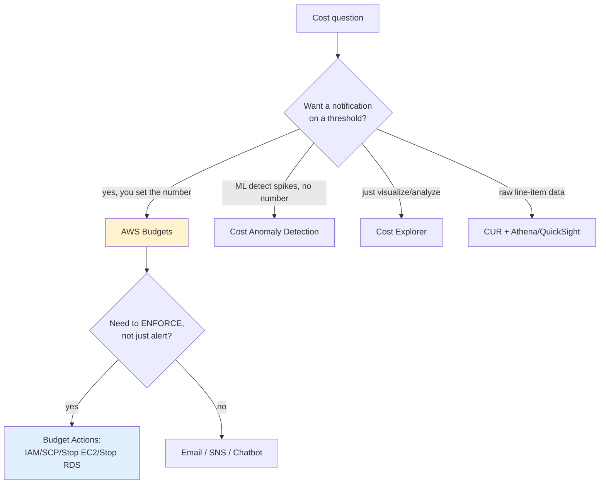

# AWS Budgets Exam Scenarios & Cheat Sheet - SAA-C03 Deep Dive

> Scenario-based Q&A, an SRE-style troubleshooting playbook (why an alert never fired, why an action didn't stop instances), a common-errors table, and a one-page cheat sheet to lock in AWS Budgets for the SAA-C03 exam.

See also: [01 - AWS Budgets Fundamentals & Architecture](01%20-%20AWS%20Budgets%20Fundamentals%20%26%20Architecture.md) · [02 - Budget Types, Actions & Alerts](02%20-%20Budget%20Types%2C%20Actions%20%26%20Alerts.md) · [00 - Cost Management Overview](00%20-%20Cost%20Management%20Overview.md)

---

## Table of Contents

- [How to Read a Budgets Exam Question](#how-to-read-a-budgets-exam-question)
- [Scenario-Based Q&A](#scenario-based-qa)
- [SRE Troubleshooting Playbook](#sre-troubleshooting-playbook)
- [Common Errors & Fixes](#common-errors--fixes)
- [Decision Cheat Sheet: Budgets vs Other Tools](#decision-cheat-sheet-budgets-vs-other-tools)
- [Final Cheat Sheet](#final-cheat-sheet)
- [Summary: Key Takeaways for SAA-C03](#summary-key-takeaways-for-saa-c03)

---

---

The SAA-C03 exam tests **tool selection** and **gotchas**, not billing math. This file drills the recurring scenarios and the "why it broke" troubleshooting that the exam (and real life) loves.

---

## How to Read a Budgets Exam Question

Map the **keyword in the stem** to the answer:

| Keyword in question                           | Likely answer                      |
| --------------------------------------------- | ---------------------------------- |
| "alert me **before**" / "**forecasted**"      | AWS Budgets (forecasted threshold) |
| "**automatically stop / prevent** spend"      | Budget **Actions**                 |
| "**Slack** notification"                      | Budgets → **SNS → AWS Chatbot**    |
| "**ML / automatically detect** unusual spend" | Cost **Anomaly Detection**         |
| "**visualize / break down** past cost"        | Cost **Explorer**                  |
| "**raw, hourly, line-item** data"             | **CUR**                            |
| "alert if **free tier** exceeded"             | Zero-spend budget / usage budget   |
| "**idle** reservation / commitment"           | RI/SP **utilization** budget       |
| "on-demand **not covered** by commitment"     | RI/SP **coverage** budget          |

[⬆ Back to top](#table-of-contents)

---

## Scenario-Based Q&A

**Q1.** Finance wants an email when the company's monthly AWS spend is _projected_ to exceed $50,000, ideally before it actually happens. Which feature?
**A.** An AWS **Cost budget** with a **FORECASTED** threshold alert.
**Why:** Only Budgets sends notifications, and forecasted thresholds warn _before_ the period ends. Cost Explorer shows forecasts but does not alert.

**Q2.** A dev sandbox account repeatedly overruns its $500/month budget. Leadership wants spending physically halted, not just an email. What do you configure?
**A.** A Budget with a **Budget Action** to **stop EC2 (and RDS) instances** (or apply an IAM deny policy) at the threshold, in **automatic** mode.
**Why:** Actions enforce; alerts only notify. Sandbox = safe for automatic mode.

**Q3.** You need budget breaches posted to a **Slack** channel for the platform team. How?
**A.** Budget alert → **SNS topic** → **AWS Chatbot** → Slack.
**Why:** Budgets integrates with chat only through SNS + Chatbot; there's no native Slack target.

**Q4.** Across a 40-account AWS Organization, central FinOps wants one place to set spend guardrails per member account. Where do they create budgets?
**A.** In the **management (payer) account**, with budgets **filtered by linked account** (and/or org-wide).
**Why:** Consolidated billing surfaces member spend in the payer account; budgets there can scope to any member.

**Q5.** Security wants to **deny launching new resources** in an OU once its budget is exceeded. Which action type?
**A.** A Budget Action that **applies an SCP** to the OU.
**Why:** SCPs are the org-level guardrail; IAM-policy actions only cover a single account's principals.

**Q6.** A team bought a 3-year Savings Plan but suspects much of the commitment is wasted. What budget tells them?
**A.** A **Savings Plans utilization budget** (alert when utilization drops below, say, 90%).
**Why:** Utilization measures how much of the _commitment_ is actually used; low utilization = waste.

**Q7.** Most on-demand EC2 usage is _not_ benefiting from any commitment and the team wants to be alerted. Which budget?
**A.** An **RI/SP coverage budget** (alert when coverage falls below a target).
**Why:** Coverage measures the % of eligible usage covered by commitments; low coverage = missed savings.

**Q8.** A startup on the Free Tier wants to know the instant their account incurs _any_ charge. Cheapest option?
**A.** A **zero-spend budget** (cost budget with a near-zero threshold) — and the **first 2 budgets are free**.
**Why:** No need for paid Cost Explorer API or CUR pipelines just to get a single alert.

**Q9.** A budget exists but the team complains alerts arrive _hours_ after the spike. Is something broken?
**A.** No — Budgets data refreshes only **~3x/day**; it is **not real-time**. This lag is expected.
**Why:** For near-real-time reaction you'd need a different mechanism; Budgets is for threshold governance.

**Q10.** They want a **scheduled emailed report** summarizing all of their budgets weekly. What feature?
**A.** **Budget reports** — scheduled (daily/weekly/monthly) email reports covering up to **50 budgets**.
**Why:** This is a distinct Budgets feature separate from per-threshold alerts.

[⬆ Back to top](#table-of-contents)

---

## SRE Troubleshooting Playbook

### "The budget alert never fired"

| Probable cause                           | Diagnosis / fix                                                                            |
| ---------------------------------------- | ------------------------------------------------------------------------------------------ |
| Forecasted alert with too little history | Forecasts need **~5 weeks** of usage; new budget can't forecast yet — use ACTUAL or wait   |
| Data lag                                 | Refresh is **~3x/day**; the breach may not be evaluated yet (not a bug)                    |
| Missing SNS topic policy                 | Topic must allow `budgets.amazonaws.com:SNS:Publish` — add it                              |
| Wrong scope/filter                       | Budget filtered to the wrong service/account/tag → it never sees the spend                 |
| Tag not activated                        | Tag-scoped budgets need the cost allocation tag **activated** in Billing (not retroactive) |
| Email never confirmed                    | SNS email subscriptions require **subscription confirmation** click                        |
| Threshold too high / wrong basis         | Threshold % or ACTUAL-vs-FORECASTED set incorrectly                                        |

### "The budget action didn't stop the instances"

| Probable cause                   | Diagnosis / fix                                                                                |
| -------------------------------- | ---------------------------------------------------------------------------------------------- |
| Manual approval pending          | Action in **manual** mode is staged until a human approves — switch to AUTOMATIC or approve it |
| Execution role lacks permissions | Role needs `ec2:StopInstances` / `rds:StopDBInstance` / `iam:Attach*` as appropriate           |
| Action not enabled / not created | Notification exists but no **Budget Action** was attached                                      |
| Wrong target                     | Action targets the wrong instances / roles / OU                                                |
| Data lag                         | Threshold not yet re-evaluated due to refresh cadence                                          |
| Storage charges persist          | Stopping ≠ terminating; EBS/EIP/RDS storage still bills                                        |

[⬆ Back to top](#table-of-contents)

---

## Common Errors & Fixes

| Symptom                           | Root cause                                   | Fix                                                 |
| --------------------------------- | -------------------------------------------- | --------------------------------------------------- |
| No SNS notification               | Topic policy missing `budgets.amazonaws.com` | Add publish permission to topic policy              |
| Forecasted alert silent           | < ~5 weeks history                           | Use ACTUAL threshold or wait for warm-up            |
| Slack not receiving alerts        | No Chatbot configured on the SNS topic       | Subscribe AWS Chatbot to the topic, configure Slack |
| Tag filter shows $0               | Cost allocation tag not activated            | Activate tag in Billing console (forward-looking)   |
| Action does nothing               | Manual approval pending / role lacks perms   | Approve action or grant execution-role permissions  |
| Bill still high after stop action | EBS/EIP/storage not stopped                  | Terminate or remove storage if truly done           |
| Charged unexpectedly for budgets  | > 2 budgets                                  | First 2 free; $0.02/budget/day after                |
| Alert lags reality by hours       | Data refresh ~3x/day                         | Expected — Budgets is not real-time                 |

[⬆ Back to top](#table-of-contents)

---

## Decision Cheat Sheet: Budgets vs Other Tools

| You want to...                                 | Reach for                                |
| ---------------------------------------------- | ---------------------------------------- |
| Alert on a **threshold** you define            | **AWS Budgets**                          |
| Alert on a **forecasted** breach               | **AWS Budgets** (forecasted)             |
| **Enforce** (stop/deny) on breach              | **Budget Actions**                       |
| **ML-detect** unexpected spikes (no threshold) | **Cost Anomaly Detection**               |
| **Visualize / analyze** historical cost        | **Cost Explorer**                        |
| Get **raw hourly line-item** data              | **CUR** (→ Athena/QuickSight)            |
| **Slack/Chime** delivery                       | Budgets → **SNS → AWS Chatbot**          |
| Track **commitment waste / coverage**          | **RI/SP utilization & coverage budgets** |

[⬆ Back to top](#table-of-contents)

---

## Final Cheat Sheet

- **Budgets = you set the threshold; alert on ACTUAL or FORECASTED.**
- **6 types:** Cost, Usage, RI utilization, RI coverage, SP utilization, SP coverage.
- **Utilization** = using what you bought; **Coverage** = % of usage covered.
- **5 thresholds/budget**, each ACTUAL or FORECASTED; **10 emails/alert**.
- **Forecast needs ~5 weeks** of history.
- **Refresh ~3x/day** — NOT real-time.
- **Periods:** daily / monthly / quarterly / annual; fixed or planned amounts.
- **Filters:** service, account, tag, AZ, instance type, region, usage type, charge type.
- **Notifications:** Email + SNS → Chatbot (Slack/Chime) / Lambda; SNS topic policy must allow `budgets.amazonaws.com`.
- **Actions (4):** apply IAM policy, apply SCP, stop EC2, stop RDS. **Automatic vs Manual** approval. Needs an **execution role**.
- **Reports:** scheduled email, up to **50 budgets**.
- **Pricing:** first **2 free**, then **$0.02/budget/day**; Actions billed separately.
- **Org:** create in **management/payer** account; track org-wide or member spend.
- **Templates:** zero-spend, monthly-cost.

[⬆ Back to top](#table-of-contents)

---

## Summary: Key Takeaways for SAA-C03

| Theme                   | Exam takeaway                                                                                                  |
| ----------------------- | -------------------------------------------------------------------------------------------------------------- |
| Tool selection          | Threshold + notify/act → **Budgets**; ML spikes → Anomaly Detection; visualize → Cost Explorer; raw data → CUR |
| Forecast                | Budgets is the only core tool that **alerts** on forecasted spend (~5-week warm-up)                            |
| Enforcement             | **Budget Actions**: IAM, SCP, stop EC2, stop RDS; automatic vs manual                                          |
| Slack delivery          | Budgets → **SNS → AWS Chatbot** (no native Slack)                                                              |
| #1 silent-failure cause | Missing **SNS topic policy** for `budgets.amazonaws.com`                                                       |
| Not real-time           | Refresh **~3x/day**; expect lag                                                                                |
| Org guardrails          | Set in **management account**; SCP actions clamp whole OUs                                                     |
| Cost                    | First **2 budgets free**, then **$0.02/budget/day**                                                            |

[⬆ Back to top](#table-of-contents)

---
