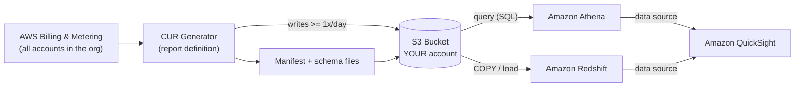
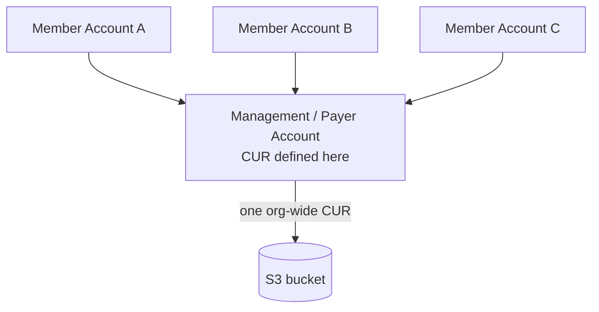

# AWS Cost and Usage Report (CUR) — Fundamentals & Architecture - SAA-C03 Deep Dive

> The CUR is the single most comprehensive and granular source of AWS billing data — every line item, optionally per-resource and per-hour — delivered to an S3 bucket you own.

See also: [02 - CUR Data, Athena & QuickSight Integration](02%20-%20CUR%20Data%2C%20Athena%20%26%20QuickSight%20Integration.md) · [03 - Cost and Usage Report Exam Scenarios & Cheat Sheet](03%20-%20Cost%20and%20Usage%20Report%20Exam%20Scenarios%20%26%20Cheat%20Sheet.md) · [00 - Cost Management Overview](00%20-%20Cost%20Management%20Overview.md)

---

## Table of Contents

- [What Is the Cost and Usage Report?](#what-is-the-cost-and-usage-report)
- [Why CUR Exists: The Granularity Problem](#why-cur-exists-the-granularity-problem)
- [End-to-End Data-Flow Architecture](#end-to-end-data-flow-architecture)
- [Granularity Options & Resource-Level IDs](#granularity-options--resource-level-ids)
- [Delivery: S3 Bucket, Cadence & Versioning](#delivery-s3-bucket-cadence--versioning)
- [Output Formats: CSV vs Parquet & the Manifest](#output-formats-csv-vs-parquet--the-manifest)
- [Where to Set It Up: Payer (Management) Account](#where-to-set-it-up-payer-management-account)
- [Pricing Model](#pricing-model)
- [CUR vs Cost Explorer](#cur-vs-cost-explorer)
- [CUR 2.0 & AWS Data Exports (The Modern Front-End)](#cur-20--aws-data-exports-the-modern-front-end)
- [Summary: Key Takeaways for SAA-C03](#summary-key-takeaways-for-saa-c03)

---



---

The **AWS Cost and Usage Report (CUR)** is AWS's most detailed billing data set. While Cost Explorer gives you polished charts and AWS Budgets gives you alerts, the CUR hands you the _raw_ line items behind the bill so you can build your own chargeback, audit, and analytics pipelines. This file covers what CUR is, why it exists, how the data flows, the granularity and delivery options, formats, pricing, and how it differs from Cost Explorer — plus the modern CUR 2.0 / Data Exports successor.

---

## What Is the Cost and Usage Report?

The CUR is the **most comprehensive set of AWS cost and usage data available**. It publishes **one line item for each unique combination** of:

- AWS **product** (service, e.g. Amazon EC2)
- **usage type** (e.g. `BoxUsage:m5.large`)
- **operation** (e.g. `RunInstances`)

For every such combination, the report records the usage quantity, the rate, the cost, applicable discounts (Reserved Instances, Savings Plans), credits, taxes, and — once activated — your cost allocation tags as extra columns.

| Property       | Detail                                                                                     |
| -------------- | ------------------------------------------------------------------------------------------ |
| Scope          | Every line item across all accounts in the organization (when set up in the payer account) |
| Detail         | The most granular billing data AWS offers — more detailed than Cost Explorer               |
| Output         | Files written to **an S3 bucket you own**                                                  |
| Refresh        | Updated **at least once per day**; AWS may revise estimates during the month               |
| Cost of report | Free (you pay only for S3 + query engines)                                                 |

> **Exam Tip:** If a question asks for the **"most detailed / most granular billing data"** or wants you to **query billing data with SQL/Athena**, the answer is the **Cost and Usage Report**, not Cost Explorer.

[⬆ Back to top](#table-of-contents)

---

## Why CUR Exists: The Granularity Problem

Cost Explorer aggregates and summarizes — great for humans, limited for programmatic analysis. Organizations frequently need to:

- **Charge back / show back** costs to individual teams, projects, or cost centers down to the resource.
- **Audit** every penny for finance/compliance.
- Build **custom dashboards** that combine billing data with their own business dimensions.
- Analyze **RI/Savings Plans utilization & coverage** at line-item depth.

The CUR solves this by exporting the _underlying_ metering records, so you control the queries and the visualization layer.

```text
Cost Explorer  →  "Show me a chart of EC2 spend this month."        (summarized)
CUR            →  "Give me every hourly line item, per resource,
                   with the RI discount and the cost-center tag,
                   so I can run my own SQL."                         (exhaustive)
```

[⬆ Back to top](#table-of-contents)

---

## End-to-End Data-Flow Architecture

The pipeline is intentionally simple: AWS generates the report, drops it in _your_ bucket, and you point an analytics engine at it.

```mermaid
sequenceDiagram
    participant Billing as AWS Billing
    participant CUR as CUR Definition
    participant S3 as S3 (your account)
    participant Q as Athena / Redshift / QuickSight

    Billing->>CUR: Aggregate all line items
    CUR->>S3: Write GZIP-CSV or Parquet + manifest
    Note over CUR,S3: First delivery up to 24h; then >= once/day
    Q->>S3: Read files (SQL / COPY)
    Q-->>Q: Build dashboards, chargeback, audit
```

**Critical dependency — the S3 bucket policy.** The bucket lives in _your_ account, so AWS's billing service cannot write to it until you attach a **bucket policy granting the billing service write access**. The console can create/validate this policy for you; if files never arrive, this is the first thing to check (see [03 - Cost and Usage Report Exam Scenarios & Cheat Sheet](03%20-%20Cost%20and%20Usage%20Report%20Exam%20Scenarios%20%26%20Cheat%20Sheet.md)).

> **Exam Trap:** The CUR S3 bucket is owned by **you**, not by AWS. No bucket policy = no delivery.

[⬆ Back to top](#table-of-contents)

---

## Granularity Options & Resource-Level IDs

When you define a report you choose its **time granularity** and whether to include **resource IDs**.

| Granularity | Meaning                         | Use case                                                  |
| ----------- | ------------------------------- | --------------------------------------------------------- |
| **Hourly**  | One row per hour per line item  | Fine-grained utilization, spotting spikes, RI/SP analysis |
| **Daily**   | One row per day per line item   | Most common balance of detail vs. file size               |
| **Monthly** | One row per month per line item | High-level rollups, smallest files                        |

**Resource-level IDs (optional):** when enabled, the report includes the **individual resource ID** (e.g. an EC2 instance ID, an EBS volume ID) as its own line — letting you attribute cost to a specific resource. This is the **most detailed view AWS provides**.

> **Exam Tip:** "Need cost broken down **per individual resource**" → enable **resource IDs** in the CUR. Enabling resource IDs greatly increases file size and query cost.

> **Exam Trap:** Hourly + resource-level produces _enormous_ files. Pair with **Parquet + partitioning** to keep query cost down (covered in [02 - CUR Data, Athena & QuickSight Integration](02%20-%20CUR%20Data%2C%20Athena%20%26%20QuickSight%20Integration.md)).

[⬆ Back to top](#table-of-contents)

---

## Delivery: S3 Bucket, Cadence & Versioning

**Delivery target:** an **S3 bucket you own** (any region). The report writes a folder hierarchy containing data files plus manifest/metadata.

**Cadence:**

- **First report can take up to 24 hours** to appear after you create the definition.
- Thereafter, files are **updated at least once per day**.
- AWS may **revise estimates throughout the month** as charges finalize, so intra-month figures are estimates until the bill closes.

**Versioning options** — how AWS handles each day's new file set:

| Option                        | Behavior                                       | Trade-off                                                         |
| ----------------------------- | ---------------------------------------------- | ----------------------------------------------------------------- |
| **Overwrite existing report** | Replaces the prior file set each time          | **Fewer files**, lower storage, but no history of prior estimates |
| **Create new report version** | Writes a new timestamped version each delivery | Keeps **full history**, but more files / more storage             |

> **Exam Tip:** "Keep a history of how estimates changed over time" → choose **create new version**. "Minimize the number of files / storage" → choose **overwrite**.

[⬆ Back to top](#table-of-contents)

---

## Output Formats: CSV vs Parquet & the Manifest

The CUR can be written as:

| Format                    | Notes                                                                      |
| ------------------------- | -------------------------------------------------------------------------- |
| **CSV (GZIP-compressed)** | Human-readable-ish, broadly compatible                                     |
| **Apache Parquet**        | Columnar, compressed, **far cheaper & faster to query** in Athena/Redshift |

A **manifest file** accompanies each delivery and **describes the schema** (column list, file locations). Athena/Redshift integrations use the manifest to understand the data.

The CUR can **auto-generate integration** with **Amazon Athena, Amazon Redshift, and Amazon QuickSight** — AWS sets up the table definitions / crawler artifacts so you can start querying quickly.

> **Exam Tip:** For cost-effective, performant querying choose **Parquet**. Athena bills per **data scanned**, and columnar Parquet scans far less than GZIP-CSV.

[⬆ Back to top](#table-of-contents)

---

## Where to Set It Up: Payer (Management) Account

For **organization-wide** line items, create the CUR in the **management (payer) account**. The payer account sees consolidated billing for every member account, so its CUR contains the full org's data.



> **Exam Trap:** Create the CUR in a member account and it only contains that account's data. For whole-org chargeback, it **must** be the payer account.

[⬆ Back to top](#table-of-contents)

---

## Pricing Model

| Component                      | Cost                            |
| ------------------------------ | ------------------------------- |
| The CUR report itself          | **Free**                        |
| S3 storage of the report files | Standard S3 pricing             |
| Athena queries                 | Per TB of data **scanned**      |
| Redshift                       | Cluster / RPU compute + storage |
| QuickSight                     | Per-user / per-session pricing  |

The report generation costs nothing; **you pay only for storage and for whatever you use to query/visualize it.** This is why format (Parquet), partitioning, and S3 lifecycle policies matter for cost control.

[⬆ Back to top](#table-of-contents)

---

## CUR vs Cost Explorer

| Dimension          | **Cost and Usage Report (CUR)**        | **Cost Explorer**                       |
| ------------------ | -------------------------------------- | --------------------------------------- |
| Nature             | Raw, exhaustive line items             | Visual, interactive, summarized         |
| Granularity        | Hourly/daily/monthly + per-resource    | Down to daily/hourly (limited), grouped |
| How you consume it | **You query it** (Athena/Redshift/SQL) | Built-in UI charts & filters            |
| Best for           | Custom dashboards, chargeback, audit   | Quick visual analysis, forecasting      |
| Delivery           | Files in your S3 bucket                | Console UI / API                        |
| Cost               | Free + storage/query                   | Free UI (API calls billed per request)  |

> **Exam Tip — the deciding phrases:**
>
> - "most detailed / granular billing data," "query with Athena/SQL," "build a custom chargeback dashboard" → **CUR**
> - "interactive visualization," "quick chart," "forecast spend in the console" → **Cost Explorer**

[⬆ Back to top](#table-of-contents)

---

## CUR 2.0 & AWS Data Exports (The Modern Front-End)

AWS introduced **AWS Data Exports** as the modern mechanism for creating cost data exports, with **CUR 2.0** as the new data format.

| Concept              | What it is                                                                                                |
| -------------------- | --------------------------------------------------------------------------------------------------------- |
| **AWS Data Exports** | The modern **front-end / service** for creating exports of cost data to S3                                |
| **CUR 2.0**          | The new **data format**: customizable columns, **SQL-like column selection**, and a **consistent schema** |

Benefits of CUR 2.0 via Data Exports:

- **Choose exactly which columns** you want (SQL-like selection) instead of the full fixed schema.
- **Consistent schema** that doesn't change shape as new columns appear — friendlier for downstream pipelines.
- Same S3 delivery model, integrates with Athena/QuickSight.

> **Exam Tip:** If a newer question references **"AWS Data Exports"** or **"CUR 2.0 with customizable columns / consistent schema,"** it's the modern way to produce the Cost and Usage Report. The classic CUR concepts (S3 delivery, granularity, Parquet) still apply.

[⬆ Back to top](#table-of-contents)

---

## Summary: Key Takeaways for SAA-C03

| Concept              | Key Fact                                                                                              |
| -------------------- | ----------------------------------------------------------------------------------------------------- |
| What CUR is          | Most comprehensive/granular AWS cost & usage data; one line item per product × usage type × operation |
| Granularity          | Hourly, daily, or monthly; optional **resource-level IDs**                                            |
| Delivery target      | **S3 bucket you own** — requires a **bucket policy** granting billing write access                    |
| First delivery       | Up to **24 hours**; then refreshed **>= once/day**                                                    |
| Versioning           | **Overwrite** (fewer files) vs **new version** (keep history)                                         |
| Formats              | **CSV (GZIP)** or **Parquet**; **manifest** describes schema                                          |
| Integrations         | Auto-setup for **Athena, Redshift, QuickSight**                                                       |
| Where to create      | **Payer (management) account** for org-wide data                                                      |
| Pricing              | Report is **free**; pay for S3 storage + query engines                                                |
| CUR vs Cost Explorer | CUR = raw/queryable/audit; Cost Explorer = visual/summarized                                          |
| Modern path          | **AWS Data Exports** + **CUR 2.0** (customizable columns, consistent schema)                          |

[⬆ Back to top](#table-of-contents)

---
