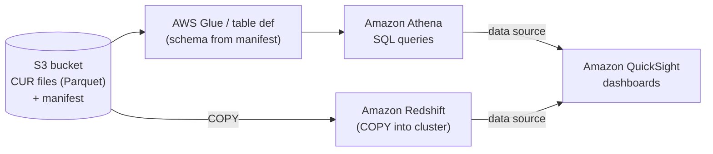
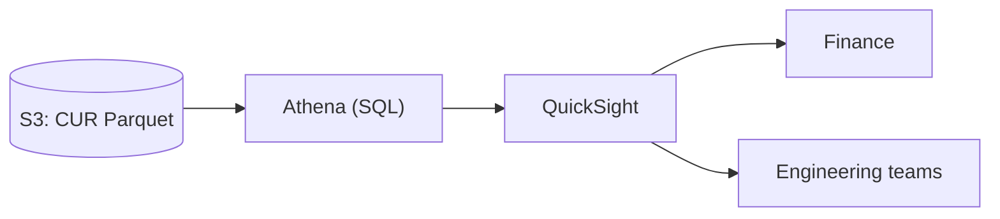

# CUR Data, Athena & QuickSight Integration - SAA-C03 Deep Dive

> The CUR's column schema (cost types, RI/SP, tags) plus its Athena → QuickSight (or Redshift) query pattern is what turns raw billing files into a chargeback dashboard.

See also: [01 - CUR Fundamentals & Architecture](01%20-%20CUR%20Fundamentals%20%26%20Architecture.md) · [03 - Cost and Usage Report Exam Scenarios & Cheat Sheet](03%20-%20Cost%20and%20Usage%20Report%20Exam%20Scenarios%20%26%20Cheat%20Sheet.md) · [00 - Cost Management Overview](00%20-%20Cost%20Management%20Overview.md)

---

## Table of Contents

- [The CUR Schema at a Glance](#the-cur-schema-at-a-glance)
- [Cost Types: Unblended, Blended, Amortized & Net](#cost-types-unblended-blended-amortized--net)
- [Reserved Instance & Savings Plans Columns](#reserved-instance--savings-plans-columns)
- [Cost Allocation Tag Columns (Activation Required)](#cost-allocation-tag-columns-activation-required)
- [The Manifest & File Layout](#the-manifest--file-layout)
- [Querying CUR with Amazon Athena (SQL)](#querying-cur-with-amazon-athena-sql)
- [The QuickSight + Athena Dashboard Pattern](#the-quicksight--athena-dashboard-pattern)
- [The Amazon Redshift Option](#the-amazon-redshift-option)
- [S3 Bucket Policy for CUR Delivery (JSON)](#s3-bucket-policy-for-cur-delivery-json)
- [Best Practices: Cost, Performance & Security](#best-practices-cost-performance--security)
- [Summary: Key Takeaways for SAA-C03](#summary-key-takeaways-for-saa-c03)

---



---

Once the CUR is landing in S3 (see [01 - CUR Fundamentals & Architecture](01%20-%20CUR%20Fundamentals%20%26%20Architecture.md)), the value comes from _querying_ it. This file dissects the column schema — especially the different **cost types**, **RI/Savings Plans** columns, and **cost allocation tag** columns — explains the **manifest**, shows an **Athena SQL** example, the **QuickSight** and **Redshift** patterns, the required **S3 bucket policy**, and the **best practices** that keep queries fast, cheap, and secure.

---

## The CUR Schema at a Glance

The CUR is a wide table. Columns are grouped into families (prefixes in classic CUR):

| Column family        | Prefix          | Example columns                                                                                                     |
| -------------------- | --------------- | ------------------------------------------------------------------------------------------------------------------- |
| Identity / line item | `lineItem/`     | `lineItem/UsageType`, `lineItem/Operation`, `lineItem/UnblendedCost`, `lineItem/BlendedCost`, `lineItem/ResourceId` |
| Bill                 | `bill/`         | `bill/BillingPeriodStartDate`, `bill/PayerAccountId`                                                                |
| Product              | `product/`      | `product/ProductName`, `product/region`, `product/instanceType`                                                     |
| Pricing              | `pricing/`      | `pricing/term`, `pricing/unit`                                                                                      |
| Reservation (RI)     | `reservation/`  | `reservation/AmortizedUpfrontFeeForBillingPeriod`, coverage data                                                    |
| Savings Plan         | `savingsPlan/`  | `savingsPlan/SavingsPlanEffectiveCost`                                                                              |
| Cost allocation tags | `resourceTags/` | `resourceTags/user:CostCenter` (only after activation)                                                              |

> **Exam Tip:** The CUR contains **resource IDs**, **operation**, and **usage type** columns — this granularity is exactly what lets you do per-resource chargeback that Cost Explorer cannot.

[⬆ Back to top](#table-of-contents)

---

## Cost Types: Unblended, Blended, Amortized & Net

The CUR exposes **multiple cost representations** of the same usage. Choosing the right one is a common exam discriminator.

| Cost type                         | What it represents                                                                           | When to use                                          |
| --------------------------------- | -------------------------------------------------------------------------------------------- | ---------------------------------------------------- |
| **Unblended cost**                | The actual rate charged for that specific usage at that moment (the "cash" cost on the line) | Reconciling against the actual invoice               |
| **Blended cost**                  | An **averaged rate** across linked accounts in an org (consolidated billing averages)        | Internal fairness across member accounts             |
| **Amortized cost**                | Spreads **upfront RI/SP fees** evenly across the term so each hour carries its share         | "True" cost per period; smooths big upfront payments |
| **Net unblended / Net amortized** | Same as above but **after applying credits/discounts**                                       | Showing cost _after_ private pricing/credits         |

```text
Bought a 1-yr All-Upfront RI for $8,760 ($1/hr equivalent):
  Unblended  -> $8,760 shows in the month you paid; $0 thereafter
  Amortized  -> ~$1/hr (~$730/mo) spread across all 12 months
```

> **Exam Tip:** "Spread the upfront Reserved Instance fee evenly across the term" → **amortized cost**. "Match the actual invoice line" → **unblended cost**. "After credits/discounts" → the **net** variants.

[⬆ Back to top](#table-of-contents)

---

## Reserved Instance & Savings Plans Columns

The CUR is the authoritative source for **RI and Savings Plans coverage and discount** analysis at line-item depth:

- **Reservation columns** (`reservation/...`): which usage was covered by an RI, the amortized upfront fee, effective cost, unused reservation hours.
- **Savings Plans columns** (`savingsPlan/...`): `SavingsPlanEffectiveCost`, covered usage, and the discount applied.

This lets you answer "what percentage of my EC2 hours were covered by RIs/SPs and what did I save?" with your own SQL — more flexible than the Cost Explorer RI/SP reports.

> **Exam Tip:** Deep, custom **RI/Savings Plans utilization & coverage** analysis → CUR columns queried in Athena/Redshift. Quick built-in view → Cost Explorer's RI/SP reports.

[⬆ Back to top](#table-of-contents)

---

## Cost Allocation Tag Columns (Activation Required)

Cost allocation tags appear as **additional columns** in the CUR (e.g. `resourceTags/user:CostCenter`) — **but only after you activate them** in the **Billing console**.

Critical rules:

- Activation is done in **Billing → Cost Allocation Tags** (user-defined and/or AWS-generated tags).
- **Activation is NOT retroactive** — tag columns/values appear only for usage **after** activation.
- A tag must exist on resources _and_ be activated to populate the column.

> **Exam Trap:** "Our cost-center tag isn't showing up in the CUR." → The tag was **not activated** as a cost allocation tag, or activation just happened and isn't **retroactive** to past usage. This is one of the most-tested CUR gotchas.

[⬆ Back to top](#table-of-contents)

---

## The Manifest & File Layout

Each delivery includes a **manifest** file that **describes the schema and lists the data files** for the billing period. Athena/Redshift integration relies on the manifest to map columns and locate files.

```text
s3://my-cur-bucket/cur-prefix/
  my-report/
    20260601-20260701/
      my-report-Manifest.json        <- schema + file list
      my-report-00001.snappy.parquet
      my-report-00002.snappy.parquet
```

The manifest is why the auto-generated Athena/Redshift integration "just knows" the columns; if you build the table manually you mirror the manifest's schema.

[⬆ Back to top](#table-of-contents)

---

## Querying CUR with Amazon Athena (SQL)

Athena reads the Parquet/CSV directly from S3. A typical flow: create an external table (often auto-created by the integration / a Glue crawler), then run SQL.

```sql
-- Create an external table over the CUR Parquet files (schema simplified)
CREATE EXTERNAL TABLE IF NOT EXISTS cur_db.cur_line_items (
    line_item_usage_account_id  string,
    line_item_product_code      string,
    line_item_usage_type        string,
    line_item_operation         string,
    line_item_resource_id       string,
    line_item_unblended_cost    double,
    line_item_blended_cost      double,
    pricing_unit                string,
    resource_tags_user_costcenter string
)
PARTITIONED BY (billing_period string)
STORED AS PARQUET
LOCATION 's3://my-cur-bucket/cur-prefix/my-report/';
```

```sql
-- Chargeback: top spend per cost-center tag this billing period
SELECT
    resource_tags_user_costcenter           AS cost_center,
    line_item_product_code                  AS service,
    ROUND(SUM(line_item_unblended_cost), 2) AS total_cost
FROM cur_db.cur_line_items
WHERE billing_period = '2026-06'
  AND line_item_unblended_cost > 0
GROUP BY resource_tags_user_costcenter, line_item_product_code
ORDER BY total_cost DESC
LIMIT 25;
```

```sql
-- Per-resource breakdown (requires resource IDs enabled in the CUR)
SELECT line_item_resource_id,
       SUM(line_item_unblended_cost) AS cost
FROM cur_db.cur_line_items
WHERE billing_period = '2026-06'
GROUP BY line_item_resource_id
ORDER BY cost DESC;
```

> **Exam Tip:** Athena charges per **data scanned**. `WHERE billing_period = '...'` on a **partitioned** Parquet table dramatically reduces scanned bytes and cost.

[⬆ Back to top](#table-of-contents)

---

## The QuickSight + Athena Dashboard Pattern

The canonical "build a cost dashboard from the CUR" answer:



1. CUR lands in S3 (Parquet, partitioned).
2. **Athena** provides the SQL query layer (table from the manifest/Glue).
3. **QuickSight** uses **Athena as a data source** to build interactive, shareable dashboards (optionally **SPICE** for in-memory speed).

> **Exam Tip:** "Build a **custom, interactive cost dashboard** from the most granular billing data" → **CUR (S3) → Athena → QuickSight.** This trio is the single most common CUR exam answer.

[⬆ Back to top](#table-of-contents)

---

## The Amazon Redshift Option

For very large CURs or when you want a persistent warehouse joined with other data, **load the CUR into Amazon Redshift**:

```sql
-- Load CUR files from S3 into a Redshift table
COPY cur_line_items
FROM 's3://my-cur-bucket/cur-prefix/my-report/'
IAM_ROLE 'arn:aws:iam::111122223333:role/RedshiftCopyRole'
FORMAT AS PARQUET;
```

| Engine       | Best when                                                                     |
| ------------ | ----------------------------------------------------------------------------- |
| **Athena**   | Serverless, ad-hoc SQL straight on S3, pay-per-scan — most common, lowest ops |
| **Redshift** | Large persistent warehouse, frequent complex joins, BI at scale               |

[⬆ Back to top](#table-of-contents)

---

## S3 Bucket Policy for CUR Delivery (JSON)

The billing service must be allowed to write to **your** bucket. The console can generate this; the policy grants `s3:GetBucketAcl`/`GetBucketPolicy` and `s3:PutObject`:

```json
{
  "Version": "2012-10-17",
  "Statement": [
    {
      "Sid": "AllowBillingReadBucketAcl",
      "Effect": "Allow",
      "Principal": { "Service": "billingreports.amazonaws.com" },
      "Action": ["s3:GetBucketAcl", "s3:GetBucketPolicy"],
      "Resource": "arn:aws:s3:::my-cur-bucket",
      "Condition": {
        "StringEquals": {
          "aws:SourceAccount": "111122223333",
          "aws:SourceArn": "arn:aws:cur:us-east-1:111122223333:definition/*"
        }
      }
    },
    {
      "Sid": "AllowBillingWriteObjects",
      "Effect": "Allow",
      "Principal": { "Service": "billingreports.amazonaws.com" },
      "Action": "s3:PutObject",
      "Resource": "arn:aws:s3:::my-cur-bucket/*",
      "Condition": {
        "StringEquals": {
          "aws:SourceAccount": "111122223333",
          "aws:SourceArn": "arn:aws:cur:us-east-1:111122223333:definition/*"
        }
      }
    }
  ]
}
```

> **Exam Trap:** No CUR files arriving is almost always a **missing/incorrect S3 bucket policy** (or the bucket is in a region/account the policy doesn't permit). See [03 - Cost and Usage Report Exam Scenarios & Cheat Sheet](03%20-%20Cost%20and%20Usage%20Report%20Exam%20Scenarios%20%26%20Cheat%20Sheet.md).

[⬆ Back to top](#table-of-contents)

---

## Best Practices: Cost, Performance & Security

| Area                  | Best practice                                                                                                                         |
| --------------------- | ------------------------------------------------------------------------------------------------------------------------------------- |
| **Format**            | Use **Parquet** (columnar, compressed) — cheaper/faster Athena scans than GZIP-CSV                                                    |
| **Partitioning**      | Partition by billing period (and dataset); query with `WHERE` on partitions to cut scanned data                                       |
| **Lifecycle**         | Apply **S3 lifecycle policies** — transition old report files to S3-IA/Glacier or expire, controlling storage cost                    |
| **Access**            | **Restrict access** to the CUR bucket (billing data is sensitive) — least-privilege bucket policy, block public access, encrypt (SSE) |
| **Versioning choice** | Use **overwrite** to limit file sprawl, or **new version** when history is required                                                   |
| **Query cost**        | Compress + partition; avoid `SELECT *`; project only needed columns                                                                   |
| **Schema stability**  | Prefer **CUR 2.0 / Data Exports** when you need a consistent schema for pipelines                                                     |

```bash
# Example: lifecycle to expire raw CUR files after 365 days (via S3 lifecycle config)
aws s3api put-bucket-lifecycle-configuration \
  --bucket my-cur-bucket \
  --lifecycle-configuration file://cur-lifecycle.json
```

[⬆ Back to top](#table-of-contents)

---

## Summary: Key Takeaways for SAA-C03

| Concept           | Key Fact                                                                                                          |
| ----------------- | ----------------------------------------------------------------------------------------------------------------- |
| Cost types        | **Unblended** = actual; **Blended** = org-averaged; **Amortized** = upfront RI/SP spread; **Net** = after credits |
| RI/SP columns     | CUR has full reservation & Savings Plans coverage/discount data                                                   |
| Tag columns       | Cost allocation tags appear **only after activation**; **not retroactive**                                        |
| Manifest          | Describes schema + lists files; drives Athena/Redshift integration                                                |
| Athena            | Serverless SQL on S3; bills per **data scanned** → Parquet + partitions                                           |
| Dashboard pattern | **CUR (S3) → Athena → QuickSight** is the go-to answer                                                            |
| Redshift          | Alternative for large persistent warehouse / heavy joins                                                          |
| Bucket policy     | Required to let `billingreports.amazonaws.com` write to your bucket                                               |
| Best practices    | Parquet, partition, lifecycle, restrict + encrypt, project columns                                                |

[⬆ Back to top](#table-of-contents)

---
