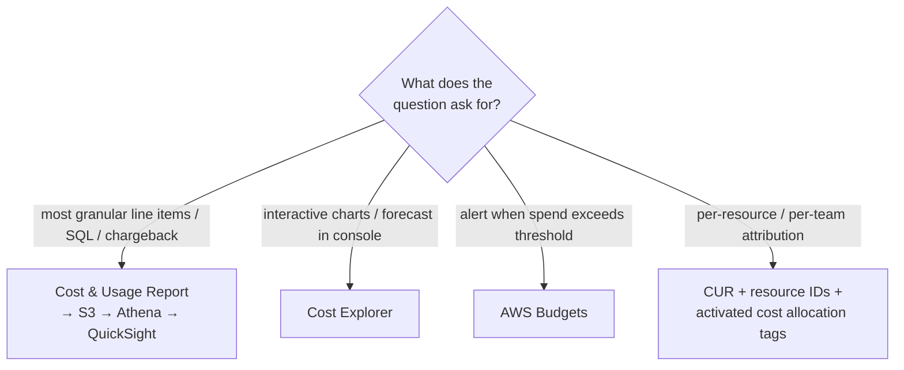

# Cost and Usage Report — Exam Scenarios & Cheat Sheet - SAA-C03 Deep Dive

> Scenario-driven decision-making plus an SRE troubleshooting guide and a one-glance cheat sheet for everything CUR on the SAA-C03 exam.

See also: [01 - CUR Fundamentals & Architecture](01%20-%20CUR%20Fundamentals%20%26%20Architecture.md) · [02 - CUR Data, Athena & QuickSight Integration](02%20-%20CUR%20Data%2C%20Athena%20%26%20QuickSight%20Integration.md) · [00 - Cost Management Overview](00%20-%20Cost%20Management%20Overview.md)

---

## Table of Contents

- [How to Recognize a CUR Question](#how-to-recognize-a-cur-question)
- [Scenario Q&A (Exam-Style)](#scenario-qa-exam-style)
- [CUR vs Cost Explorer vs Budgets — Picking the Service](#cur-vs-cost-explorer-vs-budgets--picking-the-service)
- [SRE Troubleshooting Guide](#sre-troubleshooting-guide)
- [Common Errors & Fixes Table](#common-errors--fixes-table)
- [Final Cheat Sheet](#final-cheat-sheet)
- [Summary: Key Takeaways for SAA-C03](#summary-key-takeaways-for-saa-c03)

---

---

This file converts the fundamentals ([01 - CUR Fundamentals & Architecture](01%20-%20CUR%20Fundamentals%20%26%20Architecture.md)) and integration patterns ([02 - CUR Data, Athena & QuickSight Integration](02%20-%20CUR%20Data%2C%20Athena%20%26%20QuickSight%20Integration.md)) into exam reflexes: keyword triggers, worked scenario Q&A, a service-selection matrix, an SRE-style troubleshooting playbook, a common-errors table, and a final cheat sheet.

---

## How to Recognize a CUR Question

Trigger phrases that point to **CUR**:

| Phrase in the question                               | Signal                         |
| ---------------------------------------------------- | ------------------------------ |
| "most detailed / most granular billing data"         | **CUR**                        |
| "query billing data using SQL / Athena"              | **CUR + Athena**               |
| "build a custom / chargeback / showback dashboard"   | **CUR → Athena → QuickSight**  |
| "line item for every product, usage type, operation" | **CUR**                        |
| "cost down to the individual resource"               | **CUR with resource IDs**      |
| "hourly cost data per resource"                      | **CUR, hourly + resource IDs** |
| "deliver raw billing data to S3"                     | **CUR**                        |
| "customizable columns / consistent schema export"    | **CUR 2.0 / Data Exports**     |

Phrases that point **away** from CUR:

| Phrase                                               | Better answer              |
| ---------------------------------------------------- | -------------------------- |
| "interactive visualization / quick chart / forecast" | **Cost Explorer**          |
| "alert / notify when spend exceeds X"                | **AWS Budgets**            |
| "detect anomalous spend automatically"               | **Cost Anomaly Detection** |

[⬆ Back to top](#table-of-contents)

---

## Scenario Q&A (Exam-Style)

**1. Most granular line-item data for a custom chargeback dashboard.**
_A FinOps team must attribute every dollar to teams down to the resource and build their own interactive dashboard._
**Answer:** Enable the **Cost and Usage Report** (Parquet, resource IDs on), query with **Athena**, visualize with **QuickSight**. Activate cost allocation tags for team attribution.

**2. CUR vs Cost Explorer.**
_Finance wants polished month-over-month charts and a spend forecast without writing SQL._
**Answer:** **Cost Explorer** — visual, interactive, built-in forecasting. CUR would be over-engineering here.

**3. Cost allocation tags not appearing in the report.**
_The `CostCenter` tag is on resources but its column is empty/missing in the CUR._
**Answer:** **Activate** `CostCenter` as a **cost allocation tag** in the Billing console. Remember activation is **not retroactive** — past usage won't be back-filled.

**4. Org-wide chargeback across many accounts.**
_A company with AWS Organizations needs one report covering all member accounts._
**Answer:** Create the CUR in the **management (payer) account** so it contains consolidated org-wide line items.

**5. Spread upfront RI cost across the term for internal reporting.**
_Teams complain that a big upfront RI payment skews one month._
**Answer:** Report on **amortized cost** (or net amortized) from the CUR, which spreads the upfront fee evenly.

**6. Athena query bill is huge.**
_Analysts run frequent queries and Athena costs are climbing._
**Answer:** Switch the CUR to **Parquet**, **partition** by billing period, and filter on partitions / project only needed columns to reduce **data scanned**.

**7. No report files have appeared after setup.**
_A new CUR definition exists but the S3 bucket is empty after a few hours._
**Answer:** Two things: (a) the **first delivery can take up to 24 hours**; (b) verify the **S3 bucket policy** grants `billingreports.amazonaws.com` write access to the correct bucket/region.

**8. Detailed RI / Savings Plans coverage analysis.**
_Need to know exactly which usage was covered and the effective discount, with custom slicing._
**Answer:** Query the CUR's **reservation** and **savingsPlan** columns in Athena/Redshift (more flexible than Cost Explorer's built-in RI/SP reports).

**9. Reduce storage growth of the report files.**
_The CUR bucket keeps growing with historical versions._
**Answer:** Use the **overwrite** versioning option (fewer files) and/or apply **S3 lifecycle** rules to transition/expire old files.

**10. Modern export with only the columns they need and a stable schema.**
_A data pipeline breaks whenever the CUR schema widens._
**Answer:** Use **AWS Data Exports** to create **CUR 2.0** with **customizable columns** and a **consistent schema**.

[⬆ Back to top](#table-of-contents)

---

## CUR vs Cost Explorer vs Budgets — Picking the Service

| Need                                                     | Service                                 |
| -------------------------------------------------------- | --------------------------------------- |
| Raw, exhaustive, queryable line items                    | **Cost and Usage Report**               |
| Interactive charts, grouping, forecasting in the console | **Cost Explorer**                       |
| Threshold alerts on cost/usage/RI coverage               | **AWS Budgets**                         |
| Automatic anomaly detection & root cause                 | **Cost Anomaly Detection**              |
| Custom dashboard from granular data                      | **CUR → Athena → QuickSight**           |
| Per-resource / per-team chargeback                       | **CUR + resource IDs + activated tags** |

[⬆ Back to top](#table-of-contents)

---

## SRE Troubleshooting Guide

| Symptom                               | Likely Cause                                                                                    | Fix                                                                                                        |
| ------------------------------------- | ----------------------------------------------------------------------------------------------- | ---------------------------------------------------------------------------------------------------------- |
| **No files in the S3 bucket**         | Missing/incorrect **bucket policy**; wrong bucket/region; first delivery not yet due            | Apply the billing-service bucket policy; confirm bucket name/region; wait up to **24h** for first delivery |
| **Tag columns empty/missing**         | Cost allocation tag **not activated**, or activation just done                                  | Activate in Billing console; note it is **not retroactive**                                                |
| **Data looks stale / numbers change** | Intra-month figures are **estimates**; refresh is **>= once/day**; AWS revises during the month | Expect daily refresh and end-of-month finalization; don't treat mid-month as final                         |
| **Athena query cost is high**         | Scanning GZIP-CSV / unpartitioned data / `SELECT *`                                             | Use **Parquet**, **partition**, filter on partitions, project columns                                      |
| **Only one account's data appears**   | CUR created in a **member** account                                                             | Recreate in the **payer (management)** account                                                             |
| **Per-resource breakdown missing**    | **Resource IDs** not enabled in the report definition                                           | Enable resource IDs (expect larger files)                                                                  |
| **Athena table has wrong columns**    | Table not synced with **manifest** / new columns added                                          | Re-crawl / re-create table from current manifest; consider **CUR 2.0** for stable schema                   |
| **Storage cost creeping up**          | New versions accumulating; no lifecycle                                                         | Switch to **overwrite** and/or add **S3 lifecycle** rules                                                  |

[⬆ Back to top](#table-of-contents)

---

## Common Errors & Fixes Table

| Error / Misconception                   | Reality                                                                             |
| --------------------------------------- | ----------------------------------------------------------------------------------- |
| "AWS owns the CUR bucket."              | **You** own it; you must attach a bucket policy for billing to write.               |
| "Activating a tag back-fills old data." | Activation is **not retroactive** — only future usage gets the column.              |
| "CUR updates in real time."             | Updated **at least once per day**; intra-month values are estimates.                |
| "First report appears instantly."       | Can take **up to 24 hours**.                                                        |
| "Use CUR for a quick chart."            | Use **Cost Explorer** for quick visuals; CUR is raw data.                           |
| "CSV is fine for big queries."          | Prefer **Parquet** to cut Athena scan cost.                                         |
| "Create the CUR anywhere in the org."   | Use the **payer account** for org-wide data.                                        |
| "Amortized = unblended."                | **Amortized** spreads upfront RI/SP fees; **unblended** is the actual charged rate. |

[⬆ Back to top](#table-of-contents)

---

## Final Cheat Sheet

| Item             | Fact                                                                                         |
| ---------------- | -------------------------------------------------------------------------------------------- |
| Definition       | Most comprehensive/granular cost & usage data; one line per product × usage type × operation |
| Granularity      | **Hourly / daily / monthly** + optional **resource IDs**                                     |
| Delivery         | **S3 bucket you own**; needs **bucket policy** for `billingreports.amazonaws.com`            |
| First delivery   | Up to **24h**; then **>= once/day**; intra-month = estimates                                 |
| Formats          | **CSV (GZIP)** or **Parquet**; **manifest** = schema                                         |
| Versioning       | **Overwrite** (fewer files) vs **new version** (history)                                     |
| Cost types       | Unblended / Blended / **Amortized** / Net (after credits)                                    |
| RI & SP          | Full coverage/discount columns                                                               |
| Tags             | Appear **after activation only**; **not retroactive**                                        |
| Setup location   | **Payer (management) account** for org-wide                                                  |
| Integrations     | **Athena, Redshift, QuickSight** (auto-generatable)                                          |
| Go-to dashboard  | **CUR → Athena → QuickSight**                                                                |
| Pricing          | Report **free**; pay for S3 + query engines                                                  |
| Modern path      | **AWS Data Exports** + **CUR 2.0** (custom columns, consistent schema)                       |
| vs Cost Explorer | CUR = raw/queryable/audit; CE = visual/summarized                                            |

[⬆ Back to top](#table-of-contents)

---

## Summary: Key Takeaways for SAA-C03

| Concept          | Key Fact                                                                                          |
| ---------------- | ------------------------------------------------------------------------------------------------- |
| Recognize CUR    | "most granular," "SQL/Athena," "chargeback," "raw billing to S3" → **CUR**                        |
| Dashboard answer | **CUR (S3, Parquet) → Athena → QuickSight**                                                       |
| Tags gotcha      | Activate cost allocation tags; **not retroactive**                                                |
| Delivery gotcha  | First file up to **24h**; missing files → **bucket policy**                                       |
| Cost type gotcha | **Amortized** spreads upfront RI/SP; **unblended** = actual                                       |
| Org-wide         | Create in the **payer account**                                                                   |
| Query cost       | **Parquet + partitions** to cut Athena scanned data                                               |
| Modern           | **Data Exports / CUR 2.0** for customizable columns & stable schema                               |
| Not CUR          | Visual/forecast → **Cost Explorer**; alerts → **Budgets**; anomalies → **Cost Anomaly Detection** |

[⬆ Back to top](#table-of-contents)

---
