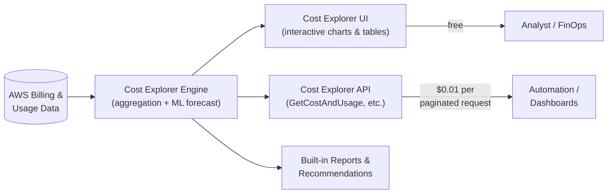

# AWS Cost Explorer Fundamentals & Architecture - SAA-C03 Deep Dive

> AWS Cost Explorer is a free, in-console tool to visualize, understand, and manage AWS cost and usage over time (up to 12 months back, 12 months forecast) with interactive charts, tables, and an optional paid API.

See also: [02 - Cost Explorer Features, Forecasting & Rightsizing](02%20-%20Cost%20Explorer%20Features%2C%20Forecasting%20%26%20Rightsizing.md) · [03 - Cost Explorer Exam Scenarios & Cheat Sheet](03%20-%20Cost%20Explorer%20Exam%20Scenarios%20%26%20Cheat%20Sheet.md) · [00 - Cost Management Overview](00%20-%20Cost%20Management%20Overview.md)

---

## Table of Contents

- [What Is AWS Cost Explorer?](#what-is-aws-cost-explorer)
- [The Problem It Solves](#the-problem-it-solves)
- [Architecture: Where the Data Comes From](#architecture-where-the-data-comes-from)
- [Data Retention: 12-Month History & 12-Month Forecast](#data-retention-12-month-history--12-month-forecast)
- [Granularity: Monthly, Daily, Hourly & Resource-Level](#granularity-monthly-daily-hourly--resource-level)
- [Enablement Lag & Refresh Cadence](#enablement-lag--refresh-cadence)
- [Where to Enable: Payer (Management) Account](#where-to-enable-payer-management-account)
- [Pricing: UI Free, API $0.01 per Request](#pricing-ui-free-api-001-per-request)
- [Cost Explorer vs CUR vs Compute Optimizer](#cost-explorer-vs-cur-vs-compute-optimizer)
- [Summary: Key Takeaways for SAA-C03](#summary-key-takeaways-for-saa-c03)

---

---

AWS Cost Explorer is the first stop for anyone trying to answer "where is my AWS money going?" It is a managed, console-native analytics surface that sits on top of your billing and usage data and turns it into interactive charts and tables. For the SAA-C03 exam, the key associations are: **visualize and understand cost trends**, **12 months of history and forecast**, **free UI / paid API**, and **rightsizing + RI/Savings Plans recommendations**. This file establishes what the service is, how it is wired together, and the operational facts (lag, granularity, where to enable) that scenario questions love to test.

---

## What Is AWS Cost Explorer?

AWS Cost Explorer is a **free, in-console tool** to **visualize, understand, and manage** your AWS cost and usage over time. It lives inside the **AWS Cost Management** console alongside Cost Anomaly Detection, Cost Categories, Budgets, and the Cost and Usage Report (CUR).

| Attribute   | Detail                                                                |
| ----------- | --------------------------------------------------------------------- |
| Purpose     | Visualize and analyze cost & usage trends                             |
| Interface   | Interactive charts + tabular breakdowns (UI), plus a programmatic API |
| Cost (UI)   | Free                                                                  |
| Cost (API)  | $0.01 per paginated request                                           |
| Scope       | Single account or entire AWS Organization (from the payer account)    |
| Data window | Last 12 months history + up to 12 months forecast                     |

> **Exam Tip:** When a question asks to "**visualize**", "**explore trends**", or "**break down spend by service/account/tag**" with minimal setup and no cost, the answer is almost always **Cost Explorer**.

[⬆ Back to top](#table-of-contents)

---

## The Problem It Solves

Raw AWS bills are flat, monthly, and aggregated — they do not answer questions like "which service grew month-over-month?" or "what will I spend next quarter?" Cost Explorer solves this by providing:

- **Trend analysis** — see spend rise/fall across days and months.
- **Drill-down** — group and filter by service, account, region, tag, usage type, etc.
- **Forecasting** — ML-based projection of future spend.
- **Optimization signals** — RI purchase, Savings Plans, and rightsizing recommendations.

Without Cost Explorer you would have to download the CUR and build your own queries/dashboards in Athena or QuickSight — far more work for the common "just show me the trend" use case.

> **Exam Trap:** Cost Explorer is for **analysis and visualization**, NOT for setting spend alerts. Proactive **alerts/limits** are the job of **AWS Budgets**; anomaly alerts belong to **Cost Anomaly Detection**.

[⬆ Back to top](#table-of-contents)

---

## Architecture: Where the Data Comes From

Cost Explorer does not generate billing data; it **consumes** it. AWS continuously meters resource usage and applies pricing/discounts to produce cost-and-usage records. The Cost Explorer engine aggregates those records, applies your groupings/filters, and runs an ML forecast model.

| Layer                     | Role                                                                                       |
| ------------------------- | ------------------------------------------------------------------------------------------ |
| Billing & metering        | AWS meters usage and computes charges (the source of truth)                                |
| Cost Explorer engine      | Aggregates, indexes, applies dimensions, runs ML forecast                                  |
| UI                        | Interactive charts/tables (free)                                                           |
| API                       | `GetCostAndUsage`, `GetCostForecast`, `GetRightsizingRecommendation`, etc. ($0.01/request) |
| Reports & recommendations | Pre-built default reports + optimization recommendations                                   |

The same engine powers both the UI and the API — the difference is only the access path and whether you are charged per request.

> **Exam Tip:** The UI and API read the **same data**; the engine is shared. Choosing the API is about **automation**, not access to different data.

[⬆ Back to top](#table-of-contents)

---

## Data Retention: 12-Month History & 12-Month Forecast

| Direction       | Window                              |
| --------------- | ----------------------------------- |
| Historical data | Up to the **last 12 months**        |
| Forecast        | Up to **12 months** into the future |

These two windows are among the most frequently tested numbers. If a scenario says "analyze the last 18 months" Cost Explorer alone is **insufficient** — you would need the CUR (which you can retain indefinitely in S3).

> **Exam Trap:** Need **more than 12 months** of history? Cost Explorer cannot do it. Use the **Cost and Usage Report (CUR)** stored in **S3** for long-term/indefinite retention.

[⬆ Back to top](#table-of-contents)

---

## Granularity: Monthly, Daily, Hourly & Resource-Level

| Granularity    | Availability           | Cost                                        |
| -------------- | ---------------------- | ------------------------------------------- |
| Monthly        | Default                | Free                                        |
| Daily          | Default                | Free                                        |
| Hourly         | Optional (must enable) | Extra charge; hourly data retained ~14 days |
| Resource-level | Optional (must enable) | Extra charge                                |

Monthly and daily views cover most analysis. **Hourly** and **resource-level** granularity must be explicitly enabled in the Cost Management preferences and incur an additional charge; hourly data is retained for roughly **14 days**.

> **Exam Tip:** "We need **hourly** spend detail in Cost Explorer" → **enable hourly granularity** (it is **not on by default** and **costs extra**), with ~14-day retention.

[⬆ Back to top](#table-of-contents)

---

## Enablement Lag & Refresh Cadence

- On **first enablement**, data can take **up to 24 hours** to populate.
- Data is refreshed **at least once per day** — it is **not real-time**.

This explains the classic "new account / just enabled, why is Cost Explorer empty?" troubleshooting scenario: you simply have to wait up to 24 hours.

> **Exam Trap:** Cost Explorer is **not real-time**. Do not pick it for sub-hour, live cost monitoring; expect up to **24h** initial lag and **daily** refresh.

[⬆ Back to top](#table-of-contents)

---

## Where to Enable: Payer (Management) Account

Enable Cost Explorer in the **management (payer) account** of an AWS Organization to see **org-wide** cost and usage across all linked/member accounts. The payer can also **grant member-account access** so individual accounts view their own data.

| Account type       | What it sees                                           |
| ------------------ | ------------------------------------------------------ |
| Management (payer) | Consolidated, org-wide cost & usage across all members |
| Member (linked)    | Its own data, if access has been granted by the payer  |

> **Exam Tip:** Org-wide visibility ("see spend across all accounts") → enable Cost Explorer in the **management/payer account**.

[⬆ Back to top](#table-of-contents)

---

## Pricing: UI Free, API $0.01 per Request

| Access method                             | Cost                  |
| ----------------------------------------- | --------------------- |
| Cost Explorer **UI**                      | **Free**              |
| Cost Explorer **API** (paginated request) | **$0.01 per request** |
| Hourly / resource-level granularity       | Additional charge     |

The console experience is entirely free. Programmatic access via the API costs **$0.01 per paginated request**, so high-volume automation should paginate efficiently and cache results.

> **Exam Trap:** The UI is free, but **API calls cost $0.01 each**. A poorly-paginated, high-frequency integration can rack up real charges.

[⬆ Back to top](#table-of-contents)

---

## Cost Explorer vs CUR vs Compute Optimizer

| Tool                          | What it is                                                                       | Use when                                               |
| ----------------------------- | -------------------------------------------------------------------------------- | ------------------------------------------------------ |
| **Cost Explorer (CE)**        | Visual, interactive, summarized cost analysis; ≤12 months history/forecast       | You want to **explore trends** quickly in the console  |
| **Cost & Usage Report (CUR)** | Raw, granular, line-item data in S3; query yourself (Athena/QuickSight/Redshift) | You need **maximum detail** or **long-term retention** |
| **Compute Optimizer**         | ML rightsizing across **EC2, EBS, Lambda, ASG**                                  | You want **deeper rightsizing** beyond EC2 cost        |

Cost Explorer's own rightsizing recommendations focus on **EC2 cost** (idle/over-provisioned instances). **Compute Optimizer** provides deeper, ML-driven rightsizing across more resource types.

> **Exam Tip:** **CE = visualize/summarize**, **CUR = raw/granular/DIY queries**, **Compute Optimizer = deep cross-service rightsizing**. Map the keyword in the question to the right tool.

[⬆ Back to top](#table-of-contents)

---

## Summary: Key Takeaways for SAA-C03

| Concept                       | Key Fact                                                           |
| ----------------------------- | ------------------------------------------------------------------ |
| What it is                    | Free, in-console tool to visualize/understand/manage cost & usage  |
| History                       | Up to last **12 months**                                           |
| Forecast                      | Up to **12 months** ahead (ML-based)                               |
| Default granularity           | **Monthly + daily** (free)                                         |
| Paid granularity              | **Hourly** (~14-day retention) & **resource-level** (extra charge) |
| First-enable lag              | Up to **24 hours**; refreshed **daily** (not real-time)            |
| Where to enable               | **Management/payer** account for org-wide visibility               |
| UI cost                       | **Free**                                                           |
| API cost                      | **$0.01 per paginated request**                                    |
| Beyond 12 months / raw detail | Use **CUR** in **S3**                                              |
| Deeper rightsizing            | Use **Compute Optimizer** (EC2/EBS/Lambda/ASG)                     |
| Alerts (not CE's job)         | **Budgets** (limits) / **Cost Anomaly Detection** (anomalies)      |

[⬆ Back to top](#table-of-contents)

---
