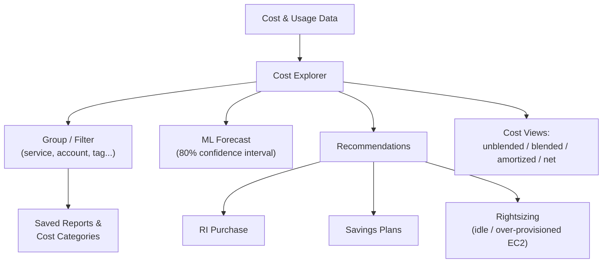

# Cost Explorer Features, Forecasting & Rightsizing - SAA-C03 Deep Dive

> A deep dive into Cost Explorer's grouping/filtering dimensions, built-in reports, ML forecasting with an 80% confidence interval, the three recommendation engines (RI purchase, Savings Plans, rightsizing), cost views, and best practices.

See also: [01 - Cost Explorer Fundamentals & Architecture](01%20-%20Cost%20Explorer%20Fundamentals%20%26%20Architecture.md) · [03 - Cost Explorer Exam Scenarios & Cheat Sheet](03%20-%20Cost%20Explorer%20Exam%20Scenarios%20%26%20Cheat%20Sheet.md) · [00 - Cost Management Overview](00%20-%20Cost%20Management%20Overview.md)

---

## Table of Contents

- [Grouping & Filtering Dimensions](#grouping--filtering-dimensions)
- [Built-in Default Reports](#built-in-default-reports)
- [Forecasting Deep Dive: ML & the 80% Confidence Interval](#forecasting-deep-dive-ml--the-80-confidence-interval)
- [Recommendation Engine 1: Reserved Instance Purchases](#recommendation-engine-1-reserved-instance-purchases)
- [Recommendation Engine 2: Savings Plans](#recommendation-engine-2-savings-plans)
- [Recommendation Engine 3: Rightsizing](#recommendation-engine-3-rightsizing)
- [Cost Views: Unblended, Blended, Amortized, Net](#cost-views-unblended-blended-amortized-net)
- [Cost Categories & Saved Reports](#cost-categories--saved-reports)
- [Best Practices](#best-practices)
- [Summary: Key Takeaways for SAA-C03](#summary-key-takeaways-for-saa-c03)

---

---

Beyond simple charts, Cost Explorer is a full analysis surface. You slice data along many **dimensions**, start from **built-in reports**, project the future with **ML forecasting**, and act on three families of **recommendations**. You also choose how costs are **attributed** (unblended vs amortized) and persist your analyses as **saved reports** and **Cost Categories**. This file covers each capability with tables, examples, and exam-oriented notes.

---

## Grouping & Filtering Dimensions

Cost Explorer lets you **group by** and **filter on** many dimensions to slice spend. Grouping changes how the chart is broken out; filtering narrows the data set.

| Dimension                     | Example use                                     |
| ----------------------------- | ----------------------------------------------- |
| Service                       | "EC2 vs S3 vs RDS share of bill"                |
| Linked account                | "Spend per member account in the org"           |
| Region                        | "Cost in us-east-1 vs eu-west-1"                |
| Availability Zone             | Per-AZ cost analysis                            |
| Instance type                 | "Spend on m5.large vs c5.xlarge"                |
| Usage type / usage-type group | Specific metered usage (e.g., DataTransfer-Out) |
| Tag                           | Cost allocation by cost-center / project tag    |
| Cost category                 | Custom business-defined grouping                |
| Charge type                   | Usage, tax, credit, refund, RI fee, etc.        |
| API operation                 | Cost by API action                              |
| Platform / tenancy            | OS (Linux/Windows) / shared vs dedicated        |

> **Exam Tip:** To attribute cost to teams/projects, use **cost allocation tags** as a Cost Explorer **grouping dimension** (tags must first be activated in the Billing console).

[⬆ Back to top](#table-of-contents)

---

## Built-in Default Reports

Cost Explorer ships with pre-built reports so you do not start from a blank chart:

| Report                          | Shows                                       |
| ------------------------------- | ------------------------------------------- |
| Monthly costs by service        | Spend per service, month over month         |
| Monthly costs by linked account | Spend per member account                    |
| Daily costs                     | Day-by-day spend trend                      |
| RI utilization                  | How much of purchased RIs you actually used |
| RI coverage                     | How much eligible usage was covered by RIs  |
| Savings Plans utilization       | Commitment used vs wasted                   |
| Savings Plans coverage          | Eligible usage covered by Savings Plans     |

> **Exam Tip:** **Utilization** = "am I using what I bought?" (avoid waste). **Coverage** = "how much of my eligible usage is on a discount plan?" (find more savings). Both exist for **RIs** and **Savings Plans**.

[⬆ Back to top](#table-of-contents)

---

## Forecasting Deep Dive: ML & the 80% Confidence Interval

Cost Explorer forecasts future cost using **machine learning** on your historical spend, projecting up to **12 months** ahead. Each forecast is a **predicted amount** accompanied by an **80% confidence (prediction) interval** — a range within which actual spend is expected to fall with ~80% probability.

- Forecasting **requires sufficient history**; a brand-new account or erratic, spiky usage yields **inaccurate / wide** forecasts.
- More stable, longer history → tighter, more reliable predictions.

**Example:** With 8 months of steady ~$10k/month spend, Cost Explorer might forecast next month at **$10.2k** with an 80% interval of **$9.6k–$10.8k**.

> **Exam Trap:** "Forecast looks wrong / too wide on a new account" → the model **needs more historical data**. It is not a bug; it is a cold-start limitation.

[⬆ Back to top](#table-of-contents)

---

## Recommendation Engine 1: Reserved Instance Purchases

Cost Explorer analyzes your steady-state usage and recommends **Reserved Instance (RI)** purchases that would lower cost versus On-Demand.

- Inputs: past usage patterns, chosen term (1 or 3 year), payment option (No/Partial/All Upfront).
- Output: which RIs to buy and the **estimated savings**.

**Example:** "You run 10 steady m5.large instances on-demand; buying 10 × 1-year No-Upfront RIs saves ~$3,800/year."

> **Exam Tip:** RI recommendations target **stable, predictable** usage of a specific instance family/region. For flexible commitment, see Savings Plans.

[⬆ Back to top](#table-of-contents)

---

## Recommendation Engine 2: Savings Plans

Cost Explorer recommends a **Savings Plans** hourly commitment (e.g., $X/hour) that maximizes savings given your usage. Savings Plans are more **flexible** than RIs (apply across instance families/regions, and Compute SPs even across EC2/Fargate/Lambda).

**Example:** "Commit to **$5/hour** of Compute Savings Plans for 1 year → estimated **~27%** savings vs On-Demand."

> **Exam Tip:** Choose **Savings Plans** when you want commitment-based discounts with **flexibility** across instance types/services; choose **RIs** for capacity-reservation needs or specific reservations.

[⬆ Back to top](#table-of-contents)

---

## Recommendation Engine 3: Rightsizing

The **rightsizing recommendations** engine identifies **idle and over-provisioned EC2 instances** and suggests you **terminate** (idle) or **downsize** (over-provisioned) them to cut cost.

**Example:** "t3.xlarge averaging 4% CPU → downsize to t3.medium, estimated savings ~$45/month." or "instance with near-zero utilization → terminate."

| Aspect | Cost Explorer Rightsizing   | Compute Optimizer                        |
| ------ | --------------------------- | ---------------------------------------- |
| Scope  | **EC2 cost** focus          | EC2, EBS, Lambda, Auto Scaling groups    |
| Depth  | Idle / over-provisioned EC2 | Deeper ML rightsizing & performance risk |

> **Exam Tip:** "Find **idle / over-provisioned EC2** to cut cost" → Cost Explorer **rightsizing**. Need **deeper, cross-service** rightsizing → **Compute Optimizer**.

[⬆ Back to top](#table-of-contents)

---

## Cost Views: Unblended, Blended, Amortized, Net

Cost Explorer can present costs under several **views**, which matters in Organizations and with upfront commitments:

| View              | Meaning                                                   |
| ----------------- | --------------------------------------------------------- |
| **Unblended**     | Cost as actually charged at the moment of usage (default) |
| **Blended**       | Average rate across an Organization's accounts            |
| **Amortized**     | Upfront RI/SP fees spread evenly across the term          |
| **Net amortized** | Amortized view with discounts/credits applied             |

> **Exam Tip:** Use **amortized** costs to fairly spread **upfront RI/Savings Plan** fees across months instead of showing a single large spike when purchased.

[⬆ Back to top](#table-of-contents)

---

## Cost Categories & Saved Reports

- **Cost Categories** — define custom rules that map spend into business-meaningful buckets (e.g., "Team-A", "Production") usable as a Cost Explorer dimension. Accessible alongside Cost Explorer in **AWS Cost Management**.
- **Saved reports** — persist a configured chart (groupings, filters, view) for repeated use and sharing.
- **Cost Anomaly Detection** — also sits in Cost Management; uses ML to flag unusual spend (complements CE).

> **Exam Tip:** When the org's chart of accounts/services does not map cleanly to AWS services, **Cost Categories** create the custom dimension you analyze and report on.

[⬆ Back to top](#table-of-contents)

---

## Best Practices

| Practice                                                 | Why                                            |
| -------------------------------------------------------- | ---------------------------------------------- |
| Activate **cost allocation tags**                        | Enables tag-based grouping/showback/chargeback |
| Enable CE in the **payer** account                       | Org-wide visibility in one place               |
| Use **amortized** view for committed spend               | Fair month-to-month attribution                |
| Review **rightsizing + RI/SP** recommendations regularly | Continuous cost optimization                   |
| Enable **hourly granularity** only when needed           | Avoids unnecessary extra charges               |
| Paginate & cache **API** calls                           | Controls the $0.01/request cost                |
| Pair CE with **Budgets** + **Anomaly Detection**         | Analysis + alerting together                   |

[⬆ Back to top](#table-of-contents)

---

## Summary: Key Takeaways for SAA-C03

| Concept            | Key Fact                                                                                                            |
| ------------------ | ------------------------------------------------------------------------------------------------------------------- |
| Dimensions         | Service, account, region, AZ, instance type, usage type, tag, cost category, charge type, API op, platform, tenancy |
| Default reports    | Costs by service/account, daily costs, RI & SP utilization/coverage                                                 |
| Forecast           | ML-based, up to 12 months, **80% confidence interval**, needs history                                               |
| Recommendation #1  | **RI purchase** (steady usage)                                                                                      |
| Recommendation #2  | **Savings Plans** (flexible commitment)                                                                             |
| Recommendation #3  | **Rightsizing** (idle/over-provisioned EC2)                                                                         |
| Deeper rightsizing | **Compute Optimizer** (EC2/EBS/Lambda/ASG)                                                                          |
| Cost views         | unblended (default), blended, amortized, net amortized                                                              |
| Amortized          | Spreads **upfront** RI/SP fees across the term                                                                      |
| Cost Categories    | Custom business buckets as a CE dimension                                                                           |
| Saved reports      | Persist & share configured analyses                                                                                 |

[⬆ Back to top](#table-of-contents)

---
