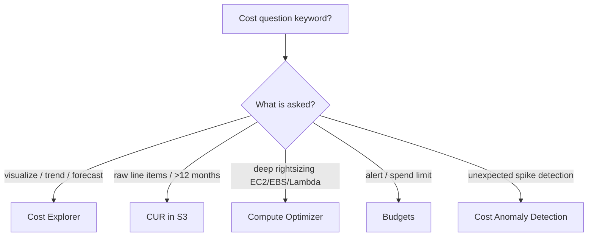

# Cost Explorer Exam Scenarios & Cheat Sheet - SAA-C03 Deep Dive

> Scenario-based Q&A, SRE-style troubleshooting (empty data, inaccurate forecasts, non-real-time refresh, API cost/throttling), a common-errors table, and a final rapid-recall cheat sheet for AWS Cost Explorer.

See also: [01 - Cost Explorer Fundamentals & Architecture](01%20-%20Cost%20Explorer%20Fundamentals%20%26%20Architecture.md) · [02 - Cost Explorer Features, Forecasting & Rightsizing](02%20-%20Cost%20Explorer%20Features%2C%20Forecasting%20%26%20Rightsizing.md) · [00 - Cost Management Overview](00%20-%20Cost%20Management%20Overview.md)

---

## Table of Contents

- [How to Read Cost Explorer Exam Questions](#how-to-read-cost-explorer-exam-questions)
- [Scenario Q&A](#scenario-qa)
- [SRE Troubleshooting](#sre-troubleshooting)
- [Common Errors & Fixes](#common-errors--fixes)
- [Decision Cheat Sheet: Pick the Right Tool](#decision-cheat-sheet-pick-the-right-tool)
- [Summary: Key Takeaways for SAA-C03](#summary-key-takeaways-for-saa-c03)

---

---

The exam tests Cost Explorer mostly through **keyword mapping** ("visualize", "forecast", "rightsize", "idle EC2") and through **operational gotchas** (24-hour lag, daily refresh, 12-month limit, API cost). This file drills both: realistic scenario Q&A, an SRE troubleshooting section for when things look broken, a common-errors table, and a one-glance decision cheat sheet.

---

## How to Read Cost Explorer Exam Questions

- "**Visualize / explore / break down** spend" → **Cost Explorer**.
- "**Forecast** next N months (N ≤ 12)" → **Cost Explorer forecast**.
- "**Idle / over-provisioned EC2**" → **Cost Explorer rightsizing** (or **Compute Optimizer** for deeper/cross-service).
- "**Raw, granular, queryable**" or "**> 12 months**" → **CUR** in **S3**.
- "**Alert / budget / limit**" → **AWS Budgets** (not CE).
- "**Detect unusual spike**" → **Cost Anomaly Detection**.

> **Exam Tip:** Match the verb. **Visualize/forecast → CE**, **alert → Budgets**, **detect anomaly → Anomaly Detection**, **deep query → CUR**.

[⬆ Back to top](#table-of-contents)

---

## Scenario Q&A

**Q1.** A team wants to **visualize spend trends over the last 6 months and forecast the next 3 months** with no setup cost.
**A.** **AWS Cost Explorer** — free UI, ≤12-month history and forecast.

**Q2.** Finance must **identify idle and over-provisioned EC2 instances** to reduce cost.
**A.** **Cost Explorer rightsizing recommendations** (terminate idle / downsize over-provisioned). For deeper, cross-service rightsizing use **Compute Optimizer**.

**Q3.** You need **raw, line-item billing data going back 2 years**, queried in Athena.
**A.** **Cost and Usage Report (CUR)** delivered to **S3** — CE only covers 12 months and is summarized.

**Q4.** The team wants to see **hourly** cost granularity in Cost Explorer.
**A.** **Enable hourly granularity** in Cost Management preferences — it is **off by default**, **costs extra**, and hourly data is retained ~14 days.

**Q5.** Management wants **one consolidated view of all member-account spend** in an Organization.
**A.** Enable Cost Explorer in the **management (payer) account**.

**Q6.** A team wants to **attribute cost to each project/cost-center**.
**A.** Activate **cost allocation tags**, then **group by tag** in Cost Explorer (or define **Cost Categories**).

**Q7.** Leadership wants to **smooth a large upfront RI purchase** across the months rather than see one spike.
**A.** Use the **amortized cost** view.

**Q8.** A finance app must **pull cost data programmatically into a dashboard**.
**A.** Use the **Cost Explorer API** (`GetCostAndUsage`) — note **$0.01 per paginated request**; paginate and cache.

> **Exam Trap:** Q1/Q2 are CE; Q3 is CUR; Q5 is the payer account. Mixing these up is the most common mistake.

[⬆ Back to top](#table-of-contents)

---

## SRE Troubleshooting

| Symptom                                        | Root Cause                                                  | Resolution                                                                  |
| ---------------------------------------------- | ----------------------------------------------------------- | --------------------------------------------------------------------------- |
| New account: Cost Explorer shows **no data**   | Just enabled; data not populated yet                        | Wait **up to 24 hours** for first population                                |
| Numbers seem **stale / not live**              | CE is **not real-time**; refreshed **daily**                | Expected behavior; for near-real-time use Budgets/Anomaly Detection signals |
| **Forecast wildly inaccurate / wide interval** | Insufficient or spiky **history**                           | Accumulate more steady history; cold-start limitation, not a bug            |
| Cannot see **> 12 months** of data             | CE retention limit is 12 months                             | Use **CUR** in **S3** for long-term data                                    |
| Cannot find **hourly** breakdown               | Hourly granularity **not enabled**                          | Enable it (extra cost; ~14-day retention)                                   |
| **API throttling / unexpected charges**        | High-frequency, poorly paginated calls at **$0.01/request** | Reduce frequency, paginate efficiently, cache results                       |
| Member account **can't open Cost Explorer**    | Access not granted by payer                                 | Payer grants member-account access                                          |

> **Exam Trap:** "Empty Cost Explorer on a new account" is **not** a permissions/billing error — it is the **up-to-24h initial population** delay.

[⬆ Back to top](#table-of-contents)

---

## Common Errors & Fixes

| Mistake                                          | Reality                                                |
| ------------------------------------------------ | ------------------------------------------------------ |
| Expecting **real-time** cost                     | Refreshed **daily**, up to 24h initial lag             |
| Expecting **> 12 months** in CE                  | Max **12 months**; use CUR for more                    |
| Assuming **hourly** is default/free              | Must enable; **extra charge**; ~14-day retention       |
| Assuming the **API is free**                     | **$0.01 per paginated request**                        |
| Using CE to set **spend alerts**                 | That is **Budgets**; anomalies → **Anomaly Detection** |
| Using CE for **deep cross-service rightsizing**  | Use **Compute Optimizer**                              |
| Forecasting on a **brand-new account**           | Needs history; expect inaccuracy                       |
| Enabling CE in a **member** account for org view | Enable in **payer** account                            |

[⬆ Back to top](#table-of-contents)

---

## Decision Cheat Sheet: Pick the Right Tool

| You want to...                          | Use                                        |
| --------------------------------------- | ------------------------------------------ |
| Visualize/understand cost trends (free) | **Cost Explorer**                          |
| Forecast spend up to 12 months          | **Cost Explorer forecast**                 |
| Find idle/over-provisioned EC2          | **CE rightsizing** / **Compute Optimizer** |
| Get RI / Savings Plans buy advice       | **CE recommendations**                     |
| Query raw line items / keep > 12 months | **CUR** in **S3**                          |
| Set spend limits & get alerts           | **AWS Budgets**                            |
| Detect unusual spend spikes             | **Cost Anomaly Detection**                 |
| Custom business cost buckets            | **Cost Categories**                        |
| Programmatic cost pull                  | **Cost Explorer API** ($0.01/req)          |
| Org-wide consolidated view              | CE in **payer/management** account         |

[⬆ Back to top](#table-of-contents)

---

## Summary: Key Takeaways for SAA-C03

| Concept                                      | Key Fact                                                |
| -------------------------------------------- | ------------------------------------------------------- |
| Default answer for "visualize/forecast cost" | **Cost Explorer**                                       |
| History / forecast window                    | **12 months** each                                      |
| Granularity                                  | Monthly+daily free; **hourly & resource-level extra**   |
| Initial data lag                             | Up to **24 hours**; refreshed **daily** (not real-time) |
| Forecast                                     | ML, **80% confidence interval**, needs history          |
| Recommendations                              | RI purchase, Savings Plans, **rightsizing**             |
| UI vs API cost                               | UI **free**; API **$0.01/paginated request**            |
| Org-wide visibility                          | Enable in **payer/management** account                  |
| > 12 months / raw data                       | **CUR** in **S3**                                       |
| Deep rightsizing                             | **Compute Optimizer**                                   |
| Alerts                                       | **Budgets** / **Cost Anomaly Detection** (not CE)       |
| Empty-on-new-account fix                     | Wait up to **24h**                                      |

[⬆ Back to top](#table-of-contents)

---
