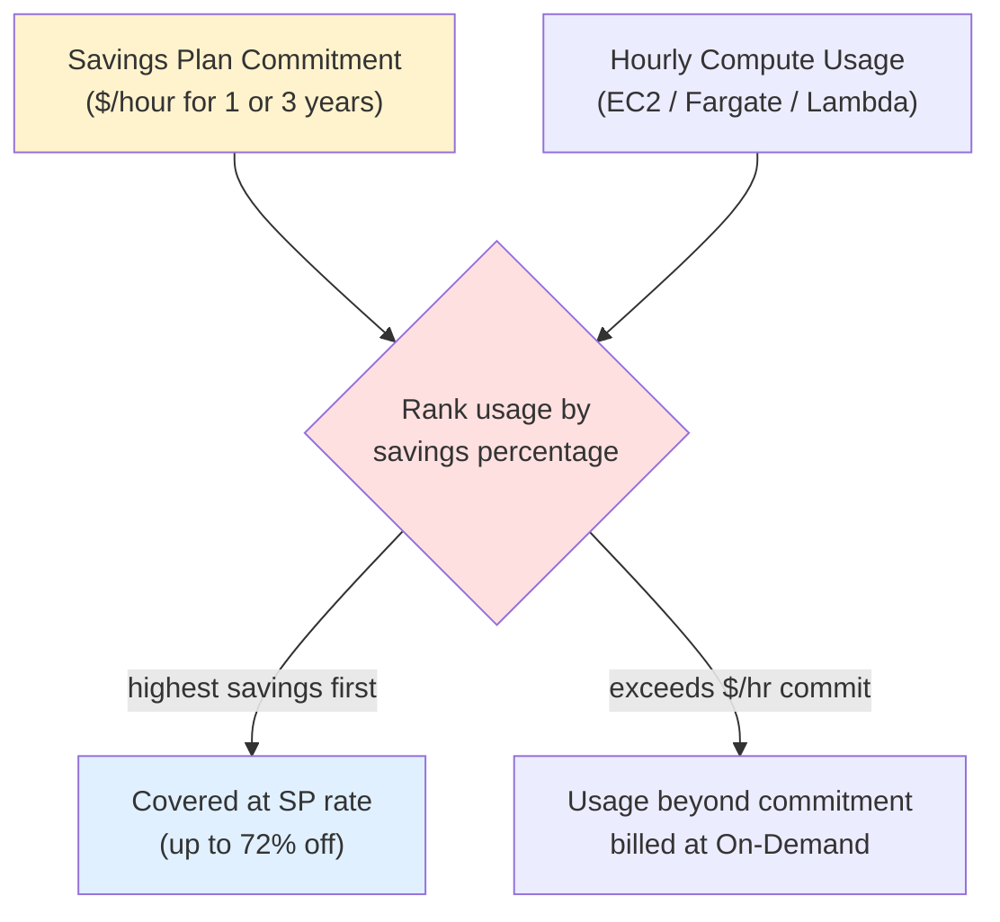
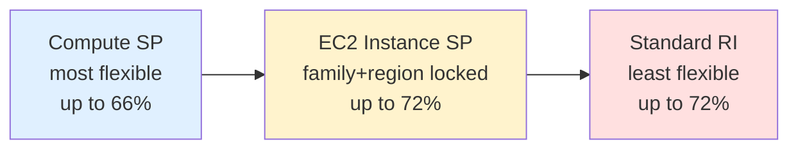
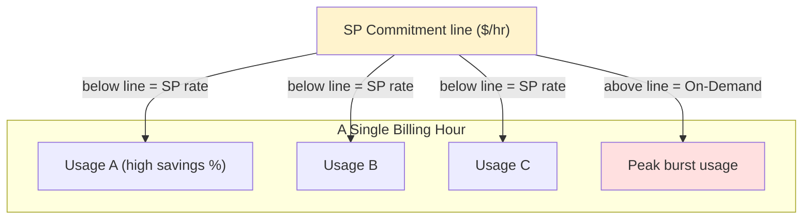
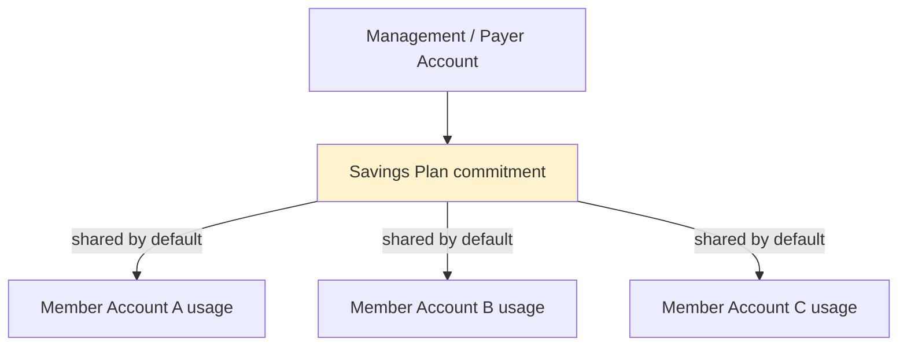

# Savings Plans Fundamentals & Architecture - SAA-C03 Deep Dive

> Savings Plans are a **flexible pricing model**: you commit to a consistent amount of compute usage measured in **$/hour** for a **1-year or 3-year** term in exchange for **up to 72% off On-Demand** — discounts apply **automatically**, no instance reservation required.

See also: [02 - Savings Plans vs Reserved Instances & Purchase Strategy](02%20-%20Savings%20Plans%20vs%20Reserved%20Instances%20%26%20Purchase%20Strategy.md) · [03 - Savings Plans Exam Scenarios & Cheat Sheet](03%20-%20Savings%20Plans%20Exam%20Scenarios%20%26%20Cheat%20Sheet.md) · [00 - Cost Management Overview](00%20-%20Cost%20Management%20Overview.md)

---

## Table of Contents

- [What Are Savings Plans?](#what-are-savings-plans)
- [The Commitment Model ($/Hour, 1 or 3 Years)](#the-commitment-model-hour-1-or-3-years)
- [The Three Types of Savings Plans](#the-three-types-of-savings-plans)
- [Most Flexible vs Biggest Discount](#most-flexible-vs-biggest-discount)
- [Payment Options](#payment-options)
- [How the Discount Auto-Applies (Highest-Savings-First)](#how-the-discount-auto-applies-highest-savings-first)
- [No Capacity Reservation](#no-capacity-reservation)
- [Architecture: Mapping a Commitment Onto Usage](#architecture-mapping-a-commitment-onto-usage)
- [Organization-Level Discount Sharing](#organization-level-discount-sharing)
- [Cost Explorer Recommendations](#cost-explorer-recommendations)
- [Pricing & Term Math Example](#pricing--term-math-example)
- [Summary: Key Takeaways for SAA-C03](#summary-key-takeaways-for-saa-c03)

---

---

Savings Plans are the **discount-by-commitment** pillar of AWS cost optimization. Instead of reserving a specific instance (the old Reserved Instance model), you pledge to spend a steady **dollars-per-hour** on compute, and AWS automatically discounts whatever matching usage you run — across families, sizes, OSes, and (for Compute Savings Plans) even regions and services. This file covers what they are, the commitment model, the three types, payment options, how the discount engine applies coverage, the critical "no capacity reservation" caveat, org-level sharing, and the pricing math.

---

## What Are Savings Plans?

A **Savings Plan** is a flexible pricing model that gives you lower compute prices in exchange for a **usage commitment**. The key mental shift from Reserved Instances:

- **Reserved Instances** = "I reserve _this_ instance type/config."
- **Savings Plans** = "I commit to spending _this many dollars per hour_ on compute; discount any matching usage."

Because the commitment is a **dollar rate**, not a hardware spec, you keep the freedom to change instance families, sizes, and (depending on type) regions and services without losing your discount.

| Attribute            | Savings Plan                                                |
| -------------------- | ----------------------------------------------------------- |
| What you commit to   | A **$/hour** spend on compute                               |
| Term                 | **1 year** or **3 years**                                   |
| Max discount         | **Up to 72%** off On-Demand                                 |
| Discount application | **Automatic** — no per-instance action                      |
| Covers               | EC2, Fargate, Lambda (Compute SP); SageMaker (SageMaker SP) |
| Capacity guarantee   | **No** (it is a billing discount only)                      |

> **Exam Tip:** The phrase "commit to a **consistent amount of compute usage** ($/hour) for **1 or 3 years**" is the signature of Savings Plans. If you see "$/hour commitment," the answer is a Savings Plan, not an RI.

[⬆ Back to top](#table-of-contents)

---

## The Commitment Model ($/Hour, 1 or 3 Years)

You commit to an **hourly dollar amount of compute spend** (e.g., "$10/hour") for a fixed term:

- **Term:** 1 year or 3 years. Longer term = bigger discount.
- **Measured in:** dollars of compute usage **per hour**, evaluated continuously.
- **Behavior:** any matching usage **up to** your $/hour commitment is billed at the discounted Savings Plan rate; **anything beyond** it is billed at On-Demand.

The commitment is "use it or lose it" on an hourly basis — if you commit to $10/hour but only run $6/hour of matching usage in a given hour, you still pay for the full $10/hour commitment for that hour (the unused $4 is wasted).

| Lever                           | Effect on discount                |
| ------------------------------- | --------------------------------- |
| 3-year term (vs 1-year)         | Larger discount                   |
| All Upfront payment             | Largest discount                  |
| EC2 Instance SP (vs Compute SP) | Larger discount, less flexibility |

> **Exam Trap:** "Commit to a **specific number of instances**" describes a **Reserved Instance**, not a Savings Plan. Savings Plans commit to a **dollar/hour rate**, never to an instance count.

[⬆ Back to top](#table-of-contents)

---

## The Three Types of Savings Plans

There are **three** Savings Plan types, trading flexibility against discount depth:

| Type                           | Max discount  | Flexible across                                    | Locked to                             | Covers                             |
| ------------------------------ | ------------- | -------------------------------------------------- | ------------------------------------- | ---------------------------------- |
| **Compute Savings Plans**      | up to **66%** | family, size, OS, tenancy, **region**, **service** | nothing (most flexible)               | EC2 (any), **Fargate**, **Lambda** |
| **EC2 Instance Savings Plans** | up to **72%** | size, OS, tenancy (within the family+region)       | **specific family + specific region** | EC2 in that family/region only     |
| **SageMaker Savings Plans**    | up to **64%** | instance/component flexibility within SageMaker    | SageMaker usage                       | Amazon SageMaker                   |

**Compute Savings Plans** — the **most flexible**. The discount auto-applies regardless of instance family, size, OS, tenancy, **region**, and even across **EC2, Fargate, and Lambda**. Switch from `m5.large` in us-east-1 to `c6g.xlarge` in eu-west-1, or move a workload onto Fargate, and the plan keeps discounting it.

**EC2 Instance Savings Plans** — the **biggest discount (up to 72%)**. You commit to a **specific instance family in a specific region** (e.g., M5 in us-east-1). You stay flexible across **size, OS, and tenancy within that family+region** (e.g., `m5.large` → `m5.2xlarge`, Linux → Windows), but you are **NOT** flexible across family or region.

**SageMaker Savings Plans** — up to **64%** off SageMaker ML usage, flexible across SageMaker instance components.

> **Exam Tip:** "Discount applies to **Fargate and Lambda** too" → **Compute Savings Plans** (the only SP type that covers Fargate and Lambda). EC2 Instance SPs cover EC2 only.

[⬆ Back to top](#table-of-contents)

---

## Most Flexible vs Biggest Discount

This trade-off is a favorite exam pivot:

| Goal                                                                      | Choose                                     |
| ------------------------------------------------------------------------- | ------------------------------------------ |
| **Maximum flexibility** (changing families/regions, using Fargate/Lambda) | **Compute Savings Plans** (up to 66%)      |
| **Maximum discount** on a **known, fixed** family in one region           | **EC2 Instance Savings Plans** (up to 72%) |
| Discount on SageMaker                                                     | **SageMaker Savings Plans** (up to 64%)    |

The rule of thumb: **flexibility and discount are inversely related**. The more freedom you keep, the smaller the discount; the more you lock down, the bigger the discount.

> **Exam Trap:** Don't assume "Savings Plan = always 72%." Only the **EC2 Instance** Savings Plan reaches 72%. The flexible **Compute** Savings Plan tops out around **66%**.

[⬆ Back to top](#table-of-contents)

---

## Payment Options

Like Reserved Instances, Savings Plans offer three payment options. More upfront = bigger discount:

| Payment option      | Upfront                     | Discount                    |
| ------------------- | --------------------------- | --------------------------- |
| **All Upfront**     | Pay entire commitment now   | **Biggest**                 |
| **Partial Upfront** | Pay part now, rest hourly   | Medium                      |
| **No Upfront**      | Pay nothing now, all hourly | Smallest (still discounted) |

Combine with term length: **3-year + All Upfront** yields the deepest discount; **1-year + No Upfront** the shallowest (but most cash-flow-friendly and lowest commitment risk).

> **Exam Tip:** "Maximize discount, cash is not a constraint" → **3-year, All Upfront**. "Lower commitment risk / preserve cash flow" → **1-year, No Upfront**.

[⬆ Back to top](#table-of-contents)

---

## How the Discount Auto-Applies (Highest-Savings-First)

You don't assign a Savings Plan to specific instances. AWS's billing engine applies it **automatically each hour**:

1. AWS looks at all your **eligible usage** for the hour.
2. It applies the Savings Plan rate to the usage with the **highest savings percentage first**, then works down.
3. It keeps applying until your **$/hour commitment is consumed**.
4. Any remaining eligible usage beyond the commitment is billed at **On-Demand**.
5. **Spot usage is ignored** by Savings Plans (Spot is already discounted).

This "highest-savings-first" ordering maximizes the value you extract from a given commitment — AWS automatically covers the most expensive-relative-to-discount usage first.

| Step                    | What happens                                     |
| ----------------------- | ------------------------------------------------ |
| Eligible usage gathered | EC2/Fargate/Lambda (or family+region for EC2 SP) |
| Sort                    | By savings % (highest first)                     |
| Apply                   | Until $/hour commitment exhausted                |
| Overflow                | Billed at On-Demand                              |
| Spot                    | Never covered (already discounted)               |

> **Exam Tip:** "Discount applies **automatically to the usage with the highest savings first**" is textbook Savings Plans behavior — no manual instance assignment needed.

> **Exam Trap:** Savings Plans do **not** discount **Spot** usage. If a question pairs an SP with Spot Instances and asks why the SP isn't reducing the Spot bill — Spot is excluded by design.

[⬆ Back to top](#table-of-contents)

---

## No Capacity Reservation

A Savings Plan is a **billing discount only** — it provides **NO capacity reservation**. If a region/AZ is capacity-constrained, owning a Savings Plan does **not** guarantee you can launch the instance.

To **guarantee capacity**, use one of:

| Need                                     | Use                                                                      |
| ---------------------------------------- | ------------------------------------------------------------------------ |
| Guaranteed capacity in a **specific AZ** | **Zonal Reserved Instance** or **On-Demand Capacity Reservation (ODCR)** |
| Discount only (no capacity)              | **Savings Plan** or **Regional RI**                                      |
| Capacity **+** SP-style discount         | **ODCR** for capacity **+** a Savings Plan for the discount (they stack) |

> **Exam Trap:** "We need guaranteed capacity in an AZ for a critical workload" → **NOT** a Savings Plan. The answer is a **zonal RI** or an **On-Demand Capacity Reservation**. A Savings Plan only changes the _price_, never the _availability_.

[⬆ Back to top](#table-of-contents)

---

## Architecture: Mapping a Commitment Onto Usage

Picture your hourly compute spend as a stacked bar. The Savings Plan commitment is a horizontal line; everything **under** the line is discounted, everything **above** it is On-Demand.

- **Below the commitment line:** discounted at the Savings Plan rate, highest-savings-first.
- **At the line:** commitment fully utilized (ideal).
- **Above the line:** the peak/burst portion bills at On-Demand (or could be Spot).
- **Below your usage but above commitment unused:** if usage drops below the commitment, the unused commitment is **wasted spend**.

> **Exam Tip:** The classic optimal pattern: **commit to your steady baseline** with a Savings Plan, and let **On-Demand or Spot** absorb the spiky peak above it. (See [02 - Savings Plans vs Reserved Instances & Purchase Strategy](02%20-%20Savings%20Plans%20vs%20Reserved%20Instances%20%26%20Purchase%20Strategy.md).)

[⬆ Back to top](#table-of-contents)

---

## Organization-Level Discount Sharing

In **AWS Organizations / consolidated billing**, Savings Plan (and RI) discounts are **shared across member accounts by default**:

- Buy a Savings Plan in any account; unused commitment automatically flows to **other accounts' eligible usage** in the org.
- This maximizes utilization — one account's slack covers another's overflow.
- Sharing can be **turned off per account** (in the management account's billing preferences) if you want a member account's plan to apply only to itself.

> **Exam Tip:** "We have many accounts under one org — how do we make the most of our Savings Plan commitment?" → discount sharing is **on by default** across the org, so unused commitment automatically benefits other accounts. Disable per-account only if you need isolation.

[⬆ Back to top](#table-of-contents)

---

## Cost Explorer Recommendations

You don't have to guess your commitment. **AWS Cost Explorer** analyzes your **past usage** and generates **Savings Plans purchase recommendations**:

- Recommends a **$/hour commitment** level, **term**, and **payment option**.
- Shows **estimated savings** and **utilization/coverage** projections.
- After purchase, Cost Explorer reports **Savings Plans utilization** (are you using what you committed?) and **coverage** (what % of eligible usage is covered by an SP?).

| Metric          | Question it answers                                                            |
| --------------- | ------------------------------------------------------------------------------ |
| **Utilization** | Am I using the commitment I bought? (low = wasted spend)                       |
| **Coverage**    | What % of my eligible usage is on an SP vs On-Demand? (low = room to buy more) |

> **Exam Tip:** "How do we right-size our Savings Plan commitment?" → use **Cost Explorer's Savings Plans recommendations** (based on historical usage), then monitor **utilization and coverage** afterward.

[⬆ Back to top](#table-of-contents)

---

## Pricing & Term Math Example

A simplified example to ground the model. Suppose your steady baseline costs **$10/hour at On-Demand**, and a 1-year Compute Savings Plan offers a **30%** effective discount on that usage:

| Scenario                                                        | Hourly cost   | Monthly (~730h) |
| --------------------------------------------------------------- | ------------- | --------------- |
| All On-Demand                                                   | $10.00        | ~$7,300         |
| Commit $10/hr to a 1-yr Compute SP (~30% off the covered usage) | ~$7.00        | ~$5,110         |
| **Savings**                                                     | **~$3.00/hr** | **~$2,190/mo**  |

Now suppose actual usage **drops to $6/hour** but you committed to **$10/hour**:

- You still pay the **$10/hour commitment** (the unused $4/hr is **wasted**).
- Effective rate on real usage rises → the over-commitment erodes your savings.

And if usage **spikes to $14/hour**:

- The first **$10/hour** is discounted by the SP.
- The extra **$4/hour** is billed at **On-Demand** (or Spot if applicable).

> **Exam Tip:** Right-size the commitment to your **reliable baseline**, not your peak. Over-commit = wasted spend; under-commit = the safe default (overflow just bills at On-Demand). When unsure, **commit conservatively**.

[⬆ Back to top](#table-of-contents)

---

## Summary: Key Takeaways for SAA-C03

| Concept                           | Key fact                                                                                            |
| --------------------------------- | --------------------------------------------------------------------------------------------------- |
| What it is                        | Flexible pricing: commit **$/hour** for **1 or 3 yr**, up to **72% off**                            |
| Three types                       | **Compute** (66%, most flexible), **EC2 Instance** (72%, family+region locked), **SageMaker** (64%) |
| Compute SP covers                 | EC2 (any), **Fargate**, **Lambda**; flexible across region + service                                |
| EC2 Instance SP covers            | EC2 in **one family + one region**; flexible across size/OS/tenancy                                 |
| Most flexible vs biggest discount | Compute = flexible; EC2 Instance = biggest discount                                                 |
| Payment options                   | All / Partial / No Upfront — more upfront = bigger discount                                         |
| Discount application              | **Automatic**, **highest-savings-first**, until $/hr commit used                                    |
| Overflow                          | Beyond commitment → **On-Demand**                                                                   |
| Spot                              | **Never** covered by Savings Plans                                                                  |
| Capacity                          | **No** reservation — use **zonal RI / ODCR** for guaranteed capacity                                |
| Org sharing                       | Discounts **shared across member accounts by default**                                              |
| Recommendations                   | **Cost Explorer** suggests commitment; monitor **utilization & coverage**                           |

[⬆ Back to top](#table-of-contents)

---
