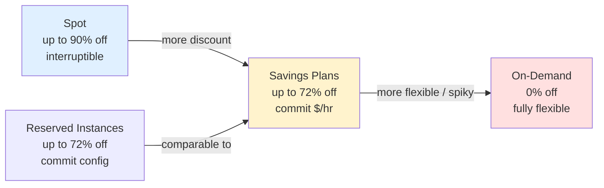
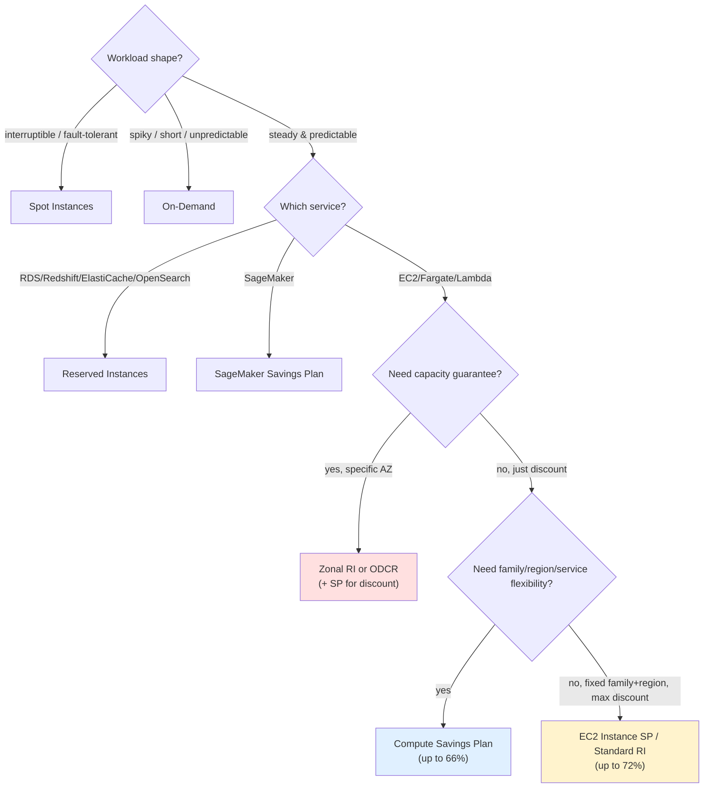

# Savings Plans vs Reserved Instances & Purchase Strategy - SAA-C03 Deep Dive

> Savings Plans, Standard RIs, Convertible RIs, On-Demand, and Spot are five points on a **flexibility ↔ discount ↔ capacity** spectrum — this file maps each one and gives you a **decision tree** plus a **blended purchase strategy** to pick correctly under exam pressure.

See also: [01 - Savings Plans Fundamentals & Architecture](01%20-%20Savings%20Plans%20Fundamentals%20%26%20Architecture.md) · [03 - Savings Plans Exam Scenarios & Cheat Sheet](03%20-%20Savings%20Plans%20Exam%20Scenarios%20%26%20Cheat%20Sheet.md) · [00 - Cost Management Overview](00%20-%20Cost%20Management%20Overview.md)

---

## Table of Contents

- [The Five Compute Pricing Models](#the-five-compute-pricing-models)
- [Savings Plans vs Standard RI vs Convertible RI](#savings-plans-vs-standard-ri-vs-convertible-ri)
- [Covered Services: SP vs RI](#covered-services-sp-vs-ri)
- [Marketplace Resale & Modification](#marketplace-resale--modification)
- [Zonal vs Regional RI (Capacity Reservation)](#zonal-vs-regional-ri-capacity-reservation)
- [On-Demand and Spot in the Mix](#on-demand-and-spot-in-the-mix)
- [When to Pick Each](#when-to-pick-each)
- [Decision Tree](#decision-tree)
- [Purchase Strategy & Best Practices](#purchase-strategy--best-practices)
- [1-Year vs 3-Year Trade-Off](#1-year-vs-3-year-trade-off)
- [Blended Strategy Example](#blended-strategy-example)
- [Summary: Key Takeaways for SAA-C03](#summary-key-takeaways-for-saa-c03)

---

---

Choosing the right compute purchase model is one of the most heavily tested cost-optimization skills on SAA-C03. The trick is to recognize which axis the question is testing — **discount depth**, **flexibility**, **capacity guarantee**, or **resale** — and map it to the right model. This file lays out the full comparison between Savings Plans and both RI flavors, brings On-Demand and Spot into the picture, and gives you a repeatable decision process and a real blended-strategy example.

---

## The Five Compute Pricing Models

| Model                         | Discount       | Commitment                   | Flexibility                  | Capacity       | Best for                            |
| ----------------------------- | -------------- | ---------------------------- | ---------------------------- | -------------- | ----------------------------------- |
| **On-Demand**                 | 0%             | None                         | Total                        | None           | Spiky / unpredictable / short-lived |
| **Spot**                      | up to **90%**  | None                         | High (can be reclaimed)      | None           | Fault-tolerant, interruptible batch |
| **Compute Savings Plan**      | up to **66%**  | $/hr, 1–3 yr                 | Family/region/service        | None           | Steady usage, want flexibility      |
| **EC2 Instance Savings Plan** | up to **72%**  | $/hr, 1–3 yr (family+region) | Size/OS/tenancy              | None           | Steady usage, fixed family/region   |
| **Standard RI**               | up to **72%**  | Specific config, 1–3 yr      | AZ/size (within family)      | **Zonal: yes** | Steady, fixed, want resale option   |
| **Convertible RI**            | up to **~66%** | Config, 1–3 yr               | Can change family/OS/tenancy | No             | Steady but evolving instance needs  |

> **Exam Tip:** Order of preference for **steady, predictable** compute = **Savings Plans / RIs**; for **spiky/short** = **On-Demand**; for **interruptible/fault-tolerant** = **Spot**.

[⬆ Back to top](#table-of-contents)

---

## Savings Plans vs Standard RI vs Convertible RI

| Dimension                      | Compute SP | EC2 Instance SP        | Standard RI                   | Convertible RI  |
| ------------------------------ | ---------- | ---------------------- | ----------------------------- | --------------- |
| Max discount                   | up to 66%  | up to **72%**          | up to **72%**                 | up to ~66%      |
| Commit to                      | **$/hour** | $/hour (family+region) | **Specific instance config**  | Instance config |
| Change instance **family**     | **Yes**    | No                     | No                            | **Yes**         |
| Change **region**              | **Yes**    | No                     | No (regional gives AZ flex)   | No              |
| Change **size**                | Yes        | Yes                    | Yes (within family, regional) | Yes             |
| Change **OS / tenancy**        | Yes        | Yes                    | No                            | **Yes**         |
| Covers **Fargate / Lambda**    | **Yes**    | No                     | No                            | No              |
| Sellable in **RI Marketplace** | No         | No                     | **Yes**                       | **No**          |
| Capacity reservation           | No         | No                     | **Zonal RI: yes**             | Zonal: yes      |

Key contrasts:

- **Compute SP vs Convertible RI:** both let you change instance family. But the Compute SP is **automatic and also covers Fargate/Lambda**, whereas Convertible RIs require an **exchange** action and are EC2-only. The SP is generally the more modern, lower-effort choice.
- **EC2 Instance SP vs Standard RI:** both hit ~72% on a fixed family/region. The Standard RI can be **resold in the Marketplace** and a **zonal RI reserves capacity**; the SP cannot be resold and reserves no capacity but is **simpler to manage** (no instance config to track).

> **Exam Tip:** "Need to change **instance family** later and want it **automatic** + cover **Fargate/Lambda**" → **Compute Savings Plan**. "Need to change family but stuck on classic RIs" → **Convertible RI**.

[⬆ Back to top](#table-of-contents)

---

## Covered Services: SP vs RI

Savings Plans and Reserved Instances cover **different services** — a common distractor.

| Service     | Compute SP            | EC2 Instance SP         | RI (Standard/Convertible) |
| ----------- | --------------------- | ----------------------- | ------------------------- |
| EC2         | Yes                   | Yes (one family/region) | Yes                       |
| **Fargate** | **Yes**               | No                      | No                        |
| **Lambda**  | **Yes**               | No                      | No                        |
| RDS         | No                    | No                      | **Yes** (RDS RI)          |
| Redshift    | No                    | No                      | **Yes** (Redshift RI)     |
| ElastiCache | No                    | No                      | **Yes** (ElastiCache RI)  |
| OpenSearch  | No                    | No                      | **Yes** (OpenSearch RI)   |
| SageMaker   | No (use SageMaker SP) | No                      | No                        |

So: **RIs** are the discount mechanism for **RDS, Redshift, ElastiCache, OpenSearch**. **Savings Plans (Compute/EC2)** cover **EC2/Fargate/Lambda** only; **SageMaker SP** covers SageMaker.

> **Exam Trap:** "Discount our **RDS / Redshift / ElastiCache / OpenSearch** spend" → **Reserved Instances**, NOT Savings Plans. Savings Plans do **not** apply to those databases/analytics services.

[⬆ Back to top](#table-of-contents)

---

## Marketplace Resale & Modification

| Action                           | Standard RI | Convertible RI     | Savings Plan                |
| -------------------------------- | ----------- | ------------------ | --------------------------- |
| Sell on **RI Marketplace**       | **Yes**     | **No**             | **No**                      |
| Modify AZ / size (within family) | Yes         | Yes                | N/A (already flexible)      |
| Change instance **family**       | No          | **Yes** (exchange) | Compute SP: yes; EC2 SP: no |

- Only the **Standard RI** can be **sold** in the AWS **RI Marketplace** to recover value if your needs change.
- **Convertible RIs** cannot be sold but can be **exchanged** for a different config of equal or greater value.
- **Savings Plans** can be neither sold nor cancelled — you are committed for the full term.

> **Exam Tip:** "We might need to **recoup our investment** by reselling if plans change" → only the **Standard RI** is sellable on the Marketplace. Savings Plans and Convertible RIs are not resellable.

[⬆ Back to top](#table-of-contents)

---

## Zonal vs Regional RI (Capacity Reservation)

A frequently confused RI distinction that also clarifies why Savings Plans never guarantee capacity:

| Scope                         | Discount | AZ flexibility         | **Capacity reservation**    |
| ----------------------------- | -------- | ---------------------- | --------------------------- |
| **Zonal RI** (specific AZ)    | Yes      | No (locked to that AZ) | **YES — reserves capacity** |
| **Regional RI** (region-wide) | Yes      | Yes (any AZ in region) | **No**                      |
| **Savings Plan**              | Yes      | N/A                    | **No**                      |

- A **Zonal RI** reserves **capacity** in a specific AZ — the only RI behavior that guarantees you can launch.
- A **Regional RI** gives a **billing discount + AZ flexibility** but **no capacity guarantee** (like a Savings Plan in that respect).
- For capacity without the RI commitment, use an **On-Demand Capacity Reservation (ODCR)**, which can be combined with a Savings Plan for the discount.

> **Exam Trap:** "Guarantee capacity in a particular AZ" → **Zonal RI** (or **ODCR**). A **Regional RI** or a **Savings Plan** gives the discount but **does not** reserve capacity.

[⬆ Back to top](#table-of-contents)

---

## On-Demand and Spot in the Mix

Commitments aren't always the answer — the workload's shape decides:

| Workload shape                                      | Best model                    | Why                                    |
| --------------------------------------------------- | ----------------------------- | -------------------------------------- |
| Steady 24/7 baseline                                | **Savings Plan / RI**         | Predictable → commit for discount      |
| Spiky / unpredictable / short                       | **On-Demand**                 | No commitment, no waste on idle commit |
| Fault-tolerant, interruptible (batch, CI, big-data) | **Spot**                      | Up to 90% off; tolerate reclaim        |
| Critical, must-not-be-interrupted, needs capacity   | **On-Demand + ODCR/zonal RI** | Guaranteed availability                |

Remember: **Savings Plans do not discount Spot** (Spot is already discounted), and Spot can be **interrupted with a 2-minute warning**, so only use it where interruption is acceptable.

> **Exam Tip:** Decision order for cost-optimizing compute: **Spot** (interruptible) → **Savings Plans/RIs** (steady predictable) → **On-Demand** (spiky/short/unpredictable).

[⬆ Back to top](#table-of-contents)

---

## When to Pick Each

| If the question emphasizes...                                          | Pick                                   |
| ---------------------------------------------------------------------- | -------------------------------------- |
| Steady usage + **flexibility** across family/region + Fargate/Lambda   | **Compute Savings Plan**               |
| Steady usage + **biggest discount** on a **known fixed** family/region | **EC2 Instance SP** or **Standard RI** |
| Discount on **RDS/Redshift/ElastiCache/OpenSearch**                    | **Reserved Instances** (that service)  |
| Ability to **resell** the commitment                                   | **Standard RI** (Marketplace)          |
| Change instance **family** via classic RI                              | **Convertible RI**                     |
| **Guaranteed capacity** in an AZ                                       | **Zonal RI** or **ODCR**               |
| Spiky / unpredictable / short-lived                                    | **On-Demand**                          |
| Fault-tolerant, interruptible, cheapest                                | **Spot**                               |
| Discount on **SageMaker**                                              | **SageMaker Savings Plan**             |

[⬆ Back to top](#table-of-contents)

---

## Decision Tree

> **Exam Tip:** The first fork is always **workload shape**. Only once you've established "steady & predictable" does the SP-vs-RI-vs-flexibility logic apply.

[⬆ Back to top](#table-of-contents)

---

## Purchase Strategy & Best Practices

The professional FinOps approach is a **layered / blended** commitment:

1. **Measure the baseline.** Use Cost Explorer to find the **minimum steady-state usage** that runs nearly 24/7.
2. **Commit to the baseline, not the peak.** Cover the floor with a Savings Plan (or RI); never commit to your spiky maximum.
3. **Absorb the peak with On-Demand or Spot.** The variable top layer runs without commitment.
4. **Prefer Compute Savings Plans for flexibility** unless you're certain of a fixed family/region (then EC2 Instance SP or Standard RI for the extra discount).
5. **Use RIs for RDS/Redshift/ElastiCache/OpenSearch** — SPs don't cover them.
6. **Monitor utilization and coverage** in Cost Explorer; set **AWS Budgets** for SP/RI utilization and coverage to catch waste.
7. **Stagger expirations** so commitments don't all lapse at once.
8. **Leverage org-level sharing** — buy centrally and let unused commitment cover member accounts.

| Best practice                   | Reason                             |
| ------------------------------- | ---------------------------------- |
| Commit to baseline only         | Avoid wasted (unused) commitment   |
| Compute SP as default           | Flexibility with minimal effort    |
| Spot for the interruptible peak | Up to 90% off where tolerable      |
| Monitor utilization/coverage    | Detect over/under-commitment early |
| Budgets on SP/RI utilization    | Alert on waste                     |

> **Exam Tip:** The model answer to "optimize cost for a workload with a steady baseline and variable peaks" = **Savings Plan/RI for the baseline + On-Demand or Spot for the peak**.

[⬆ Back to top](#table-of-contents)

---

## 1-Year vs 3-Year Trade-Off

| Term       | Discount   | Risk                    | Use when                                |
| ---------- | ---------- | ----------------------- | --------------------------------------- |
| **1-year** | Smaller    | Lower (shorter lock-in) | Uncertain future, evolving architecture |
| **3-year** | **Larger** | Higher (long lock-in)   | Confident, stable, long-lived workloads |

The longer term always yields a bigger discount, but it locks you in for longer. If the architecture is likely to change (or you're unsure), the **1-year** term limits downside; if the workload is proven and stable, **3-year** maximizes savings.

> **Exam Tip:** "Maximize discount, workload is stable for years" → **3-year**. "Architecture may change / want lower risk" → **1-year**.

[⬆ Back to top](#table-of-contents)

---

## Blended Strategy Example

A web platform runs on EC2/Fargate with this profile:

- **Always-on baseline:** ~$8/hour of compute, predictable, mixed families, plans to migrate some to Fargate.
- **Daily peak:** an extra ~$5/hour during business hours, somewhat variable.
- **Nightly batch:** large, fault-tolerant data processing.

Optimal blend:

| Layer               | Model                                | Rationale                                                  |
| ------------------- | ------------------------------------ | ---------------------------------------------------------- |
| $8/hr baseline      | **Compute Savings Plan (1 or 3 yr)** | Steady; needs family flexibility + future Fargate coverage |
| ~$5/hr daytime peak | **On-Demand**                        | Variable; no commitment waste                              |
| Nightly batch       | **Spot**                             | Fault-tolerant → cheapest, tolerates interruption          |

Result: deep discount on the predictable floor, no wasted commitment on the variable peak, and near-90%-off on the interruptible batch.

> **Exam Trap:** Don't commit a Savings Plan to the **peak** ($13/hr) — when the peak isn't running you'd pay for unused commitment. Commit only to the **reliable $8/hr floor**.

[⬆ Back to top](#table-of-contents)

---

## Summary: Key Takeaways for SAA-C03

| Concept                                      | Key fact                                                       |
| -------------------------------------------- | -------------------------------------------------------------- |
| Flexibility vs discount                      | Compute SP (flexible, 66%) ↔ EC2 SP / Standard RI (fixed, 72%) |
| Change family automatically + Fargate/Lambda | **Compute Savings Plan**                                       |
| Change family via classic RI                 | **Convertible RI** (exchange)                                  |
| Resell commitment                            | **Standard RI** only (RI Marketplace)                          |
| Discount RDS/Redshift/ElastiCache/OpenSearch | **Reserved Instances** (SP doesn't cover them)                 |
| Guaranteed capacity in an AZ                 | **Zonal RI** or **ODCR** (not Regional RI, not SP)             |
| Regional RI / Savings Plan                   | Discount + flexibility, **no capacity**                        |
| Interruptible & cheapest                     | **Spot** (up to 90%, not covered by SP)                        |
| Spiky / short                                | **On-Demand**                                                  |
| 1-yr vs 3-yr                                 | Longer = bigger discount, more lock-in                         |
| Best practice                                | Commit to **baseline**; On-Demand/Spot for **peak**            |
| Org sharing                                  | SP/RI discounts shared across accounts by default              |

[⬆ Back to top](#table-of-contents)

---
