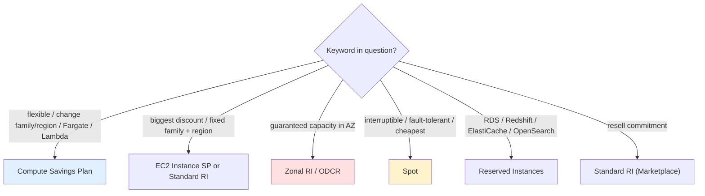
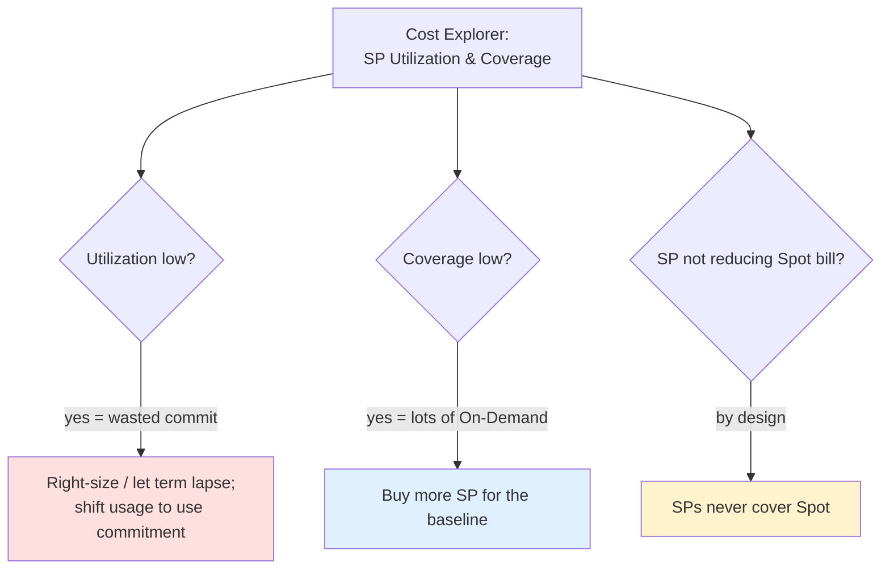

# Savings Plans Exam Scenarios & Cheat Sheet - SAA-C03 Deep Dive

> Pattern-match your way to the right answer: this file drills **8 scenario Q&As**, an **SRE troubleshooting** playbook for under/over-utilized commitments, a **common-errors** table, and a one-page **cheat sheet** for last-minute review.

See also: [01 - Savings Plans Fundamentals & Architecture](01%20-%20Savings%20Plans%20Fundamentals%20%26%20Architecture.md) · [02 - Savings Plans vs Reserved Instances & Purchase Strategy](02%20-%20Savings%20Plans%20vs%20Reserved%20Instances%20%26%20Purchase%20Strategy.md) · [00 - Cost Management Overview](00%20-%20Cost%20Management%20Overview.md)

---

## Table of Contents

- [How to Read a Savings Plans Question](#how-to-read-a-savings-plans-question)
- [Scenario 1: Steady Compute Across Changing Families & Regions](#scenario-1-steady-compute-across-changing-families--regions)
- [Scenario 2: Biggest Discount on a Fixed Family in One Region](#scenario-2-biggest-discount-on-a-fixed-family-in-one-region)
- [Scenario 3: Need Guaranteed Capacity in an AZ](#scenario-3-need-guaranteed-capacity-in-an-az)
- [Scenario 4: Fault-Tolerant Batch, Cheapest Possible](#scenario-4-fault-tolerant-batch-cheapest-possible)
- [Scenario 5: Discount on RDS / Redshift Spend](#scenario-5-discount-on-rds--redshift-spend)
- [Scenario 6: Multi-Account Org Wants Maximum Coverage](#scenario-6-multi-account-org-wants-maximum-coverage)
- [Scenario 7: Want to Resell the Commitment Later](#scenario-7-want-to-resell-the-commitment-later)
- [Scenario 8: Right-Sizing the Commitment](#scenario-8-right-sizing-the-commitment)
- [SRE Troubleshooting: Utilization & Coverage](#sre-troubleshooting-utilization--coverage)
- [Common Errors & Troubleshooting](#common-errors--troubleshooting)
- [Cheat Sheet](#cheat-sheet)
- [Summary: Key Takeaways for SAA-C03](#summary-key-takeaways-for-saa-c03)

---

---

The Savings Plans questions on SAA-C03 are almost always **keyword-driven**: the scenario buries a signal — "flexibility," "guaranteed capacity," "fault-tolerant," "RDS," "resell" — that points to exactly one model. This file trains the pattern-match, then shifts to the **operational (SRE) side**: detecting wasted commitment, handling overflow, and monitoring coverage with Cost Explorer and Budgets.

---

## How to Read a Savings Plans Question

Scan for these signals in order:

1. **Workload shape** — interruptible? spiky? steady? (decides Spot vs On-Demand vs commitment)
2. **Service** — EC2/Fargate/Lambda (SP) vs RDS/Redshift/ElastiCache/OpenSearch (RI) vs SageMaker (SageMaker SP)
3. **Flexibility vs discount** — "flexible" → Compute SP; "biggest discount, fixed" → EC2 SP / Standard RI
4. **Capacity** — "guaranteed capacity in an AZ" → zonal RI / ODCR (never SP alone)
5. **Resale** — "sell / recoup" → Standard RI only

> **Exam Tip:** If two answers both give a discount, the differentiator is usually **flexibility**, **capacity**, **covered service**, or **resale**. Find which axis the question stresses.

[⬆ Back to top](#table-of-contents)

---

## Scenario 1: Steady Compute Across Changing Families & Regions

**Q:** A company runs a steady, predictable compute workload but expects to **change instance families and even regions** over the next year, and is moving some services to **Fargate and Lambda**. They want a discount **without sacrificing flexibility**. What should they buy?

**A: Compute Savings Plan (1 or 3 year).** It's the **most flexible** option — auto-applies across any family, size, OS, tenancy, **region**, and across **EC2, Fargate, and Lambda** (up to 66% off).

> **Exam Tip:** "Flexibility across **region and service** (Fargate/Lambda)" is the unique signature of the **Compute** Savings Plan.

[⬆ Back to top](#table-of-contents)

---

## Scenario 2: Biggest Discount on a Fixed Family in One Region

**Q:** A workload is locked to the **M5 family in us-east-1** for the next 3 years and will not change. The company wants the **largest possible discount**. What's best?

**A: EC2 Instance Savings Plan** (or a **Standard RI**) for that family/region — up to **72% off**, the deepest discount. Flexible across size/OS/tenancy within M5/us-east-1, which is all they need.

> **Exam Tip:** "Fixed family + fixed region + **maximum discount**" → **EC2 Instance SP** or **Standard RI** (72%), not the more flexible Compute SP (66%).

[⬆ Back to top](#table-of-contents)

---

## Scenario 3: Need Guaranteed Capacity in an AZ

**Q:** A critical application must be **guaranteed to launch instances in a specific Availability Zone** during a regional capacity crunch, and the company also wants a discount. What do they use?

**A:** A **Zonal Reserved Instance** (reserves capacity + discount) **or** an **On-Demand Capacity Reservation (ODCR)** for the capacity guarantee — optionally paired with a **Savings Plan** for the discount. A Savings Plan **alone does NOT reserve capacity**.

> **Exam Trap:** Savings Plans and **Regional** RIs give a discount but **never guarantee capacity**. For guaranteed launch in an AZ you need a **Zonal RI** or **ODCR**.

[⬆ Back to top](#table-of-contents)

---

## Scenario 4: Fault-Tolerant Batch, Cheapest Possible

**Q:** A nightly **batch job is fully fault-tolerant** and can be restarted if interrupted. The company wants the **lowest possible compute cost**. What should they use?

**A: Spot Instances** — up to **90% off**, ideal for interruptible/fault-tolerant work. Savings Plans don't even apply to Spot (Spot is already discounted).

> **Exam Tip:** "Fault-tolerant / interruptible / can be restarted / cheapest" → **Spot**, every time. Don't over-commit a Savings Plan to a job that tolerates interruption.

[⬆ Back to top](#table-of-contents)

---

## Scenario 5: Discount on RDS / Redshift Spend

**Q:** A company wants to **reduce the cost of its steady RDS and Redshift usage** with a commitment-based discount. Do Savings Plans help?

**A: No — use Reserved Instances** for **RDS** and **Redshift** (each service has its own RI). Savings Plans (Compute/EC2) cover **only EC2/Fargate/Lambda**; they do **not** apply to RDS, Redshift, ElastiCache, or OpenSearch.

> **Exam Trap:** Savings Plans are a common wrong answer for **database/analytics** discounts. Those need **Reserved Instances** for the respective service.

[⬆ Back to top](#table-of-contents)

---

## Scenario 6: Multi-Account Org Wants Maximum Coverage

**Q:** An organization with **many member accounts** under consolidated billing wants to ensure a Savings Plan bought in one account benefits the **whole org** and isn't wasted. What's the behavior?

**A:** Savings Plan (and RI) discounts are **shared across member accounts by default** in AWS Organizations. Unused commitment in one account automatically covers eligible usage in others. (Sharing can be disabled per account if isolation is required.)

> **Exam Tip:** "Maximize utilization across many accounts" → rely on **default org-level discount sharing**; buy commitments centrally.

[⬆ Back to top](#table-of-contents)

---

## Scenario 7: Want to Resell the Commitment Later

**Q:** A company is willing to commit for the discount but wants the ability to **recoup the cost by reselling** if their needs change. Which option allows that?

**A: Standard Reserved Instances** — the only option that can be **sold on the AWS RI Marketplace**. Savings Plans and Convertible RIs **cannot** be resold.

> **Exam Trap:** "Resell / sell unused reservation / recover investment" → **Standard RI** only. A Savings Plan is non-cancellable and non-resellable for its full term.

[⬆ Back to top](#table-of-contents)

---

## Scenario 8: Right-Sizing the Commitment

**Q:** A team is unsure **how much** to commit to a Savings Plan and wants to avoid wasting money on unused commitment. What should they do?

**A:** Use **AWS Cost Explorer's Savings Plans purchase recommendations** (based on historical usage) to size the **$/hour commitment, term, and payment option**, then commit to the **steady baseline** (not the peak) and monitor **utilization & coverage**.

> **Exam Tip:** "How much to commit / right-size" → **Cost Explorer recommendations**, commit to the **baseline**, overflow safely bills at On-Demand.

[⬆ Back to top](#table-of-contents)

---

## SRE Troubleshooting: Utilization & Coverage

From an operations standpoint, the two failure modes are **over-commitment** (wasted spend) and **under-commitment** (paying On-Demand on usage that could be discounted).

| Symptom                                         | Root cause                                               | Fix                                                                                            |
| ----------------------------------------------- | -------------------------------------------------------- | ---------------------------------------------------------------------------------------------- |
| **Low utilization** (e.g., 70%)                 | Committed more $/hr than you actually run                | Right-size next purchase; consolidate workloads to use the commitment; rely on **org sharing** |
| **Low coverage**                                | Lots of eligible usage still on On-Demand                | Buy **more** Savings Plan to cover the steady baseline                                         |
| **Bill higher than expected**                   | Usage **exceeds** commitment → overflow at **On-Demand** | Expected behavior; increase commitment if the baseline grew                                    |
| **SP not discounting Spot**                     | Spot is excluded from SPs                                | By design — Spot is already discounted                                                         |
| **Wasted commitment after architecture change** | Workload shrank/moved                                    | Can't cancel SP; let it lapse, use **org sharing** to absorb it elsewhere                      |

**Monitoring tooling:**

- **Cost Explorer** → Savings Plans **Utilization** and **Coverage** reports.
- **AWS Budgets** → **Savings Plans utilization** and **coverage** budgets that **alert** when utilization drops below a threshold or coverage is too low.

> **Exam Tip:** "Alert us when our Savings Plan utilization drops below X%" → an **AWS Budgets** Savings Plans utilization budget. "Visualize how much usage is covered" → **Cost Explorer** coverage report.

> **Exam Trap:** A Savings Plan **cannot be cancelled or modified** mid-term. Over-committing is real, unrecoverable waste — which is why you **commit to the baseline, not the peak**.

[⬆ Back to top](#table-of-contents)

---

## Common Errors & Troubleshooting

| Mistake                                 | Consequence                               | Correct approach                                         |
| --------------------------------------- | ----------------------------------------- | -------------------------------------------------------- |
| Committing to the **peak** usage        | Wasted commitment when peak isn't running | Commit to the **steady baseline**                        |
| Expecting a **Compute SP** to hit 72%   | Only ~66%                                 | Use **EC2 Instance SP / Standard RI** for 72%            |
| Expecting an SP to **reserve capacity** | Launch fails in capacity crunch           | Use **zonal RI / ODCR** for capacity                     |
| Buying an **SP for RDS/Redshift**       | SP doesn't apply                          | Buy **RDS/Redshift Reserved Instances**                  |
| Expecting SP to **discount Spot**       | Spot bill unchanged                       | Spot is excluded by design                               |
| Choosing **Regional RI** for capacity   | No capacity guarantee                     | **Zonal RI** for AZ capacity                             |
| Buying an SP hoping to **resell** later | Non-resellable                            | Use **Standard RI** (Marketplace) if resale needed       |
| Ignoring **utilization/coverage**       | Silent waste or over-spend                | Monitor via **Cost Explorer + Budgets**                  |
| Forgetting **org sharing** is on        | Confusion about cross-account discounts   | Sharing is **default on**; disable per account if needed |

[⬆ Back to top](#table-of-contents)

---

## Cheat Sheet

| Trigger phrase                                        | Answer                                       |
| ----------------------------------------------------- | -------------------------------------------- |
| "Flexible, change family/region, Fargate/Lambda"      | **Compute Savings Plan** (≤66%)              |
| "Biggest discount, fixed family + region"             | **EC2 Instance SP** / **Standard RI** (≤72%) |
| "Guaranteed capacity in an AZ"                        | **Zonal RI** or **ODCR**                     |
| "Fault-tolerant / interruptible / cheapest"           | **Spot** (≤90%)                              |
| "Spiky / short / unpredictable"                       | **On-Demand**                                |
| "Discount RDS / Redshift / ElastiCache / OpenSearch"  | **Reserved Instances** (that service)        |
| "Change instance family via classic RI"               | **Convertible RI**                           |
| "Resell / recoup the commitment"                      | **Standard RI** (Marketplace)                |
| "Discount SageMaker"                                  | **SageMaker Savings Plan** (≤64%)            |
| "How much to commit / right-size"                     | **Cost Explorer recommendations**            |
| "Alert on SP utilization/coverage"                    | **AWS Budgets**                              |
| "Commit measured in $/hour, 1 or 3 yr"                | **Savings Plan**                             |
| "Maximize discount, stable for years, cash available" | **3-year, All Upfront**                      |
| "Many accounts, maximize coverage"                    | **Org-level sharing** (default on)           |

[⬆ Back to top](#table-of-contents)

---

## Summary: Key Takeaways for SAA-C03

| Concept                 | Key fact                                                               |
| ----------------------- | ---------------------------------------------------------------------- |
| Most flexible           | **Compute SP** (family/region/service, ≤66%)                           |
| Biggest discount        | **EC2 Instance SP / Standard RI** (≤72%)                               |
| Cheapest, interruptible | **Spot** (≤90%, not covered by SP)                                     |
| Spiky/short             | **On-Demand**                                                          |
| Guaranteed AZ capacity  | **Zonal RI / ODCR** (never SP alone)                                   |
| DB/analytics discount   | **Reserved Instances** (SP doesn't apply)                              |
| Resellable              | **Standard RI** only                                                   |
| Discount application    | Automatic, highest-savings-first; overflow → On-Demand                 |
| Over-commit risk        | Wasted, non-cancellable — commit to **baseline**                       |
| Right-sizing            | **Cost Explorer** recommendations + **Budgets** alerts                 |
| Monitoring              | **Utilization** (am I using it?) + **Coverage** (how much is covered?) |
| Org sharing             | Discounts shared across accounts by **default**                        |

[⬆ Back to top](#table-of-contents)

---
