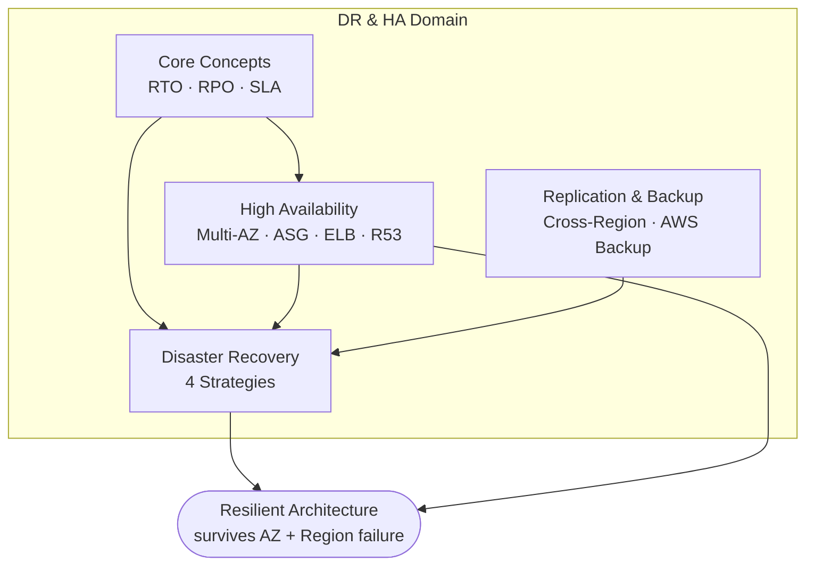

# DR & HA Overview & Exam Guide - SAA-C03 Deep Dive

> The map of the Disaster Recovery & High Availability domain: what each note covers, the vocabulary that decides answers (RTO/RPO, availability vs durability), and the high-yield exam triggers. Start here, then deep-dive each topic.

See also: [01 - HA, Fault Tolerance & Core Concepts](01%20-%20HA%2C%20Fault%20Tolerance%20%26%20Core%20Concepts.md) · [02 - High Availability Building Blocks](02%20-%20High%20Availability%20Building%20Blocks.md) · [03 - The Four DR Strategies](03%20-%20The%20Four%20DR%20Strategies.md) · [04 - Cross-Region, Backup & Data Replication](04%20-%20Cross-Region%2C%20Backup%20%26%20Data%20Replication.md) · [05 - DR & HA Scenario Questions](05%20-%20DR%20%26%20HA%20Scenario%20Questions.md) · [06 - DR & HA Troubleshooting (SRE)](06%20-%20DR%20%26%20HA%20Troubleshooting%20%28SRE%29.md) · [07 - DR & HA Important Facts & Cheat Sheet](07%20-%20DR%20%26%20HA%20Important%20Facts%20%26%20Cheat%20Sheet.md)

---

## Table of Contents

- [Why This Domain Matters](#why-this-domain-matters)
- [How the Notes Are Organised](#how-the-notes-are-organised)
- [The Vocabulary That Decides Answers](#the-vocabulary-that-decides-answers)
- [The Resilience Stack (AZ → Region → Multi-Region)](#the-resilience-stack-az--region--multi-region)
- [The Four Lenses of a DR Question](#the-four-lenses-of-a-dr-question)
- [High-Yield Exam Triggers](#high-yield-exam-triggers)
- [Study Order](#study-order)

---

---

## Why This Domain Matters

DR & HA is **not a single service** — it is a design discipline that reaches across compute, storage, networking, and databases. On the SAA-C03 it shows up as the _"design for reliability"_ pillar of the Well-Architected Framework, and almost every reliability question reduces to one decision:

> **"Given a budget and a tolerance for downtime/data loss, which architecture survives the failure described?"**

You will rarely be asked to define a term. You will constantly be asked to **pick the cheapest design that meets a stated RTO/RPO**, or to **spot the single point of failure** in an architecture.

[⬆ Back to top](#table-of-contents)

---

## How the Notes Are Organised

| Note                                             | What it covers                                                                                                                |
| :----------------------------------------------- | :---------------------------------------------------------------------------------------------------------------------------- |
| [01 - HA, Fault Tolerance & Core Concepts](01%20-%20HA%2C%20Fault%20Tolerance%20%26%20Core%20Concepts.md)     | RTO, RPO, availability vs durability, HA vs FT vs DR, the "nines", SPOF analysis.                                             |
| [02 - High Availability Building Blocks](02%20-%20High%20Availability%20Building%20Blocks.md)       | Multi-AZ, Auto Scaling Groups, ELB, Route 53 health checks & failover, multi-AZ NAT — the components you compose into HA.     |
| [03 - The Four DR Strategies](03%20-%20The%20Four%20DR%20Strategies.md)                  | Backup & Restore, Pilot Light, Warm Standby, Multi-Site Active/Active — cost vs RTO/RPO, architecture, when to pick each.     |
| [04 - Cross-Region, Backup & Data Replication](04%20-%20Cross-Region%2C%20Backup%20%26%20Data%20Replication.md) | Aurora Global DB, DynamoDB Global Tables, S3 CRR, RDS cross-Region, EBS snapshot copy, AWS Backup, data-replication patterns. |
| [05 - DR & HA Scenario Questions](05%20-%20DR%20%26%20HA%20Scenario%20Questions.md)              | 12 realistic exam Q&A with reasoning.                                                                                         |
| [06 - DR & HA Troubleshooting (SRE)](06%20-%20DR%20%26%20HA%20Troubleshooting%20%28SRE%29.md)           | On-call playbooks: failover didn't trigger, replica lag breaks RPO, AZ imbalance, backup restore failures, etc.               |
| [07 - DR & HA Important Facts & Cheat Sheet](07%20-%20DR%20%26%20HA%20Important%20Facts%20%26%20Cheat%20Sheet.md)   | Rapid-revision tables and the keyword→answer map.                                                                             |

[⬆ Back to top](#table-of-contents)

---

## The Vocabulary That Decides Answers

| Term                               | Definition                                                  | Exam meaning                                                          |
| :--------------------------------- | :---------------------------------------------------------- | :-------------------------------------------------------------------- |
| **RTO** (Recovery Time Objective)  | Max acceptable **time to recover** after an incident.       | "Must be back in 5 minutes" → low RTO → Warm Standby / Active-Active. |
| **RPO** (Recovery Point Objective) | Max acceptable **data loss**, measured in time.             | "Can lose at most 1 minute of data" → near-synchronous replication.   |
| **Availability**                   | % of time the system is **up and serving** (e.g. 99.99%).   | Solved by **redundancy** (Multi-AZ, ASG, ELB).                        |
| **Durability**                     | Probability data is **not lost** (e.g. S3 = 11 nines).      | Solved by **replication of data** (S3 copies, snapshots).             |
| **Fault Tolerance**                | Keeps working **with zero interruption** through a failure. | Stronger than HA; e.g. Aurora, S3, DynamoDB.                          |
| **High Availability**              | **Minimises** downtime (fast recovery), small blip allowed. | Multi-AZ RDS (brief failover), ASG replacing an instance.             |
| **Disaster Recovery**              | Recover from a **large-scale / Region** failure.            | The four strategies in [03 - The Four DR Strategies](03%20-%20The%20Four%20DR%20Strategies.md).               |

> [!tip] Exam Tip
> **Availability ≠ Durability.** S3 is 99.999999999% **durable** but 99.99% **available** in the Standard class. A question about _losing data_ is durability; a question about _being able to reach it right now_ is availability.

[⬆ Back to top](#table-of-contents)

---

## The Resilience Stack (AZ → Region → Multi-Region)

Resilience is layered. Each layer protects against a bigger blast radius at a higher cost:

| Layer                        | Protects against                   | Typical mechanism                                       |
| :--------------------------- | :--------------------------------- | :------------------------------------------------------ |
| **Single instance**          | Nothing (SPOF)                     | — avoid for production                                  |
| **Multi-AZ (in one Region)** | AZ failure (power, network, flood) | ASG across AZs, Multi-AZ RDS, ELB                       |
| **Multi-Region**             | Region failure / regional disaster | CRR, Aurora Global DB, DynamoDB Global Tables, Route 53 |

> [!tip] Exam Tip
> **Multi-AZ = High Availability** (default answer for "survive an AZ outage"). **Multi-Region = Disaster Recovery** (answer for "survive a Region outage" / data residency / global users). Don't reach for multi-Region when the question only needs multi-AZ — it's more expensive and usually the _wrong_ "best" answer.

[⬆ Back to top](#table-of-contents)

---

## The Four Lenses of a DR Question

Read the **last sentence** of the question — it tells you which lens to optimise:

1. **Cost** — "most cost-effective", "minimise cost" → lean **Backup & Restore** / **Pilot Light**.
2. **RTO/RPO** — "near-zero downtime", "no data loss" → lean **Warm Standby** / **Active-Active**.
3. **Operational overhead** — "least management", "fully managed" → managed replication (Aurora Global DB, DynamoDB Global Tables, AWS Backup).
4. **Compliance / residency** — "data must stay in region X", "audited backups" → AWS Backup + cross-Region/cross-account copy, encryption.

[⬆ Back to top](#table-of-contents)

---

## High-Yield Exam Triggers

| Phrase in the question                                              | Likely answer                                               |
| :------------------------------------------------------------------ | :---------------------------------------------------------- |
| "survive an Availability Zone failure", "automatic failover"        | **Multi-AZ** (RDS Multi-AZ / ASG across AZs / ELB)          |
| "survive a Region failure", "global users", "regional disaster"     | **Multi-Region** (CRR, Aurora Global DB, Route 53 failover) |
| "most cost-effective DR", "can tolerate hours of downtime"          | **Backup & Restore**                                        |
| "minimal running cost but faster than restore", "core/DB always on" | **Pilot Light**                                             |
| "scaled-down but fully functional copy always running"              | **Warm Standby**                                            |
| "zero downtime", "lowest possible RTO/RPO", "active-active"         | **Multi-Site Active/Active**                                |
| "automatically replace unhealthy instances"                         | **Auto Scaling Group + ELB health checks**                  |
| "route users away from a failed Region"                             | **Route 53 health checks + failover routing**               |
| "RPO near zero for a relational DB across Regions"                  | **Aurora Global Database**                                  |
| "multi-Region active-active NoSQL"                                  | **DynamoDB Global Tables**                                  |
| "centralised, policy-driven backups across services/accounts"       | **AWS Backup**                                              |
| "11 nines durability", "protect objects from Region loss"           | **S3** + **Cross-Region Replication**                       |

[⬆ Back to top](#table-of-contents)

---

## Study Order

1. **Lock the vocabulary** — [01 - HA, Fault Tolerance & Core Concepts](01%20-%20HA%2C%20Fault%20Tolerance%20%26%20Core%20Concepts.md). Everything else depends on RTO/RPO intuition.
2. **Learn the building blocks** — [02 - High Availability Building Blocks](02%20-%20High%20Availability%20Building%20Blocks.md). These are reused everywhere.
3. **Master the four strategies** — [03 - The Four DR Strategies](03%20-%20The%20Four%20DR%20Strategies.md). This is the single highest-yield note.
4. **Know the data layer** — [04 - Cross-Region, Backup & Data Replication](04%20-%20Cross-Region%2C%20Backup%20%26%20Data%20Replication.md).
5. **Drill** — [05 - DR & HA Scenario Questions](05%20-%20DR%20%26%20HA%20Scenario%20Questions.md) then [06 - DR & HA Troubleshooting (SRE)](06%20-%20DR%20%26%20HA%20Troubleshooting%20%28SRE%29.md).
6. **Revise fast** — [07 - DR & HA Important Facts & Cheat Sheet](07%20-%20DR%20%26%20HA%20Important%20Facts%20%26%20Cheat%20Sheet.md) the day before the exam.

[⬆ Back to top](#table-of-contents)
