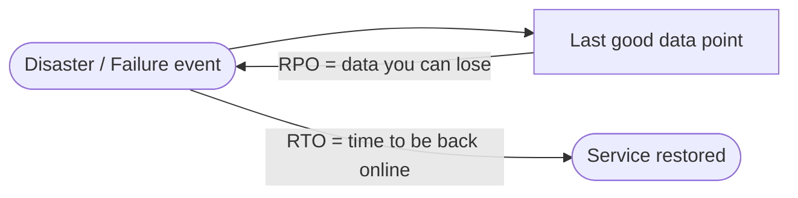
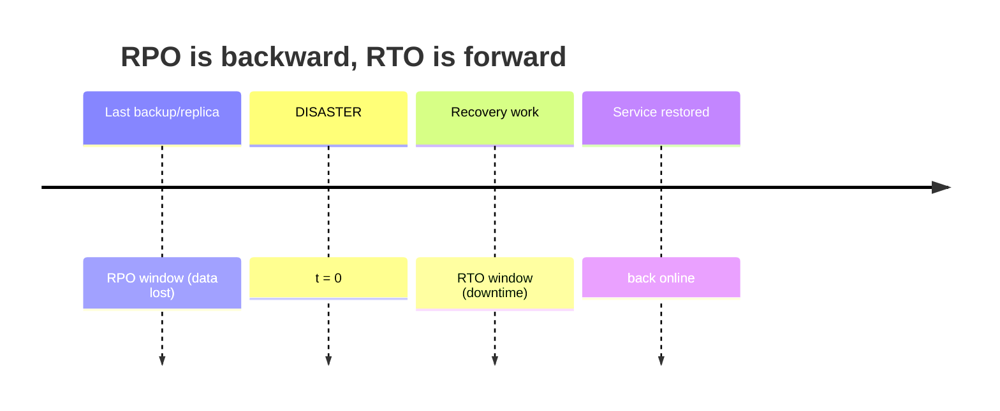
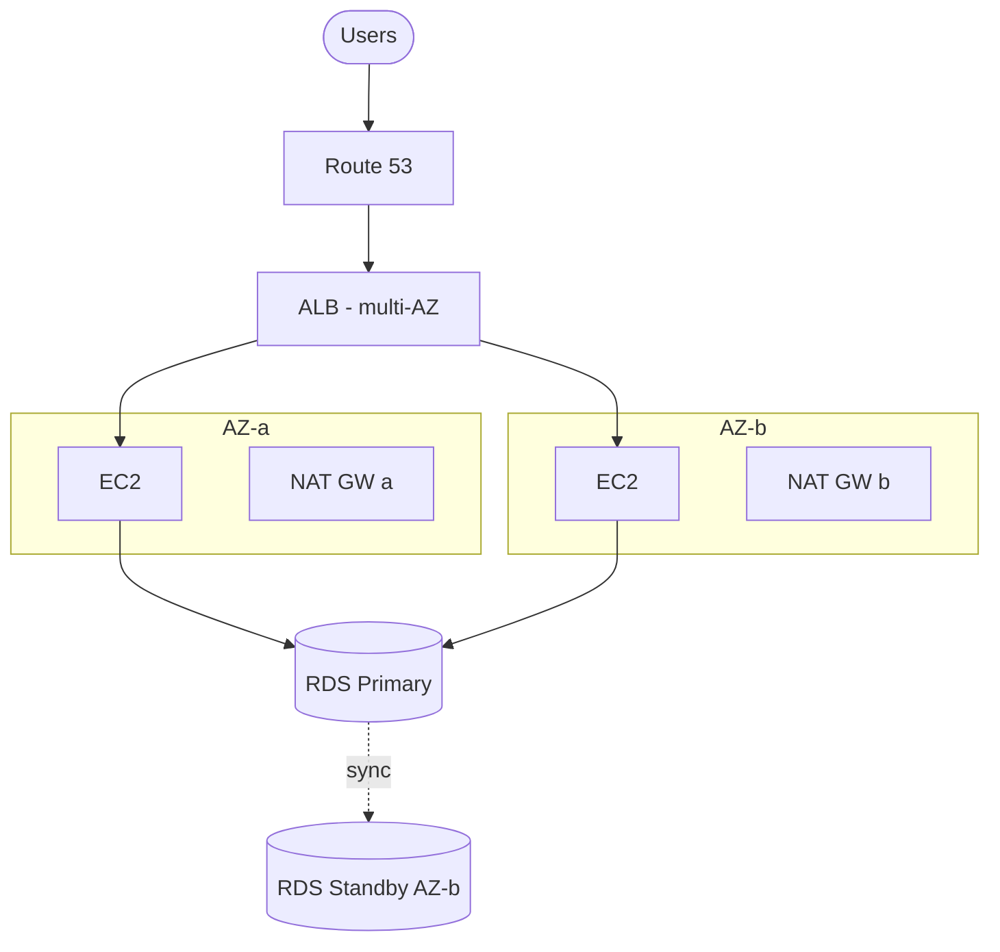

# HA, Fault Tolerance & Core Concepts - SAA-C03 Deep Dive

> The foundation of the whole domain: RTO and RPO, availability vs durability, High Availability vs Fault Tolerance vs Disaster Recovery, the "nines", how AWS SLAs compose, and how to find the single point of failure in any architecture.

See also: [00 - DR & HA Overview & Exam Guide](00%20-%20DR%20%26%20HA%20Overview%20%26%20Exam%20Guide.md) · [02 - High Availability Building Blocks](02%20-%20High%20Availability%20Building%20Blocks.md) · [03 - The Four DR Strategies](03%20-%20The%20Four%20DR%20Strategies.md) · [04 - Cross-Region, Backup & Data Replication](04%20-%20Cross-Region%2C%20Backup%20%26%20Data%20Replication.md) · [07 - DR & HA Important Facts & Cheat Sheet](07%20-%20DR%20%26%20HA%20Important%20Facts%20%26%20Cheat%20Sheet.md)

---

## Table of Contents

- [RTO and RPO The Two Numbers](#rto-and-rpo-the-two-numbers)
- [Availability vs Durability](#availability-vs-durability)
- [High Availability vs Fault Tolerance vs Disaster Recovery](#high-availability-vs-fault-tolerance-vs-disaster-recovery)
- [The Nines of Availability](#the-nines-of-availability)
- [How SLAs Compose Across Components](#how-slas-compose-across-components)
- [Redundancy Active-Passive vs Active-Active](#redundancy-active-passive-vs-active-active)
- [Single Point of Failure Analysis](#single-point-of-failure-analysis)
- [Stateless vs Stateful and Why It Matters](#stateless-vs-stateful-and-why-it-matters)
- [Exam Pitfalls](#exam-pitfalls)

---



---

## RTO and RPO The Two Numbers

Every DR decision is a trade-off between two numbers, both measured in **time**:

- **RPO — Recovery Point Objective:** how much **data loss** is acceptable, expressed as a time window. _"RPO of 5 minutes"_ means after recovery you may have lost up to the last 5 minutes of writes. **RPO is set by how often you replicate/back up.**
- **RTO — Recovery Time Objective:** how long the business can be **down**, expressed as time-to-restore. _"RTO of 1 hour"_ means you must be serving traffic again within 1 hour. **RTO is set by how fast you can stand the system back up.**



|                 | RPO                                     | RTO                                 |
| :-------------- | :-------------------------------------- | :---------------------------------- |
| **Measures**    | Data loss                               | Downtime                            |
| **Direction**   | Looks **backward** from the disaster    | Looks **forward** from the disaster |
| **Driven by**   | Backup/replication **frequency**        | Recovery **process speed**          |
| **Lower it by** | More frequent / synchronous replication | Pre-provisioned standby capacity    |

> [!tip] Exam Tip
> **RPO → "how much data can I lose"** (replication frequency). **RTO → "how long can I be down"** (recovery speed). Lower RPO/RTO = higher cost. The exam picks the **cheapest strategy that still meets both numbers** — see [03 - The Four DR Strategies](03%20-%20The%20Four%20DR%20Strategies.md).

[⬆ Back to top](#table-of-contents)

---

## Availability vs Durability

These are constantly confused and the exam exploits it.

- **Durability** = "will my data still exist?" — protection against **loss/corruption**. S3 Standard is **99.999999999% (11 nines) durable**: across millions of objects you'd expect to lose one object every ~10,000 years. Durability comes from **storing many copies**.
- **Availability** = "can I access it right now?" — protection against **downtime**. S3 Standard targets **99.99% availability**. Availability comes from **redundant serving paths**.

|                | Durability                              | Availability                         |
| :------------- | :-------------------------------------- | :----------------------------------- |
| Question       | Is the data safe?                       | Can I reach it now?                  |
| Threat         | Disk failure, corruption, deletion      | Outage, network partition, overload  |
| Mechanism      | Replication of data (copies, snapshots) | Redundant components (Multi-AZ, ELB) |
| S3 Standard    | 11 nines                                | 4 nines (99.99%)                     |
| S3 One Zone-IA | 11 nines                                | 99.5% (single AZ)                    |

> [!tip] Exam Tip
> "Could we **lose** the data?" → durability. "Could the service be **unreachable**?" → availability. **S3 One Zone-IA** is still 11-nines durable but lives in **one AZ**, so its _availability_ drops and an AZ loss can take it offline — use it only for **reproducible** data.

[⬆ Back to top](#table-of-contents)

---

## High Availability vs Fault Tolerance vs Disaster Recovery

| Concept                    | Goal                                                     | Tolerates                                    | AWS examples                                                  |
| :------------------------- | :------------------------------------------------------- | :------------------------------------------- | :------------------------------------------------------------ |
| **High Availability (HA)** | Minimise downtime; **fast recovery** with a brief blip   | Component/AZ failure with short interruption | Multi-AZ RDS (seconds of failover), ASG replacing an instance |
| **Fault Tolerance (FT)**   | **Zero interruption**; the failure is invisible to users | Component failure with **no** downtime       | S3, DynamoDB, Aurora storage, ELB itself                      |
| **Disaster Recovery (DR)** | Recover from a **large-scale / Region** disaster         | Loss of an entire site/Region                | The 4 strategies, multi-Region replication                    |

The relationship: **FT is stronger than HA** (no blip vs small blip), and **DR is about a bigger blast radius** (a whole Region/site, not just one component).

> [!tip] Exam Tip
> Multi-AZ RDS is **HA, not FT** — there is a short failover (typically 60–120s) during which connections drop. If a question demands **no interruption at all**, that points to fault-tolerant services (Aurora, DynamoDB, S3) or active-active designs, not Multi-AZ RDS.

[⬆ Back to top](#table-of-contents)

---

## The Nines of Availability

| Availability           | Downtime / year | Downtime / month | Typical design                 |
| :--------------------- | :-------------- | :--------------- | :----------------------------- |
| 99% ("two nines")      | ~3.65 days      | ~7.2 hours       | Single instance, no redundancy |
| 99.9% ("three nines")  | ~8.77 hours     | ~43 min          | Single AZ with backups         |
| 99.95%                 | ~4.38 hours     | ~22 min          | Multi-AZ, manual steps         |
| 99.99% ("four nines")  | ~52.6 min       | ~4.3 min         | Multi-AZ + ASG + ELB           |
| 99.999% ("five nines") | ~5.26 min       | ~26 sec          | Multi-Region active-active     |

> [!tip] Exam Tip
> Each extra "nine" roughly **multiplies cost and complexity**. The exam wants the **lowest design that meets the stated SLA** — don't propose multi-Region active-active when four nines (multi-AZ) is enough.

[⬆ Back to top](#table-of-contents)

---

## How SLAs Compose Across Components

When a request passes through components **in series** (it needs all of them), availabilities **multiply** — the result is **lower** than any single component:

```
ELB (99.99%) × App (99.95%) × RDS (99.95%) ≈ 99.89%
```

When you add **redundant** components **in parallel** (any one suffices), unavailability multiplies, so availability **rises**:

```
Two AZs each 99% available → 1 − (0.01 × 0.01) = 99.99%
```

> [!tip] Exam Tip
> **Series (dependency chain) lowers availability; parallel (redundancy) raises it.** This is the math behind "spread across multiple AZs" being the default HA answer — adding a redundant AZ turns two-nines into four-nines.

[⬆ Back to top](#table-of-contents)

---

## Redundancy Active-Passive vs Active-Active

- **Active-Passive:** one node serves traffic; a standby waits and takes over on failure. Cheaper, but the standby is idle and failover takes time. _Examples:_ Multi-AZ RDS, Route 53 failover routing, Warm Standby DR.
- **Active-Active:** all nodes serve traffic simultaneously; failure of one just removes capacity. More expensive, but **near-zero RTO** and the spare capacity isn't wasted. _Examples:_ ASG behind ELB across AZs, DynamoDB Global Tables, Multi-Site Active/Active DR.

|            | Active-Passive            | Active-Active                            |
| :--------- | :------------------------ | :--------------------------------------- |
| Cost       | Lower (standby idle)      | Higher (all live)                        |
| RTO        | Failover delay            | Near-zero                                |
| Complexity | Lower                     | Higher (conflict/state sync)             |
| Examples   | Multi-AZ RDS, Pilot Light | DynamoDB Global Tables, Active-Active DR |

[⬆ Back to top](#table-of-contents)

---

## Single Point of Failure Analysis

A **Single Point of Failure (SPOF)** is any component whose failure takes down the whole system. SAA-C03 loves "what is the SPOF / make this resilient" questions. Walk the request path and ask _"if this one thing dies, am I down?"_



Common SPOFs and their fixes:

| SPOF                            | Fix                                                    |
| :------------------------------ | :----------------------------------------------------- |
| Single EC2 instance             | ASG across multiple AZs behind an ELB                  |
| Single AZ                       | Deploy subnets/resources in ≥2 AZs                     |
| Single RDS instance             | Enable **Multi-AZ**                                    |
| Single NAT Gateway              | One NAT GW **per AZ** (with per-AZ route tables)       |
| Single Region                   | Multi-Region replication + Route 53 failover           |
| Hard-coded IP / single endpoint | Use DNS (Route 53), ELB, or service endpoints          |
| Session state on one instance   | Externalise to ElastiCache / DynamoDB (stateless tier) |

> [!tip] Exam Tip
> A **single NAT Gateway** is a classic hidden SPOF: it lives in **one AZ**. If that AZ fails, private instances in _other_ AZs lose outbound internet. Deploy **one NAT GW per AZ** and route each subnet to its local NAT.

[⬆ Back to top](#table-of-contents)

---

## Stateless vs Stateful and Why It Matters

HA scaling works cleanly only when the compute tier is **stateless** — any instance can serve any request because no user data lives on the instance.

- **Stateless tier:** put session/state in **ElastiCache**, **DynamoDB**, or a database; store files in **S3/EFS**, not local disk. Now an ASG can freely add/replace/terminate instances and an ELB can route to any of them.
- **Stateful trap:** sessions in instance memory or files on a local EBS volume → losing/replacing an instance loses user data and breaks HA.

> [!tip] Exam Tip
> "Users get logged out when an instance is replaced / scales in" → **externalise session state** (ElastiCache or DynamoDB) to make the tier stateless. Don't fix it with sticky sessions alone — that just re-pins the SPOF.

[⬆ Back to top](#table-of-contents)

---

## Exam Pitfalls

- Confusing **RTO** (downtime) with **RPO** (data loss).
- Confusing **availability** (reachable) with **durability** (not lost).
- Treating **Multi-AZ RDS as a read-scaling or zero-downtime** solution — it is **HA only**, the standby is **not readable**, and failover causes a brief blip. Read scaling = **read replicas**.
- Choosing **multi-Region** when the scenario only needs **multi-AZ** (over-engineering = wrong "best" answer).
- Forgetting that **S3 One Zone-IA** and **a single NAT Gateway** are AZ-bound SPOFs.
- Assuming snapshots are "HA" — snapshots are **recovery/durability**, not availability.

[⬆ Back to top](#table-of-contents)
