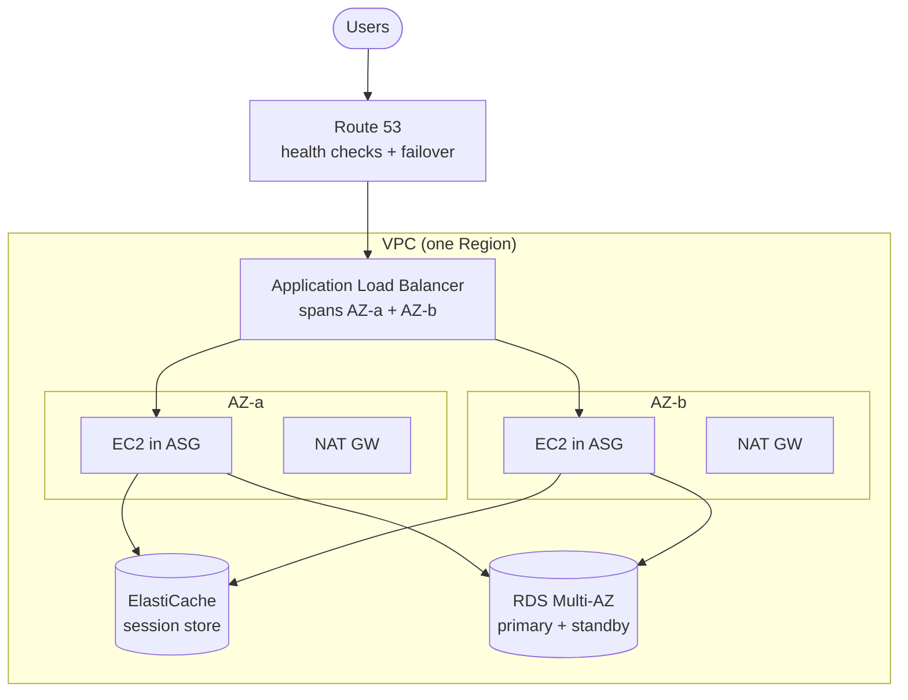
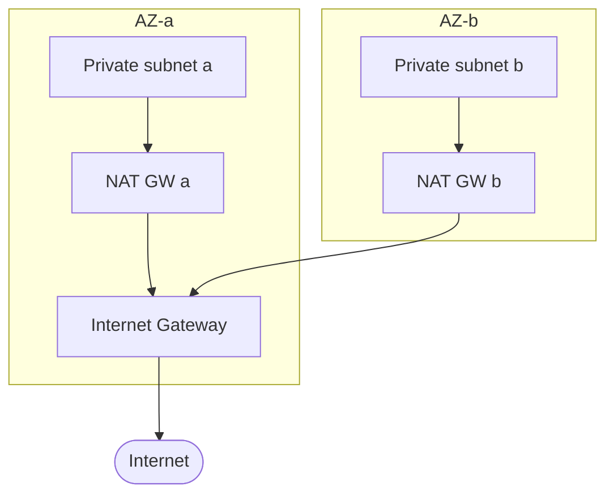

# High Availability Building Blocks - SAA-C03 Deep Dive

> The reusable components you compose into a highly available architecture: multiple Availability Zones, Auto Scaling Groups, Elastic Load Balancing, Route 53 health checks & routing policies, multi-AZ NAT, and the per-service Multi-AZ features. Plus the reference HA web-tier architecture.

See also: [00 - DR & HA Overview & Exam Guide](00%20-%20DR%20%26%20HA%20Overview%20%26%20Exam%20Guide.md) · [01 - HA, Fault Tolerance & Core Concepts](01%20-%20HA%2C%20Fault%20Tolerance%20%26%20Core%20Concepts.md) · [03 - The Four DR Strategies](03%20-%20The%20Four%20DR%20Strategies.md) · [04 - Cross-Region, Backup & Data Replication](04%20-%20Cross-Region%2C%20Backup%20%26%20Data%20Replication.md) · [06 - DR & HA Troubleshooting (SRE)](06%20-%20DR%20%26%20HA%20Troubleshooting%20%28SRE%29.md) · [01 - VPC Fundamentals & Architecture](01%20-%20VPC%20Fundamentals%20%26%20Architecture.md)

---

## Table of Contents

- [Availability Zones and Regions](#availability-zones-and-regions)
- [The Reference HA Web Architecture](#the-reference-ha-web-architecture)
- [Auto Scaling Groups](#auto-scaling-groups)
- [Elastic Load Balancing](#elastic-load-balancing)
- [Route 53 Health Checks and Routing Policies](#route-53-health-checks-and-routing-policies)
- [Multi-AZ NAT Gateways](#multi-az-nat-gateways)
- [Per-Service Multi-AZ Features](#per-service-multi-az-features)
- [Decoupling for Resilience](#decoupling-for-resilience)
- [Putting It Together Checklist](#putting-it-together-checklist)
- [Exam Pitfalls](#exam-pitfalls)

---

---

## Availability Zones and Regions

- A **Region** is a geographic area (e.g. `ap-south-1`) containing **multiple, isolated Availability Zones**.
- An **Availability Zone (AZ)** is one or more discrete data centres with independent power, cooling, and networking, interconnected by low-latency links. AZs in a Region are physically separated (km apart) so a single disaster rarely hits two.
- **HA = spread across ≥2 AZs in one Region.** **DR = spread across ≥2 Regions.**

> [!tip] Exam Tip
> The single most common HA answer on the exam is **"deploy across multiple Availability Zones."** If an architecture lives in one AZ, that AZ is a SPOF — the fix is almost always "add a second AZ."

[⬆ Back to top](#table-of-contents)

---

## The Reference HA Web Architecture

The canonical three-tier HA design the exam expects you to recognise:

1. **Route 53** — DNS with health checks; can fail traffic over between ALBs/Regions.
2. **ALB** — spans **≥2 AZs**, health-checks targets, routes only to healthy ones.
3. **Auto Scaling Group** — EC2 across the **same AZs**, self-heals and scales.
4. **Stateless app tier** — session state in **ElastiCache/DynamoDB**, files in **S3/EFS**.
5. **RDS Multi-AZ** (or Aurora) — synchronous standby in another AZ, automatic failover.

Every layer is redundant across AZs → no single AZ failure takes the app down → ~99.99% availability.

[⬆ Back to top](#table-of-contents)

---

## Auto Scaling Groups

An **Auto Scaling Group (ASG)** maintains a desired number of EC2 instances, replaces unhealthy ones, and scales capacity with demand.

**HA features:**

- **Multi-AZ:** specify multiple subnets (one per AZ); ASG balances instances across them and rebalances after an AZ recovers.
- **Self-healing:** when an instance fails its **health check** (EC2 or, better, **ELB health check**), the ASG terminates and replaces it.
- **Min / Desired / Max:** `min` guarantees a floor of capacity for HA; `max` caps cost.

**Scaling policies:**

| Policy                 | When to use                                                         |
| :--------------------- | :------------------------------------------------------------------ |
| **Target tracking**    | Keep a metric at a target (e.g. CPU 50%). Simplest; default choice. |
| **Step scaling**       | Add/remove N instances at metric thresholds.                        |
| **Scheduled scaling**  | Predictable time-based demand (e.g. business hours).                |
| **Predictive scaling** | ML forecasts demand and pre-scales.                                 |

> [!tip] Exam Tip
> Use **ELB health checks** (not just EC2 status checks) on the ASG so an instance that is _running but not serving_ (app crashed) gets replaced. "Automatically replace unhealthy instances" = **ASG + ELB health check**.

[⬆ Back to top](#table-of-contents)

---

## Elastic Load Balancing

ELB distributes incoming traffic across healthy targets in **multiple AZs**, removing instance-level and AZ-level SPOFs. The ELB itself is a managed, fault-tolerant, multi-AZ service.

| Type     | Layer            | Use it for                                                   | Key HA facts                                                         |
| :------- | :--------------- | :----------------------------------------------------------- | :------------------------------------------------------------------- |
| **ALB**  | L7 (HTTP/HTTPS)  | Web apps, microservices, host/path routing                   | Health checks per target group; enable **Cross-Zone** load balancing |
| **NLB**  | L4 (TCP/UDP/TLS) | Ultra-low latency, static IP / Elastic IP, millions of req/s | One static IP per AZ; preserves source IP                            |
| **GWLB** | L3/4             | Insert virtual appliances (firewalls, IDS/IPS)               | Transparent traffic steering                                         |
| **CLB**  | L4/7 (legacy)    | Old workloads only                                           | Avoid for new designs                                                |

**Cross-Zone Load Balancing:** distributes traffic **evenly across all instances in all AZs**, not just within the AZ the request landed in.

- **ALB:** cross-zone **always on** (free).
- **NLB / GWLB:** cross-zone **off by default** (enabling may incur inter-AZ data charges).

> [!tip] Exam Tip
> Need a **static IP** or extreme throughput at L4 → **NLB**. Need **host/path-based HTTP routing** → **ALB**. Insert **third-party firewall appliances** → **GWLB**. ELB only routes to **healthy** targets, so it works hand-in-hand with the ASG.

[⬆ Back to top](#table-of-contents)

---

## Route 53 Health Checks and Routing Policies

Route 53 is the **global DNS** layer of HA/DR — it can detect endpoint failure and steer DNS answers away from it.

**Health checks** monitor an endpoint (HTTP/HTTPS/TCP) or a CloudWatch alarm and mark it healthy/unhealthy; unhealthy targets are removed from DNS responses.

**Routing policies relevant to HA/DR:**

| Policy                 | What it does                                          | HA/DR use                                     |
| :--------------------- | :---------------------------------------------------- | :-------------------------------------------- |
| **Failover**           | Active-passive: primary while healthy, else secondary | Classic DR site cutover                       |
| **Latency-based**      | Routes to the Region with lowest latency              | Multi-Region active-active performance        |
| **Weighted**           | Splits traffic by percentage                          | Blue/green, gradual cutover, A-B Regions      |
| **Geolocation**        | Routes by user's continent/country                    | Compliance/data residency, localisation       |
| **Geoproximity**       | Routes by geographic distance, with bias              | Shift load between Regions                    |
| **Multi-value answer** | Returns multiple healthy IPs (with health checks)     | Simple client-side redundancy (not a full LB) |
| **Simple**             | One record, **no health check**                       | Single resource only                          |

> [!tip] Exam Tip
> "Automatically send users to a standby Region when the primary fails" → **Failover routing + health checks**. "Send users to the nearest/lowest-latency Region" → **Latency-based routing**. **Alias records** point to AWS resources (ALB, CloudFront, S3) for free and are preferred over CNAMEs at the zone apex.

[⬆ Back to top](#table-of-contents)

---

## Multi-AZ NAT Gateways

A **NAT Gateway** gives private-subnet instances outbound internet (patching, API calls) with no inbound exposure — but a NAT GW exists **in a single AZ**.

- **Anti-pattern:** one NAT GW for the whole VPC. If its AZ fails, **every** private instance loses outbound access, even those in healthy AZs.
- **HA pattern:** deploy **one NAT GW per AZ**, and give each AZ's private route table a default route to **its own** NAT GW.

> [!tip] Exam Tip
> Single NAT Gateway = hidden **SPOF** and a cross-AZ data-charge trap. Always **per-AZ NAT GW + per-AZ route table** for HA.

[⬆ Back to top](#table-of-contents)

---

## Per-Service Multi-AZ Features

| Service                 | HA mechanism                                                       | Notes                                                                                  |
| :---------------------- | :----------------------------------------------------------------- | :------------------------------------------------------------------------------------- |
| **RDS Multi-AZ**        | Synchronous standby in another AZ, automatic failover via DNS      | Standby **not readable**; brief failover blip → see [01 - RDS Intro & Core Concepts](01%20-%20RDS%20Intro%20%26%20Core%20Concepts.md) |
| **Aurora**              | Storage auto-replicated 6 ways across 3 AZs; replicas auto-promote | More resilient than RDS Multi-AZ → [01 - Aurora Intro & Core Concepts](01%20-%20Aurora%20Intro%20%26%20Core%20Concepts.md)               |
| **DynamoDB**            | Data replicated across 3 AZs automatically                         | Regionally fault-tolerant by default → [01 - DynamoDB Intro & Core Concepts](01%20-%20DynamoDB%20Intro%20%26%20Core%20Concepts.md)         |
| **S3**                  | Objects replicated across ≥3 AZs (except One Zone-IA)              | 11 nines durability                                                                    |
| **EFS**                 | Stored across multiple AZs (Standard)                              | Shared file system survives AZ loss                                                    |
| **ElastiCache (Redis)** | Multi-AZ with automatic failover, replicas across AZs              | Memcached has no replication                                                           |
| **ELB**                 | Inherently multi-AZ, managed                                       | Add AZs in the listener config                                                         |

> [!tip] Exam Tip
> Many services are **AZ-redundant by default** (S3, DynamoDB, Aurora storage). For **RDS** and **ElastiCache Redis**, Multi-AZ is an **explicit toggle** you must enable.

[⬆ Back to top](#table-of-contents)

---

## Decoupling for Resilience

Tightly coupled components fail together. **Decoupling** lets one tier absorb the failure or slowness of another:

- **SQS** queues buffer work so a downstream outage doesn't lose requests — producers keep enqueuing, consumers catch up later. → [01 - SQS Fundamentals & Deep Dive](01%20-%20SQS%20Fundamentals%20%26%20Deep%20Dive.md)
- **SNS / EventBridge** fan out events so a single subscriber failure doesn't block others.
- **Load balancers** decouple clients from specific instances.

> [!tip] Exam Tip
> "Make the system resilient to a downstream/processing-tier outage without losing requests" → put an **SQS queue** between tiers. Decoupling is a reliability pattern, not just an integration one.

[⬆ Back to top](#table-of-contents)

---

## Putting It Together Checklist

- [ ] Resources span **≥2 AZs** at every tier.
- [ ] EC2 in an **ASG** with **ELB health checks**, `min ≥ 2`.
- [ ] **ELB** front door spanning the same AZs.
- [ ] App tier is **stateless** (session in ElastiCache/DynamoDB).
- [ ] Database is **Multi-AZ** (RDS) or **Aurora**.
- [ ] **One NAT GW per AZ** with per-AZ routes.
- [ ] **Route 53 health checks** for DNS-level failover (and cross-Region if DR required).
- [ ] Queues (**SQS**) decouple critical processing tiers.

[⬆ Back to top](#table-of-contents)

---

## Exam Pitfalls

- Putting an ASG or ELB in **one AZ** — defeats the purpose.
- Relying on **EC2 status checks** instead of **ELB health checks** (misses app-level failure).
- A **single NAT Gateway** for all AZs.
- Forgetting the app tier must be **stateless** for ASG/ELB to work cleanly.
- Thinking **RDS Multi-AZ standby is readable** (it is not — that's a read replica).
- Using **Simple routing** when health-check-based **Failover/Multi-value** is needed.

[⬆ Back to top](#table-of-contents)
