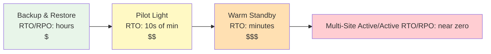
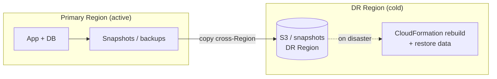
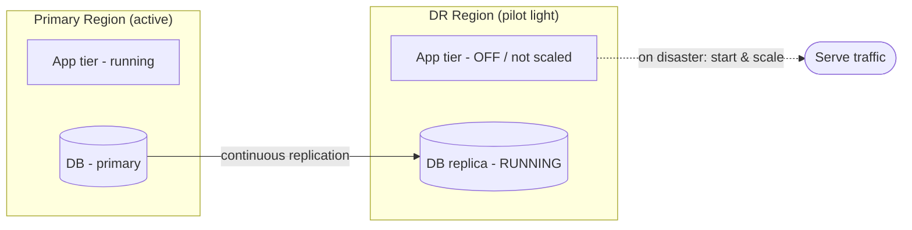
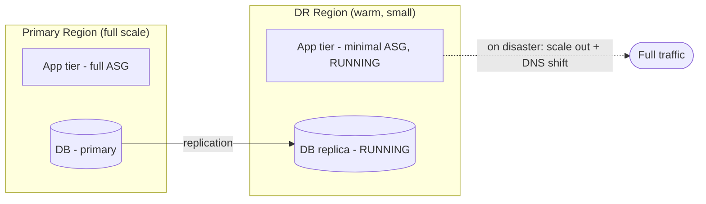
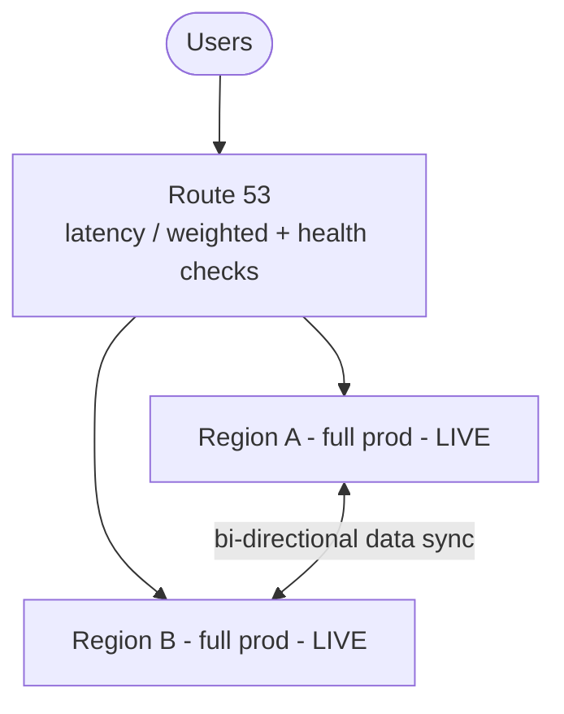
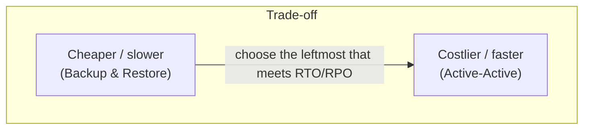
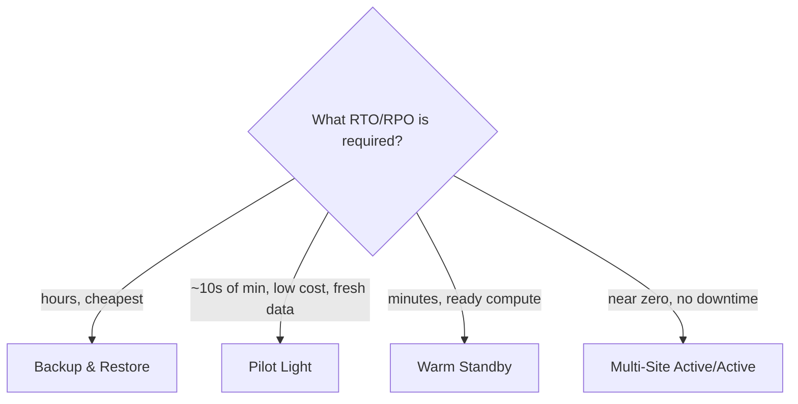

# The Four DR Strategies - SAA-C03 Deep Dive

> The single highest-yield note in this domain. Backup & Restore, Pilot Light, Warm Standby, and Multi-Site Active/Active — their architectures, cost vs RTO/RPO trade-offs, the keywords that signal each, and the failback story. If you learn one thing for the reliability questions, learn this spectrum.

See also: [00 - DR & HA Overview & Exam Guide](00%20-%20DR%20%26%20HA%20Overview%20%26%20Exam%20Guide.md) · [01 - HA, Fault Tolerance & Core Concepts](01%20-%20HA%2C%20Fault%20Tolerance%20%26%20Core%20Concepts.md) · [02 - High Availability Building Blocks](02%20-%20High%20Availability%20Building%20Blocks.md) · [04 - Cross-Region, Backup & Data Replication](04%20-%20Cross-Region%2C%20Backup%20%26%20Data%20Replication.md) · [05 - DR & HA Scenario Questions](05%20-%20DR%20%26%20HA%20Scenario%20Questions.md) · [07 - DR & HA Important Facts & Cheat Sheet](07%20-%20DR%20%26%20HA%20Important%20Facts%20%26%20Cheat%20Sheet.md)

---

## Table of Contents

- [The Spectrum at a Glance](#the-spectrum-at-a-glance)
- [1 Backup and Restore](#1-backup-and-restore)
- [2 Pilot Light](#2-pilot-light)
- [3 Warm Standby](#3-warm-standby)
- [4 Multi-Site Active-Active](#4-multi-site-active-active)
- [Side-by-Side Comparison](#side-by-side-comparison)
- [How to Pick the Right Strategy](#how-to-pick-the-right-strategy)
- [Failback The Forgotten Half](#failback-the-forgotten-half)
- [Exam Pitfalls](#exam-pitfalls)

---

> As you move **right**: RTO and RPO **shrink**, cost and complexity **grow**. The exam's job is to make you pick the **leftmost (cheapest)** option that still meets the stated RTO/RPO.

---

## The Spectrum at a Glance

| Strategy                     | RTO            | RPO             | Running cost | Core idea                                                           |
| :--------------------------- | :------------- | :-------------- | :----------- | :------------------------------------------------------------------ |
| **Backup & Restore**         | Hours          | Hours           | Lowest       | Restore from backups into a new environment after disaster          |
| **Pilot Light**              | 10s of minutes | Minutes         | Low          | Core (data + minimal services) always on; scale up on disaster      |
| **Warm Standby**             | Minutes        | Seconds–minutes | Medium-high  | Full but **scaled-down** copy always running; scale out on disaster |
| **Multi-Site Active/Active** | Near zero      | Near zero       | Highest      | Full production in ≥2 Regions serving live traffic                  |

[⬆ Back to top](#table-of-contents)

---

## 1 Backup and Restore

**Idea:** Regularly back up data (and ideally infrastructure-as-code), store copies in the DR Region, and **rebuild + restore** only after a disaster. Nothing runs in the DR Region until needed.

- **What's running in DR normally:** essentially nothing — just stored backups (S3, AMIs, EBS/RDS snapshots copied cross-Region).
- **Recovery:** deploy infrastructure (CloudFormation/IaC), restore data from snapshots, repoint DNS.
- **RTO:** hours (provision + restore time). **RPO:** hours (last backup), or less with frequent backups.
- **Cost:** lowest — you pay mainly for **storage** of backups.

**Enabling services:** AWS Backup, EBS/RDS snapshot copy (cross-Region), S3 Cross-Region Replication, AMI copy, CloudFormation.

> [!tip] Exam Tip
> Keywords: **"most cost-effective DR"**, **"can tolerate hours of downtime/data loss"**, **"minimise running cost"**. This is the **cheapest** strategy and the default when the question stresses cost over speed.

[⬆ Back to top](#table-of-contents)

---

## 2 Pilot Light

**Idea:** Keep the **core** of the system — primarily the **data layer** — always running and replicated in the DR Region, while application/compute tiers are **provisioned but switched off** (or not yet created). On disaster, you "turn up the gas": start/scale the compute and the data is already there.

- **Always on in DR:** the **database / data store** (e.g. RDS cross-Region read replica, DynamoDB Global Table, replicated S3). Compute is off.
- **Recovery:** launch/scale the app tier (AMIs ready), promote the DB replica, repoint DNS.
- **RTO:** tens of minutes. **RPO:** minutes (continuous data replication).
- **Cost:** low — you pay for the always-on **data** layer plus storage, not idle compute.

> [!tip] Exam Tip
> Pilot Light = **"only the database/core is always running; spin up the rest on failover."** Cheaper than Warm Standby (no idle app servers), slower RTO (you must start and scale compute). Keyword: **"core services / data always replicated, compute started on demand."**

[⬆ Back to top](#table-of-contents)

---

## 3 Warm Standby

**Idea:** Run a **fully functional but scaled-down** copy of the entire production stack in the DR Region at all times. It can handle a fraction of load immediately; on disaster you **scale it out** to full capacity and shift traffic.

- **Always on in DR:** the **whole stack**, just small (e.g. minimum ASG size, small instances).
- **Recovery:** scale the ASG up / resize, promote DB, shift DNS (often Route 53 failover/weighted).
- **RTO:** minutes (it's already live, just under-provisioned). **RPO:** seconds–minutes.
- **Cost:** medium-high — you pay for a continuously running (if small) full environment.

> [!tip] Exam Tip
> Warm Standby = **"a smaller copy of everything is always running and can take traffic immediately."** Faster RTO than Pilot Light because compute is already up. Keyword: **"scaled-down but fully working standby."**

[⬆ Back to top](#table-of-contents)

---

## 4 Multi-Site Active-Active

**Idea:** Run **full production capacity in two (or more) Regions simultaneously**, both serving live user traffic. If a Region fails, the others absorb its load — there's almost nothing to "recover."

- **Always on:** full stacks in all Regions, plus **bi-directional / multi-Region data replication** (DynamoDB Global Tables, Aurora Global DB with care, etc.).
- **Recovery:** essentially automatic — Route 53 health checks pull the failed Region out; surviving Regions carry on.
- **RTO:** near zero. **RPO:** near zero.
- **Cost:** highest — you run (and pay for) full production multiple times, and handle data-consistency/conflict complexity.

> [!tip] Exam Tip
> Active-Active = **"zero downtime", "lowest possible RTO and RPO", "active-active across Regions", "global users with local low latency."** Most expensive and complex. **DynamoDB Global Tables** is the poster child for the active-active data layer.

[⬆ Back to top](#table-of-contents)

---

## Side-by-Side Comparison

| Dimension         | Backup & Restore | Pilot Light           | Warm Standby                | Active-Active              |
| :---------------- | :--------------- | :-------------------- | :-------------------------- | :------------------------- |
| **RTO**           | Hours            | 10s of minutes        | Minutes                     | Near zero                  |
| **RPO**           | Hours            | Minutes               | Seconds–minutes             | Near zero                  |
| **Running in DR** | Backups only     | Data layer only       | Full stack, scaled **down** | Full stack, **full** scale |
| **Compute in DR** | None             | Off                   | Small/minimal               | Full                       |
| **Cost**          | $                | $$                    | $$$                         | $$$$                       |
| **Complexity**    | Low              | Medium                | Medium-high                 | High                       |
| **Failover work** | Build + restore  | Start & scale compute | Scale out                   | Almost none (auto)         |

[⬆ Back to top](#table-of-contents)

---

## How to Pick the Right Strategy

Decision flow for the exam:

1. **Read the required RTO and RPO** (and the cost constraint).
2. **RTO in hours + cost is the priority** → **Backup & Restore**.
3. **RTO in ~tens of minutes, keep cost low, data must be current** → **Pilot Light**.
4. **RTO in minutes, can't wait to launch compute** → **Warm Standby**.
5. **RTO/RPO near zero, "no downtime", global active-active** → **Multi-Site Active/Active**.

> [!tip] Exam Tip
> The trap answer is usually **too much DR** (Active-Active when Backup & Restore is asked for) or **too little** (Backup & Restore when "near-zero RTO" is required). Match the strategy to the **stated numbers**, then pick the **cheapest** option that satisfies them.

[⬆ Back to top](#table-of-contents)

---

## Failback The Forgotten Half

DR isn't done at failover — you must eventually **fail back** to the primary Region once it recovers:

1. Restore/rebuild the primary Region.
2. **Reverse replication**: sync data written in DR back to primary.
3. Validate, then shift traffic (Route 53) back to primary, usually during a low-traffic window.
4. Return the DR site to its standby posture.

> [!tip] Exam Tip
> Failback requires **re-syncing data that was written while running in DR** before cutting back — otherwise you lose everything customers did during the outage. Active-active largely sidesteps failback because both Regions stay live.

[⬆ Back to top](#table-of-contents)

---

## Exam Pitfalls

- **Confusing Pilot Light vs Warm Standby:** Pilot Light = **data only** always on, compute **off**; Warm Standby = **whole stack** always on but **small**.
- Picking **Active-Active** whenever you see "DR" — it's the most expensive; only correct for **near-zero RTO/RPO / zero-downtime**.
- Picking **Backup & Restore** when the RTO is minutes (it can't meet that).
- Forgetting **failback / data re-sync** after the primary recovers.
- Thinking DR strategies are about AZs — DR is about **Regions**; AZ redundancy is **HA** (see [02 - High Availability Building Blocks](02%20-%20High%20Availability%20Building%20Blocks.md)).

[⬆ Back to top](#table-of-contents)
