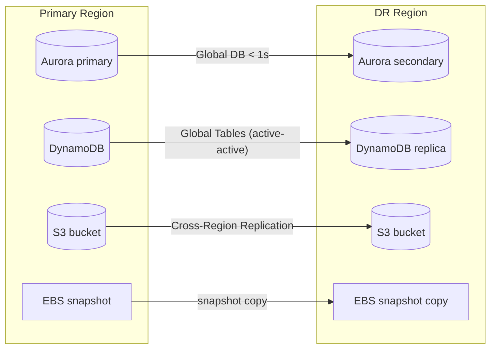
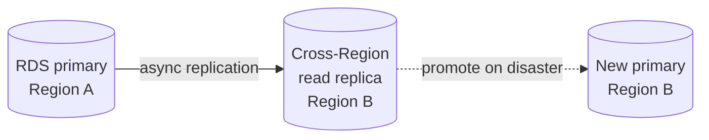
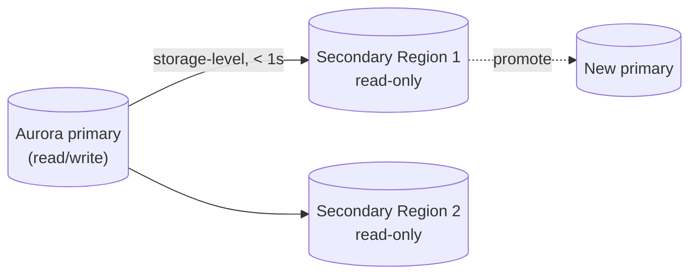
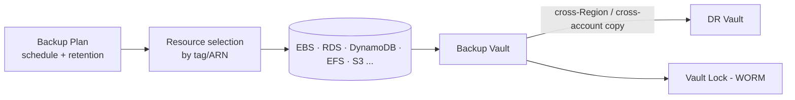

# Cross-Region, Backup & Data Replication - SAA-C03 Deep Dive

> The data layer of DR: how each AWS service replicates and backs up across AZs and Regions. Aurora Global Database, DynamoDB Global Tables, RDS cross-Region replicas & snapshot copy, S3 replication, EBS/AMI snapshot copy, EFS replication, and AWS Backup for centralised, policy-driven, cross-account protection.

See also: [00 - DR & HA Overview & Exam Guide](00%20-%20DR%20%26%20HA%20Overview%20%26%20Exam%20Guide.md) · [03 - The Four DR Strategies](03%20-%20The%20Four%20DR%20Strategies.md) · [02 - High Availability Building Blocks](02%20-%20High%20Availability%20Building%20Blocks.md) · [06 - DR & HA Troubleshooting (SRE)](06%20-%20DR%20%26%20HA%20Troubleshooting%20%28SRE%29.md) · [01 - RDS Intro & Core Concepts](01%20-%20RDS%20Intro%20%26%20Core%20Concepts.md) · [01 - Aurora Intro & Core Concepts](01%20-%20Aurora%20Intro%20%26%20Core%20Concepts.md) · [01 - DynamoDB Intro & Core Concepts](01%20-%20DynamoDB%20Intro%20%26%20Core%20Concepts.md)

---

## Table of Contents

- [Replication Concepts Sync vs Async](#replication-concepts-sync-vs-async)
- [RDS Cross-Region DR](#rds-cross-region-dr)
- [Aurora Global Database](#aurora-global-database)
- [DynamoDB Global Tables](#dynamodb-global-tables)
- [S3 Replication CRR and SRR](#s3-replication-crr-and-srr)
- [EBS Snapshots and AMI Copy](#ebs-snapshots-and-ami-copy)
- [EFS and FSx Replication](#efs-and-fsx-replication)
- [ElastiCache Global Datastore](#elasticache-global-datastore)
- [AWS Backup](#aws-backup)
- [Choosing a Data DR Mechanism](#choosing-a-data-dr-mechanism)
- [Exam Pitfalls](#exam-pitfalls)

---

---

## Replication Concepts Sync vs Async

|                  | Synchronous                                            | Asynchronous                                       |
| :--------------- | :----------------------------------------------------- | :------------------------------------------------- |
| **How**          | Write acknowledged only after the replica also commits | Write acknowledged immediately; replica catches up |
| **RPO**          | Zero (no data loss)                                    | Small lag (seconds–minutes)                        |
| **Latency cost** | Higher write latency                                   | Low write latency                                  |
| **Distance**     | Short (same Region/AZ)                                 | Works across Regions                               |
| **Example**      | RDS Multi-AZ standby                                   | RDS read replicas, Aurora Global DB, S3 CRR        |

> [!tip] Exam Tip
> **Synchronous = RPO 0 but only practical within a Region** (latency). **Cross-Region replication is asynchronous**, so there's always a small RPO. "RPO must be zero across Regions" is essentially impossible with standard replication — the closest is Aurora Global DB (~1s) or active-active designs.

[⬆ Back to top](#table-of-contents)

---

## RDS Cross-Region DR

Two main options for relational DR with RDS (non-Aurora):

1. **Cross-Region read replica** — asynchronous replica in another Region. On disaster, **promote** it to a standalone primary (it becomes writable). RTO = promotion time; RPO = replication lag.
2. **Automated/manual snapshot copy** — copy snapshots to the DR Region; restore on disaster. Cheaper, slower (Backup & Restore style).

> [!tip] Exam Tip
> RDS cross-Region **read replica** = lower RTO/RPO DR you can also use for reads; **promote** it on failover. Snapshot copy = cheapest DR. Remember **Multi-AZ is in-Region HA**, not DR — for Region-level DR you need cross-Region replica or snapshot copy.

[⬆ Back to top](#table-of-contents)

---

## Aurora Global Database

Purpose-built for low-RPO, low-RTO relational DR and global reads.

- **One primary Region** (read/write) replicates to **up to 5 secondary Regions** (read-only) with typical lag **< 1 second**.
- Replication uses Aurora's storage layer (not the DB engine), so it adds **negligible** load on the primary.
- **Managed planned failover** and **unplanned cross-Region failover**: promote a secondary to primary, typically **RTO < 1 minute**.
- Secondaries serve **low-latency local reads** for global users.

> [!tip] Exam Tip
> "Relational database, **cross-Region DR with RPO ~1 second and fast failover**, plus **global low-latency reads**" → **Aurora Global Database**. It beats RDS cross-Region read replicas on lag, failover speed, and primary overhead.

[⬆ Back to top](#table-of-contents)

---

## DynamoDB Global Tables

The NoSQL active-active multi-Region answer.

- **Multi-Region, multi-active**: every replica Region is **read AND write**, kept in sync with **asynchronous replication** (typically sub-second).
- **Last-writer-wins** conflict resolution.
- Underpins **Multi-Site Active/Active** DR with **near-zero RTO/RPO** for NoSQL workloads.
- Requires DynamoDB **Streams** enabled.

> [!tip] Exam Tip
> "Multi-Region **active-active**", "global app, write in any Region", "near-zero RTO/RPO NoSQL" → **DynamoDB Global Tables**. Contrast with Aurora Global DB, which is **single-writer** (one primary Region) — only DynamoDB Global Tables gives true multi-Region writes out of the box.

[⬆ Back to top](#table-of-contents)

---

## S3 Replication CRR and SRR

- **Cross-Region Replication (CRR):** async copy of objects to a bucket in **another Region** — DR, lower-latency global access, compliance/residency.
- **Same-Region Replication (SRR):** copy within the **same Region** — log aggregation, prod→test data, compliance separation.

Facts that matter:

- Replication is **asynchronous** and applies to **new objects after it's enabled** (use **S3 Batch Replication** for existing objects).
- Requires **versioning enabled** on both buckets.
- Can replicate to a **different account** and change ownership/storage class.
- Does **not** replicate deletes-of-delete-markers by default; can replicate KMS-encrypted objects (with config).

> [!tip] Exam Tip
> "Protect S3 objects from a **Region failure**" or "serve the same objects with low latency in another Region" → **CRR** (+ versioning). For existing objects, you need **S3 Batch Replication**. 11-nines durability already covers AZ-level loss within a Region.

[⬆ Back to top](#table-of-contents)

---

## EBS Snapshots and AMI Copy

- **EBS snapshots** are stored in **S3** (Region-durable) and are **incremental**.
- **Copy snapshots cross-Region** (and cross-account) for DR; **copy AMIs cross-Region** so you can launch instances in the DR Region.
- Automate with **Data Lifecycle Manager (DLM)** or **AWS Backup**.

> [!tip] Exam Tip
> EBS snapshot + AMI **cross-Region copy** is the compute/storage half of a **Backup & Restore** or **Pilot Light** DR plan — you need the AMI in the DR Region to launch instances there.

[⬆ Back to top](#table-of-contents)

---

## EFS and FSx Replication

- **EFS Replication:** creates and maintains a read-only replica of a file system in another Region (or same Region), with RPO typically minutes.
- **FSx:** supports backups and, for some file system types, cross-Region copy/replication for DR.

> [!tip] Exam Tip
> Shared file system needing cross-Region DR → **EFS Replication**. EFS Standard is already multi-AZ within a Region for HA.

[⬆ Back to top](#table-of-contents)

---

## ElastiCache Global Datastore

- **Redis Global Datastore:** cross-Region replication of a Redis cluster — fast local reads in secondary Regions and DR with promotion of a secondary.
- Memcached has **no** replication (not for DR).

> [!tip] Exam Tip
> Cross-Region Redis for DR or global low-latency reads → **Global Datastore**. If a question needs cache **persistence/replication/failover**, the answer is **Redis**, never Memcached.

[⬆ Back to top](#table-of-contents)

---

## AWS Backup

A **centralised, policy-driven** backup service across many AWS services — the exam's go-to for "manage backups in one place / enforce backup compliance."

- **Supported sources:** EBS, EC2/AMI, RDS, Aurora, DynamoDB, EFS, FSx, Storage Gateway, S3, and more.
- **Backup plans:** define **frequency**, **retention/lifecycle** (transition to cold storage), and **backup windows** centrally.
- **Cross-Region and cross-account copy** for DR and isolation.
- **Backup Vault Lock (WORM)** for immutable, compliance-grade backups that even admins/root cannot delete during the retention period.
- Tag-based resource selection for org-wide coverage; integrates with **AWS Organizations** for cross-account policies.

> [!tip] Exam Tip
> "**Centralised**, **automated**, **policy-based** backups across multiple services / accounts, with compliance retention" → **AWS Backup**. For **immutable / can't-be-deleted** backups → **Backup Vault Lock (WORM)**. For cross-Region DR copies → AWS Backup **cross-Region copy**.

[⬆ Back to top](#table-of-contents)

---

## Choosing a Data DR Mechanism

| Data store                 | In-Region HA               | Cross-Region DR mechanism                           |
| :------------------------- | :------------------------- | :-------------------------------------------------- |
| **RDS**                    | Multi-AZ                   | Cross-Region read replica (promote) / snapshot copy |
| **Aurora**                 | 6 copies / 3 AZs           | **Global Database** (< 1s, < 1 min RTO)             |
| **DynamoDB**               | 3 AZs (automatic)          | **Global Tables** (active-active)                   |
| **S3**                     | ≥3 AZs (Standard)          | **Cross-Region Replication**                        |
| **EBS**                    | Single AZ (snapshot to S3) | Snapshot **cross-Region copy**                      |
| **EFS**                    | Multi-AZ (Standard)        | **EFS Replication**                                 |
| **ElastiCache Redis**      | Multi-AZ failover          | **Global Datastore**                                |
| **Anything (centralised)** | —                          | **AWS Backup** + cross-Region/account copy          |

[⬆ Back to top](#table-of-contents)

---

## Exam Pitfalls

- Expecting **zero RPO across Regions** — cross-Region replication is **async**; closest is Aurora Global DB (~1s) or active-active.
- Forgetting **S3 replication needs versioning** and only covers **new** objects (existing → **Batch Replication**).
- Confusing **Aurora Global DB (single-writer)** with **DynamoDB Global Tables (multi-writer/active-active)**.
- Treating **Multi-AZ** as DR — it's in-Region **HA**; Region-level DR needs cross-Region replication.
- Using **Memcached** where replication/DR is required (use **Redis**).
- Not copying the **AMI** to the DR Region — you can't launch the recovered app tier without it.

[⬆ Back to top](#table-of-contents)
