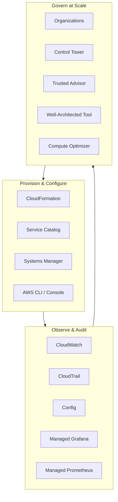

# Management & Governance - SAA-C03 Section Overview

> The Management & Governance domain is about **operating, observing, and controlling** AWS at scale: provisioning resources (CloudFormation, Service Catalog), observing them (CloudWatch, CloudTrail, Config, Grafana, Prometheus), and governing them across many accounts (Organizations, Control Tower, Trusted Advisor, Well-Architected). It maps mostly to SAA-C03 **Domain 1 (Secure Architectures)** and **Domain 2 (Resilient Architectures)** plus the Operational-Excellence pillar.

See also: [06 - IAM Identity Center & Organizations](06%20-%20IAM%20Identity%20Center%20%26%20Organizations.md) · [07 - AWS Control Tower](07%20-%20AWS%20Control%20Tower.md) · [24 - AWS Config & Audit Manager](24%20-%20AWS%20Config%20%26%20Audit%20Manager.md) · [01 - AWS Budgets Fundamentals & Architecture](01%20-%20AWS%20Budgets%20Fundamentals%20%26%20Architecture.md) · [01 - Cost Explorer Fundamentals & Architecture](01%20-%20Cost%20Explorer%20Fundamentals%20%26%20Architecture.md)

---

## Table of Contents

- [How This Section Is Organised](#how-this-section-is-organised)
- [The Four-File Pattern Per Service](#the-four-file-pattern-per-service)
- [Service Index](#service-index)
- [Mental Model: Provision, Observe, Govern](#mental-model-provision-observe-govern)
- [Cross-Domain Links](#cross-domain-links)

---

---

## How This Section Is Organised

Each service lives in its own numbered folder. Services that are already documented in depth elsewhere in the vault (to avoid divergence) are **cross-link stubs** pointing at the canonical note:

| Service           | Canonical note                                                            |
| :---------------- | :------------------------------------------------------------------------ |
| AWS Config        | [24 - AWS Config & Audit Manager](24%20-%20AWS%20Config%20%26%20Audit%20Manager.md) (02-IAM-Security)                     |
| AWS Control Tower | [07 - AWS Control Tower](07%20-%20AWS%20Control%20Tower.md) (02-IAM-Security)                              |
| AWS Organizations | [06 - IAM Identity Center & Organizations](06%20-%20IAM%20Identity%20Center%20%26%20Organizations.md) (02-IAM-Security)            |
| AWS Budgets       | [01 - AWS Budgets Fundamentals & Architecture](01%20-%20AWS%20Budgets%20Fundamentals%20%26%20Architecture.md) (09-Cost-Optimization)   |
| Cost Explorer     | [01 - Cost Explorer Fundamentals & Architecture](01%20-%20Cost%20Explorer%20Fundamentals%20%26%20Architecture.md) (09-Cost-Optimization) |

[⬆ Back to top](#table-of-contents)

---

## The Four-File Pattern Per Service

Every fully-documented service folder contains four files. This keeps each file focused and readable while preserving the full 18-point depth requirement across the set.

| File                        | Covers                                                                                                                                                            |
| :-------------------------- | :---------------------------------------------------------------------------------------------------------------------------------------------------------------- |
| `01 - … Intro bits & bytes` | Service overview, the problem it solves, when/when-not to use, alternatives, core concepts, foundational architecture, cost intro                                 |
| `02 - … Deep Dive`          | Detailed architecture, control vs data plane, internal components, integration matrix, security, monitoring, limits & quotas, service comparisons, best practices |
| `03 - … Exam Scenarios`     | SAA-C03 exam focus, keywords, distractors, elimination technique, **20 medium + 10 hard** scenario questions with full explanations                               |
| `04 - … SRE Operations`     | Common errors, troubleshooting workflows, runbooks, real CLI/CloudFormation/IAM examples, production patterns, cost-optimization operations                       |

[⬆ Back to top](#table-of-contents)

---

## Service Index

| #   | Service                                                                                                  | Status                                                    | Primary exam angle                        |
| :-- | :------------------------------------------------------------------------------------------------------- | :-------------------------------------------------------- | :---------------------------------------- |
| 01  | [AWS Auto Scaling](01%20-%20AWS%20Auto%20Scaling%20Intro%20bits%20%26%20bytes.md)                                           | Full                                                      | Elasticity, resilience, cost              |
| 02  | [AWS CLI](01%20-%20AWS%20CLI%20Intro%20bits%20%26%20bytes.md)                                                             | Full                                                      | Automation, credentials, scripting        |
| 03  | [AWS CloudFormation](01%20-%20AWS%20CloudFormation%20Intro%20bits%20%26%20bytes.md)                                       | Full                                                      | IaC, drift, StackSets, multi-account      |
| 04  | [AWS CloudTrail](01%20-%20AWS%20CloudTrail%20Intro%20bits%20%26%20bytes.md)                                               | Full                                                      | Audit, security, governance               |
| 05  | [Amazon CloudWatch](01%20-%20Amazon%20CloudWatch%20Intro%20bits%20%26%20bytes.md)                                         | Full                                                      | Metrics, logs, alarms, dashboards         |
| 06  | [AWS Compute Optimizer](01%20-%20AWS%20Compute%20Optimizer%20Intro%20bits%20%26%20bytes.md)                                 | Full                                                      | Right-sizing, cost                        |
| 07  | AWS Config                                                                                               | Stub → [24 - AWS Config & Audit Manager](24%20-%20AWS%20Config%20%26%20Audit%20Manager.md)                | Compliance, configuration history         |
| 08  | AWS Control Tower                                                                                        | Stub → [07 - AWS Control Tower](07%20-%20AWS%20Control%20Tower.md)                         | Landing zone, guardrails                  |
| 09  | [AWS Health Dashboard](01%20-%20AWS%20Health%20Dashboard%20Intro%20bits%20%26%20bytes.md)                                   | Full                                                      | Operational events, planned changes       |
| 10  | [AWS License Manager](01%20-%20AWS%20License%20Manager%20Intro%20bits%20%26%20bytes.md)                                     | Full                                                      | BYOL, license compliance                  |
| 11  | [Amazon Managed Grafana](01%20-%20Amazon%20Managed%20Grafana%20Intro%20bits%20%26%20bytes.md)                               | Full                                                      | Visualisation, multi-source dashboards    |
| 12  | [Amazon Managed Service for Prometheus](01%20-%20Amazon%20Managed%20Service%20for%20Prometheus%20Intro%20bits%20%26%20bytes.md) | Full                                                      | Container/metrics monitoring              |
| 13  | [AWS Management Console](01%20-%20AWS%20Management%20Console%20Intro%20bits%20%26%20bytes.md)                               | Full                                                      | Access, federation, mobile                |
| 14  | AWS Organizations                                                                                        | Stub → [06 - IAM Identity Center & Organizations](06%20-%20IAM%20Identity%20Center%20%26%20Organizations.md)       | Multi-account, SCPs, consolidated billing |
| 15  | [AWS Service Catalog](01%20-%20AWS%20Service%20Catalog%20Intro%20bits%20%26%20bytes.md)                                     | Full                                                      | Self-service, standardisation             |
| 16  | [AWS Systems Manager](01%20-%20AWS%20Systems%20Manager%20Intro%20bits%20%26%20bytes.md)                                     | Full                                                      | Patch, Session Manager, Parameter Store   |
| 17  | [AWS Trusted Advisor](01%20-%20AWS%20Trusted%20Advisor%20Intro%20bits%20%26%20bytes.md)                                     | Full                                                      | Best-practice checks, cost, limits        |
| 18  | [AWS Well-Architected Tool](01%20-%20AWS%20Well-Architected%20Tool%20Intro%20bits%20%26%20bytes.md)                         | Full                                                      | Reviews, pillars, remediation             |
| 19  | AWS Budgets                                                                                              | Stub → [01 - AWS Budgets Fundamentals & Architecture](01%20-%20AWS%20Budgets%20Fundamentals%20%26%20Architecture.md)   | Cost alerts, budget actions               |
| 20  | Cost Explorer                                                                                            | Stub → [01 - Cost Explorer Fundamentals & Architecture](01%20-%20Cost%20Explorer%20Fundamentals%20%26%20Architecture.md) | Cost analysis, RI/SP recommendations      |
| 21  | [AWS Billing Dashboard](01%20-%20AWS%20Billing%20Dashboard%20Intro%20bits%20%26%20bytes.md)                                 | Full                                                      | Consolidated billing, cost allocation     |
| 22  | [AWS Resource Groups](01%20-%20AWS%20Resource%20Groups%20Intro%20bits%20%26%20bytes.md)                                     | Full                                                      | Tag-based grouping, bulk operations       |
| 23  | [AWS Tagging Strategies](01%20-%20AWS%20Tagging%20Strategies%20Intro%20bits%20%26%20bytes.md)                               | Full                                                      | Cost allocation, ABAC, automation         |
| 24  | [AWS Service Quotas](01%20-%20AWS%20Service%20Quotas%20Intro%20bits%20%26%20bytes.md)                                       | Full                                                      | Limits, quota increases                   |
| 25  | [AWS Account Factory & Landing Zone](01%20-%20AWS%20Account%20Factory%20and%20Landing%20Zone%20Intro%20bits%20%26%20bytes.md)     | Full                                                      | Account vending, multi-account baseline   |
| 26  | [AWS Backup](01%20-%20AWS%20Backup%20Intro%20bits%20%26%20bytes.md)                                                       | Full                                                      | Centralised backup, compliance            |
| 27  | [EventBridge Governance Integrations](01%20-%20EventBridge%20Governance%20Integrations%20Intro%20bits%20%26%20bytes.md)     | Full                                                      | Event-driven governance, automation       |

[⬆ Back to top](#table-of-contents)

---

## Mental Model: Provision, Observe, Govern

A clean way to remember the whole domain for the exam — almost every service falls into one of three verbs:

- **Provision / Configure** — _get resources into a known-good state_: CloudFormation (declarative IaC), Service Catalog (curated products), Systems Manager (run commands, patch, parameters), CLI/Console (the access surface).
- **Observe / Audit** — _know what is happening and what happened_: CloudWatch (metrics/logs/alarms = "is it healthy?"), CloudTrail (API audit = "who did what?"), Config (configuration history & compliance = "is it compliant and how did it change?"), Managed Grafana/Prometheus (open-source observability stack).
- **Govern at Scale** — _enforce policy across many accounts_: Organizations (the account container + SCPs), Control Tower (opinionated landing zone on top of Organizations), Trusted Advisor & Well-Architected Tool (best-practice posture), Compute Optimizer (right-sizing posture).

> Exam shortcut: **"Who did what" → CloudTrail. "Is it configured correctly / did it change" → Config. "Is it healthy / performing" → CloudWatch.** This single distinction resolves a large fraction of governance questions.

[⬆ Back to top](#table-of-contents)

---

## Cross-Domain Links

- Security governance: [08 - SCP](08%20-%20SCP.md) · [09 - RCP](09%20-%20RCP.md) · [10 - Declarative Policies](10%20-%20Declarative%20Policies.md) · [11 - Permissions Boundaries](11%20-%20Permissions%20Boundaries.md) · [25 - GuardDuty Inspector Macie Security Hub](25%20-%20GuardDuty%20Inspector%20Macie%20Security%20Hub.md)
- Cost governance: [01 - AWS Budgets Fundamentals & Architecture](01%20-%20AWS%20Budgets%20Fundamentals%20%26%20Architecture.md) · [01 - CUR Fundamentals & Architecture](01%20-%20CUR%20Fundamentals%20%26%20Architecture.md) · [01 - Cost Explorer Fundamentals & Architecture](01%20-%20Cost%20Explorer%20Fundamentals%20%26%20Architecture.md) · [01 - Savings Plans Fundamentals & Architecture](01%20-%20Savings%20Plans%20Fundamentals%20%26%20Architecture.md)
- Automation surface: [01 - AWS Systems Manager Intro bits & bytes](01%20-%20AWS%20Systems%20Manager%20Intro%20bits%20%26%20bytes.md) (this section)

[⬆ Back to top](#table-of-contents)
