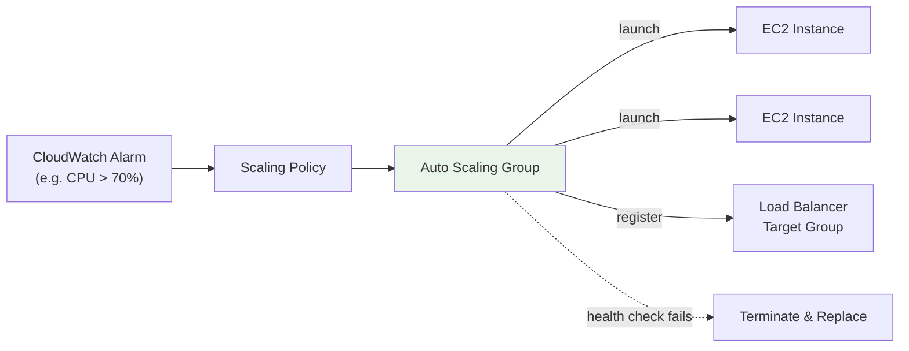
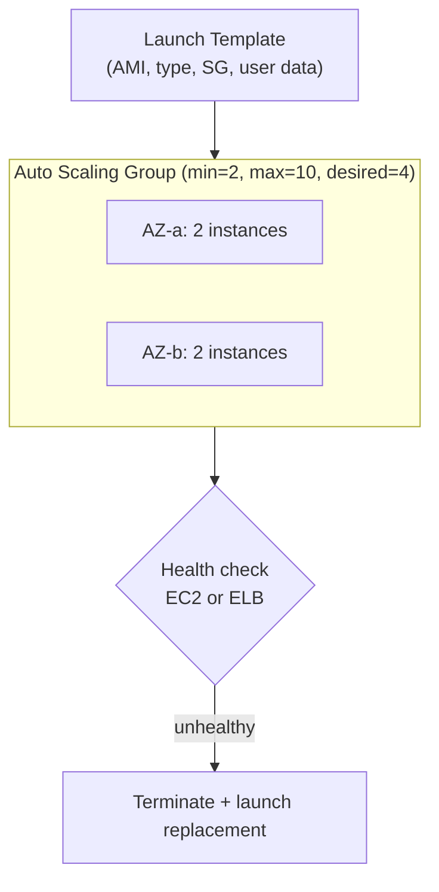

# AWS Auto Scaling - Intro bits & bytes

> Auto Scaling is how AWS adds and removes capacity **automatically** so an application has _enough_ resources to stay healthy under load, and _not more_ than it needs when load drops. It is the backbone of both **elasticity** (a cost lever) and **resilience** (a reliability lever) on the exam.

See also: [02 - AWS Auto Scaling Deep Dive](02%20-%20AWS%20Auto%20Scaling%20Deep%20Dive.md) · [03 - AWS Auto Scaling Exam Scenarios](03%20-%20AWS%20Auto%20Scaling%20Exam%20Scenarios.md) · [04 - AWS Auto Scaling SRE Operations](04%20-%20AWS%20Auto%20Scaling%20SRE%20Operations.md) · [01 - Amazon CloudWatch Intro bits & bytes](01%20-%20Amazon%20CloudWatch%20Intro%20bits%20%26%20bytes.md) · [01 - AWS Compute Optimizer Intro bits & bytes](01%20-%20AWS%20Compute%20Optimizer%20Intro%20bits%20%26%20bytes.md)

---

## Table of Contents

- [1. The Problem Auto Scaling Solves](#1-the-problem-auto-scaling-solves)
- [2. The Two Things Called "Auto Scaling"](#2-the-two-things-called-auto-scaling)
- [3. Core Building Blocks of an EC2 ASG](#3-core-building-blocks-of-an-ec2-asg)
- [4. The Four Scaling Policy Types](#4-the-four-scaling-policy-types)
- [5. When To Use It / When NOT To Use It](#5-when-to-use-it--when-not-to-use-it)
- [6. Alternatives and Where Auto Scaling Fits](#6-alternatives-and-where-auto-scaling-fits)
- [7. Cost Considerations (Intro)](#7-cost-considerations-intro)
- [8. Mini-Quiz](#8-mini-quiz)

---

---

## 1. The Problem Auto Scaling Solves

Before Auto Scaling, you sized servers for **peak** load and paid for that peak 24/7. Two bad outcomes followed:

- **Over-provisioning** — you pay for idle capacity at 3 AM when nobody is using the app.
- **Under-provisioning** — a traffic spike (a marketing email, a sale, a viral post) overwhelms fixed capacity and the app falls over.

Auto Scaling fixes both by tying capacity to **demand signals** (metrics like CPU, request count, or a queue depth). It also solves a _reliability_ problem that has nothing to do with load: if an instance dies, Auto Scaling notices the failed health check and **replaces it automatically**, keeping you at your desired count.

> Two jobs, one service: **match capacity to demand** (elasticity) **and keep capacity healthy** (self-healing). Many exam questions hinge on the second job, not the first.

[⬆ Back to top](#table-of-contents)

---

## 2. The Two Things Called "Auto Scaling"

AWS confusingly uses "Auto Scaling" for two related-but-different products. Knowing the difference is worth easy exam points.

|                  | **EC2 Auto Scaling**                                    | **AWS Auto Scaling** (the unified service)                                                  |
| :--------------- | :------------------------------------------------------ | :------------------------------------------------------------------------------------------ |
| Scope            | EC2 instances only, via an **Auto Scaling Group (ASG)** | Multiple resource types from one place                                                      |
| Manages          | ASGs                                                    | EC2 ASGs, ECS services, DynamoDB tables/indexes, Aurora replicas, Spot Fleets               |
| Headline feature | The classic ASG + scaling policies                      | **Predictive scaling** and **unified target-tracking** across resources via _scaling plans_ |
| Exam framing     | "scale my web tier"                                     | "scale a whole application's resources together"                                            |

Most SAA-C03 questions mean **EC2 Auto Scaling Groups**. Application Auto Scaling (DynamoDB/ECS/Aurora) shows up in those service-specific questions.

[⬆ Back to top](#table-of-contents)

---

## 3. Core Building Blocks of an EC2 ASG

An Auto Scaling Group is defined by a small set of mandatory pieces:

- **Launch Template** (modern) or **Launch Configuration** (legacy, do not pick on the exam) — the "recipe" for each instance: AMI, instance type, key pair, security groups, user data, IAM instance profile. Launch Templates support **versioning** and **mixed instances / multiple instance types**; Launch Configurations are immutable and being deprecated.
- **Min / Max / Desired capacity** — the floor, ceiling, and current target instance count. Scaling never goes below min or above max.
- **Subnets / Availability Zones** — the ASG launches across the AZs/subnets you give it and tries to keep them **balanced**.
- **Health checks** — `EC2` (is the instance running?) or `ELB` (does the load balancer think it's healthy?). Use **ELB health checks** when behind a load balancer so a hung-but-running instance gets replaced.
- **Scaling policies** — the rules that change desired capacity (see next section).

[⬆ Back to top](#table-of-contents)

---

## 4. The Four Scaling Policy Types

| Policy type            | How it decides                                       | Best for                                             | Exam keyword                |
| :--------------------- | :--------------------------------------------------- | :--------------------------------------------------- | :-------------------------- |
| **Target tracking**    | Keep a metric at a target value (e.g. avg CPU = 50%) | Most workloads; simplest to reason about             | "maintain", "keep at"       |
| **Step scaling**       | Add/remove N instances per alarm breach size         | Fine-grained, multi-step reactions to big swings     | "add more as it gets worse" |
| **Simple scaling**     | One adjustment per alarm, then a cooldown            | Legacy; avoid — superseded by step scaling           | (older docs)                |
| **Scheduled scaling**  | Change capacity at a known time                      | Predictable, time-based load (business hours, batch) | "every weekday at 9 AM"     |
| **Predictive scaling** | ML forecasts load and pre-scales                     | Cyclical load where reactive scaling lags            | "forecast", "pre-emptively" |

> Default to **target tracking** unless the scenario gives a reason not to. **Scheduled** wins when the trigger is a _clock_, not a _metric_. **Predictive** wins when the load is _cyclical_ and you must scale _before_ the spike, not after.

[⬆ Back to top](#table-of-contents)

---

## 5. When To Use It / When NOT To Use It

**Use it when:**

- Load varies over time and you want to pay only for what you need.
- You need self-healing: automatic replacement of failed instances.
- You want zero-downtime deployments via instance refresh / rolling replacement.
- You run a fleet behind an ELB and want capacity to track request volume.

**Do NOT reach for EC2 Auto Scaling when:**

- The workload is **serverless** — Lambda and Fargate scale themselves; there is no ASG to manage. (Fargate-on-ECS uses _Application_ Auto Scaling, not an EC2 ASG.)
- You need a **single, always-on, stateful** server with a fixed identity (a legacy license-bound app). An ASG of 1 still gives self-healing, but stateful identity needs care (EIP/ENI re-attach, EBS).
- Demand is perfectly flat — scaling adds complexity with no benefit; a Reserved Instance or Savings Plan on fixed capacity is cheaper to operate.

[⬆ Back to top](#table-of-contents)

---

## 6. Alternatives and Where Auto Scaling Fits

| Need                        | EC2 Auto Scaling                | Alternative                                                                                                                          |
| :-------------------------- | :------------------------------ | :----------------------------------------------------------------------------------------------------------------------------------- |
| Scale containers            | Capacity provider backed by ASG | **ECS Service Auto Scaling** / **Fargate** (no servers)                                                                              |
| Scale functions             | n/a                             | **Lambda** (concurrency scales automatically)                                                                                        |
| Scale a database            | n/a                             | **DynamoDB auto scaling**, **Aurora Auto Scaling** (read replicas)                                                                   |
| Right-size, not scale       | n/a                             | [Compute Optimizer](01%20-%20AWS%20Compute%20Optimizer%20Intro%20bits%20%26%20bytes.md) recommends a better instance type; Auto Scaling changes _count_ |
| Global traffic distribution | n/a                             | Route 53 / Global Accelerator route; ASG provides the capacity behind them                                                           |

Key distinction the exam tests: **Auto Scaling changes how _many_ instances; Compute Optimizer changes how _big_ each instance is.** They complement each other.

[⬆ Back to top](#table-of-contents)

---

## 7. Cost Considerations (Intro)

- **The ASG itself is free.** You pay only for the EC2 instances, EBS volumes, and data transfer it creates.
- Scaling **in** (removing instances) is the primary cost lever — make sure your scale-in policy is not too timid.
- Combine with **Spot Instances** in a mixed-instances ASG to cut compute cost up to ~90% for fault-tolerant tiers; keep a baseline of On-Demand for stability.
- **Predictive + scheduled** scaling avoids the "scale up too late, then over-provision to compensate" pattern that quietly wastes money.
- A too-aggressive scale-out with a too-timid scale-in is the classic hidden cost. See [04 - AWS Auto Scaling SRE Operations](04%20-%20AWS%20Auto%20Scaling%20SRE%20Operations.md) for tuning.

[⬆ Back to top](#table-of-contents)

---

## 8. Mini-Quiz

**Q1:** An instance is "running" (EC2 health OK) but the application has hung and returns 500s. With default `EC2` health checks, does the ASG replace it?
_A:_ **No.** EC2 health checks only see the hypervisor/instance state. Switch to **ELB health checks** so the load balancer's view of health drives replacement.

**Q2:** Load is predictable — heavy 9 AM–6 PM weekdays, near-zero overnight. Cheapest correct policy?
_A:_ **Scheduled scaling** (clock-driven). Optionally pair with target tracking as a safety net for unexpected spikes.

**Q3:** You need capacity to grow _before_ a daily traffic wave, not after CPU climbs. Which policy?
_A:_ **Predictive scaling** — it forecasts and pre-scales.

**Q4:** What's the difference between Auto Scaling and Compute Optimizer?
_A:_ Auto Scaling changes the **number** of instances; Compute Optimizer recommends a better **size/type** for each instance.

---

> Continue to [02 - AWS Auto Scaling Deep Dive](02%20-%20AWS%20Auto%20Scaling%20Deep%20Dive.md) for architecture, internals, integrations, limits, and best practices.
