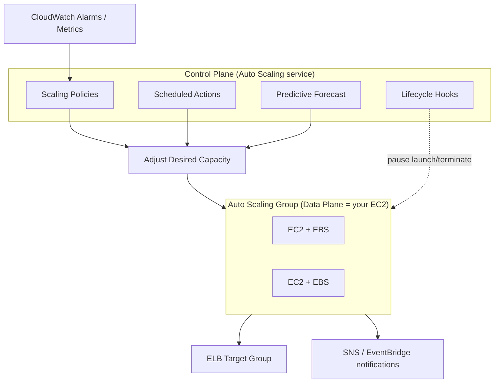
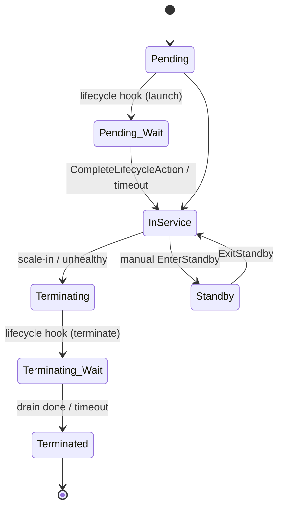

# AWS Auto Scaling - Deep Dive

> Architecture, control vs data plane, lifecycle hooks, termination policies, integration matrix, limits, comparisons, and best practices for EC2 Auto Scaling Groups and Application Auto Scaling.

See also: [01 - AWS Auto Scaling Intro bits & bytes](01%20-%20AWS%20Auto%20Scaling%20Intro%20bits%20%26%20bytes.md) · [03 - AWS Auto Scaling Exam Scenarios](03%20-%20AWS%20Auto%20Scaling%20Exam%20Scenarios.md) · [04 - AWS Auto Scaling SRE Operations](04%20-%20AWS%20Auto%20Scaling%20SRE%20Operations.md) · [01 - Amazon CloudWatch Intro bits & bytes](01%20-%20Amazon%20CloudWatch%20Intro%20bits%20%26%20bytes.md) · [01 - ELB Fundamentals & Types](01%20-%20ELB%20Fundamentals%20%26%20Types.md)

---

## Table of Contents

- [1. Architecture End-to-End](#1-architecture-end-to-end)
- [2. Control Plane vs Data Plane](#2-control-plane-vs-data-plane)
- [3. The Instance Lifecycle and Lifecycle Hooks](#3-the-instance-lifecycle-and-lifecycle-hooks)
- [4. Termination Policies (Who Dies First)](#4-termination-policies-who-dies-first)
- [5. Health Checks, Cooldowns, and Warm-Up](#5-health-checks-cooldowns-and-warm-up)
- [6. Instance Refresh and Mixed Instances](#6-instance-refresh-and-mixed-instances)
- [7. Regional and Multi-AZ Behaviour](#7-regional-and-multi-az-behaviour)
- [8. Service Limits and Quotas](#8-service-limits-and-quotas)
- [9. Integration Matrix](#9-integration-matrix)
- [10. Service Comparisons](#10-service-comparisons)
- [11. Best Practices by Well-Architected Pillar](#11-best-practices-by-well-architected-pillar)

---

---

## 1. Architecture End-to-End

A complete elastic tier wires together five layers:

1. **CloudWatch** publishes metrics (CPU, `RequestCountPerTarget`, custom metrics, or a queue's `ApproximateNumberOfMessages`).
2. A **scaling policy** (or scheduled/predictive action) reads those metrics and decides a new **desired capacity**.
3. The **ASG** reconciles actual instance count toward desired, launching from a **Launch Template** or terminating per the **termination policy**.
4. New instances **register** with an **ELB target group**; the ELB only routes once they pass health checks.
5. **Lifecycle hooks** can pause an instance in `Pending:Wait` or `Terminating:Wait` so you can bootstrap or drain it gracefully.

The crucial mental model: an ASG is a **reconciliation loop**. You declare _desired_; the service continuously makes _actual_ match it — that is what gives you both elasticity and self-healing from the same mechanism.

[⬆ Back to top](#table-of-contents)

---

## 2. Control Plane vs Data Plane

| Plane             | What it is                                                                                                                                    | Failure behaviour                                                                                                              |
| :---------------- | :-------------------------------------------------------------------------------------------------------------------------------------------- | :----------------------------------------------------------------------------------------------------------------------------- |
| **Control plane** | The Auto Scaling service itself: evaluating policies, calling `RunInstances`/`TerminateInstances`, managing desired capacity, lifecycle hooks | Regional AWS-managed service; if the control plane is impaired, _existing_ instances keep running — only scaling actions pause |
| **Data plane**    | Your EC2 instances + EBS + the ENIs serving traffic                                                                                           | This is what actually serves users; survives control-plane blips                                                               |

Exam-relevant consequence: **a running ASG keeps serving traffic even if scaling actions are temporarily unavailable.** Auto Scaling is not in the request path — it manages capacity out-of-band.

[⬆ Back to top](#table-of-contents)

---

## 3. The Instance Lifecycle and Lifecycle Hooks

- **Lifecycle hooks** give you a window (default 1 hour, max 48 h) to run custom logic before an instance enters service or is terminated — e.g. install software, pull config, or **drain** connections and ship final logs. You signal completion with `CompleteLifecycleAction`.
- **Standby** lets you pull an instance out of rotation for troubleshooting without the ASG replacing it.
- **Scale-in protection** marks specific instances as "do not terminate on scale-in" — useful for an instance doing long-running work.

[⬆ Back to top](#table-of-contents)

---

## 4. Termination Policies (Who Dies First)

When scaling in, the ASG picks victims using termination policies (evaluated in order):

| Policy                                               | Picks                                                                                     |
| :--------------------------------------------------- | :---------------------------------------------------------------------------------------- |
| `Default`                                            | Balances AZs first, then oldest launch template/config, then closest to next billing hour |
| `OldestInstance` / `NewestInstance`                  | By launch time                                                                            |
| `OldestLaunchTemplate` / `OldestLaunchConfiguration` | Retires instances on stale recipes — good during a migration                              |
| `ClosestToNextInstanceHour`                          | Maximises billing-hour value (legacy, less relevant with per-second billing)              |
| `AllocationStrategy`                                 | For mixed/Spot, keeps the chosen allocation balanced                                      |

> Default behaviour keeps AZs balanced, then kills the oldest configuration — which is exactly what you want during a rolling AMI update.

[⬆ Back to top](#table-of-contents)

---

## 5. Health Checks, Cooldowns, and Warm-Up

- **Health check types:** `EC2` (instance status checks) and `ELB` (target group health). Behind a load balancer, **enable ELB health checks** or hung apps won't be replaced.
- **Health check grace period:** seconds the ASG ignores health checks after launch so the app can boot (set it longer than your boot+warm time, or new instances get killed mid-boot — a classic flapping cause).
- **Cooldown (simple scaling):** a pause after a scaling activity so metrics can stabilise before the next action. Target tracking uses **instance warm-up** instead, which excludes warming instances from the metric aggregation.
- **Default instance warm-up:** the modern, ASG-wide setting that replaces per-policy cooldowns/warm-up for consistent behaviour.

[⬆ Back to top](#table-of-contents)

---

## 6. Instance Refresh and Mixed Instances

- **Instance refresh** performs a rolling replacement of all instances to adopt a new Launch Template version or AMI, with a configurable `MinHealthyPercentage` and optional **checkpoints** and **skip-matching**. This is the supported way to "deploy" a new AMI to an ASG without external tooling.
- **Mixed instances policy** lets one ASG span multiple instance types and combine **On-Demand + Spot** with an allocation strategy (`price-capacity-optimized` is the recommended default for Spot). This is the core pattern for cheap, resilient fleets.
- **Capacity Rebalancing** proactively launches a replacement when a Spot instance gets a two-minute interruption notice.
- **Warm pools** keep pre-initialised, stopped instances ready so scale-out is near-instant for slow-booting apps.

[⬆ Back to top](#table-of-contents)

---

## 7. Regional and Multi-AZ Behaviour

- An ASG is **regional** and spans the **subnets/AZs** you assign. It strives to keep instance counts **balanced across AZs**; if an AZ is impaired, it launches replacements in the healthy AZs.
- **Best practice: span at least 2–3 AZs.** A single-AZ ASG loses the resilience benefit entirely.
- ASGs do **not** span regions. For multi-region elasticity you deploy an ASG per region and route with Route 53 / Global Accelerator.
- AZ rebalancing may briefly run _above_ desired capacity while it relaunches to rebalance — expected, not a bug.

[⬆ Back to top](#table-of-contents)

---

## 8. Service Limits and Quotas

| Limit                            | Default                         | Notes                                                                      |
| :------------------------------- | :------------------------------ | :------------------------------------------------------------------------- |
| Auto Scaling groups per region   | 500                             | Soft (Service Quotas increase)                                             |
| Launch configurations per region | 200                             | Legacy — prefer Launch Templates                                           |
| Scaling policies per ASG         | 50                              | Soft                                                                       |
| Scheduled actions per ASG        | 125                             | Soft                                                                       |
| Lifecycle hooks per ASG          | 50                              | Soft                                                                       |
| Step adjustments per policy      | 20                              | Soft                                                                       |
| Max instances per ASG            | bounded by your EC2/vCPU quotas | The real ceiling is usually your **EC2 On-Demand vCPU quota**, not the ASG |

> Common trap: an ASG "won't scale past N." The ASG limit is rarely the cause — check the **account EC2 vCPU quota** and subnet free IPs first. See [01 - AWS Service Quotas Intro bits & bytes](01%20-%20AWS%20Service%20Quotas%20Intro%20bits%20%26%20bytes.md).

[⬆ Back to top](#table-of-contents)

---

## 9. Integration Matrix

| Service               | How Auto Scaling integrates                                                                 | Why it matters                                                                           |
| :-------------------- | :------------------------------------------------------------------------------------------ | :--------------------------------------------------------------------------------------- |
| **IAM**               | Service-linked role `AWSServiceRoleForAutoScaling`; instance profile in the Launch Template | ASG needs permission to launch/terminate; instances assume their own role                |
| **CloudWatch**        | Source of scaling metrics; ASG also emits group metrics (must be enabled)                   | The decision engine for dynamic scaling                                                  |
| **CloudTrail**        | Logs all ASG API calls (CreateAutoScalingGroup, SetDesiredCapacity…)                        | Audit who changed capacity                                                               |
| **EventBridge**       | ASG lifecycle events (launch/terminate success/fail)                                        | Trigger automation/Lambda on scale events                                                |
| **SNS**               | Notifications on launch/terminate/error                                                     | Human/email alerting                                                                     |
| **ELB/ALB/NLB**       | Target group registration + ELB health checks                                               | Capacity joins/leaves the load balancer automatically                                    |
| **Systems Manager**   | Patch/bootstrap launched instances; Parameter Store for config                              | Fleet management of ASG members → [01 - AWS Systems Manager Intro bits & bytes](01%20-%20AWS%20Systems%20Manager%20Intro%20bits%20%26%20bytes.md)        |
| **Compute Optimizer** | Recommends right-sized types for the ASG                                                    | Pairs count-scaling with size-tuning → [01 - AWS Compute Optimizer Intro bits & bytes](01%20-%20AWS%20Compute%20Optimizer%20Intro%20bits%20%26%20bytes.md) |
| **Spot**              | Mixed instances + capacity rebalancing                                                      | Cost + interruption handling                                                             |

[⬆ Back to top](#table-of-contents)

---

## 10. Service Comparisons

### Auto Scaling vs Compute Optimizer

|                     | Auto Scaling                            | Compute Optimizer               |
| :------------------ | :-------------------------------------- | :------------------------------ |
| Changes             | **Number** of instances                 | **Type/size** of instance       |
| Trigger             | Real-time metrics / schedule / forecast | Periodic ML analysis of history |
| Acts automatically? | Yes                                     | No — it only _recommends_       |

### Target Tracking vs Step vs Scheduled vs Predictive

|                       | Target tracking   | Step                    | Scheduled                | Predictive                    |
| :-------------------- | :---------------- | :---------------------- | :----------------------- | :---------------------------- |
| Decision input        | A metric target   | Alarm breach magnitude  | Clock                    | ML forecast                   |
| Reacts or anticipates | Reacts            | Reacts                  | Anticipates (known time) | Anticipates (learned pattern) |
| Best when             | General workloads | Big, multi-stage swings | Predictable schedule     | Cyclical but variable         |

### ASG vs ECS Service Auto Scaling vs Lambda

|                     | EC2 ASG                | ECS Service AS                       | Lambda                |
| :------------------ | :--------------------- | :----------------------------------- | :-------------------- |
| Unit scaled         | EC2 instances          | Tasks (and capacity providers)       | Concurrent executions |
| You manage servers? | Yes (or via warm pool) | No (Fargate) / Yes (EC2 launch type) | No                    |
| Scaling mechanism   | EC2 Auto Scaling       | Application Auto Scaling             | Built-in concurrency  |

[⬆ Back to top](#table-of-contents)

---

## 11. Best Practices by Well-Architected Pillar

**Operational Excellence**

- Manage ASGs as code (CloudFormation/CDK/Terraform); use **instance refresh** for AMI rollouts.
- Bake AMIs (Image Builder) to cut boot time instead of long user-data scripts.

**Security**

- Attach least-privilege instance profiles via the Launch Template; never embed keys in user data.
- Use IMDSv2-only (`HttpTokens=required`) in the Launch Template.

**Reliability**

- Span **≥2 AZs**; use **ELB health checks**; set a realistic grace period.
- Keep `min` ≥ the count needed to survive one AZ loss.

**Performance Efficiency**

- Prefer **target tracking**; add **predictive** for cyclical load; use **warm pools** for slow boots.

**Cost Optimization**

- Mixed instances with **Spot** for fault-tolerant tiers; ensure scale-in is not too conservative.
- Use scheduled scale-in for known idle windows. See [04 - AWS Auto Scaling SRE Operations](04%20-%20AWS%20Auto%20Scaling%20SRE%20Operations.md).

**Sustainability**

- Right-size with Compute Optimizer and scale in aggressively off-peak to reduce idle capacity.

[⬆ Back to top](#table-of-contents)

---

> Continue to [03 - AWS Auto Scaling Exam Scenarios](03%20-%20AWS%20Auto%20Scaling%20Exam%20Scenarios.md) for exam focus and 30 scenario questions.
