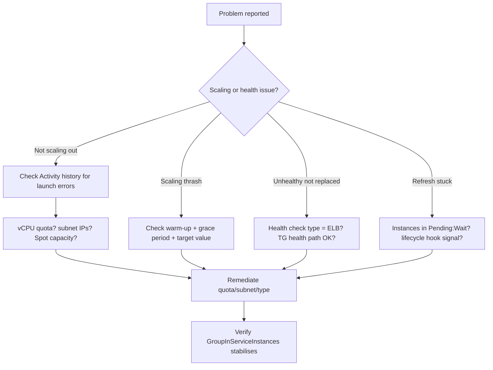

# AWS Auto Scaling - SRE Operations

> Operational reality for Auto Scaling: common failure modes with root cause and fix, a troubleshooting workflow, runbooks, real CLI/CloudFormation/IAM examples, production patterns by org size, and cost-optimization operations.

See also: [01 - AWS Auto Scaling Intro bits & bytes](01%20-%20AWS%20Auto%20Scaling%20Intro%20bits%20%26%20bytes.md) · [02 - AWS Auto Scaling Deep Dive](02%20-%20AWS%20Auto%20Scaling%20Deep%20Dive.md) · [03 - AWS Auto Scaling Exam Scenarios](03%20-%20AWS%20Auto%20Scaling%20Exam%20Scenarios.md) · [01 - Amazon CloudWatch Intro bits & bytes](01%20-%20Amazon%20CloudWatch%20Intro%20bits%20%26%20bytes.md)

---

## Table of Contents

- [1. Common Errors (Symptom → Root Cause → Fix → Prevention)](#1-common-errors-symptom--root-cause--fix--prevention)
- [2. Troubleshooting Workflow](#2-troubleshooting-workflow)
- [3. Key Metrics, Logs, and Events](#3-key-metrics-logs-and-events)
- [4. Runbooks](#4-runbooks)
- [5. Real Examples (CLI / CloudFormation / IAM)](#5-real-examples-cli--cloudformation--iam)
- [6. Production Patterns by Org Size](#6-production-patterns-by-org-size)
- [7. Cost-Optimization Operations](#7-cost-optimization-operations)
- [8. Disaster Recovery Considerations](#8-disaster-recovery-considerations)

---

## 1. Common Errors (Symptom → Root Cause → Fix → Prevention)

### Instances launch then immediately terminate (flapping)

- **Symptom:** Activity history shows repeated launch/terminate cycles minutes apart.
- **Root cause:** Health check grace period shorter than boot time, or no warm-up so the new instance's metric triggers an immediate scale-in.
- **Detection:** ASG Activity history; CloudWatch `GroupInServiceInstances` sawtooth.
- **Remediation:** Increase **health check grace period**; set **default instance warm-up**; verify the app actually passes ELB health checks within the grace window.
- **Prevention:** Bake AMIs to shorten boot; load-test the warm-up value.

### ASG stops scaling out below `max`

- **Symptom:** "launch failed" in activity history; instance count plateaus under `max`.
- **Root cause:** EC2 On-Demand **vCPU quota** reached, **subnet free IPs** exhausted, or **Spot capacity** unavailable for the chosen type.
- **Detection:** Activity history error text; Service Quotas console; subnet "available IPv4 addresses."
- **Remediation:** Request a vCPU quota increase; add larger/secondary subnets; diversify instance types (mixed instances).
- **Prevention:** Monitor quota utilisation; size subnets for `max`; use multiple types/AZs.

### Hung-but-running instances never replaced

- **Symptom:** 5xx errors persist; ASG count stable.
- **Root cause:** Default `EC2` health checks (not `ELB`).
- **Fix:** Set health check type to **ELB**; ensure the target group health check path returns the app's real health.
- **Prevention:** Always use ELB health checks behind a load balancer.

### Instance refresh stuck

- **Symptom:** Refresh stalls at a percentage; instances in `Pending:Wait`.
- **Root cause:** Launch lifecycle hook never receives `CompleteLifecycleAction`, or `MinHealthyPercentage` can't be satisfied.
- **Fix:** Fix the bootstrap signal; lower `MinHealthyPercentage` if too strict; check hook timeout.
- **Prevention:** Test hooks; emit completion signals with a hard timeout fallback.

### Uneven AZ distribution / one AZ overloaded

- **Symptom:** Instances cluster in one AZ.
- **Root cause:** Some subnets out of capacity/IPs, or only one subnet attached.
- **Fix:** Attach subnets in all target AZs with free capacity; let AZ rebalancing run.
- **Prevention:** Equal-sized subnets across AZs; mixed instance types.

[⬆ Back to top](#table-of-contents)

---

## 2. Troubleshooting Workflow



Always start with the **ASG Activity history** — it states the _reason_ for every launch/terminate and most failures self-explain there.

[⬆ Back to top](#table-of-contents)

---

## 3. Key Metrics, Logs, and Events

| Source                           | What to watch                                                                                                                                                         |
| :------------------------------- | :-------------------------------------------------------------------------------------------------------------------------------------------------------------------- |
| **CloudWatch ASG group metrics** | `GroupDesiredCapacity`, `GroupInServiceInstances`, `GroupPendingInstances`, `GroupTerminatingInstances`, `GroupTotalInstances` (must enable group metrics collection) |
| **Target tracking metric**       | The metric the policy tracks (CPU, `RequestCountPerTarget`, custom backlog)                                                                                           |
| **ASG Activity history**         | Per-action reason and errors — first stop for failures                                                                                                                |
| **CloudTrail**                   | `SetDesiredCapacity`, `UpdateAutoScalingGroup`, `TerminateInstanceInAutoScalingGroup` — audit                                                                         |
| **EventBridge**                  | `EC2 Instance Launch Successful/Unsuccessful`, `... Terminate ...` events → automation                                                                                |
| **SNS**                          | Optional human notifications on lifecycle transitions                                                                                                                 |

[⬆ Back to top](#table-of-contents)

---

## 4. Runbooks

### Runbook: "Site is slow, suspected capacity shortage"

1. Check `GroupInServiceInstances` vs `GroupDesiredCapacity` — is the ASG trying to grow?
2. If desired is rising but in-service lags → look at Activity history for launch failures (quota/IP/Spot).
3. If desired is flat under load → the scaling policy metric isn't breaching; verify the policy and target value.
4. Temporary mitigation: raise `min`/`desired` manually to add headroom.
5. Fix root cause (quota increase, diversify types), then return `min` to baseline.

### Runbook: "Deploy a new AMI safely"

1. Create a new **Launch Template version** with the new AMI.
2. Start an **instance refresh** with `MinHealthyPercentage` (e.g. 90%) and `InstanceWarmup`.
3. Watch `GroupInServiceInstances` and target-group healthy host count.
4. If errors spike, the refresh auto-rolls forward — use **rollback** (`PreferredInstanceMaintenancePolicy`/`RollbackOnFailure`) to revert to the prior version.

### Runbook: "Graceful scale-in for a stateful node"

1. Ensure a **Terminating lifecycle hook** exists.
2. On the hook event, drain connections (set target-group **deregistration delay**), flush state, ship logs.
3. Call `CompleteLifecycleAction` (or let it time out).

[⬆ Back to top](#table-of-contents)

---

## 5. Real Examples (CLI / CloudFormation / IAM)

### CLI — create an ASG from a Launch Template and add target tracking

```bash
# Create the ASG across 3 AZs
aws autoscaling create-auto-scaling-group \
  --auto-scaling-group-name web-asg \
  --launch-template "LaunchTemplateName=web-lt,Version=\$Latest" \
  --min-size 2 --max-size 10 --desired-capacity 3 \
  --vpc-zone-identifier "subnet-aaa,subnet-bbb,subnet-ccc" \
  --health-check-type ELB --health-check-grace-period 180 \
  --target-group-arns arn:aws:elasticloadbalancing:...:targetgroup/web-tg/abc

# Target tracking: keep average CPU at 50%
aws autoscaling put-scaling-policy \
  --auto-scaling-group-name web-asg \
  --policy-name cpu50 --policy-type TargetTrackingScaling \
  --target-tracking-configuration '{
    "PredefinedMetricSpecification": {"PredefinedMetricType": "ASGAverageCPUUtilization"},
    "TargetValue": 50.0
  }'
```

### CloudFormation — ASG with mixed instances (On-Demand base + Spot)

```yaml
Resources:
  WebASG:
    Type: AWS::AutoScaling::AutoScalingGroup
    Properties:
      MinSize: "2"
      MaxSize: "20"
      DesiredCapacity: "4"
      VPCZoneIdentifier: [subnet-aaa, subnet-bbb, subnet-ccc]
      HealthCheckType: ELB
      HealthCheckGracePeriod: 180
      TargetGroupARNs: [!Ref WebTargetGroup]
      MixedInstancesPolicy:
        InstancesDistribution:
          OnDemandBaseCapacity: 2
          OnDemandPercentageAboveBaseCapacity: 0
          SpotAllocationStrategy: price-capacity-optimized
        LaunchTemplate:
          LaunchTemplateSpecification:
            LaunchTemplateId: !Ref WebLaunchTemplate
            Version: !GetAtt WebLaunchTemplate.LatestVersionNumber
          Overrides:
            - InstanceType: m6i.large
            - InstanceType: m6a.large
            - InstanceType: m5.large
```

### IAM — least-privilege instance profile (in the Launch Template)

```json
{
  "Version": "2012-10-17",
  "Statement": [
    {
      "Sid": "ReadAppConfigAndShipLogs",
      "Effect": "Allow",
      "Action": [
        "ssm:GetParameter",
        "ssm:GetParametersByPath",
        "logs:CreateLogStream",
        "logs:PutLogEvents"
      ],
      "Resource": [
        "arn:aws:ssm:*:*:parameter/web/*",
        "arn:aws:logs:*:*:log-group:/web/*:*"
      ]
    }
  ]
}
```

> The ASG itself uses the AWS-managed **service-linked role** `AWSServiceRoleForAutoScaling`; you do not create it manually.

[⬆ Back to top](#table-of-contents)

---

## 6. Production Patterns by Org Size

| Context           | Pattern                                                                                                                                                                                    |
| :---------------- | :----------------------------------------------------------------------------------------------------------------------------------------------------------------------------------------- |
| **Startup**       | Single ASG per service, target tracking on CPU, 2 AZs, all On-Demand for simplicity; add Spot once tolerant.                                                                               |
| **SMB**           | Mixed instances (small On-Demand base + Spot), scheduled scale-in off-peak, instance refresh for deploys.                                                                                  |
| **Enterprise**    | Golden Launch Templates via [Service Catalog](01%20-%20AWS%20Service%20Catalog%20Intro%20bits%20%26%20bytes.md); Config rules enforce IMDSv2/ELB-HC; predictive + target tracking; warm pools for slow boots. |
| **Regulated**     | All of the above + CloudTrail org trail, Config conformance packs, SCP guardrails on instance types/regions, mandatory tagging.                                                            |
| **Multi-Region**  | One ASG per region behind regional ALBs; Route 53 / Global Accelerator for failover; AMIs replicated per region.                                                                           |
| **Multi-Account** | Standardised templates deployed via CloudFormation **StackSets**; centralised observability account.                                                                                       |

[⬆ Back to top](#table-of-contents)

---

## 7. Cost-Optimization Operations

- **Right-size first, then scale:** apply [Compute Optimizer](01%20-%20AWS%20Compute%20Optimizer%20Intro%20bits%20%26%20bytes.md) recommendations so each instance is the correct type before tuning count.
- **Spot mixed instances** for stateless/fault-tolerant tiers; diversify types to reduce interruption impact.
- **Aggressive but safe scale-in:** verify scale-in isn't blocked by an overly high `min` or conservative policy; add **scheduled scale-in** for known idle windows.
- **Savings Plans / RIs** cover the steady **On-Demand base**; let Spot/elastic capacity float on top.
- **Warm pools** reduce over-provisioning "just in case" for slow-boot apps — you pay stopped-instance EBS instead of running idle compute.
- **Track waste:** alarm on sustained low average CPU with high instance count (over-scaled), and on `GroupInServiceInstances` pinned at `min` during peaks (under-scaled).

[⬆ Back to top](#table-of-contents)

---

## 8. Disaster Recovery Considerations

- An ASG is a DR primitive: in a pilot-light/warm-standby region, keep an ASG at `min=0` or low, then **raise desired** (or flip a scheduled/automated action) during failover.
- Ensure the **AMI and Launch Template exist in the DR region** (AMIs are regional; copy them as part of the pipeline).
- Pair with **Route 53 health checks / failover routing** so traffic shifts to the scaled-up DR region.
- Document recovery as a runbook and automate the desired-capacity bump via EventBridge + Lambda or Systems Manager Automation.

[⬆ Back to top](#table-of-contents)

---

Related: [01 - AWS Auto Scaling Intro bits & bytes](01%20-%20AWS%20Auto%20Scaling%20Intro%20bits%20%26%20bytes.md) · [02 - AWS Auto Scaling Deep Dive](02%20-%20AWS%20Auto%20Scaling%20Deep%20Dive.md) · [03 - AWS Auto Scaling Exam Scenarios](03%20-%20AWS%20Auto%20Scaling%20Exam%20Scenarios.md) · [01 - Amazon CloudWatch Intro bits & bytes](01%20-%20Amazon%20CloudWatch%20Intro%20bits%20%26%20bytes.md) · [01 - AWS Compute Optimizer Intro bits & bytes](01%20-%20AWS%20Compute%20Optimizer%20Intro%20bits%20%26%20bytes.md) · [01 - AWS Service Quotas Intro bits & bytes](01%20-%20AWS%20Service%20Quotas%20Intro%20bits%20%26%20bytes.md)
