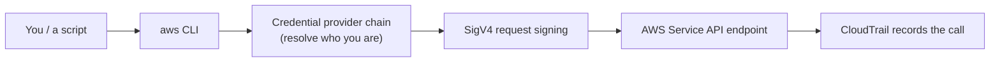

# AWS CLI - Intro bits & bytes

> The AWS CLI is the command-line front door to every AWS API. On the exam it shows up less as "a service" and more as the **automation and credential** surface: how scripts authenticate, how the SDK credential chain resolves, and why you use roles instead of long-lived keys.

See also: [02 - AWS CLI Deep Dive](02%20-%20AWS%20CLI%20Deep%20Dive.md) · [03 - AWS CLI Exam Scenarios](03%20-%20AWS%20CLI%20Exam%20Scenarios.md) · [04 - AWS CLI SRE Operations](04%20-%20AWS%20CLI%20SRE%20Operations.md) · [01 - AWS Management Console Intro bits & bytes](01%20-%20AWS%20Management%20Console%20Intro%20bits%20%26%20bytes.md) · [01 - AWS Systems Manager Intro bits & bytes](01%20-%20AWS%20Systems%20Manager%20Intro%20bits%20%26%20bytes.md)

---

## Table of Contents

- [1. What the CLI Is and the Problem It Solves](#1-what-the-cli-is-and-the-problem-it-solves)
- [2. How a CLI Command Becomes an API Call](#2-how-a-cli-command-becomes-an-api-call)
- [3. Credentials: The Provider Chain](#3-credentials-the-provider-chain)
- [4. Profiles, Config, and Named Profiles](#4-profiles-config-and-named-profiles)
- [5. When To Use It / When NOT To Use It](#5-when-to-use-it--when-not-to-use-it)
- [6. Alternatives](#6-alternatives)
- [7. Cost Considerations](#7-cost-considerations)
- [8. Mini-Quiz](#8-mini-quiz)

---



---

## 1. What the CLI Is and the Problem It Solves

The AWS Management Console is great for humans clicking through one task; it is terrible for **repeatability**. The AWS CLI is a single binary that exposes essentially **every AWS API** as a command, so you can:

- Automate repetitive tasks in shell scripts and CI/CD pipelines.
- Reproduce an action identically across accounts/regions.
- Do things the console can't easily express (batch operations, scripting, piping JSON through `jq`).

It is built on the same SDK foundations as the language SDKs, so what you learn about **authentication and signing** here applies everywhere.

[⬆ Back to top](#table-of-contents)

---

## 2. How a CLI Command Becomes an API Call

Every `aws <service> <operation>` maps to an AWS API action. The flow:

1. The CLI parses your command and parameters.
2. It **resolves credentials** via the provider chain (next section).
3. It **signs** the HTTPS request with **Signature V4** using those credentials.
4. It sends the request to the service's **regional endpoint**.
5. The service authorises it against IAM, executes, and returns JSON.
6. The call is recorded in **CloudTrail** (management events by default).

> Key exam idea: the CLI itself has no special powers — it inherits exactly the permissions of whatever identity the credential chain resolves to. A CLI call and a console click hit the **same API** and are governed by the **same IAM**.

[⬆ Back to top](#table-of-contents)

---

## 3. Credentials: The Provider Chain

The CLI/SDK looks for credentials in this **order** and uses the first it finds:

| Order | Source                                                                                    | Typical use                     |
| :---- | :---------------------------------------------------------------------------------------- | :------------------------------ |
| 1     | CLI options (`--profile`, env at command)                                                 | Overrides                       |
| 2     | Environment variables (`AWS_ACCESS_KEY_ID`, `AWS_SECRET_ACCESS_KEY`, `AWS_SESSION_TOKEN`) | CI/CD, containers               |
| 3     | CLI credentials file (`~/.aws/credentials`)                                               | Local dev with named profiles   |
| 4     | CLI config file (`~/.aws/config`) incl. SSO / `credential_process`                        | IAM Identity Center, federation |
| 5     | Container credentials (ECS task role via `AWS_CONTAINER_CREDENTIALS_*`)                   | ECS/Fargate                     |
| 6     | **Instance profile** via EC2 instance metadata (IMDS)                                     | EC2                             |

> The single most important best practice: on EC2/ECS/Lambda, **use the role from the metadata/task role — never put access keys on the instance**. The chain finds them automatically; rotation is handled for you.

[⬆ Back to top](#table-of-contents)

---

## 4. Profiles, Config, and Named Profiles

- `~/.aws/credentials` holds key-based profiles; `~/.aws/config` holds settings (region, output, role assumption, SSO).
- **Named profiles** let you switch identities/accounts: `aws s3 ls --profile prod`.
- **Role assumption profiles** chain into another account via `role_arn` + `source_profile` (the CLI calls STS `AssumeRole` for you).
- **SSO profiles** (`aws configure sso`) integrate with **IAM Identity Center** for short-lived credentials — the modern, key-free pattern.

```ini
# ~/.aws/config
[profile prod]
role_arn = arn:aws:iam::222222222222:role/AdminFromSecurity
source_profile = default
region = ap-south-1
```

[⬆ Back to top](#table-of-contents)

---

## 5. When To Use It / When NOT To Use It

**Use it when:** automating, scripting, CI/CD, bulk operations, or reproducing actions across accounts/regions; quick ad-hoc queries with `--query`/`jq`.

**Prefer something else when:**

- You need a **managed, auditable run surface on fleets** → Systems Manager **Run Command** (no SSH, logged in CloudTrail) rather than scripting SSH + CLI.
- You need **infrastructure provisioning** → CloudFormation/CDK/Terraform (declarative, drift-aware) rather than imperative CLI scripts.
- A non-technical user needs guided self-service → Service Catalog / Console.

[⬆ Back to top](#table-of-contents)

---

## 6. Alternatives

| Need                         | CLI              | Alternative                                                                        |
| :--------------------------- | :--------------- | :--------------------------------------------------------------------------------- |
| Imperative scripting         | ✅ AWS CLI       | Language SDK (boto3, etc.) for richer logic                                        |
| Declarative provisioning     | ❌               | [CloudFormation](01%20-%20AWS%20CloudFormation%20Intro%20bits%20%26%20bytes.md) / CDK / Terraform   |
| Run commands on fleets       | possible via SSH | [SSM Run Command / Session Manager](01%20-%20AWS%20Systems%20Manager%20Intro%20bits%20%26%20bytes.md) |
| Human point-and-click        | ❌               | [Console](01%20-%20AWS%20Management%20Console%20Intro%20bits%20%26%20bytes.md)                        |
| Interactive shell in browser | n/a              | **CloudShell** (CLI pre-authenticated in the console)                              |

[⬆ Back to top](#table-of-contents)

---

## 7. Cost Considerations

- The CLI is **free**; you pay only for the API calls' effects (resources created) and any data transfer.
- Some **read** APIs are free; some (e.g. certain `Describe`/`List` at high volume, or paginated calls) can incur request costs on specific services — rarely exam-relevant.
- **CloudShell** includes 1 GB of persistent storage per region at no cost.
- Hidden cost trap: a runaway script in a loop creating resources (or not paginating and hammering an API) — guard with `--max-items`, error handling, and least-privilege so a bug can't create expensive resources.

[⬆ Back to top](#table-of-contents)

---

## 8. Mini-Quiz

**Q1:** An EC2 instance runs a script using the CLI. Where should its credentials come from?
_A:_ An **instance profile (IAM role)** resolved from instance metadata — never hardcoded keys.

**Q2:** A CLI call and a console click both try to delete a bucket. Different permissions apply?
_A:_ **No.** Same API, same IAM evaluation. The CLI has no special privileges.

**Q3:** You need to run the same command as an admin role in another account. How?
_A:_ A named profile with `role_arn` + `source_profile` (CLI calls STS `AssumeRole`), or an IAM Identity Center SSO profile.

**Q4:** Key-free credentials for laptops across many accounts — what's the modern approach?
_A:_ `aws configure sso` with **IAM Identity Center** (short-lived credentials).

---

> Continue to [02 - AWS CLI Deep Dive](02%20-%20AWS%20CLI%20Deep%20Dive.md).
