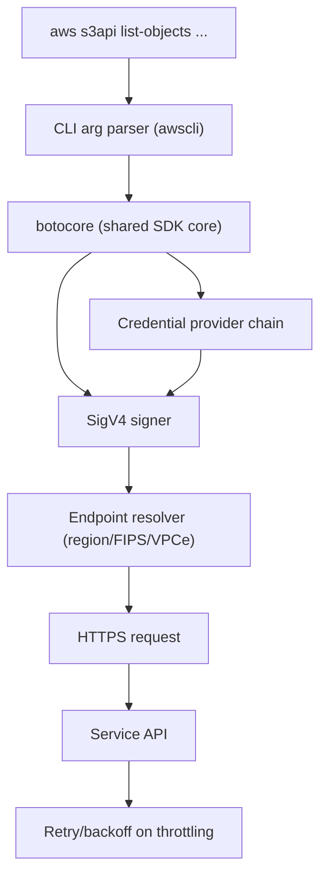
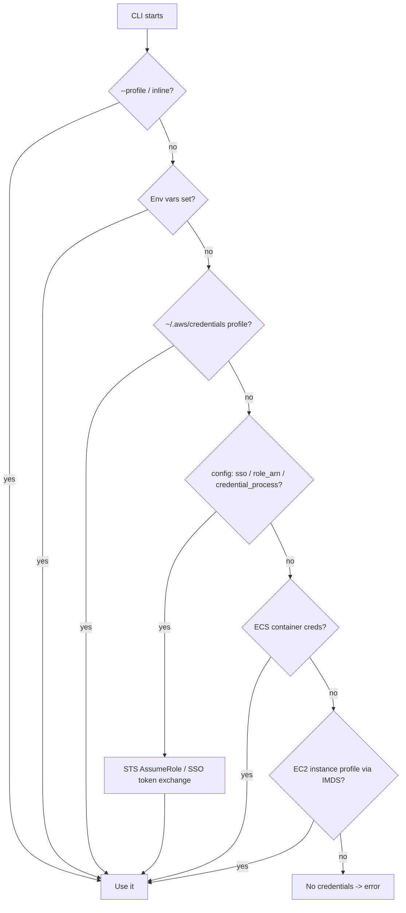

# AWS CLI - Deep Dive

> Architecture of the CLI/SDK stack, SigV4 signing, the full credential resolution and role-chaining flow, output/query/pagination internals, regional & FIPS endpoints, limits, integrations, comparisons, and best practices.

See also: [01 - AWS CLI Intro bits & bytes](01%20-%20AWS%20CLI%20Intro%20bits%20%26%20bytes.md) · [03 - AWS CLI Exam Scenarios](03%20-%20AWS%20CLI%20Exam%20Scenarios.md) · [04 - AWS CLI SRE Operations](04%20-%20AWS%20CLI%20SRE%20Operations.md) · [13 - STS & Federation](13%20-%20STS%20%26%20Federation.md) · [01 - AWS Systems Manager Intro bits & bytes](01%20-%20AWS%20Systems%20Manager%20Intro%20bits%20%26%20bytes.md)

---

## Table of Contents

- [1. Architecture: CLI, botocore, and the API](#1-architecture-cli-botocore-and-the-api)
- [2. SigV4 Request Signing](#2-sigv4-request-signing)
- [3. Full Credential Resolution and Role Chaining](#3-full-credential-resolution-and-role-chaining)
- [4. Query, Output, Pagination, and Waiters](#4-query-output-pagination-and-waiters)
- [5. Endpoints: Regional, FIPS, Dual-Stack, VPC](#5-endpoints-regional-fips-dual-stack-vpc)
- [6. Service Limits and Throttling](#6-service-limits-and-throttling)
- [7. Integration Matrix](#7-integration-matrix)
- [8. Comparisons](#8-comparisons)
- [9. Best Practices by Pillar](#9-best-practices-by-pillar)

---

---

## 1. Architecture: CLI, botocore, and the API

The `aws` CLI (v2) is a thin command layer over **botocore**, the same Python core the boto3 SDK uses. Service definitions are **data-driven** from JSON models, which is why the CLI supports every API shortly after launch. CLI v2 ships as a self-contained bundle (its own Python), supports **SSO**, **`aws configure sso`**, auto-prompt, and server-side/​client-side pagination. Prefer **v2** on the exam and in practice.

[⬆ Back to top](#table-of-contents)

---

## 2. SigV4 Request Signing

Every request is signed with **AWS Signature Version 4**:

- A canonical request (method, URI, headers, payload hash) is hashed and signed with a **signing key derived from the secret access key**, scoped to date/region/service.
- The **secret key is never transmitted** — only the signature. This prevents replay across regions/services and proves identity without sending the secret.
- Temporary credentials (from STS/roles) also carry a **session token** that must accompany the request.

Exam relevance: this is why **clock skew** breaks API calls (the timestamp is part of the signature) and why **temporary credentials** are safe to distribute — they expire and are scoped.

[⬆ Back to top](#table-of-contents)

---

## 3. Full Credential Resolution and Role Chaining

- **Role chaining:** a profile's `role_arn` + `source_profile` triggers STS `AssumeRole`. Chained roles get a **max 1-hour** session (cannot be extended). See [13 - STS & Federation](13%20-%20STS%20%26%20Federation.md).
- **`credential_process`** lets an external program supply credentials (e.g. enterprise SSO brokers).
- **IMDSv2** (token-based, `HttpTokens=required`) is the secure way EC2 exposes the instance profile — prefer it to block SSRF credential theft.

[⬆ Back to top](#table-of-contents)

---

## 4. Query, Output, Pagination, and Waiters

- **`--output`**: `json`, `text`, `table`, `yaml`. `text` is best for piping into shell; `json` for `jq`.
- **`--query`**: client-side **JMESPath** filtering, e.g. `--query "Reservations[].Instances[].InstanceId"`.
- **`--filters`**: server-side filtering (cheaper, less data transferred) where the API supports it. Prefer server-side filters over client-side `--query` for large result sets.
- **Pagination**: CLI v2 auto-paginates; control with `--page-size`, `--max-items`, `--starting-token`. APIs return `NextToken` under the hood.
- **Waiters**: `aws ec2 wait instance-running ...` polls until a state is reached — cleaner than hand-rolled sleep loops.

[⬆ Back to top](#table-of-contents)

---

## 5. Endpoints: Regional, FIPS, Dual-Stack, VPC

- Default endpoint is the **regional** one for your configured region; set `--region` or `AWS_REGION`.
- **FIPS endpoints** (`*-fips`) for compliance workloads requiring FIPS 140-2 validated crypto.
- **Dual-stack** (IPv4+IPv6) endpoints where supported.
- **VPC interface endpoints (PrivateLink)**: keep CLI traffic to AWS APIs on the private network; combine with an endpoint policy. Set a custom `--endpoint-url` only when required (e.g. localstack, VPCe with private DNS disabled).

[⬆ Back to top](#table-of-contents)

---

## 6. Service Limits and Throttling

- There's no "CLI quota"; you hit the **per-service API rate limits**. APIs return `ThrottlingException` / `RequestLimitExceeded`.
- CLI v2 uses **adaptive/standard retry mode** with exponential backoff; tune with `max_attempts` and `retry_mode` in config.
- For bulk jobs, add jitter, lower `--page-size`, and respect throttling rather than tight-looping. See [01 - AWS Service Quotas Intro bits & bytes](01%20-%20AWS%20Service%20Quotas%20Intro%20bits%20%26%20bytes.md) for raising limits.

[⬆ Back to top](#table-of-contents)

---

## 7. Integration Matrix

| Service                                   | Integration                                                                                                        |
| :---------------------------------------- | :----------------------------------------------------------------------------------------------------------------- |
| **IAM / STS**                             | Identity resolution, `AssumeRole`, MFA (`--serial-number`/`--token-code`), federation                              |
| **IAM Identity Center**                   | `aws configure sso`, short-lived creds → [06 - IAM Identity Center & Organizations](06%20-%20IAM%20Identity%20Center%20%26%20Organizations.md)                              |
| **CloudTrail**                            | Every CLI API call is auditable as a management/data event → [01 - AWS CloudTrail Intro bits & bytes](01%20-%20AWS%20CloudTrail%20Intro%20bits%20%26%20bytes.md)            |
| **CloudShell**                            | Browser CLI pre-authenticated with your console identity                                                           |
| **Systems Manager**                       | `aws ssm send-command` / `start-session` — fleet ops without SSH → [01 - AWS Systems Manager Intro bits & bytes](01%20-%20AWS%20Systems%20Manager%20Intro%20bits%20%26%20bytes.md) |
| **CodeBuild/CodePipeline/GitHub Actions** | CLI in CI using OIDC/role assumption (no static keys)                                                              |
| **S3**                                    | High-level `aws s3` (sync/cp) vs low-level `aws s3api`                                                             |

[⬆ Back to top](#table-of-contents)

---

## 8. Comparisons

### CLI vs SDK vs CloudShell

|             | AWS CLI             | Language SDK                    | CloudShell                                 |
| :---------- | :------------------ | :------------------------------ | :----------------------------------------- |
| Form        | Shell commands      | Code (boto3, JS, etc.)          | Browser shell with CLI pre-installed       |
| Best for    | Scripts, ad-hoc, CI | App logic, complex control flow | Quick authenticated access, no local setup |
| Credentials | Provider chain      | Provider chain                  | Inherits console session                   |

### CLI scripting vs Infrastructure as Code

|                | CLI scripts               | CloudFormation/Terraform  |
| :------------- | :------------------------ | :------------------------ |
| Style          | Imperative                | Declarative               |
| Drift handling | None (you track state)    | Detects/reconciles        |
| Idempotency    | You implement it          | Built in                  |
| Best for       | One-off/operational tasks | Repeatable infrastructure |

> Exam cue: "repeatable, version-controlled infrastructure" → IaC, not CLI scripts. "Run an operational task across the fleet, audited, no SSH" → Systems Manager, not raw CLI+SSH.

[⬆ Back to top](#table-of-contents)

---

## 9. Best Practices by Pillar

**Security**

- No long-lived keys on servers — use roles/instance profiles; use IAM Identity Center for humans.
- Require **MFA** for sensitive CLI actions via IAM conditions; enforce **IMDSv2**.
- Scope CI credentials with **OIDC role assumption** (e.g. GitHub Actions → IAM role), not stored secrets.

**Operational Excellence**

- Pin CLI v2; centralise profiles; use `--query`/waiters instead of brittle parsing/sleeps.

**Reliability**

- Honour retries/backoff; make scripts idempotent; check exit codes.

**Cost / Performance**

- Prefer server-side filters and pagination limits to reduce data and request volume.

[⬆ Back to top](#table-of-contents)

---

> Continue to [03 - AWS CLI Exam Scenarios](03%20-%20AWS%20CLI%20Exam%20Scenarios.md).
