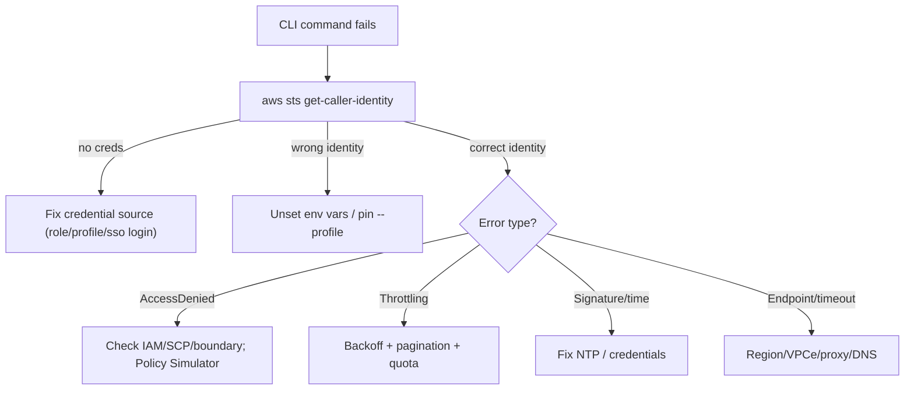

# AWS CLI - SRE Operations

> Operational reality: the CLI errors you actually hit, a triage workflow, real examples (config, assume-role, MFA, scripting, pagination), production patterns, and cost/security operations.

See also: [01 - AWS CLI Intro bits & bytes](01%20-%20AWS%20CLI%20Intro%20bits%20%26%20bytes.md) · [02 - AWS CLI Deep Dive](02%20-%20AWS%20CLI%20Deep%20Dive.md) · [03 - AWS CLI Exam Scenarios](03%20-%20AWS%20CLI%20Exam%20Scenarios.md) · [01 - AWS Systems Manager Intro bits & bytes](01%20-%20AWS%20Systems%20Manager%20Intro%20bits%20%26%20bytes.md)

---

## Table of Contents

- [1. Common Errors (Symptom → Root Cause → Fix → Prevention)](#1-common-errors-symptom--root-cause--fix--prevention)
- [2. Troubleshooting Workflow](#2-troubleshooting-workflow)
- [3. Observability of CLI Activity](#3-observability-of-cli-activity)
- [4. Runbooks](#4-runbooks)
- [5. Real Examples](#5-real-examples)
- [6. Production Patterns by Org Size](#6-production-patterns-by-org-size)
- [7. Cost & Security Operations](#7-cost--security-operations)

---

## 1. Common Errors (Symptom → Root Cause → Fix → Prevention)

### `Unable to locate credentials`

- **Cause:** Provider chain found nothing (no env, no profile, no instance role).
- **Fix:** Attach an instance/task role, set the right `--profile`, or run `aws configure`/`aws sso login`.
- **Prevention:** Standardise roles on compute; avoid relying on ambient env vars.

### `An error occurred (AccessDenied)`

- **Cause:** The resolved identity lacks the IAM permission, or an SCP/permissions boundary blocks it.
- **Fix:** Check `aws sts get-caller-identity` (who am I?), then the policy; use IAM Policy Simulator.
- **Prevention:** Least-privilege roles tested before rollout.

### `Signature ... / SignatureDoesNotMatch / time skew`

- **Cause:** Clock drift (SigV4 timestamp) or a corrupted secret.
- **Fix:** Sync NTP; re-verify credentials.
- **Prevention:** Ensure time sync on all hosts.

### `ThrottlingException` / `RequestLimitExceeded`

- **Cause:** Exceeding per-service API rate.
- **Fix:** `retry_mode = adaptive`, raise `max_attempts`, add jitter, lower `--page-size`.
- **Prevention:** Throttle-aware tooling; request quota increases.

### Wrong identity used

- **Cause:** Env vars override the intended profile (chain precedence).
- **Fix:** `unset AWS_ACCESS_KEY_ID AWS_SECRET_ACCESS_KEY AWS_SESSION_TOKEN`; pin `--profile`.
- **Prevention:** Clean env in CI jobs; verify with `get-caller-identity`.

[⬆ Back to top](#table-of-contents)

---

## 2. Troubleshooting Workflow



> First command in any CLI triage: **`aws sts get-caller-identity`** — it answers "who does AWS think I am?" and resolves most issues immediately.

[⬆ Back to top](#table-of-contents)

---

## 3. Observability of CLI Activity

| Source                                  | Use                                                                                         |
| :-------------------------------------- | :------------------------------------------------------------------------------------------ |
| **CloudTrail**                          | Every API call: caller ARN, role session name, source IP, params (management + data events) |
| **`--debug`**                           | Local: full request/response, signing, endpoint resolution                                  |
| **CloudTrail Lake / Athena**            | Query historical CLI activity at scale                                                      |
| **IAM Access Analyzer / last-accessed** | Find unused permissions to tighten roles                                                    |

[⬆ Back to top](#table-of-contents)

---

## 4. Runbooks

### Runbook: "Set up secure cross-account CLI access"

1. Create a role in the target account trusting the source account/identity; attach least-privilege policy.
2. In `~/.aws/config`, add a profile with `role_arn` + `source_profile` (+ `mfa_serial` if required).
3. Verify with `aws sts get-caller-identity --profile target`.
4. For humans at scale, replace with `aws configure sso` (Identity Center).

### Runbook: "Leaked access key"

1. Immediately `aws iam update-access-key --status Inactive`, then delete.
2. Review CloudTrail for use of the key (CloudTrail Lake/Athena).
3. Rotate any dependent secrets; migrate the workload to a role/SSO.
4. Add detective control: alert on `aws iam create-access-key` and on long-lived keys.

[⬆ Back to top](#table-of-contents)

---

## 5. Real Examples

### Configure and verify

```bash
aws configure sso            # Identity Center: key-free, short-lived creds
aws sso login --profile prod
aws sts get-caller-identity --profile prod
```

### Assume a role with MFA (CLI config)

```ini
# ~/.aws/config
[profile prod-admin]
role_arn       = arn:aws:iam::222222222222:role/Admin
source_profile = default
mfa_serial     = arn:aws:iam::111111111111:mfa/alice
region         = ap-south-1
```

### Robust scripting pattern

```bash
#!/usr/bin/env bash
set -euo pipefail
export AWS_RETRY_MODE=adaptive AWS_MAX_ATTEMPTS=10

# server-side filter + paginate + JMESPath projection
aws ec2 describe-instances \
  --filters "Name=tag:Env,Values=prod" "Name=instance-state-name,Values=running" \
  --query "Reservations[].Instances[].{Id:InstanceId,Type:InstanceType}" \
  --output table --page-size 100

# wait on state instead of sleeping
aws ec2 wait instance-running --instance-ids i-0123456789abcdef0
```

### IAM policy: deny CLI/API calls outside the corporate VPC endpoint

```json
{
  "Version": "2012-10-17",
  "Statement": [
    {
      "Sid": "DenyOutsideVPCe",
      "Effect": "Deny",
      "Action": "*",
      "Resource": "*",
      "Condition": { "StringNotEquals": { "aws:SourceVpce": "vpce-0abc123" } }
    }
  ]
}
```

[⬆ Back to top](#table-of-contents)

---

## 6. Production Patterns by Org Size

| Context           | Pattern                                                                                                                              |
| :---------------- | :----------------------------------------------------------------------------------------------------------------------------------- |
| **Startup**       | `aws configure sso` for devs; instance/task roles for compute; CLI in CI via OIDC.                                                   |
| **SMB**           | Named role-assumption profiles per environment; MFA-required admin profile.                                                          |
| **Enterprise**    | Identity Center for all humans; per-pipeline OIDC roles; PrivateLink endpoints; SCPs denying static-key usage patterns.              |
| **Regulated**     | FIPS endpoints; CloudTrail org trail + Lake; deny non-VPCe API paths; mandatory MFA; key-existence Config rules.                     |
| **Multi-Account** | Standard profile bootstrap distributed via Identity Center; deploy roles assumed per account; session names per job for attribution. |

[⬆ Back to top](#table-of-contents)

---

## 7. Cost & Security Operations

- **Security:** eliminate long-lived keys (Config rule `iam-user-no-policies`/access-key-age, alert on `CreateAccessKey`); enforce IMDSv2; require MFA via conditions; restrict to VPC endpoints where mandated.
- **Cost:** CLI is free, but guard against runaway scripts creating resources — least privilege caps blast radius; use `--dry-run` on supported mutating commands; test in a sandbox account.
- **Hygiene:** rotate any unavoidable keys ≤90 days; remove unused permissions via last-accessed data; pin CLI v2 in images.

[⬆ Back to top](#table-of-contents)

---

Related: [01 - AWS CLI Intro bits & bytes](01%20-%20AWS%20CLI%20Intro%20bits%20%26%20bytes.md) · [02 - AWS CLI Deep Dive](02%20-%20AWS%20CLI%20Deep%20Dive.md) · [03 - AWS CLI Exam Scenarios](03%20-%20AWS%20CLI%20Exam%20Scenarios.md) · [13 - STS & Federation](13%20-%20STS%20%26%20Federation.md) · [01 - AWS CloudTrail Intro bits & bytes](01%20-%20AWS%20CloudTrail%20Intro%20bits%20%26%20bytes.md) · [01 - AWS Systems Manager Intro bits & bytes](01%20-%20AWS%20Systems%20Manager%20Intro%20bits%20%26%20bytes.md)
