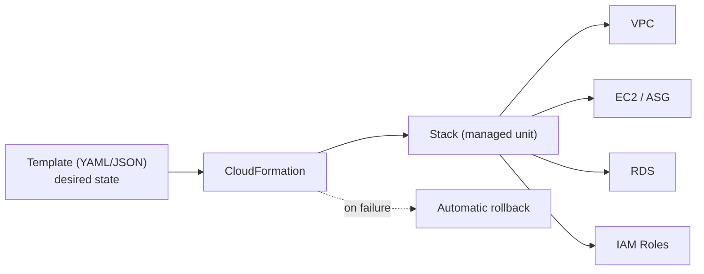
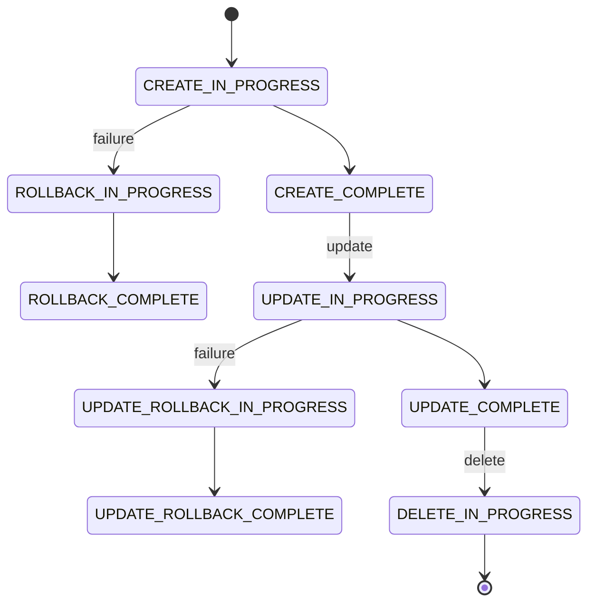

# AWS CloudFormation - Intro bits & bytes

> CloudFormation is AWS's native **Infrastructure as Code**: you describe the resources you want in a template, and CloudFormation creates, updates, and deletes them as a managed unit called a **stack**. It turns "click these 40 things in the right order" into one reviewable, versioned, repeatable file.

See also: [02 - AWS CloudFormation Deep Dive](02%20-%20AWS%20CloudFormation%20Deep%20Dive.md) · [03 - AWS CloudFormation Exam Scenarios](03%20-%20AWS%20CloudFormation%20Exam%20Scenarios.md) · [04 - AWS CloudFormation SRE Operations](04%20-%20AWS%20CloudFormation%20SRE%20Operations.md) · [01 - AWS Service Catalog Intro bits & bytes](01%20-%20AWS%20Service%20Catalog%20Intro%20bits%20%26%20bytes.md) · [01 - AWS Auto Scaling Intro bits & bytes](01%20-%20AWS%20Auto%20Scaling%20Intro%20bits%20%26%20bytes.md)

---

## Table of Contents

- [1. The Problem It Solves](#1-the-problem-it-solves)
- [2. Core Vocabulary: Template, Stack, Resource](#2-core-vocabulary-template-stack-resource)
- [3. Anatomy of a Template](#3-anatomy-of-a-template)
- [4. The Stack Lifecycle](#4-the-stack-lifecycle)
- [5. When To Use It / When NOT To Use It](#5-when-to-use-it--when-not-to-use-it)
- [6. Alternatives (CDK, Terraform, SAM)](#6-alternatives-cdk-terraform-sam)
- [7. Cost Considerations](#7-cost-considerations)
- [8. Mini-Quiz](#8-mini-quiz)

---



---

## 1. The Problem It Solves

Building infrastructure by clicking in the console is **slow, error-prone, and unrepeatable**. You can't diff it, review it, or recreate it identically in another region or account. CloudFormation makes infrastructure **declarative**:

- You declare _what_ you want (a VPC, two subnets, an ASG, an RDS instance).
- CloudFormation figures out _how_ and _in what order_ to create it (dependency graph), and tears it down cleanly when you delete the stack.
- The same template produces the same environment in dev, staging, prod — and in any region/account.

> Mental model: a stack is a **single managed unit** for a set of resources. Create/update/delete the stack and CloudFormation reconciles reality to the template — including rolling back if something fails midway.

[⬆ Back to top](#table-of-contents)

---

## 2. Core Vocabulary: Template, Stack, Resource

| Term             | Meaning                                                               |
| :--------------- | :-------------------------------------------------------------------- |
| **Template**     | The YAML/JSON document describing desired resources                   |
| **Stack**        | A deployed instance of a template; the unit you create/update/delete  |
| **Resource**     | One AWS thing in the stack (`AWS::EC2::Instance`, `AWS::S3::Bucket`…) |
| **Change Set**   | A preview of what an update _would_ do before you execute it          |
| **StackSet**     | Deploy one template across **many accounts and regions**              |
| **Drift**        | When a resource's real config no longer matches the template          |
| **Nested stack** | A stack created as a resource inside a parent stack (modularity)      |

[⬆ Back to top](#table-of-contents)

---

## 3. Anatomy of a Template

```yaml
AWSTemplateFormatVersion: "2010-09-09"
Description: A minimal web bucket

Parameters: # inputs at deploy time
  BucketName:
    Type: String

Mappings: # static lookup tables (e.g. region -> AMI)
  RegionMap:
    ap-south-1: { AMI: ami-0abc }

Conditions: # boolean gates for resources
  IsProd: !Equals [!Ref Env, prod]

Resources: # THE ONLY REQUIRED SECTION
  WebBucket:
    Type: AWS::S3::Bucket
    Properties:
      BucketName: !Ref BucketName

Outputs: # values to export / show after deploy
  BucketArn:
    Value: !GetAtt WebBucket.Arn
    Export: { Name: web-bucket-arn }
```

- **`Resources` is the only mandatory section.**
- **Intrinsic functions** wire things together: `!Ref`, `!GetAtt`, `!Sub`, `!Join`, `!FindInMap`, `!If`, `!ImportValue`.
- **Pseudo parameters**: `AWS::Region`, `AWS::AccountId`, `AWS::StackName`.

[⬆ Back to top](#table-of-contents)

---

## 4. The Stack Lifecycle



- On **create/update failure**, CloudFormation **rolls back** to the last known good state by default — you don't get half-built infrastructure.
- **Update behaviours** differ per property: _No interruption_, _Some interruption_, or **Replacement** (a new resource is created and the old deleted — watch this for stateful resources!).
- **`DeletionPolicy`** (`Retain`/`Snapshot`/`Delete`) protects data when a stack or resource is deleted.

[⬆ Back to top](#table-of-contents)

---

## 5. When To Use It / When NOT To Use It

**Use it when:**

- You want repeatable, reviewable, version-controlled infrastructure.
- You need to recreate an environment in another region/account identically.
- You want automatic rollback and dependency ordering.
- You need org-wide, multi-account standardised deployments (**StackSets**).

**Consider alternatives when:**

- You want a **real programming language** with loops/abstractions → **AWS CDK** (which synthesises CloudFormation).
- You're **multi-cloud** or already standardised on **Terraform**.
- It's a **one-off operational task**, not infrastructure → CLI/SSM.
- You need a **curated self-service catalog** for end users → **Service Catalog** (wraps CloudFormation).

[⬆ Back to top](#table-of-contents)

---

## 6. Alternatives (CDK, Terraform, SAM)

| Tool                | What it is                             | Relationship to CFN                                       |
| :------------------ | :------------------------------------- | :-------------------------------------------------------- |
| **AWS CDK**         | Define infra in TypeScript/Python/etc. | **Synthesises CloudFormation** templates under the hood   |
| **AWS SAM**         | Serverless-focused shorthand           | Transforms into CloudFormation (a macro)                  |
| **Terraform**       | HashiCorp multi-cloud IaC              | Separate engine + state file; not CloudFormation          |
| **Service Catalog** | Curated products for self-service      | **Deploys CloudFormation** templates as governed products |

> Exam cue: "native AWS IaC" = CloudFormation. "Programming language for IaC on AWS" = CDK. "Multi-cloud IaC" = Terraform. "Self-service curated provisioning" = Service Catalog.

[⬆ Back to top](#table-of-contents)

---

## 7. Cost Considerations

- **CloudFormation itself is free** for AWS resource types — you pay only for the resources the stack creates.
- **Third-party/registry resource types** and **Hooks** invoked via the CloudFormation registry can incur **per-handler-operation charges** (and the underlying Lambda for custom resources).
- Hidden cost trap: a **`Replacement`** update on a stateful resource (RDS, EBS) can create a new resource (and orphan/destroy data) — always preview with a **change set**.
- Use `DeletionPolicy: Snapshot/Retain` to avoid losing (and having to rebuild, at cost) data on stack deletion.

[⬆ Back to top](#table-of-contents)

---

## 8. Mini-Quiz

**Q1:** Which template section is mandatory?
_A:_ **`Resources`**.

**Q2:** You must deploy the same baseline to 30 accounts across 3 regions. What feature?
_A:_ **StackSets** (ideally with AWS Organizations as the target).

**Q3:** How do you preview the impact of an update before applying it?
_A:_ Create a **change set**.

**Q4:** A property update would _replace_ your RDS instance. How do you protect the data?
_A:_ `DeletionPolicy: Snapshot`/`Retain` and review the change set; avoid the replacing change if possible.

**Q5:** You want IaC but in Python with loops and classes. What should you use?
_A:_ **AWS CDK** (it synthesises CloudFormation).

---

> Continue to [02 - AWS CloudFormation Deep Dive](02%20-%20AWS%20CloudFormation%20Deep%20Dive.md).
