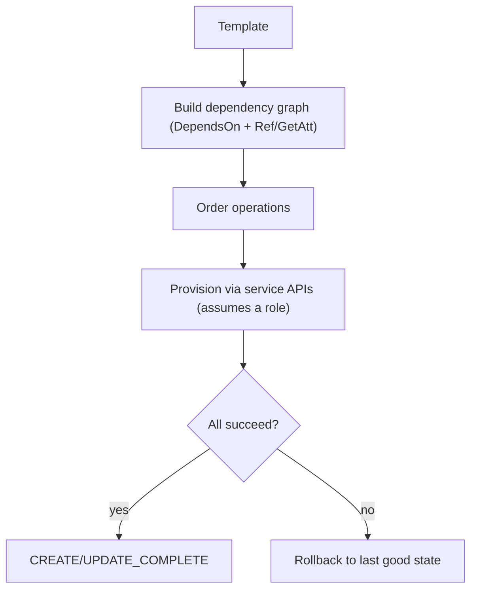

# AWS CloudFormation - Deep Dive

> Architecture and execution model, intrinsic functions, nested vs cross-stack, StackSets (self-managed vs service-managed), drift detection, custom resources/hooks/modules, stack policies, limits, integrations, comparisons, and best practices.

See also: [01 - AWS CloudFormation Intro bits & bytes](01%20-%20AWS%20CloudFormation%20Intro%20bits%20%26%20bytes.md) · [03 - AWS CloudFormation Exam Scenarios](03%20-%20AWS%20CloudFormation%20Exam%20Scenarios.md) · [04 - AWS CloudFormation SRE Operations](04%20-%20AWS%20CloudFormation%20SRE%20Operations.md) · [01 - AWS Service Catalog Intro bits & bytes](01%20-%20AWS%20Service%20Catalog%20Intro%20bits%20%26%20bytes.md) · [06 - IAM Identity Center & Organizations](06%20-%20IAM%20Identity%20Center%20%26%20Organizations.md)

---

## Table of Contents

- [1. Execution Model and the Dependency Graph](#1-execution-model-and-the-dependency-graph)
- [2. Intrinsic Functions and Pseudo Parameters](#2-intrinsic-functions-and-pseudo-parameters)
- [3. Modularity: Nested Stacks vs Cross-Stack Exports](#3-modularity-nested-stacks-vs-cross-stack-exports)
- [4. StackSets: Multi-Account, Multi-Region](#4-stacksets-multi-account-multi-region)
- [5. Change Sets, Update Behaviours, and Replacement](#5-change-sets-update-behaviours-and-replacement)
- [6. Drift Detection](#6-drift-detection)
- [7. Extensibility: Custom Resources, Hooks, Modules, Registry](#7-extensibility-custom-resources-hooks-modules-registry)
- [8. Stack Policies, DeletionPolicy, Termination Protection](#8-stack-policies-deletionpolicy-termination-protection)
- [9. Service Limits and Quotas](#9-service-limits-and-quotas)
- [10. Integration Matrix](#10-integration-matrix)
- [11. Comparisons](#11-comparisons)
- [12. Best Practices by Pillar](#12-best-practices-by-pillar)

---

---

## 1. Execution Model and the Dependency Graph

CloudFormation builds a **dependency graph** from explicit `DependsOn` and implicit references (`!Ref`, `!GetAtt`) and provisions resources in the correct order, parallelising where it can. It calls the underlying service APIs using either your credentials or a specified **service role** (recommended for least privilege and to decouple stack operations from the operator's permissions). Each resource is handled by a **resource provider** that knows how to create/update/delete/read that type.

[⬆ Back to top](#table-of-contents)

---

## 2. Intrinsic Functions and Pseudo Parameters

| Function                                    | Purpose                                                             |
| :------------------------------------------ | :------------------------------------------------------------------ |
| `!Ref`                                      | Reference a parameter (value) or resource (usually its physical ID) |
| `!GetAtt`                                   | Get an attribute of a resource (`!GetAtt MyBucket.Arn`)             |
| `!Sub`                                      | String interpolation (`!Sub "${AWS::StackName}-web"`)               |
| `!Join` / `!Split`                          | Build/split strings/lists                                           |
| `!FindInMap`                                | Look up a value in `Mappings` (e.g. region→AMI)                     |
| `!If` / `!Equals` / `!And` / `!Or` / `!Not` | Conditionals (paired with `Conditions`)                             |
| `!ImportValue`                              | Import another stack's exported `Output` (cross-stack)              |
| `!GetAZs`                                   | List of AZs in a region                                             |

Pseudo parameters: `AWS::AccountId`, `AWS::Region`, `AWS::StackName`, `AWS::StackId`, `AWS::Partition`, `AWS::NoValue` (remove a property conditionally).

[⬆ Back to top](#table-of-contents)

---

## 3. Modularity: Nested Stacks vs Cross-Stack Exports

|           | **Nested stacks**                                             | **Cross-stack references**                                                |
| :-------- | :------------------------------------------------------------ | :------------------------------------------------------------------------ |
| Mechanism | Parent stack has `AWS::CloudFormation::Stack` child resources | `Outputs` with `Export` + `!ImportValue`                                  |
| Coupling  | Tight — lifecycle tied to parent                              | Loose — independent stacks                                                |
| Reuse     | Reusable components (e.g. a standard VPC)                     | Share values (VPC ID, subnet IDs) across teams                            |
| Gotcha    | Update parent to update children                              | **Can't delete/modify an exported output while another stack imports it** |

> Exam trap: you can't change or delete a stack export that another stack is importing — you must update consumers first. Choose **nested stacks** for reusable building blocks; **exports/ImportValue** to share values across independently-managed stacks.

[⬆ Back to top](#table-of-contents)

---

## 4. StackSets: Multi-Account, Multi-Region

StackSets deploy one template to **many target accounts and regions** from a single operation.

| Permission model    | How it works                                                                                                               | When                                          |
| :------------------ | :------------------------------------------------------------------------------------------------------------------------- | :-------------------------------------------- |
| **Self-managed**    | You create the `AWSCloudFormationStackSetAdministrationRole` (admin account) and `...ExecutionRole` (each target) manually | No AWS Organizations, or fine-grained control |
| **Service-managed** | Uses **AWS Organizations** + trusted access; can **auto-deploy** to new accounts that join an OU                           | Org-wide governance baselines                 |

- **Concurrency & failure tolerance** control rollout speed/blast radius.
- **Drift detection** works across the StackSet.
- Classic use: deploy a security baseline (Config rules, IAM password policy, GuardDuty enablement) to every account automatically. See [01 - AWS Account Factory and Landing Zone Intro bits & bytes](01%20-%20AWS%20Account%20Factory%20and%20Landing%20Zone%20Intro%20bits%20%26%20bytes.md).

[⬆ Back to top](#table-of-contents)

---

## 5. Change Sets, Update Behaviours, and Replacement

- A **change set** previews additions, modifications, and crucially **Replacements** before you execute.
- Per-property update behaviour:
  - **No interruption** — updated in place, resource keeps running.
  - **Some interruption** — brief disruption (e.g. EC2 reboot).
  - **Replacement** — a **new physical resource** is created and the old one deleted (new physical ID). Dangerous for stateful resources (RDS, EBS, EIP associations).
- Always change-set stateful stacks; combine with `DeletionPolicy` to protect data.

[⬆ Back to top](#table-of-contents)

---

## 6. Drift Detection

**Drift** = a resource changed outside CloudFormation (someone clicked in the console). Drift detection compares live config to the template and reports `IN_SYNC` / `MODIFIED` / `DELETED` per resource and property.

- Drift detection is **on-demand** (not continuous); schedule it (EventBridge + Lambda/SSM) or use **AWS Config** for continuous configuration tracking.
- Remediation: re-deploy the stack (CloudFormation reasserts the template) or update the template to match the intended change.

[⬆ Back to top](#table-of-contents)

---

## 7. Extensibility: Custom Resources, Hooks, Modules, Registry

- **Custom resources** (`AWS::CloudFormation::CustomResource`) back a resource with a **Lambda or SNS** so you can provision things CloudFormation doesn't natively support, or run logic during stack ops. Must send a SUCCESS/FAILED response or the stack hangs.
- **Hooks** run **proactive** checks before create/update (e.g. block non-compliant resources) — the "proactive guardrail" in Control Tower.
- **Modules** package reusable resource configurations registered in the **CloudFormation Registry**.
- **Resource types (third-party)** extend CFN to non-AWS or partner resources.

[⬆ Back to top](#table-of-contents)

---

## 8. Stack Policies, DeletionPolicy, Termination Protection

| Control                    | Protects against                                              | Notes                                          |
| :------------------------- | :------------------------------------------------------------ | :--------------------------------------------- |
| **Stack policy**           | Accidental updates to specific resources during stack updates | JSON allow/deny on update actions per resource |
| **`DeletionPolicy`**       | Data loss on resource/stack delete                            | `Retain`, `Snapshot`, `Delete` (default)       |
| **`UpdateReplacePolicy`**  | Data loss when an update would replace a resource             | Same options as DeletionPolicy                 |
| **Termination protection** | Accidental whole-stack deletion                               | Enable on critical stacks                      |

[⬆ Back to top](#table-of-contents)

---

## 9. Service Limits and Quotas

| Limit                                        | Default                                  | Notes                                    |
| :------------------------------------------- | :--------------------------------------- | :--------------------------------------- |
| Resources per stack                          | 500                                      | Use nested stacks to exceed conceptually |
| Template body size (direct)                  | 51,200 bytes                             | Larger → upload to S3 (up to ~1 MB)      |
| Parameters / Outputs / Mappings per template | 200 each                                 | Soft-ish                                 |
| Stacks per account/region                    | 2,000                                    | Soft (Service Quotas)                    |
| Exports per region                           | 1,000                                    | Cross-stack `Export` names               |
| StackSet stack instances                     | high; controlled by concurrency settings | —                                        |

> If you're brushing 500 resources/stack, split into **nested or layered stacks** rather than one monolith.

[⬆ Back to top](#table-of-contents)

---

## 10. Integration Matrix

| Service                                   | Integration                                                                                                       |
| :---------------------------------------- | :---------------------------------------------------------------------------------------------------------------- |
| **IAM**                                   | Service role for least-privilege stack ops; templates create IAM resources (needs CAPABILITY_IAM/NAMED_IAM)       |
| **Organizations**                         | Service-managed StackSets, auto-deploy to OUs → [06 - IAM Identity Center & Organizations](06%20-%20IAM%20Identity%20Center%20%26%20Organizations.md)                      |
| **Config**                                | Continuous drift/compliance; CloudFormation can be the remediation deployer → [24 - AWS Config & Audit Manager](24%20-%20AWS%20Config%20%26%20Audit%20Manager.md) |
| **Control Tower**                         | Proactive guardrails via **Hooks**; account baselines via StackSets → [07 - AWS Control Tower](07%20-%20AWS%20Control%20Tower.md)                  |
| **Service Catalog**                       | Publishes templates as governed products → [01 - AWS Service Catalog Intro bits & bytes](01%20-%20AWS%20Service%20Catalog%20Intro%20bits%20%26%20bytes.md)                        |
| **CloudTrail**                            | Audits stack API operations → [01 - AWS CloudTrail Intro bits & bytes](01%20-%20AWS%20CloudTrail%20Intro%20bits%20%26%20bytes.md)                                          |
| **SSM Parameter Store / Secrets Manager** | Dynamic references (`{{resolve:ssm:...}}`, `{{resolve:secretsmanager:...}}`) for config/secrets                   |
| **CodePipeline**                          | Deploy/Change-set actions for IaC CI/CD                                                                           |

[⬆ Back to top](#table-of-contents)

---

## 11. Comparisons

### CloudFormation vs CDK vs Terraform

|             | CloudFormation                         | CDK                             | Terraform                              |
| :---------- | :------------------------------------- | :------------------------------ | :------------------------------------- |
| Language    | YAML/JSON                              | TS/Python/Java/Go               | HCL                                    |
| State       | Managed by AWS (the stack)             | Managed by AWS (synth → CFN)    | **Your** state file (S3+DynamoDB lock) |
| Cloud scope | AWS only                               | AWS only                        | Multi-cloud                            |
| Drift       | On-demand detection                    | via CFN                         | `terraform plan`                       |
| Best for    | Native AWS, StackSets, Service Catalog | Developers wanting abstractions | Multi-cloud / existing TF estate       |

### CloudFormation vs Elastic Beanstalk vs Service Catalog

|             | CloudFormation          | Beanstalk           | Service Catalog                 |
| :---------- | :---------------------- | :------------------ | :------------------------------ |
| Abstraction | Any resource, low-level | App platform (PaaS) | Curated products for end users  |
| Audience    | Platform/infra teams    | App developers      | Governed self-service consumers |

[⬆ Back to top](#table-of-contents)

---

## 12. Best Practices by Pillar

**Operational Excellence** — templates in version control; deploy via change sets in CI/CD; small layered stacks (network / data / app); use SSM dynamic references instead of hardcoding.

**Security** — least-privilege **service role**; never hardcode secrets (use Secrets Manager dynamic references); require `CAPABILITY_NAMED_IAM` consciously; stack policies on sensitive resources.

**Reliability** — rely on rollback; `DeletionPolicy: Snapshot/Retain` for stateful resources; termination protection on prod; nested stacks for reuse.

**Performance Efficiency** — parallel resource creation is automatic; avoid unnecessary `DependsOn` that serialises.

**Cost Optimization** — preview Replacements (avoid surprise rebuilds); tag everything via template; tear down ephemeral stacks fully.

[⬆ Back to top](#table-of-contents)

---

> Continue to [03 - AWS CloudFormation Exam Scenarios](03%20-%20AWS%20CloudFormation%20Exam%20Scenarios.md).
