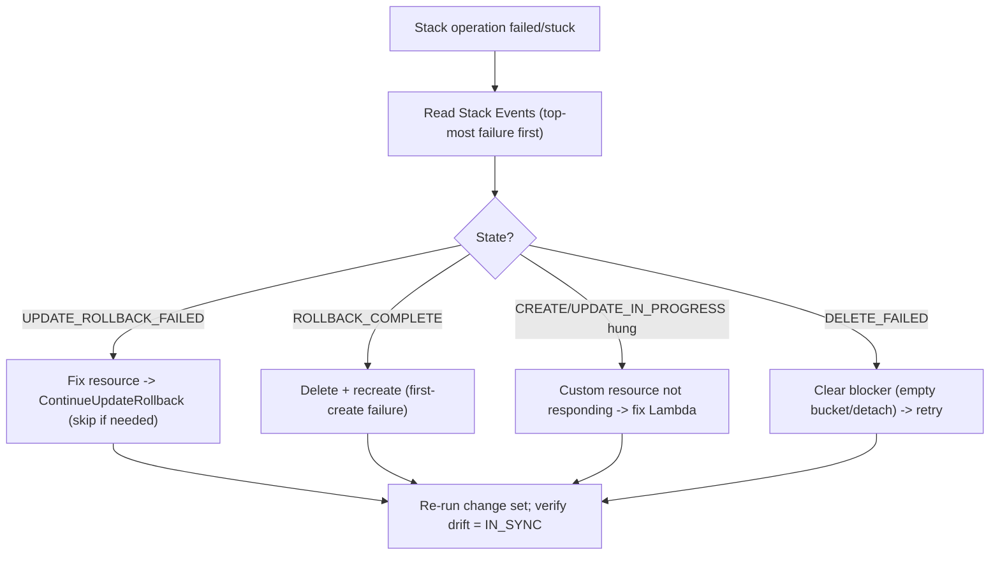

# AWS CloudFormation - SRE Operations

> The stack states that page you at 2 AM, how to recover them, drift workflows, real templates (StackSet, custom resource, dynamic refs, deletion policy), CI/CD patterns, and DR.

See also: [01 - AWS CloudFormation Intro bits & bytes](01%20-%20AWS%20CloudFormation%20Intro%20bits%20%26%20bytes.md) · [02 - AWS CloudFormation Deep Dive](02%20-%20AWS%20CloudFormation%20Deep%20Dive.md) · [03 - AWS CloudFormation Exam Scenarios](03%20-%20AWS%20CloudFormation%20Exam%20Scenarios.md) · [24 - AWS Config & Audit Manager](24%20-%20AWS%20Config%20%26%20Audit%20Manager.md)

---

## Table of Contents

- [1. Common Errors (Symptom → Root Cause → Fix → Prevention)](#1-common-errors-symptom--root-cause--fix--prevention)
- [2. Troubleshooting Workflow](#2-troubleshooting-workflow)
- [3. Key States, Events, and Logs](#3-key-states-events-and-logs)
- [4. Runbooks](#4-runbooks)
- [5. Real Examples](#5-real-examples)
- [6. CI/CD and Production Patterns](#6-cicd-and-production-patterns)
- [7. Cost Operations](#7-cost-operations)
- [8. Disaster Recovery](#8-disaster-recovery)

---

## 1. Common Errors (Symptom → Root Cause → Fix → Prevention)

### Stack stuck in `UPDATE_ROLLBACK_FAILED`

- **Symptom:** Update failed, rollback also failed; stack won't budge.
- **Root cause:** A resource can't return to its prior state (e.g. an out-of-band change, a dependency deleted manually, an S3 bucket not empty).
- **Detection:** Stack Events show the failed resource and reason.
- **Remediation:** Fix the resource manually to a valid state, then **ContinueUpdateRollback** (optionally `--resources-to-skip` for the stubborn ones). As a last resort, import/replace.
- **Prevention:** Don't modify stack resources out-of-band; use change sets; empty buckets before delete.

### Stack stuck in `CREATE_IN_PROGRESS` / hung custom resource

- **Root cause:** A custom resource Lambda never sent a response.
- **Fix:** Make the Lambda always respond (even on error); wait for timeout if needed, then fix and redeploy.
- **Prevention:** Idempotent handlers; try/except that posts FAILED; reasonable timeouts.

### `ROLLBACK_COMPLETE` and you can't update

- **Root cause:** A stack that failed its **first create** lands in `ROLLBACK_COMPLETE` and can only be **deleted**, not updated.
- **Fix:** Delete the stack and recreate.
- **Prevention:** Validate templates / use change sets; test in a sandbox.

### `DELETE_FAILED`

- **Root cause:** A resource can't be deleted (non-empty S3 bucket, ENI in use, dependency outside the stack).
- **Fix:** Resolve the blocker (empty bucket, detach), retry delete; `--retain-resources` to skip.
- **Prevention:** `DeletionPolicy` choices; understand cross-stack dependencies.

### `Export cannot be deleted as it is in use`

- **Root cause:** Another stack imports the export.
- **Fix:** Update/remove the import in the consumer first.
- **Prevention:** Prefer looser coupling (SSM parameter lookups) for shared values.

### Insufficient capabilities

- **Symptom:** `Requires capabilities: [CAPABILITY_NAMED_IAM]`.
- **Fix:** Re-run with `--capabilities CAPABILITY_NAMED_IAM` (consciously, after reviewing IAM resources).
- **Prevention:** Review templates creating IAM; least-privilege service role.

[⬆ Back to top](#table-of-contents)

---

## 2. Troubleshooting Workflow



> Always start at the **first** failure event (bottom-up in time): later events are usually cascades from the first root failure.

[⬆ Back to top](#table-of-contents)

---

## 3. Key States, Events, and Logs

| Source                       | Use                                                    |
| :--------------------------- | :----------------------------------------------------- |
| **Stack Events**             | Per-resource status + failure reason — primary triage  |
| **Change sets**              | What an update will do (incl. Replacement)             |
| **Drift results**            | Per-resource IN_SYNC/MODIFIED/DELETED                  |
| **CloudTrail**               | Who ran CreateStack/UpdateStack/DeleteStack            |
| **CloudWatch / Lambda logs** | Custom resource handler logs                           |
| **EventBridge**              | Stack status-change events → notify/automate           |
| **Config**                   | Continuous drift/compliance of stack-managed resources |

[⬆ Back to top](#table-of-contents)

---

## 4. Runbooks

### Runbook: recover `UPDATE_ROLLBACK_FAILED`

1. Open Stack Events; identify the resource(s) that failed rollback.
2. Manually restore each to a consistent state (or delete the blocker).
3. `aws cloudformation continue-update-rollback --stack-name X [--resources-to-skip ...]`.
4. Once `UPDATE_ROLLBACK_COMPLETE`, run drift detection; reconcile template.

### Runbook: safe production update

1. `create-change-set` → review for **Replacement** on stateful resources.
2. Approve (manual gate in CodePipeline).
3. `execute-change-set`; watch events.
4. Post-deploy: drift detection = IN_SYNC; smoke tests.

### Runbook: emergency rollback

1. If mid-update and failing, let auto-rollback complete; else re-deploy the last known good template version from git.
2. For data resources, restore from the snapshot created by `DeletionPolicy: Snapshot` if a replacement occurred.

[⬆ Back to top](#table-of-contents)

---

## 5. Real Examples

### CLI — change set + execute

```bash
aws cloudformation create-change-set \
  --stack-name web --change-set-name cs1 \
  --template-body file://web.yaml \
  --capabilities CAPABILITY_NAMED_IAM
aws cloudformation describe-change-set --stack-name web --change-set-name cs1
aws cloudformation execute-change-set --stack-name web --change-set-name cs1
```

### Service-managed StackSet to an OU (auto-deploy)

```bash
aws cloudformation create-stack-set \
  --stack-set-name baseline --template-body file://baseline.yaml \
  --permission-model SERVICE_MANAGED \
  --auto-deployment Enabled=true,RetainStacksOnAccountRemoval=false \
  --capabilities CAPABILITY_NAMED_IAM

aws cloudformation create-stack-instances \
  --stack-set-name baseline \
  --deployment-targets OrganizationalUnitIds=ou-abc1-11111111 \
  --regions ap-south-1 us-east-1 \
  --operation-preferences FailureToleranceCount=1,MaxConcurrentCount=5
```

### Protect data + dynamic secret + SSM AMI

```yaml
Resources:
  Db:
    Type: AWS::RDS::DBInstance
    DeletionPolicy: Snapshot
    UpdateReplacePolicy: Snapshot
    Properties:
      Engine: postgres
      MasterUsername: admin
      MasterUserPassword: "{{resolve:secretsmanager:prod/db:SecretString:password}}"
      DBInstanceClass: db.t3.medium
      AllocatedStorage: "20"

  Web:
    Type: AWS::EC2::Instance
    Properties:
      ImageId: "{{resolve:ssm:/aws/service/ami-amazon-linux-latest/al2023-ami-kernel-default-x86_64}}"
      InstanceType: t3.small
```

### Custom resource that always responds (Python sketch)

```python
import urllib3, json
http = urllib3.PoolManager()
def handler(event, context):
    status = "SUCCESS"
    data = {}
    try:
        # ... do work (must be idempotent) ...
        pass
    except Exception:
        status = "FAILED"
    finally:
        http.request("PUT", event["ResponseURL"], body=json.dumps({
            "Status": status, "PhysicalResourceId": context.log_stream_name,
            "StackId": event["StackId"], "RequestId": event["RequestId"],
            "LogicalResourceId": event["LogicalResourceId"], "Data": data
        }).encode())
```

[⬆ Back to top](#table-of-contents)

---

## 6. CI/CD and Production Patterns

| Context           | Pattern                                                                                                                       |
| :---------------- | :---------------------------------------------------------------------------------------------------------------------------- |
| **Startup**       | One repo of templates; deploy via CLI/CodePipeline with change sets.                                                          |
| **SMB**           | Layered stacks (network/data/app); SSM dynamic refs; termination protection on prod.                                          |
| **Enterprise**    | CDK or layered CFN; CodePipeline with change-set + approval; least-privilege service roles; nested stacks for shared modules. |
| **Regulated**     | Service Catalog products with constraints; Hooks for proactive compliance; Config for drift; CloudTrail org trail.            |
| **Multi-Account** | Service-managed StackSets for baselines; delegated admin; Account Factory integration.                                        |
| **Multi-Region**  | StackSet across regions; region-specific values via SSM public params; per-region certs.                                      |

[⬆ Back to top](#table-of-contents)

---

## 7. Cost Operations

- **Preview Replacements** to avoid surprise rebuilds of expensive stateful resources.
- **Tag via template** (propagate cost-allocation tags) so spend is attributable — see [01 - AWS Tagging Strategies Intro bits & bytes](01%20-%20AWS%20Tagging%20Strategies%20Intro%20bits%20%26%20bytes.md).
- Tear down **ephemeral/preview environments** fully (a deleted stack removes its resources, stopping charges) — automate with TTL tags + scheduled deletion.
- Watch custom-resource Lambda and third-party registry handler costs at scale.
- `DeletionPolicy: Snapshot` avoids rebuild cost after accidental deletes, but snapshots themselves incur storage — lifecycle them.

[⬆ Back to top](#table-of-contents)

---

## 8. Disaster Recovery

- **Templates in version control are your DR artifact**: the entire environment can be recreated in another region/account from the same template (assuming region-portable references via SSM/Mappings).
- Keep **AMIs, snapshots, and certs** available in the DR region (regional resources don't cross regions automatically).
- For stateful resources, pair IaC with data-layer DR (RDS cross-region snapshots/replicas, S3 replication, AWS Backup).
- Test DR by deploying the stack to the recovery region from a clean state and validating.

[⬆ Back to top](#table-of-contents)

---

Related: [01 - AWS CloudFormation Intro bits & bytes](01%20-%20AWS%20CloudFormation%20Intro%20bits%20%26%20bytes.md) · [02 - AWS CloudFormation Deep Dive](02%20-%20AWS%20CloudFormation%20Deep%20Dive.md) · [03 - AWS CloudFormation Exam Scenarios](03%20-%20AWS%20CloudFormation%20Exam%20Scenarios.md) · [01 - AWS Service Catalog Intro bits & bytes](01%20-%20AWS%20Service%20Catalog%20Intro%20bits%20%26%20bytes.md) · [24 - AWS Config & Audit Manager](24%20-%20AWS%20Config%20%26%20Audit%20Manager.md) · [01 - AWS Account Factory and Landing Zone Intro bits & bytes](01%20-%20AWS%20Account%20Factory%20and%20Landing%20Zone%20Intro%20bits%20%26%20bytes.md)
