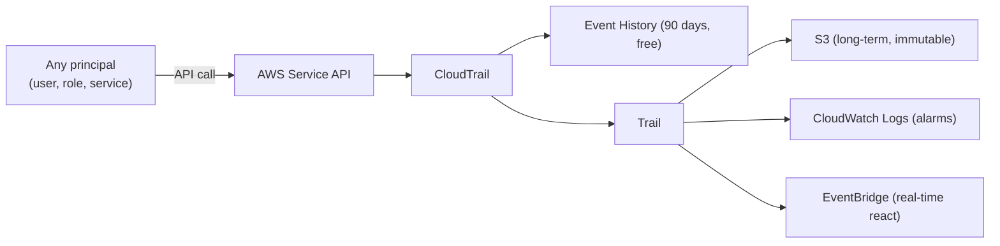

# AWS CloudTrail - Intro bits & bytes

> CloudTrail answers one question better than anything else: **"Who did what, when, from where, in my AWS account?"** It records API activity as an immutable audit log. On the exam it is _the_ answer to security investigation, governance, and compliance auditing.

See also: [02 - AWS CloudTrail Deep Dive](02%20-%20AWS%20CloudTrail%20Deep%20Dive.md) · [03 - AWS CloudTrail Exam Scenarios](03%20-%20AWS%20CloudTrail%20Exam%20Scenarios.md) · [04 - AWS CloudTrail SRE Operations](04%20-%20AWS%20CloudTrail%20SRE%20Operations.md) · [01 - Amazon CloudWatch Intro bits & bytes](01%20-%20Amazon%20CloudWatch%20Intro%20bits%20%26%20bytes.md) · [24 - AWS Config & Audit Manager](24%20-%20AWS%20Config%20%26%20Audit%20Manager.md)

---

## Table of Contents

- [1. The Problem It Solves](#1-the-problem-it-solves)
- [2. The Three Event Types](#2-the-three-event-types)
- [3. Event History vs Trails](#3-event-history-vs-trails)
- [4. Anatomy of an Event](#4-anatomy-of-an-event)
- [5. When To Use It / When NOT To Use It](#5-when-to-use-it--when-not-to-use-it)
- [6. CloudTrail vs CloudWatch vs Config](#6-cloudtrail-vs-cloudwatch-vs-config)
- [7. Cost Considerations](#7-cost-considerations)
- [8. Mini-Quiz](#8-mini-quiz)

---

---

## 1. The Problem It Solves

In a shared, automated cloud you must be able to **reconstruct exactly what happened**: who deleted the bucket, which role launched 500 instances, what IP made the change, whether an access key is being misused. CloudTrail continuously records **API activity** across AWS and stores it durably so you can investigate incidents, satisfy auditors, and detect misuse.

> Mental model: CloudTrail is the **flight recorder** of your AWS account. It doesn't tell you if a resource is _healthy_ (that's CloudWatch) or _correctly configured_ (that's Config) — it tells you **who took which action**.

[⬆ Back to top](#table-of-contents)

---

## 2. The Three Event Types

| Event type            | Records                                                                                     | Default                            | Cost                                                       |
| :-------------------- | :------------------------------------------------------------------------------------------ | :--------------------------------- | :--------------------------------------------------------- |
| **Management events** | Control-plane operations (create/modify/delete resources, login, IAM changes)               | **On** (and free in Event History) | First copy of management events free; extra trails charged |
| **Data events**       | High-volume data-plane ops (S3 `GetObject`/`PutObject`, Lambda `Invoke`, DynamoDB item ops) | **Off** (must enable)              | Charged per event (high volume)                            |
| **Insights events**   | Detects unusual _rates_ of management/API activity (anomalies)                              | **Off**                            | Charged when enabled                                       |

> Exam trap: **data events are OFF by default.** If a scenario needs to audit object-level S3 reads/writes, you must explicitly enable S3 data events on a trail.

[⬆ Back to top](#table-of-contents)

---

## 3. Event History vs Trails

|              | **Event History**                        | **Trail**                                                     |
| :----------- | :--------------------------------------- | :------------------------------------------------------------ |
| Retention    | Last **90 days**, management events only | As long as you keep the S3 objects                            |
| Setup        | Always on, free, per-region              | You create it                                                 |
| Destinations | View/search in console only              | **S3**, **CloudWatch Logs**, **EventBridge**, CloudTrail Lake |
| Scope        | Single account/region                    | Can be **multi-region** and **organization-wide**             |

- A **trail** is what you create for durable storage, alerting, and org-wide audit.
- **Organization trail**: one trail in the management/delegated-admin account that logs **all member accounts** — the standard governance pattern. See [06 - IAM Identity Center & Organizations](06%20-%20IAM%20Identity%20Center%20%26%20Organizations.md).

[⬆ Back to top](#table-of-contents)

---

## 4. Anatomy of an Event

A CloudTrail event (JSON) includes the fields you investigate with:

- `eventTime`, `eventName` (the API, e.g. `DeleteBucket`), `eventSource` (e.g. `s3.amazonaws.com`).
- `userIdentity` — who: IAM user, **assumed role** (with `sessionContext` and role session name), or AWS service.
- `sourceIPAddress`, `userAgent` — from where / with what tool.
- `requestParameters`, `responseElements` — what was asked and returned.
- `errorCode` (e.g. `AccessDenied`) — failed attempts are recorded too.
- `recipientAccountId`, `awsRegion`, `readOnly`.

> The `userIdentity` block is the heart of an investigation — especially `sessionContext` for assumed roles, which ties an action back to the human/automation that assumed it.

[⬆ Back to top](#table-of-contents)

---

## 5. When To Use It / When NOT To Use It

**Use it when:** security investigations, compliance/audit evidence, detecting unauthorized or anomalous API activity, governance across many accounts, and feeding SIEM/Security Hub/GuardDuty.

**Don't expect it to:**

- Monitor **performance/health** → that's [CloudWatch](01%20-%20Amazon%20CloudWatch%20Intro%20bits%20%26%20bytes.md) metrics/logs.
- Track **resource configuration state / compliance drift** → that's [AWS Config](24%20-%20AWS%20Config%20%26%20Audit%20Manager.md).
- Capture **OS/application logs** inside instances → CloudWatch Logs agent.
- Capture **network packet/flow data** → VPC Flow Logs.

[⬆ Back to top](#table-of-contents)

---

## 6. CloudTrail vs CloudWatch vs Config

| Question                                                | Service        |
| :------------------------------------------------------ | :------------- |
| **Who** made this API call, when, from where?           | **CloudTrail** |
| **Is it healthy / performing** (CPU, latency, errors)?  | **CloudWatch** |
| **Is it configured correctly / how did config change**? | **Config**     |

> Single most useful governance distinction on the exam. "API call / who did it / audit" → CloudTrail. "Metric/alarm/health" → CloudWatch. "Configuration history/compliance" → Config.

[⬆ Back to top](#table-of-contents)

---

## 7. Cost Considerations

- **Management events**: the **first copy** delivered to one trail is **free**; additional trails capturing management events are charged.
- **Data events** and **Insights**: charged per event — S3/Lambda data events can be **very high volume**, so scope them (specific buckets/prefixes) to control cost.
- **S3 storage** of logs and **CloudWatch Logs ingestion** add cost — use S3 lifecycle to Glacier and limit what you stream to CloudWatch Logs.
- **CloudTrail Lake** is priced on ingestion + retention; great for querying but watch volume.
- Hidden cost trap: enabling data events for _all_ S3 buckets account-wide → massive bill. Always scope.

[⬆ Back to top](#table-of-contents)

---

## 8. Mini-Quiz

**Q1:** You need to audit object-level reads on one S3 bucket. What must you do?
_A:_ Enable **S3 data events** for that bucket on a trail (data events are off by default).

**Q2:** Auditors need 7 years of immutable API logs across 40 accounts.
_A:_ An **organization trail** to S3 with **log file validation** and **S3 Object Lock**, lifecycle to Glacier.

**Q3:** "Who deleted the security group?" — which service?
_A:_ **CloudTrail** (`userIdentity` + `eventName=DeleteSecurityGroup`).

**Q4:** You want to alert in real time when anyone disables a trail.
_A:_ Stream to **CloudWatch Logs** with a metric filter + alarm, or trigger via **EventBridge** (`StopLogging`).

---

> Continue to [02 - AWS CloudTrail Deep Dive](02%20-%20AWS%20CloudTrail%20Deep%20Dive.md).
