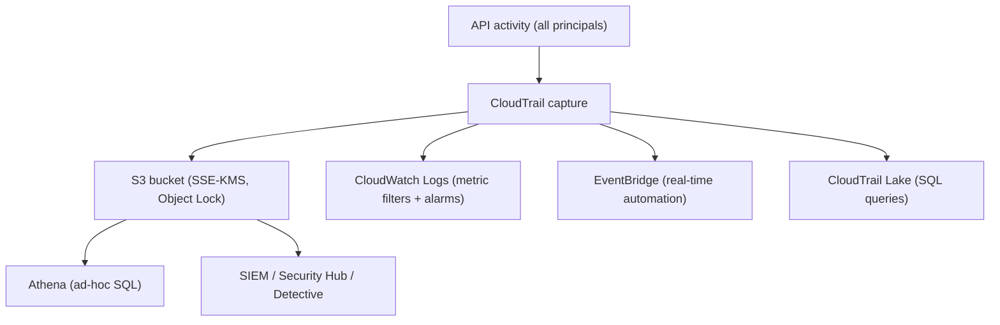

# AWS CloudTrail - Deep Dive

> Architecture and delivery pipeline, organization & multi-region trails, log file integrity, CloudTrail Lake, advanced event selectors, security of the trail itself, limits, integrations, comparisons, and best practices.

See also: [01 - AWS CloudTrail Intro bits & bytes](01%20-%20AWS%20CloudTrail%20Intro%20bits%20%26%20bytes.md) · [03 - AWS CloudTrail Exam Scenarios](03%20-%20AWS%20CloudTrail%20Exam%20Scenarios.md) · [04 - AWS CloudTrail SRE Operations](04%20-%20AWS%20CloudTrail%20SRE%20Operations.md) · [24 - AWS Config & Audit Manager](24%20-%20AWS%20Config%20%26%20Audit%20Manager.md) · [25 - GuardDuty Inspector Macie Security Hub](25%20-%20GuardDuty%20Inspector%20Macie%20Security%20Hub.md)

---

## Table of Contents

- [1. Delivery Architecture](#1-delivery-architecture)
- [2. Multi-Region and Organization Trails](#2-multi-region-and-organization-trails)
- [3. Log File Integrity Validation](#3-log-file-integrity-validation)
- [4. CloudTrail Lake](#4-cloudtrail-lake)
- [5. Event Selectors and Advanced Selectors](#5-event-selectors-and-advanced-selectors)
- [6. Securing the Trail Itself](#6-securing-the-trail-itself)
- [7. Regional Behaviour and Global Service Events](#7-regional-behaviour-and-global-service-events)
- [8. Service Limits and Quotas](#8-service-limits-and-quotas)
- [9. Integration Matrix](#9-integration-matrix)
- [10. Comparisons](#10-comparisons)
- [11. Best Practices by Pillar](#11-best-practices-by-pillar)

---

---

## 1. Delivery Architecture

CloudTrail captures events and delivers them to destinations with a short latency (typically within ~5 minutes for trails; ~15 min SLA). A trail can deliver simultaneously to:

- **S3** — durable, long-term, queryable via Athena; the system of record.
- **CloudWatch Logs** — for **metric filters + alarms** and near-real-time detection.
- **EventBridge** — every management event is also an EventBridge event for **real-time automation** (no trail needed for the bus, but trails enrich it).
- **CloudTrail Lake** — managed, immutable event data store with SQL.

Logs are written as gzipped JSON files; S3 events are partitioned by account/region/date.

[⬆ Back to top](#table-of-contents)

---

## 2. Multi-Region and Organization Trails

- A **multi-region trail** captures events from **all regions** into one bucket — recommended so activity in an unused region isn't missed (a common attacker tactic).
- An **organization trail** (created in the management or **delegated administrator** account) logs **every member account** into a central bucket. Member-account admins **cannot disable or modify** it — strong governance.
- Combine: a **multi-region organization trail** = full-coverage audit for the whole org. This is the canonical exam answer for "centralized, tamper-resistant, all-account, all-region audit."

[⬆ Back to top](#table-of-contents)

---

## 3. Log File Integrity Validation

- When enabled, CloudTrail creates **digest files** (hash chained, signed) so you can prove logs were **not altered or deleted** after delivery.
- Validate with `aws cloudtrail validate-logs`.
- Essential for compliance/forensics where the audit log must be **demonstrably tamper-evident**.

[⬆ Back to top](#table-of-contents)

---

## 4. CloudTrail Lake

A managed, **immutable** event data store you query with **SQL** — no S3+Athena plumbing:

- Retain events up to **years** (configurable, e.g. up to ~7–10 years).
- Aggregate across **accounts and regions**, and ingest non-AWS/activity events too.
- Best when you frequently run investigative queries and want a turnkey, immutable store.
- Trade-off vs S3+Athena: simpler and immutable, but priced on ingestion/retention.

[⬆ Back to top](#table-of-contents)

---

## 5. Event Selectors and Advanced Selectors

- **Basic event selectors**: choose management events (read-only/write-only/all) and data event resource types.
- **Advanced event selectors**: fine-grained filtering by fields (`eventName`, `resources.ARN`, `readOnly`) so you log **only the data events you need** — the key cost control for high-volume S3/Lambda/DynamoDB data events.
- Example: log `PutObject`/`DeleteObject` only for a sensitive prefix, not the whole bucket.

[⬆ Back to top](#table-of-contents)

---

## 6. Securing the Trail Itself

| Control                                                | Why                                                       |
| :----------------------------------------------------- | :-------------------------------------------------------- |
| **SSE-KMS** on the log bucket                          | Encrypt logs; control decryption via key policy           |
| **S3 bucket policy + Block Public Access**             | Prevent exposure of audit logs                            |
| **S3 Object Lock (WORM)**                              | Immutable retention for compliance                        |
| **MFA Delete**                                         | Extra protection against log deletion                     |
| **Log file validation**                                | Detect tampering                                          |
| **SCP** denying `cloudtrail:StopLogging`/`DeleteTrail` | Stop attackers/insiders disabling auditing → [08 - SCP](08%20-%20SCP.md) |
| **Org trail**                                          | Member admins can't tamper with it                        |

> Classic attacker move: `StopLogging` then act. Defenses: org trail (can't be stopped by members), SCP deny, and an EventBridge/CloudWatch alarm on `StopLogging`/`DeleteTrail`.

[⬆ Back to top](#table-of-contents)

---

## 7. Regional Behaviour and Global Service Events

- Most events are **regional**. **Global service events** (IAM, STS, CloudFront, Route 53) are logged in a designated region — a multi-region trail captures them correctly (avoid duplicate logging pitfalls older setups had).
- Trails can be region-scoped or all-regions; all-regions is recommended.

[⬆ Back to top](#table-of-contents)

---

## 8. Service Limits and Quotas

| Limit                     | Default              | Notes                                                      |
| :------------------------ | :------------------- | :--------------------------------------------------------- |
| Trails per region         | 5                    | Soft-ish; one good multi-region org trail usually suffices |
| Event History retention   | 90 days              | Fixed (use a trail/Lake for longer)                        |
| Delivery latency          | ~15 min (typical ~5) | Not real-time; use EventBridge for faster reaction         |
| CloudTrail Lake retention | up to ~7–10 years    | Configurable                                               |

[⬆ Back to top](#table-of-contents)

---

## 9. Integration Matrix

| Service                      | Integration                                                                                                         |
| :--------------------------- | :------------------------------------------------------------------------------------------------------------------ |
| **CloudWatch Logs**          | Metric filters + alarms on specific API calls → [01 - Amazon CloudWatch Intro bits & bytes](01%20-%20Amazon%20CloudWatch%20Intro%20bits%20%26%20bytes.md)                       |
| **EventBridge**              | Real-time rules on management events → automation → [01 - EventBridge Governance Integrations Intro bits & bytes](01%20-%20EventBridge%20Governance%20Integrations%20Intro%20bits%20%26%20bytes.md) |
| **S3 + Athena**              | Long-term store + ad-hoc SQL                                                                                        |
| **GuardDuty**                | Consumes CloudTrail to detect threats → [25 - GuardDuty Inspector Macie Security Hub](25%20-%20GuardDuty%20Inspector%20Macie%20Security%20Hub.md)                             |
| **Security Hub / Detective** | Findings + investigation graphs from trail data                                                                     |
| **Organizations**            | Org trail, delegated admin → [06 - IAM Identity Center & Organizations](06%20-%20IAM%20Identity%20Center%20%26%20Organizations.md)                                           |
| **Config**                   | Complementary: Config = config state, CloudTrail = who changed it → [24 - AWS Config & Audit Manager](24%20-%20AWS%20Config%20%26%20Audit%20Manager.md)             |
| **KMS**                      | Encrypt logs; KMS API usage itself is audited                                                                       |

[⬆ Back to top](#table-of-contents)

---

## 10. Comparisons

### CloudTrail vs Config (the perennial trap)

|                 | CloudTrail              | Config                                                         |
| :-------------- | :---------------------- | :------------------------------------------------------------- |
| Captures        | **API calls** (actions) | **Resource configuration state** over time                     |
| Answers         | "Who did what, when"    | "What is the config now / how did it change / is it compliant" |
| Form            | Event log               | Configuration items + rules                                    |
| Real-time react | EventBridge             | Config rules (often near-real-time)                            |

### CloudTrail Lake vs S3+Athena

|          | Lake                                  | S3+Athena                                  |
| :------- | :------------------------------------ | :----------------------------------------- |
| Setup    | Managed, immutable, SQL built-in      | DIY pipeline                               |
| Cost     | Ingestion+retention                   | S3 + per-query scan                        |
| Best for | Frequent investigations, immutability | Cheap long-term archive + occasional query |

[⬆ Back to top](#table-of-contents)

---

## 11. Best Practices by Pillar

**Security** — multi-region **organization trail**; SSE-KMS + Object Lock + log validation; SCP deny `StopLogging`/`DeleteTrail`; alarm on those events; feed GuardDuty/Security Hub.

**Operational Excellence** — centralize logs in a dedicated **log-archive account**; least-privilege access to logs; query with Lake/Athena.

**Reliability** — durable S3 with versioning; cross-region replication of the log bucket for resilience.

**Cost Optimization** — scope **data events** with advanced selectors; one free management-event trail; S3 lifecycle to Glacier; don't stream everything to CloudWatch Logs.

**Performance** — use EventBridge (not log polling) for real-time reaction.

[⬆ Back to top](#table-of-contents)

---

> Continue to [03 - AWS CloudTrail Exam Scenarios](03%20-%20AWS%20CloudTrail%20Exam%20Scenarios.md).
