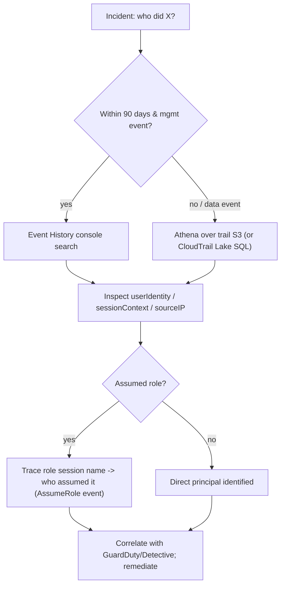

# AWS CloudTrail - SRE Operations

> Operational reality: where logs go missing, integrity checks, investigation queries (Athena/Lake), real configs (org trail, metric filters, SCP, remediation), production patterns, and cost ops.

See also: [01 - AWS CloudTrail Intro bits & bytes](01%20-%20AWS%20CloudTrail%20Intro%20bits%20%26%20bytes.md) · [02 - AWS CloudTrail Deep Dive](02%20-%20AWS%20CloudTrail%20Deep%20Dive.md) · [03 - AWS CloudTrail Exam Scenarios](03%20-%20AWS%20CloudTrail%20Exam%20Scenarios.md) · [01 - Amazon CloudWatch Intro bits & bytes](01%20-%20Amazon%20CloudWatch%20Intro%20bits%20%26%20bytes.md)

---

## Table of Contents

- [1. Common Errors (Symptom → Root Cause → Fix → Prevention)](#1-common-errors-symptom--root-cause--fix--prevention)
- [2. Investigation Workflow](#2-investigation-workflow)
- [3. What to Monitor and Alarm On](#3-what-to-monitor-and-alarm-on)
- [4. Runbooks](#4-runbooks)
- [5. Real Examples](#5-real-examples)
- [6. Production Patterns by Org Size](#6-production-patterns-by-org-size)
- [7. Cost Operations](#7-cost-operations)
- [8. Disaster Recovery & Forensics Readiness](#8-disaster-recovery--forensics-readiness)

---

## 1. Common Errors (Symptom → Root Cause → Fix → Prevention)

### "I can't find the event I expected"

- **Cause:** Data events not enabled, wrong region, or beyond 90-day Event History.
- **Fix:** Query the **trail's S3** (Athena) or **Lake**, not Event History; confirm data events/region.
- **Prevention:** Multi-region trail; enable required data events with advanced selectors.

### Logs not arriving in S3

- **Cause:** Broken bucket policy, missing KMS decrypt/encrypt grant, or wrong key policy.
- **Fix:** Repair the S3 bucket policy (allow `cloudtrail.amazonaws.com`), ensure the KMS key policy lets CloudTrail use the key.
- **Prevention:** Manage trail+bucket+key together (IaC); test delivery.

### CloudWatch Logs not receiving events

- **Cause:** Missing IAM role for CloudTrail→CloudWatch Logs delivery, or log group misconfig.
- **Fix:** Recreate the delivery role with correct trust/permissions.
- **Prevention:** Provision via CloudFormation.

### Trail disabled unexpectedly

- **Cause:** `StopLogging` by a principal with permission.
- **Fix:** Re-enable; investigate who (CloudTrail records `StopLogging` itself).
- **Prevention:** Org trail + SCP deny + EventBridge alarm.

### Integrity validation fails

- **Cause:** Log/digest file altered or deleted.
- **Fix:** Treat as incident; restore from replication/versioning; investigate.
- **Prevention:** Object Lock (WORM), versioning, MFA Delete, restricted access.

[⬆ Back to top](#table-of-contents)

---

## 2. Investigation Workflow



> To attribute an assumed-role action to a person, find the **`AssumeRole`** event for that session (matching role session name) — it shows the originating identity.

[⬆ Back to top](#table-of-contents)

---

## 3. What to Monitor and Alarm On

| Signal (CloudWatch metric filter / EventBridge)                     | Why                  |
| :------------------------------------------------------------------ | :------------------- |
| `StopLogging`, `DeleteTrail`, `UpdateTrail`                         | Audit tampering      |
| Root account usage (`userIdentity.type = Root`)                     | Should be near-zero  |
| `ConsoleLogin` without MFA / failures                               | Credential attacks   |
| IAM policy changes, `CreateAccessKey`, `AttachRolePolicy`           | Privilege escalation |
| `AuthorizeSecurityGroupIngress 0.0.0.0/0`, `PutBucketPolicy` public | Exposure             |
| Unusual API rate (CloudTrail **Insights**)                          | Anomalies            |

[⬆ Back to top](#table-of-contents)

---

## 4. Runbooks

### Runbook: stand up org-wide audit

1. In management account, enable **trusted access** and a **delegated administrator** (log-archive/security account).
2. Create a **multi-region organization trail** → central S3 bucket (in log-archive account) with SSE-KMS, versioning, Object Lock, restrictive policy.
3. Enable **log file validation**.
4. Stream to CloudWatch Logs for alarms; add EventBridge rules.
5. Add **SCP** denying `cloudtrail:StopLogging`/`DeleteTrail` org-wide.

### Runbook: suspected key compromise

1. Identify the `accessKeyId` in CloudTrail; deactivate the key (see [04 - AWS CLI SRE Operations](04%20-%20AWS%20CLI%20SRE%20Operations.md)).
2. Athena/Lake query all actions by that key over the window; list affected resources.
3. Correlate with GuardDuty findings; remediate resources; rotate dependent secrets.

[⬆ Back to top](#table-of-contents)

---

## 5. Real Examples

### Create a multi-region trail with validation + KMS

```bash
aws cloudtrail create-trail \
  --name org-audit --s3-bucket-name central-cloudtrail-logs \
  --is-multi-region-trail --enable-log-file-validation \
  --kms-key-id arn:aws:kms:ap-south-1:111111111111:key/abcd
aws cloudtrail start-logging --name org-audit
```

### Scope S3 data events with advanced selectors (cost control)

```bash
aws cloudtrail put-event-selectors --trail-name org-audit \
  --advanced-event-selectors '[
    {"Name":"RegulatedBucketWrites","FieldSelectors":[
      {"Field":"eventCategory","Equals":["Data"]},
      {"Field":"resources.type","Equals":["AWS::S3::Object"]},
      {"Field":"resources.ARN","StartsWith":["arn:aws:s3:::regulated-bucket/sensitive/"]},
      {"Field":"readOnly","Equals":["false"]}
    ]}]'
```

### CloudWatch metric filter + alarm on StopLogging

```bash
aws logs put-metric-filter --log-group-name aws-cloudtrail-logs \
  --filter-name StopLogging \
  --filter-pattern '{ ($.eventName = "StopLogging") }' \
  --metric-transformations metricName=StopLoggingCount,metricNamespace=Security,metricValue=1
aws cloudwatch put-metric-alarm --alarm-name CloudTrailStopped \
  --namespace Security --metric-name StopLoggingCount \
  --statistic Sum --period 300 --threshold 1 \
  --comparison-operator GreaterThanOrEqualToThreshold --evaluation-periods 1 \
  --alarm-actions arn:aws:sns:ap-south-1:111111111111:sec-alerts
```

### Athena query: actions by an access key

```sql
SELECT eventtime, eventname, sourceipaddress, awsregion
FROM cloudtrail_logs
WHERE useridentity.accesskeyid = 'AKIAEXAMPLE'
  AND eventtime BETWEEN '2026-01-01' AND '2026-06-01'
ORDER BY eventtime;
```

### SCP: prevent disabling CloudTrail

```json
{
  "Version": "2012-10-17",
  "Statement": [
    {
      "Sid": "ProtectCloudTrail",
      "Effect": "Deny",
      "Action": [
        "cloudtrail:StopLogging",
        "cloudtrail:DeleteTrail",
        "cloudtrail:UpdateTrail"
      ],
      "Resource": "*"
    }
  ]
}
```

[⬆ Back to top](#table-of-contents)

---

## 6. Production Patterns by Org Size

| Context           | Pattern                                                                                                                           |
| :---------------- | :-------------------------------------------------------------------------------------------------------------------------------- |
| **Startup**       | One multi-region trail → S3 + CloudWatch Logs alarms on root/StopLogging.                                                         |
| **SMB**           | Add log validation + SSE-KMS; scope a few data events; basic Athena queries.                                                      |
| **Enterprise**    | Org trail in a dedicated **log-archive account**, delegated admin, Object Lock, SCP deny, GuardDuty/Security Hub integration.     |
| **Regulated**     | All of the above + 7-year WORM retention, separated KMS key authority, CloudTrail Lake for audits, documented forensics runbooks. |
| **Multi-Account** | Single org trail covers all members automatically; central detection account.                                                     |

[⬆ Back to top](#table-of-contents)

---

## 7. Cost Operations

- Keep **one** trail capturing management events (first copy free); remove redundant trails.
- **Scope data events** with advanced selectors — this is the #1 CloudTrail cost lever.
- S3 **lifecycle to Glacier/Deep Archive** for old logs; compress (already gzipped).
- Limit what streams to **CloudWatch Logs** (ingestion cost) — alarm-relevant events only.
- Monitor **CloudTrail Lake** ingestion/retention if used heavily.

[⬆ Back to top](#table-of-contents)

---

## 8. Disaster Recovery & Forensics Readiness

- **Replicate the log bucket** cross-region (CRR) so audit history survives a regional event.
- **Versioning + Object Lock** protect against deletion/tampering even during an incident.
- Keep the **KMS key** available/replicated (multi-region key) so logs remain decryptable in DR.
- Pre-build **Athena tables / Lake data stores** so investigators can query immediately during an incident, not scramble to set up tooling.
- Store forensics runbooks and access procedures in the security account.

[⬆ Back to top](#table-of-contents)

---

Related: [01 - AWS CloudTrail Intro bits & bytes](01%20-%20AWS%20CloudTrail%20Intro%20bits%20%26%20bytes.md) · [02 - AWS CloudTrail Deep Dive](02%20-%20AWS%20CloudTrail%20Deep%20Dive.md) · [03 - AWS CloudTrail Exam Scenarios](03%20-%20AWS%20CloudTrail%20Exam%20Scenarios.md) · [24 - AWS Config & Audit Manager](24%20-%20AWS%20Config%20%26%20Audit%20Manager.md) · [25 - GuardDuty Inspector Macie Security Hub](25%20-%20GuardDuty%20Inspector%20Macie%20Security%20Hub.md) · [01 - Amazon CloudWatch Intro bits & bytes](01%20-%20Amazon%20CloudWatch%20Intro%20bits%20%26%20bytes.md)
