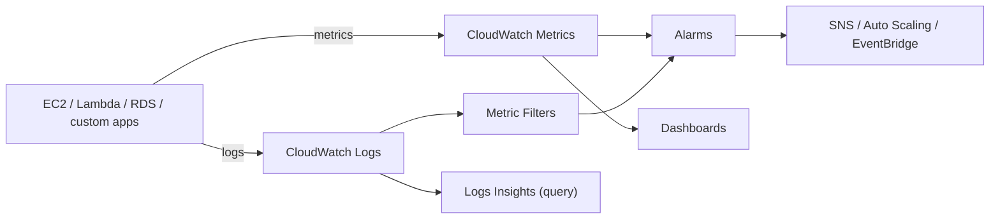

# Amazon CloudWatch - Intro bits & bytes

> CloudWatch is AWS's observability service: **metrics** (is it healthy/performing?), **logs** (what did it print?), **alarms** (tell me when it breaks), and **dashboards** (show me). It is the "is it healthy" half of the governance trio alongside CloudTrail (who did what) and Config (is it configured right).

See also: [02 - Amazon CloudWatch Deep Dive](02%20-%20Amazon%20CloudWatch%20Deep%20Dive.md) · [03 - Amazon CloudWatch Exam Scenarios](03%20-%20Amazon%20CloudWatch%20Exam%20Scenarios.md) · [04 - Amazon CloudWatch SRE Operations](04%20-%20Amazon%20CloudWatch%20SRE%20Operations.md) · [01 - AWS CloudTrail Intro bits & bytes](01%20-%20AWS%20CloudTrail%20Intro%20bits%20%26%20bytes.md) · [01 - AWS Auto Scaling Intro bits & bytes](01%20-%20AWS%20Auto%20Scaling%20Intro%20bits%20%26%20bytes.md)

---

## Table of Contents

- [1. The Problem It Solves](#1-the-problem-it-solves)
- [2. The Five Pillars of CloudWatch](#2-the-five-pillars-of-cloudwatch)
- [3. Metrics: Namespaces, Dimensions, Resolution](#3-metrics-namespaces-dimensions-resolution)
- [4. Alarms and Their States](#4-alarms-and-their-states)
- [5. Logs in 60 Seconds](#5-logs-in-60-seconds)
- [6. When To Use It / When NOT To Use It](#6-when-to-use-it--when-not-to-use-it)
- [7. CloudWatch vs CloudTrail vs Config vs X-Ray](#7-cloudwatch-vs-cloudtrail-vs-config-vs-x-ray)
- [8. Cost Considerations](#8-cost-considerations)
- [9. Mini-Quiz](#9-mini-quiz)

---

---

## 1. The Problem It Solves

You can't operate what you can't see. CloudWatch is the **single pane** for telling whether your AWS resources and applications are healthy and performing: collecting numeric **metrics**, ingesting **logs**, **alarming** when thresholds are crossed, and **visualizing** trends. It also closes the loop — an alarm can **trigger an action** (scale out, notify, recover, run automation).

> Mental model: CloudWatch turns raw signals into **decisions and actions**. Metric crosses a line → alarm fires → something happens (SNS page, Auto Scaling, EC2 recovery, Lambda).

[⬆ Back to top](#table-of-contents)

---

## 2. The Five Pillars of CloudWatch

| Pillar                   | What it is                                                                            |
| :----------------------- | :------------------------------------------------------------------------------------ |
| **Metrics**              | Time-series numeric data (CPUUtilization, RequestCount, custom)                       |
| **Logs**                 | Centralized log ingestion, storage, and query (Logs Insights)                         |
| **Alarms**               | Watch a metric/expression and act on threshold breaches                               |
| **Dashboards**           | Customizable visualizations (cross-region/cross-account)                              |
| **Events / EventBridge** | React to state changes & schedule (EventBridge is the evolution of CloudWatch Events) |

Related family members: **CloudWatch Agent** (OS + custom metrics/logs), **Container Insights**, **Lambda Insights**, **Application Signals** (APM), **Synthetics** (canaries), **RUM** (real user monitoring), **Contributor Insights**.

[⬆ Back to top](#table-of-contents)

---

## 3. Metrics: Namespaces, Dimensions, Resolution

- **Namespace**: a container for metrics (e.g. `AWS/EC2`, `AWS/Lambda`, or your own `MyApp`).
- **Dimension**: a name/value pair that scopes a metric (e.g. `InstanceId=i-123`). Up to 30 dimensions per metric.
- **Resolution**: **standard** (1-minute) or **high-resolution** (down to 1-second) custom metrics.
- **Retention**: metrics roll up over time — 1-second/1-minute data is kept short-term; aggregates persist up to **15 months**.

> Exam trap: **basic EC2 monitoring is 5-minute; detailed monitoring is 1-minute** (extra cost). Memory, disk space, and custom app metrics are **NOT** collected by default — you need the **CloudWatch Agent** or custom `PutMetricData`.

[⬆ Back to top](#table-of-contents)

---

## 4. Alarms and Their States

Three states: **OK**, **ALARM**, **INSUFFICIENT_DATA**.

- Configure: metric/expression, statistic, period, threshold, **evaluation periods**, and **datapoints to alarm** (M of N) to reduce flapping.
- **Alarm actions**: notify via **SNS**, trigger **Auto Scaling**, **EC2 actions** (stop/terminate/reboot/**recover**), or **Systems Manager** actions.
- **Composite alarms** combine multiple alarms with AND/OR to cut noise.
- **Metric math** and **anomaly detection** (a band learned from history) enable smarter thresholds.

> EC2 **auto-recovery** alarm (`recover`) rebuilds a failed instance on new hardware keeping the same instance ID/IP — common exam answer for "recover a single instance from hardware failure without changing its identity."

[⬆ Back to top](#table-of-contents)

---

## 5. Logs in 60 Seconds

- **Log group** → **log streams** → **log events**.
- Sources: CloudWatch **Agent**, Lambda (automatic), VPC Flow Logs, Route 53, CloudTrail, etc.
- **Metric filters** turn log patterns into metrics (then alarm on them).
- **Logs Insights** is a query language for ad-hoc analysis.
- **Subscription filters** stream logs in real time to Lambda, Kinesis Data Streams/Firehose, or OpenSearch.
- **Retention** is configurable per log group (1 day → forever); default is _never expire_ (a cost trap).

[⬆ Back to top](#table-of-contents)

---

## 6. When To Use It / When NOT To Use It

**Use it for:** health/performance metrics, alarms & auto-actions, centralized logs, dashboards, scheduling (EventBridge), and triggering Auto Scaling.

**Reach elsewhere when:**

- You need **API audit / who-did-what** → [CloudTrail](01%20-%20AWS%20CloudTrail%20Intro%20bits%20%26%20bytes.md).
- You need **configuration history/compliance** → [Config](24%20-%20AWS%20Config%20%26%20Audit%20Manager.md).
- You need **distributed tracing** of a request across services → **X-Ray / Application Signals**.
- You want **open-source dashboards/PromQL** across many sources → **Managed Grafana** / **Managed Prometheus** (still often fed by CloudWatch).

[⬆ Back to top](#table-of-contents)

---

## 7. CloudWatch vs CloudTrail vs Config vs X-Ray

| Need                                 | Service                         |
| :----------------------------------- | :------------------------------ |
| Health / performance / "is it up"    | **CloudWatch**                  |
| Who made the API call                | **CloudTrail**                  |
| Configuration state & compliance     | **Config**                      |
| Trace a request across microservices | **X-Ray / Application Signals** |

[⬆ Back to top](#table-of-contents)

---

## 8. Cost Considerations

- **Custom metrics**, **high-resolution metrics**, **dashboards**, **alarms**, **logs ingestion/storage**, **Logs Insights queries**, **Synthetics canaries** — each has a price. Volume matters.
- Biggest traps: **infinite log retention** (set retention!), **chatty custom/high-res metrics**, **detailed monitoring** everywhere, and **verbose Lambda logging** at scale.
- Levers: set log **retention**, archive cold logs to **S3** (subscription/export), aggregate before `PutMetricData`, use **composite alarms** to reduce alarm count, and metric filters instead of streaming all logs.

[⬆ Back to top](#table-of-contents)

---

## 9. Mini-Quiz

**Q1:** Default EC2 monitoring interval, and how to get 1-minute?
_A:_ 5-minute basic; enable **detailed monitoring** for 1-minute.

**Q2:** Collect memory and disk metrics from EC2 — how?
_A:_ Install the **CloudWatch Agent** (not available by default).

**Q3:** Recover a single failed instance keeping its ID/IP automatically.
_A:_ CloudWatch alarm with the **EC2 `recover`** action.

**Q4:** Alarm when the word "ERROR" appears > 10 times/min in app logs.
_A:_ **Metric filter** on the log group → **alarm** on the resulting metric.

**Q5:** Why did my CloudWatch Logs bill keep growing?
_A:_ Log groups default to **never expire** — set retention and/or archive to S3.

---

> Continue to [02 - Amazon CloudWatch Deep Dive](02%20-%20Amazon%20CloudWatch%20Deep%20Dive.md).
