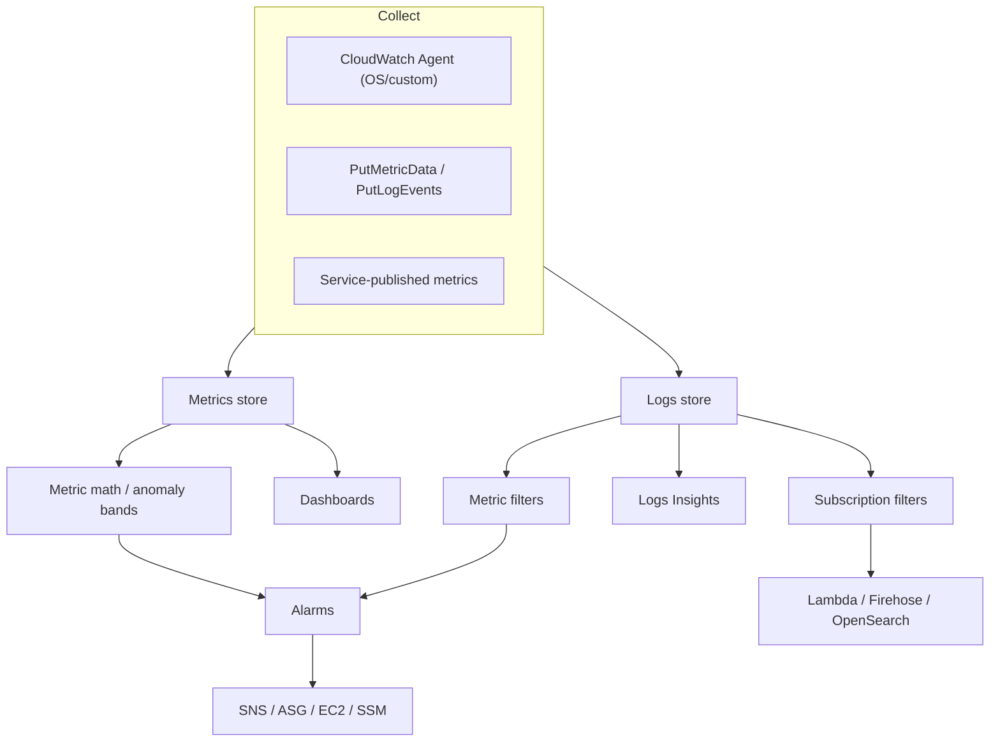

# Amazon CloudWatch - Deep Dive

> Architecture, the agent, metric math & anomaly detection, alarms in depth, Logs (filters, Insights, subscriptions), cross-account observability, EventBridge relationship, the CloudWatch family (Synthetics, RUM, Container/Lambda Insights, Application Signals), limits, integrations, comparisons, best practices.

See also: [01 - Amazon CloudWatch Intro bits & bytes](01%20-%20Amazon%20CloudWatch%20Intro%20bits%20%26%20bytes.md) · [03 - Amazon CloudWatch Exam Scenarios](03%20-%20Amazon%20CloudWatch%20Exam%20Scenarios.md) · [04 - Amazon CloudWatch SRE Operations](04%20-%20Amazon%20CloudWatch%20SRE%20Operations.md) · [01 - EventBridge Governance Integrations Intro bits & bytes](01%20-%20EventBridge%20Governance%20Integrations%20Intro%20bits%20%26%20bytes.md) · [01 - Amazon Managed Grafana Intro bits & bytes](01%20-%20Amazon%20Managed%20Grafana%20Intro%20bits%20%26%20bytes.md)

---

## Table of Contents

- [1. Architecture](#1-architecture)
- [2. The CloudWatch Agent](#2-the-cloudwatch-agent)
- [3. Metric Math, Anomaly Detection, Composite Alarms](#3-metric-math-anomaly-detection-composite-alarms)
- [4. Alarms in Depth](#4-alarms-in-depth)
- [5. CloudWatch Logs Deep Dive](#5-cloudwatch-logs-deep-dive)
- [6. Cross-Account / Cross-Region Observability](#6-cross-account--cross-region-observability)
- [7. EventBridge vs CloudWatch Events](#7-eventbridge-vs-cloudwatch-events)
- [8. The CloudWatch Family](#8-the-cloudwatch-family)
- [9. Service Limits and Quotas](#9-service-limits-and-quotas)
- [10. Integration Matrix](#10-integration-matrix)
- [11. Comparisons](#11-comparisons)
- [12. Best Practices by Pillar](#12-best-practices-by-pillar)

---

---

## 1. Architecture

CloudWatch is a regional, managed service. Resources **publish** metrics (many AWS services do so automatically); apps/agents publish custom metrics via `PutMetricData` and logs via `PutLogEvents`. Data is stored as time series (metrics) and log events (logs). Alarms continuously evaluate metrics/expressions; dashboards render them; EventBridge handles event-driven reactions and scheduling.

[⬆ Back to top](#table-of-contents)

---

## 2. The CloudWatch Agent

- Collects **OS-level** metrics not visible to the hypervisor: **memory, disk usage, swap, processes**, plus **custom application metrics** and **logs**.
- Configured via a JSON config (often stored in **SSM Parameter Store**) and deployed/managed with **Systems Manager**.
- Replaces the legacy "CloudWatch Logs agent" and the old monitoring scripts. Supports the **StatsD** and **collectd** protocols.
- Needs an instance role granting `cloudwatch:PutMetricData`, `logs:*` (scoped), and SSM permissions.

> Exam staple: "EC2 memory utilization isn't showing in CloudWatch." Cause: memory is a **guest-OS** metric — install the **CloudWatch Agent**.

[⬆ Back to top](#table-of-contents)

---

## 3. Metric Math, Anomaly Detection, Composite Alarms

- **Metric math**: derive new series (e.g. error rate = errors/requests, sum across instances, `FILL`, `RATE`, `ANOMALY_DETECTION_BAND`).
- **Anomaly detection**: ML learns a metric's normal band; alarm when it leaves the band — better than static thresholds for seasonal metrics.
- **Composite alarms**: combine child alarms with boolean logic to fire one meaningful alert instead of dozens (reduces alert fatigue and paging noise).

[⬆ Back to top](#table-of-contents)

---

## 4. Alarms in Depth

| Setting                     | Meaning                                                                                  |
| :-------------------------- | :--------------------------------------------------------------------------------------- |
| **Period**                  | Length of each evaluation window (e.g. 60s)                                              |
| **Evaluation periods (N)**  | How many periods are considered                                                          |
| **Datapoints to alarm (M)** | M-of-N breaching datapoints to fire (anti-flap)                                          |
| **Treat missing data**      | `missing` / `notBreaching` / `breaching` / `ignore`                                      |
| **Actions**                 | SNS, Auto Scaling policy, EC2 action, SSM action, per state (OK/ALARM/INSUFFICIENT_DATA) |

- **EC2 actions**: `stop`, `terminate`, `reboot`, **`recover`** (recover keeps ID/private IP/EIP; rebuilds on new host — for hardware failure).
- Alarms can be created on **custom metrics**, **metric math**, and **anomaly bands**.

[⬆ Back to top](#table-of-contents)

---

## 5. CloudWatch Logs Deep Dive

- **Metric filters**: pattern → metric (e.g. count `ERROR`, extract latency). Filters are not retroactive (apply to new events).
- **Logs Insights**: purpose-built query language (`fields`, `filter`, `stats`, `sort`); great for ad-hoc investigation.
- **Subscription filters**: real-time delivery to **Lambda**, **Kinesis Data Streams**, **Firehose** (→ S3/OpenSearch), or cross-account log destinations — the way to build centralized logging.
- **Retention** per log group (set it!); **export to S3** for cheap archive; **KMS** encryption.
- **Live Tail** for real-time streaming view.

[⬆ Back to top](#table-of-contents)

---

## 6. Cross-Account / Cross-Region Observability

- **CloudWatch cross-account observability** lets a **monitoring account** view metrics, logs, and traces from many **source accounts** (link via Organizations) — a single operational pane without copying data.
- **Cross-region dashboards** display metrics from multiple regions in one dashboard.
- Pattern: a central **observability account** in the org, source accounts share telemetry. Complements the central **log-archive** (CloudTrail) account.

[⬆ Back to top](#table-of-contents)

---

## 7. EventBridge vs CloudWatch Events

- **EventBridge** is the evolution of **CloudWatch Events** (same underlying bus). Use EventBridge for event-driven automation and **scheduled rules** (cron/rate).
- CloudWatch **alarms** ≠ EventBridge **events**: alarms watch _metrics_; EventBridge reacts to _events_ (state changes, API calls via CloudTrail, schedules). They're complementary. See [01 - EventBridge Governance Integrations Intro bits & bytes](01%20-%20EventBridge%20Governance%20Integrations%20Intro%20bits%20%26%20bytes.md).

[⬆ Back to top](#table-of-contents)

---

## 8. The CloudWatch Family

| Feature                   | Purpose                                                           |
| :------------------------ | :---------------------------------------------------------------- |
| **Container Insights**    | ECS/EKS/Fargate cluster & container metrics/logs                  |
| **Lambda Insights**       | Per-function resource telemetry                                   |
| **Application Signals**   | APM: auto service map, latency/error/SLO tracking (OpenTelemetry) |
| **Synthetics (canaries)** | Scripted checks that probe endpoints from outside                 |
| **RUM**                   | Real User Monitoring (client-side performance)                    |
| **Contributor Insights**  | Top-N "who/what" contributors from logs (e.g. top talkers)        |
| **Evidently**             | Feature flags / experiments                                       |

[⬆ Back to top](#table-of-contents)

---

## 9. Service Limits and Quotas

| Limit                           | Default            | Notes                |
| :------------------------------ | :----------------- | :------------------- |
| Dimensions per metric           | 30                 | —                    |
| Alarms per account/region       | 5,000              | Soft                 |
| Metric data retention           | up to 15 months    | Auto roll-up         |
| High-resolution metric          | 1 second           | Extra cost           |
| Logs Insights query concurrency | limited            | Soft                 |
| PutMetricData payload           | 1,000 metrics/call | Batch to reduce cost |
| Dashboards                      | 1,000/account      | Soft                 |

[⬆ Back to top](#table-of-contents)

---

## 10. Integration Matrix

| Service                          | Integration                                                                                                                                                  |
| :------------------------------- | :----------------------------------------------------------------------------------------------------------------------------------------------------------- |
| **Auto Scaling**                 | Alarms/target tracking drive scaling → [01 - AWS Auto Scaling Intro bits & bytes](01%20-%20AWS%20Auto%20Scaling%20Intro%20bits%20%26%20bytes.md)                                                                          |
| **SNS**                          | Alarm notifications / fan-out                                                                                                                                |
| **EventBridge**                  | Event-driven + scheduled automation                                                                                                                          |
| **CloudTrail**                   | Stream API logs → metric filters/alarms → [01 - AWS CloudTrail Intro bits & bytes](01%20-%20AWS%20CloudTrail%20Intro%20bits%20%26%20bytes.md)                                                                         |
| **Systems Manager**              | Agent config via Parameter Store; OpsCenter; automation actions → [01 - AWS Systems Manager Intro bits & bytes](01%20-%20AWS%20Systems%20Manager%20Intro%20bits%20%26%20bytes.md)                                            |
| **Lambda**                       | Auto metrics/logs; alarm→Lambda via SNS/EventBridge                                                                                                          |
| **Managed Grafana / Prometheus** | CloudWatch as a Grafana data source → [01 - Amazon Managed Grafana Intro bits & bytes](01%20-%20Amazon%20Managed%20Grafana%20Intro%20bits%20%26%20bytes.md) · [01 - Amazon Managed Service for Prometheus Intro bits & bytes](01%20-%20Amazon%20Managed%20Service%20for%20Prometheus%20Intro%20bits%20%26%20bytes.md) |
| **KMS**                          | Encrypt logs                                                                                                                                                 |

[⬆ Back to top](#table-of-contents)

---

## 11. Comparisons

### CloudWatch vs Prometheus/Grafana

|            | CloudWatch                             | Prometheus + Grafana                   |
| :--------- | :------------------------------------- | :------------------------------------- |
| Model      | Push (PutMetricData) + service metrics | Pull (scrape) + PromQL                 |
| Native AWS | Deep, zero-setup                       | Managed via AMP/AMG; great for K8s     |
| Dashboards | CloudWatch dashboards                  | Grafana (multi-source)                 |
| Best for   | AWS-native ops                         | Container/OSS ecosystems, multi-source |

### Alarms vs EventBridge vs Synthetics

|         | Alarm                           | EventBridge rule        | Synthetics canary          |
| :------ | :------------------------------ | :---------------------- | :------------------------- |
| Watches | A metric threshold              | An event/schedule       | An endpoint from outside   |
| Use     | Health thresholds, auto-actions | Event-driven automation | Proactive uptime/UX checks |

[⬆ Back to top](#table-of-contents)

---

## 12. Best Practices by Pillar

**Operational Excellence** — agent config in Parameter Store managed by SSM; composite alarms to cut noise; Logs Insights saved queries; cross-account observability account.

**Security** — encrypt logs with KMS; least-privilege agent role; metric filters/alarms on security events (root login, StopLogging); restrict who can delete log groups/alarms.

**Reliability** — alarm on the **right** signals (SLOs, error rate, latency p99) not just CPU; M-of-N to avoid flapping; EC2 `recover` for single-instance HW failure; treat-missing-data deliberately.

**Performance** — high-res metrics only where needed; Application Signals for latency SLOs.

**Cost** — set log **retention**, archive to S3, batch custom metrics, prune unused alarms/dashboards, scope detailed monitoring.

[⬆ Back to top](#table-of-contents)

---

> Continue to [03 - Amazon CloudWatch Exam Scenarios](03%20-%20Amazon%20CloudWatch%20Exam%20Scenarios.md).
