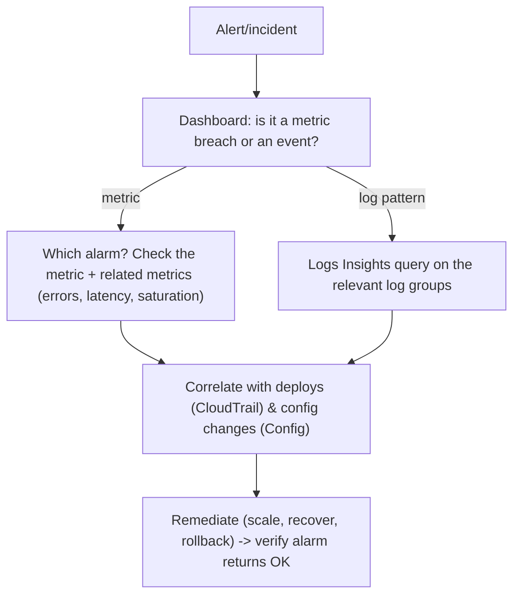

# Amazon CloudWatch - SRE Operations

> Operational reality: the gaps that hide outages, an investigation workflow, what to actually alarm on (SLOs not CPU), runbooks, real agent/alarm/Insights examples, production patterns, and cost ops.

See also: [01 - Amazon CloudWatch Intro bits & bytes](01%20-%20Amazon%20CloudWatch%20Intro%20bits%20%26%20bytes.md) · [02 - Amazon CloudWatch Deep Dive](02%20-%20Amazon%20CloudWatch%20Deep%20Dive.md) · [03 - Amazon CloudWatch Exam Scenarios](03%20-%20Amazon%20CloudWatch%20Exam%20Scenarios.md) · [01 - AWS Systems Manager Intro bits & bytes](01%20-%20AWS%20Systems%20Manager%20Intro%20bits%20%26%20bytes.md)

---

## Table of Contents

- [1. Common Errors (Symptom → Root Cause → Fix → Prevention)](#1-common-errors-symptom--root-cause--fix--prevention)
- [2. Investigation Workflow](#2-investigation-workflow)
- [3. What to Alarm On (SLOs, not just CPU)](#3-what-to-alarm-on-slos-not-just-cpu)
- [4. Runbooks](#4-runbooks)
- [5. Real Examples](#5-real-examples)
- [6. Production Patterns by Org Size](#6-production-patterns-by-org-size)
- [7. Cost Operations](#7-cost-operations)
- [8. Disaster Recovery Considerations](#8-disaster-recovery-considerations)

---

## 1. Common Errors (Symptom → Root Cause → Fix → Prevention)

### Missing OS metrics (memory/disk)

- **Cause:** No CloudWatch Agent; these aren't hypervisor-visible.
- **Fix:** Install/configure the agent (config in Parameter Store, deploy via SSM); grant `PutMetricData`/`logs` to the instance role.
- **Prevention:** Bake the agent into AMIs; manage config centrally.

### Alarm stuck in INSUFFICIENT_DATA

- **Cause:** Metric not being published (resource off, agent down, wrong namespace/dimension), or evaluation window has no data.
- **Fix:** Verify the metric exists; check agent; set **treat-missing-data** appropriately.
- **Prevention:** Heartbeat metrics; alarm on agent health.

### Logs not appearing

- **Cause:** Missing `logs:CreateLogStream`/`PutLogEvents` on the role, wrong region/log group, agent misconfig.
- **Fix:** Repair IAM and agent config.
- **Prevention:** Standard agent config + role via IaC.

### Runaway logs bill

- **Cause:** Never-expire retention + verbose logging.
- **Fix:** Set retention per group; reduce log level; archive to S3.
- **Prevention:** Org policy/Config rule enforcing retention.

### Alarm flapping / alert fatigue

- **Cause:** Too-tight thresholds, single-datapoint evaluation, no missing-data handling.
- **Fix:** M-of-N, composite alarms, anomaly detection.
- **Prevention:** Alarm on SLOs; review noisy alarms regularly.

[⬆ Back to top](#table-of-contents)

---

## 2. Investigation Workflow



> Use the **RED/USE** lenses: Rate/Errors/Duration for services; Utilization/Saturation/Errors for resources. Don't start at CPU.

[⬆ Back to top](#table-of-contents)

---

## 3. What to Alarm On (SLOs, not just CPU)

| Layer       | Alarm on                                                            |
| :---------- | :------------------------------------------------------------------ |
| User-facing | Error rate %, latency p99, availability (Synthetics canary)         |
| Service     | Queue depth/age, throttles, 5xx, saturation                         |
| Infra       | CPU/mem only as _supporting_ signals; StatusCheckFailed for recover |
| Security    | Root login, StopLogging, unauthorized API spikes                    |
| Cost        | Billing/anomaly alarms (see Budgets)                                |

[⬆ Back to top](#table-of-contents)

---

## 4. Runbooks

### Runbook: deploy the agent fleet-wide

1. Store a standard agent config in **SSM Parameter Store**.
2. Use **SSM Run Command / State Manager** to install and start the agent referencing that parameter.
3. Verify metrics (memory, disk) and log groups appear.
4. Alarm on agent heartbeat so a dead agent pages.

### Runbook: triage a latency SLO breach

1. Open the service dashboard; confirm p99 latency + error rate via metric math.
2. Logs Insights: top slow operations / errors in the window.
3. Correlate: recent deploy (CloudTrail), config change (Config), dependency saturation.
4. Mitigate (scale, roll back, shed load); confirm alarm → OK.

[⬆ Back to top](#table-of-contents)

---

## 5. Real Examples

### Create an EC2 system-recover alarm

```bash
aws cloudwatch put-metric-alarm \
  --alarm-name ec2-recover-i123 \
  --namespace AWS/EC2 --metric-name StatusCheckFailed_System \
  --dimensions Name=InstanceId,Value=i-0123456789abcdef0 \
  --statistic Maximum --period 60 --evaluation-periods 2 \
  --threshold 1 --comparison-operator GreaterThanOrEqualToThreshold \
  --alarm-actions arn:aws:automate:ap-south-1:ec2:recover
```

### Metric-math alarm: 5xx error rate > 2%

```bash
aws cloudwatch put-metric-alarm --alarm-name web-5xx-rate \
  --comparison-operator GreaterThanThreshold --threshold 2 \
  --evaluation-periods 5 --datapoints-to-alarm 5 \
  --alarm-actions arn:aws:sns:ap-south-1:111111111111:oncall \
  --metrics '[
    {"Id":"e","Expression":"100*(m5xx/mreq)","Label":"5xxRate"},
    {"Id":"m5xx","MetricStat":{"Metric":{"Namespace":"AWS/ApplicationELB","MetricName":"HTTPCode_Target_5XX_Count"},"Period":60,"Stat":"Sum"},"ReturnData":false},
    {"Id":"mreq","MetricStat":{"Metric":{"Namespace":"AWS/ApplicationELB","MetricName":"RequestCount"},"Period":60,"Stat":"Sum"},"ReturnData":false}
  ]'
```

### Set log retention + Logs Insights query

```bash
aws logs put-retention-policy --log-group-name /web/app --retention-in-days 30
```

```sql
fields @timestamp, @message
| filter @message like /ERROR/
| stats count(*) as errors by bin(5m)
| sort errors desc
```

### CloudWatch Agent config (snippet)

```json
{
  "metrics": {
    "namespace": "CWAgent",
    "metrics_collected": {
      "mem": { "measurement": ["mem_used_percent"] },
      "disk": { "measurement": ["used_percent"], "resources": ["/"] }
    }
  },
  "logs": {
    "logs_collected": {
      "files": {
        "collect_list": [
          {
            "file_path": "/var/log/app/*.log",
            "log_group_name": "/web/app",
            "retention_in_days": 30
          }
        ]
      }
    }
  }
}
```

[⬆ Back to top](#table-of-contents)

---

## 6. Production Patterns by Org Size

| Context          | Pattern                                                                                                                                           |
| :--------------- | :------------------------------------------------------------------------------------------------------------------------------------------------ |
| **Startup**      | Default service metrics + a few SLO alarms → SNS; set log retention from day one.                                                                 |
| **SMB**          | Agent baked into AMIs; composite alarms; dashboards per service; canaries on key endpoints.                                                       |
| **Enterprise**   | Central **monitoring account** (cross-account observability); Application Signals SLOs; Container/Lambda Insights; agent config governed via SSM. |
| **Regulated**    | KMS-encrypted logs, enforced retention (Config rule), tiered archive to S3 Object Lock, security metric filters.                                  |
| **Multi-Region** | Cross-region dashboards; per-region alarms; aggregate SLOs centrally.                                                                             |

[⬆ Back to top](#table-of-contents)

---

## 7. Cost Operations

- **Set retention** on every log group (Config rule to enforce); archive cold logs to **S3** + Glacier.
- **Batch** `PutMetricData`; avoid **high-cardinality** custom metrics (use EMF/Contributor Insights/logs).
- Enable **detailed monitoring** and **high-res metrics** only where they earn their cost.
- Prune unused **alarms/dashboards/canaries**; consolidate with **composite alarms**.
- Limit log streaming to CloudWatch Logs to what alarms/analysis actually need.

[⬆ Back to top](#table-of-contents)

---

## 8. Disaster Recovery Considerations

- Alarms and dashboards are **regional** — replicate alarm/dashboard definitions (IaC) to the DR region so observability exists there before you fail over.
- Use **cross-region dashboards** and a central monitoring account so you can watch both primary and DR.
- Ensure the **CloudWatch Agent** and config are present in DR AMIs.
- Canaries hosted in a second region can detect a primary-region outage independently.
- Archive logs to S3 with cross-region replication so post-incident analysis survives a regional failure.

[⬆ Back to top](#table-of-contents)

---

Related: [01 - Amazon CloudWatch Intro bits & bytes](01%20-%20Amazon%20CloudWatch%20Intro%20bits%20%26%20bytes.md) · [02 - Amazon CloudWatch Deep Dive](02%20-%20Amazon%20CloudWatch%20Deep%20Dive.md) · [03 - Amazon CloudWatch Exam Scenarios](03%20-%20Amazon%20CloudWatch%20Exam%20Scenarios.md) · [01 - AWS Auto Scaling Intro bits & bytes](01%20-%20AWS%20Auto%20Scaling%20Intro%20bits%20%26%20bytes.md) · [01 - AWS CloudTrail Intro bits & bytes](01%20-%20AWS%20CloudTrail%20Intro%20bits%20%26%20bytes.md) · [01 - AWS Systems Manager Intro bits & bytes](01%20-%20AWS%20Systems%20Manager%20Intro%20bits%20%26%20bytes.md)
