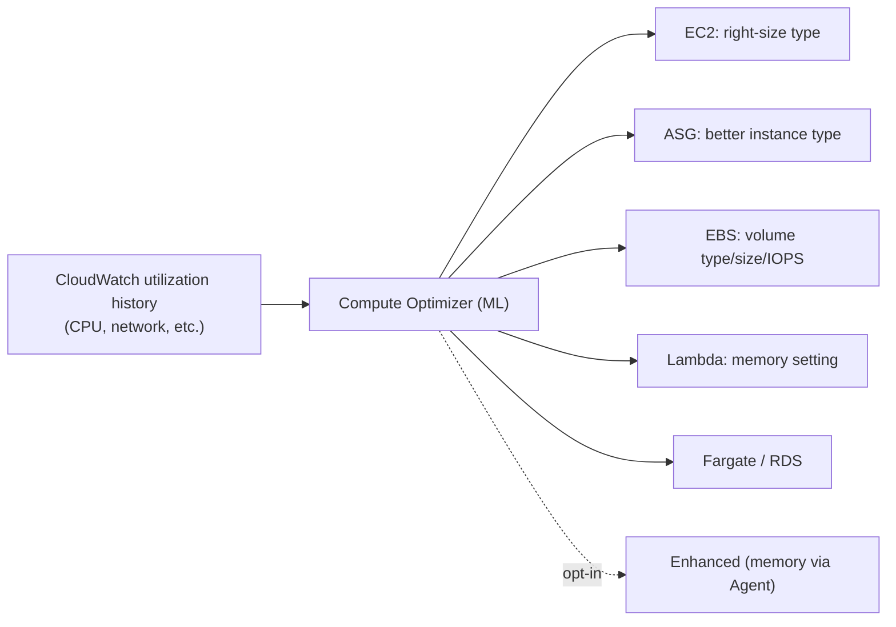

# AWS Compute Optimizer - Intro bits & bytes

> Compute Optimizer uses machine learning on your real CloudWatch utilization history to recommend the **right size and type** of your compute resources — EC2, Auto Scaling groups, EBS, Lambda, ECS-on-Fargate, and RDS. It answers "is this resource over- or under-provisioned, and what should it be instead?"

See also: [02 - AWS Compute Optimizer Deep Dive](02%20-%20AWS%20Compute%20Optimizer%20Deep%20Dive.md) · [03 - AWS Compute Optimizer Exam Scenarios](03%20-%20AWS%20Compute%20Optimizer%20Exam%20Scenarios.md) · [04 - AWS Compute Optimizer SRE Operations](04%20-%20AWS%20Compute%20Optimizer%20SRE%20Operations.md) · [01 - AWS Auto Scaling Intro bits & bytes](01%20-%20AWS%20Auto%20Scaling%20Intro%20bits%20%26%20bytes.md) · [01 - Cost Explorer Fundamentals & Architecture](01%20-%20Cost%20Explorer%20Fundamentals%20%26%20Architecture.md)

---

## Table of Contents

- [1. The Problem It Solves](#1-the-problem-it-solves)
- [2. What It Analyzes](#2-what-it-analyzes)
- [3. How Recommendations Work](#3-how-recommendations-work)
- [4. Compute Optimizer vs Cost Explorer vs Trusted Advisor](#4-compute-optimizer-vs-cost-explorer-vs-trusted-advisor)
- [5. When To Use It / When NOT To Use It](#5-when-to-use-it--when-not-to-use-it)
- [6. Cost Considerations](#6-cost-considerations)
- [7. Mini-Quiz](#7-mini-quiz)

---

---

## 1. The Problem It Solves

Most AWS bills are bloated by **over-provisioned** resources picked by guesswork ("m5.4xlarge, just in case") and **under-provisioned** ones that quietly throttle performance. Compute Optimizer removes the guesswork: it analyzes **actual utilization** and recommends a specific better resource, with the projected performance and cost impact, and a **risk** rating.

> Mental model: **Compute Optimizer recommends; it does not act.** It tells you "this m5.4xlarge should be an m6i.large." You (or automation) apply the change. Contrast with [Auto Scaling](01%20-%20AWS%20Auto%20Scaling%20Intro%20bits%20%26%20bytes.md), which _changes the count_ automatically.

[⬆ Back to top](#table-of-contents)

---

## 2. What It Analyzes

| Resource                                | Recommendation                                             |
| :-------------------------------------- | :--------------------------------------------------------- |
| **EC2 instances**                       | Optimal instance family/size; flags over/under-provisioned |
| **Auto Scaling groups**                 | Best instance type for the ASG's workload                  |
| **EBS volumes**                         | Volume type/size/IOPS (e.g. gp2 → gp3)                     |
| **Lambda functions**                    | Optimal **memory** setting (which also affects CPU/cost)   |
| **ECS services on Fargate**             | Task CPU/memory sizing                                     |
| **Commercial software / licenses, RDS** | RDS instance & storage right-sizing (newer)                |

Findings are classified: **Under-provisioned**, **Over-provisioned**, **Optimized**, or **None**.

[⬆ Back to top](#table-of-contents)

---

## 3. How Recommendations Work

- It reads **CloudWatch metrics** over a lookback window (default ~14 days; **enhanced infrastructure metrics** extend to up to **3 months** as a paid option).
- ML models compare your pattern to instance/volume characteristics and produce up to several **recommendation options**, each with projected utilization and **estimated monthly savings**.
- **Memory metrics aren't collected by default** — for memory-aware EC2 recommendations you must publish memory via the **CloudWatch Agent**.
- Works **per account** and **across an organization** when enabled at the org level (aggregated in the management/delegated-admin account).

[⬆ Back to top](#table-of-contents)

---

## 4. Compute Optimizer vs Cost Explorer vs Trusted Advisor

| Tool                  | Focus                                                                  | Output                                      |
| :-------------------- | :--------------------------------------------------------------------- | :------------------------------------------ |
| **Compute Optimizer** | Deep ML right-sizing of **compute** (EC2/ASG/EBS/Lambda/Fargate/RDS)   | Specific type/size recommendation + savings |
| **Cost Explorer**     | Cost/usage analysis & forecasting; basic EC2 right-sizing & RI/SP recs | Trends, RI/SP purchase recs                 |
| **Trusted Advisor**   | Broad best-practice checks incl. idle/underutilized resources          | Checklist across 5 pillars                  |

> Exam cue: "ML-driven, specific instance-type right-sizing across EC2/Lambda/EBS" → **Compute Optimizer**. "Forecast spend / RI & Savings Plans recommendations" → **Cost Explorer**. "Broad account-wide best-practice checklist" → **Trusted Advisor**.

[⬆ Back to top](#table-of-contents)

---

## 5. When To Use It / When NOT To Use It

**Use it when:** reducing compute cost without hurting performance, periodic right-sizing reviews, migrating to newer/cheaper instance families (Graviton candidates), tuning Lambda memory, or modernizing EBS (gp2→gp3).

**Don't expect it to:**

- **Scale automatically** — that's Auto Scaling (count) and it doesn't apply changes for you.
- Recommend for resources with **too little data** (needs sufficient utilization history; brand-new resources get "None").
- Account for **memory** unless you feed it via the agent.
- Right-size things outside its supported resource list.

[⬆ Back to top](#table-of-contents)

---

## 6. Cost Considerations

- **Base recommendations are free.**
- **Enhanced infrastructure metrics** (longer 3-month lookback) are a **paid** opt-in priced per resource/month.
- The savings come from **acting** on recommendations — pair with a change process (instance refresh for ASGs, Lambda memory tuning, EBS modification).
- Don't blindly downsize: check the **risk** rating and validate against peak/seasonal load before applying to production.

[⬆ Back to top](#table-of-contents)

---

## 7. Mini-Quiz

**Q1:** You want ML-based EC2 instance-type right-sizing recommendations. Which service?
_A:_ **Compute Optimizer**.

**Q2:** Memory isn't considered in EC2 recommendations. Why?
_A:_ Memory isn't collected by default — install the **CloudWatch Agent** to publish it.

**Q3:** Difference between Compute Optimizer and Auto Scaling?
_A:_ Compute Optimizer recommends the **size/type** (and doesn't act); Auto Scaling changes the **count** automatically.

**Q4:** Need RI/Savings Plans purchase recommendations and spend forecasting. Which tool?
_A:_ **Cost Explorer**, not Compute Optimizer.

---

> Continue to [02 - AWS Compute Optimizer Deep Dive](02%20-%20AWS%20Compute%20Optimizer%20Deep%20Dive.md).
