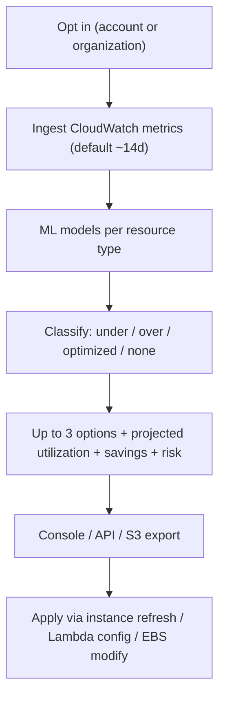

# AWS Compute Optimizer - Deep Dive

> Architecture, the recommendation pipeline, finding classifications & risk, enhanced metrics, organization-wide analysis, Graviton/migration guidance, limits, integrations, comparisons, and best practices.

See also: [01 - AWS Compute Optimizer Intro bits & bytes](01%20-%20AWS%20Compute%20Optimizer%20Intro%20bits%20%26%20bytes.md) · [03 - AWS Compute Optimizer Exam Scenarios](03%20-%20AWS%20Compute%20Optimizer%20Exam%20Scenarios.md) · [04 - AWS Compute Optimizer SRE Operations](04%20-%20AWS%20Compute%20Optimizer%20SRE%20Operations.md) · [01 - Amazon CloudWatch Intro bits & bytes](01%20-%20Amazon%20CloudWatch%20Intro%20bits%20%26%20bytes.md) · [01 - AWS Auto Scaling Intro bits & bytes](01%20-%20AWS%20Auto%20Scaling%20Intro%20bits%20%26%20bytes.md)

---

## Table of Contents

- [1. Recommendation Pipeline](#1-recommendation-pipeline)
- [2. Findings, Options, and Risk](#2-findings-options-and-risk)
- [3. Enhanced Infrastructure Metrics and Memory](#3-enhanced-infrastructure-metrics-and-memory)
- [4. Organization-Wide Analysis](#4-organization-wide-analysis)
- [5. Graviton and Migration Guidance](#5-graviton-and-migration-guidance)
- [6. Service Limits and Quotas](#6-service-limits-and-quotas)
- [7. Integration Matrix](#7-integration-matrix)
- [8. Comparisons](#8-comparisons)
- [9. Best Practices by Pillar](#9-best-practices-by-pillar)

---

---

## 1. Recommendation Pipeline

After you **opt in** (per account, or org-wide via the management account), Compute Optimizer continuously ingests CloudWatch utilization metrics for supported resources, runs ML models, and publishes recommendations accessible via the **console, API/CLI, or scheduled S3 export**. It needs a minimum amount of history before producing findings (very new resources show **None**).

[⬆ Back to top](#table-of-contents)

---

## 2. Findings, Options, and Risk

- **Findings**: `Under-provisioned` (performance risk), `Over-provisioned` (cost waste), `Optimized`, or `None` (insufficient data/unsupported).
- **Recommendation options**: typically up to 3 alternative configurations, each with **projected utilization**, **performance risk**, and **estimated monthly savings/cost**.
- **Performance risk** (e.g. Very Low → High) signals how likely the smaller option is to be too small under load — read it before downsizing prod.
- Metrics used include CPU, network, disk I/O (and memory **only** if provided).

[⬆ Back to top](#table-of-contents)

---

## 3. Enhanced Infrastructure Metrics and Memory

- **Enhanced infrastructure metrics** is a paid opt-in extending the lookback to **up to 3 months**, improving accuracy for monthly/seasonal patterns.
- **Memory**: not collected by default. Install the **CloudWatch Agent** to publish `mem_used_percent`; Compute Optimizer then factors memory into EC2 recommendations — important for memory-bound workloads that would otherwise be wrongly flagged over-provisioned on CPU alone.

[⬆ Back to top](#table-of-contents)

---

## 4. Organization-Wide Analysis

- Enable from the **management account** (or a **delegated administrator**) to aggregate recommendations across all member accounts — a single view of org-wide right-sizing savings.
- Combine with **Cost Explorer** rightsizing and **Trusted Advisor** for a complete cost-optimization governance loop.
- Export recommendations to **S3** and analyze with Athena/QuickSight for FinOps reporting.

[⬆ Back to top](#table-of-contents)

---

## 5. Graviton and Migration Guidance

- Compute Optimizer can surface **price-performance** improvements including **Graviton (ARM)** instance options, flagging workloads that are good migration candidates.
- For ASGs, recommendations target the **instance type**; apply via a new **Launch Template version + instance refresh** (see [01 - AWS Auto Scaling Intro bits & bytes](01%20-%20AWS%20Auto%20Scaling%20Intro%20bits%20%26%20bytes.md)).
- Validate architecture compatibility (x86 vs ARM) before adopting Graviton recommendations.

[⬆ Back to top](#table-of-contents)

---

## 6. Service Limits and Quotas

| Aspect                 | Detail                                                          |
| :--------------------- | :-------------------------------------------------------------- |
| Default lookback       | ~14 days (free); up to 3 months with enhanced metrics           |
| Minimum data           | Needs sufficient history; otherwise `None`                      |
| Supported resources    | EC2, ASG, EBS, Lambda, ECS-on-Fargate, RDS (expanding)          |
| Scope                  | Per region; org-wide aggregation via management/delegated admin |
| Recommendation options | Up to ~3 per resource                                           |

[⬆ Back to top](#table-of-contents)

---

## 7. Integration Matrix

| Service                      | Integration                                                                                                    |
| :--------------------------- | :------------------------------------------------------------------------------------------------------------- |
| **CloudWatch**               | Source of utilization metrics; agent for memory → [01 - Amazon CloudWatch Intro bits & bytes](01%20-%20Amazon%20CloudWatch%20Intro%20bits%20%26%20bytes.md)                |
| **Auto Scaling**             | Apply instance-type recs via Launch Template + instance refresh → [01 - AWS Auto Scaling Intro bits & bytes](01%20-%20AWS%20Auto%20Scaling%20Intro%20bits%20%26%20bytes.md) |
| **Cost Explorer**            | Complementary cost view + RI/SP recs → [01 - Cost Explorer Fundamentals & Architecture](01%20-%20Cost%20Explorer%20Fundamentals%20%26%20Architecture.md)                      |
| **Trusted Advisor**          | Overlapping idle/underutilized checks → [01 - AWS Trusted Advisor Intro bits & bytes](01%20-%20AWS%20Trusted%20Advisor%20Intro%20bits%20%26%20bytes.md)                        |
| **Organizations**            | Org-wide recommendations → [06 - IAM Identity Center & Organizations](06%20-%20IAM%20Identity%20Center%20%26%20Organizations.md)                                        |
| **S3 / Athena / QuickSight** | Scheduled export + FinOps analytics                                                                            |
| **Lambda**                   | Memory (power) tuning recommendations                                                                          |

[⬆ Back to top](#table-of-contents)

---

## 8. Comparisons

### Compute Optimizer vs Cost Explorer Rightsizing

|           | Compute Optimizer                   | Cost Explorer rightsizing    |
| :-------- | :---------------------------------- | :--------------------------- |
| Breadth   | EC2, ASG, EBS, Lambda, Fargate, RDS | Mainly EC2                   |
| Method    | ML, multiple options, risk          | Heuristic, single suggestion |
| Memory    | With agent                          | Limited                      |
| Also does | —                                   | RI/SP recs, forecasting      |

### Compute Optimizer vs Auto Scaling

|         | Compute Optimizer              | Auto Scaling                   |
| :------ | :----------------------------- | :----------------------------- |
| Changes | **Size/type** (recommend only) | **Count** (acts automatically) |
| Trigger | Periodic ML analysis           | Real-time metrics/schedule     |

[⬆ Back to top](#table-of-contents)

---

## 9. Best Practices by Pillar

**Cost Optimization** — review recommendations monthly; act on high-confidence over-provisioned findings; modernize gp2→gp3 and consider Graviton; track realized savings via S3 export.

**Performance Efficiency** — feed **memory** via the agent so memory-bound workloads aren't mis-sized; honor the **risk** rating; validate against peak load.

**Operational Excellence** — org-wide enablement + delegated admin; automate export → dashboard; integrate into a FinOps cadence.

**Reliability** — don't downsize blindly; stage in non-prod; pair ASG changes with instance refresh + health checks.

**Security** — least-privilege read role for the service; restrict who can act on recommendations in prod.

[⬆ Back to top](#table-of-contents)

---

> Continue to [03 - AWS Compute Optimizer Exam Scenarios](03%20-%20AWS%20Compute%20Optimizer%20Exam%20Scenarios.md).
