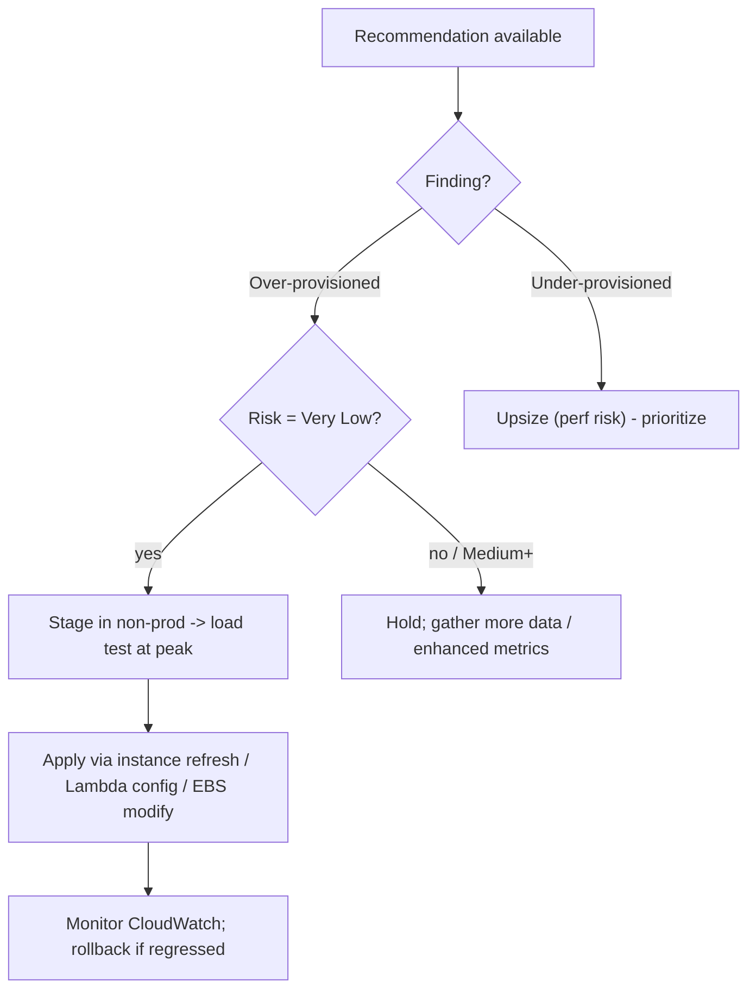

# AWS Compute Optimizer - SRE Operations

> Operational reality: why recommendations are missing or wrong, how to act on them safely, real CLI/export examples, FinOps patterns, and cost ops.

See also: [01 - AWS Compute Optimizer Intro bits & bytes](01%20-%20AWS%20Compute%20Optimizer%20Intro%20bits%20%26%20bytes.md) · [02 - AWS Compute Optimizer Deep Dive](02%20-%20AWS%20Compute%20Optimizer%20Deep%20Dive.md) · [03 - AWS Compute Optimizer Exam Scenarios](03%20-%20AWS%20Compute%20Optimizer%20Exam%20Scenarios.md) · [01 - AWS Auto Scaling Intro bits & bytes](01%20-%20AWS%20Auto%20Scaling%20Intro%20bits%20%26%20bytes.md)

---

## Table of Contents

- [1. Common Errors (Symptom → Root Cause → Fix → Prevention)](#1-common-errors-symptom--root-cause--fix--prevention)
- [2. Decision Workflow](#2-decision-workflow)
- [3. What to Track](#3-what-to-track)
- [4. Runbooks](#4-runbooks)
- [5. Real Examples](#5-real-examples)
- [6. Production / FinOps Patterns by Org Size](#6-production--finops-patterns-by-org-size)
- [7. Cost Operations](#7-cost-operations)

---

## 1. Common Errors (Symptom → Root Cause → Fix → Prevention)

### No recommendations / finding "None"

- **Cause:** Not opted in, insufficient utilization history, unsupported resource, or missing service-linked role.
- **Fix:** Opt in (account/org); wait for the lookback window; verify the role.
- **Prevention:** Enable org-wide; document the minimum-data requirement.

### Recommendation ignores memory (over-recommends downsizing)

- **Cause:** Memory not published.
- **Fix:** Deploy the **CloudWatch Agent** with `mem_used_percent`; re-evaluate.
- **Prevention:** Standardize the agent on all instances.

### Applied a recommendation, performance regressed

- **Cause:** Downsized past peak need; ignored the **risk** rating or seasonal load.
- **Fix:** Roll back (previous Launch Template version / resize up); use enhanced metrics.
- **Prevention:** Act on **Very Low risk** first; stage + load-test; keep rollback path.

### Org accounts missing from the aggregate

- **Cause:** Per-account opt-in/permission gaps.
- **Fix:** Verify enablement and the service-linked role per account.
- **Prevention:** Enable via Organizations + auto-onboard new accounts.

[⬆ Back to top](#table-of-contents)

---

## 2. Decision Workflow



[⬆ Back to top](#table-of-contents)

---

## 3. What to Track

| Signal                                          | Why                           |
| :---------------------------------------------- | :---------------------------- |
| Recommended vs applied vs realized savings      | FinOps KPI                    |
| Performance risk distribution                   | Safe-to-apply backlog         |
| Post-change CloudWatch (CPU/mem/latency/errors) | Catch regressions             |
| % resources with memory metrics                 | Accuracy coverage             |
| Under-provisioned findings                      | Performance/availability risk |

[⬆ Back to top](#table-of-contents)

---

## 4. Runbooks

### Runbook: monthly right-sizing review

1. Export recommendations to S3 (scheduled).
2. In Athena/QuickSight, rank by savings × (low risk).
3. Auto-apply Very-Low-risk over-provisioned in non-prod via pipeline; queue prod for approval.
4. After apply, watch CloudWatch for 1–2 weeks; record realized savings.

### Runbook: enable memory-aware recommendations

1. Push agent config (with `mem`) via SSM to the fleet.
2. Confirm `mem_used_percent` in CloudWatch.
3. Re-check Compute Optimizer after the lookback window.

[⬆ Back to top](#table-of-contents)

---

## 5. Real Examples

### Get EC2 recommendations (CLI)

```bash
aws compute-optimizer get-ec2-instance-recommendations \
  --query "instanceRecommendations[?finding=='OVER_PROVISIONED'].{Id:instanceArn,Current:currentInstanceType,Rec:recommendationOptions[0].instanceType,Risk:recommendationOptions[0].performanceRisk}" \
  --output table
```

### Export org recommendations to S3

```bash
aws compute-optimizer export-ec2-instance-recommendations \
  --s3-destination-config bucket=finops-co-exports,keyPrefix=ec2/ \
  --include-member-accounts \
  --file-format Csv
```

### Apply an ASG recommendation (new LT version + refresh)

```bash
aws ec2 create-launch-template-version --launch-template-name web-lt \
  --source-version 1 --launch-template-data '{"InstanceType":"m6i.large"}'
aws autoscaling start-instance-refresh --auto-scaling-group-name web-asg \
  --preferences MinHealthyPercentage=90,InstanceWarmup=180
```

### Tune Lambda memory from a recommendation

```bash
aws lambda update-function-configuration --function-name orders --memory-size 512
```

[⬆ Back to top](#table-of-contents)

---

## 6. Production / FinOps Patterns by Org Size

| Context           | Pattern                                                                                                               |
| :---------------- | :-------------------------------------------------------------------------------------------------------------------- |
| **Startup**       | Enable free recommendations; act on obvious over-provisioned + gp2→gp3.                                               |
| **SMB**           | Agent for memory; monthly review; instance refresh to apply ASG recs.                                                 |
| **Enterprise**    | Org-wide + delegated admin; scheduled S3 export → QuickSight; risk-gated automation; right-size before Savings Plans. |
| **Regulated**     | Very-Low-risk only, staged + load-tested, rollback via LT versions; separation of duties (analysts read-only).        |
| **Multi-Account** | Central FinOps account aggregates and reports realized savings.                                                       |

[⬆ Back to top](#table-of-contents)

---

## 7. Cost Operations

- Base recommendations are **free** — the ROI is in **acting** on them.
- Use **enhanced infrastructure metrics** selectively (paid) where seasonality matters.
- **Right-size before committing** to RIs/Savings Plans so commitments match true steady-state.
- Quantify and report **realized** savings (export + Cost Explorer actuals) to sustain the program.
- Pair with **Trusted Advisor** idle-resource checks and **Auto Scaling** scale-in for a full cost loop.

[⬆ Back to top](#table-of-contents)

---

Related: [01 - AWS Compute Optimizer Intro bits & bytes](01%20-%20AWS%20Compute%20Optimizer%20Intro%20bits%20%26%20bytes.md) · [02 - AWS Compute Optimizer Deep Dive](02%20-%20AWS%20Compute%20Optimizer%20Deep%20Dive.md) · [03 - AWS Compute Optimizer Exam Scenarios](03%20-%20AWS%20Compute%20Optimizer%20Exam%20Scenarios.md) · [01 - AWS Auto Scaling Intro bits & bytes](01%20-%20AWS%20Auto%20Scaling%20Intro%20bits%20%26%20bytes.md) · [01 - Cost Explorer Fundamentals & Architecture](01%20-%20Cost%20Explorer%20Fundamentals%20%26%20Architecture.md) · [01 - AWS Trusted Advisor Intro bits & bytes](01%20-%20AWS%20Trusted%20Advisor%20Intro%20bits%20%26%20bytes.md)
