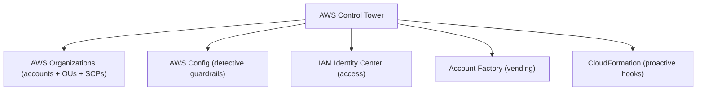

# AWS Control Tower - Cross-Reference

> AWS Control Tower is documented in depth in the **Security** domain. This stub keeps the Management & Governance index complete; follow the link for the full note.

See also: [07 - AWS Control Tower](07%20-%20AWS%20Control%20Tower.md) · [06 - IAM Identity Center & Organizations](06%20-%20IAM%20Identity%20Center%20%26%20Organizations.md) · [00 - Management and Governance Overview](00%20-%20Management%20and%20Governance%20Overview.md)

---

## Canonical Note

➡️ **[07 - AWS Control Tower](07%20-%20AWS%20Control%20Tower.md)** (in `02-IAM-Security/`)

That note covers: the landing zone, the management/log-archive/audit accounts, **guardrails** (preventive = SCPs, detective = Config rules, proactive = CloudFormation hooks), Account Factory, and how Control Tower sits on top of AWS Organizations.

---

## Where Control Tower Fits in Governance

Control Tower is the **opinionated, automated landing zone** built on the primitives in this section:

- The raw building block is [AWS Organizations](06%20-%20IAM%20Identity%20Center%20%26%20Organizations.md); Control Tower automates its setup.
- Account vending and the broader landing-zone concept are expanded in [01 - AWS Account Factory and Landing Zone Intro bits & bytes](01%20-%20AWS%20Account%20Factory%20and%20Landing%20Zone%20Intro%20bits%20%26%20bytes.md).
- Detective guardrails are [AWS Config](24%20-%20AWS%20Config%20%26%20Audit%20Manager.md) rules; preventive guardrails are [SCPs](08%20-%20SCP.md).

[⬆ Back to top](#canonical-note)
