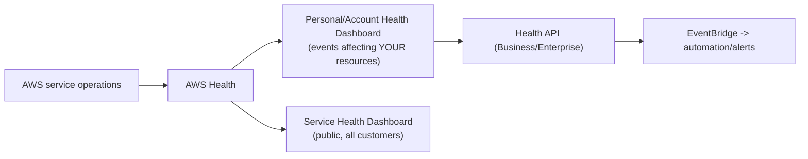

# AWS Health Dashboard - Intro bits & bytes

> The AWS Health Dashboard tells you about **events affecting AWS itself and your specific resources** — service disruptions, scheduled maintenance, and changes that require your action (certificate rotations, EOL, retirements). It answers "is the problem AWS's, and does it touch _my_ resources?"

See also: [02 - AWS Health Dashboard Deep Dive](02%20-%20AWS%20Health%20Dashboard%20Deep%20Dive.md) · [03 - AWS Health Dashboard Exam Scenarios](03%20-%20AWS%20Health%20Dashboard%20Exam%20Scenarios.md) · [04 - AWS Health Dashboard SRE Operations](04%20-%20AWS%20Health%20Dashboard%20SRE%20Operations.md) · [01 - Amazon CloudWatch Intro bits & bytes](01%20-%20Amazon%20CloudWatch%20Intro%20bits%20%26%20bytes.md) · [01 - EventBridge Governance Integrations Intro bits & bytes](01%20-%20EventBridge%20Governance%20Integrations%20Intro%20bits%20%26%20bytes.md)

---

## Table of Contents

- [1. The Problem It Solves](#1-the-problem-it-solves)
- [2. Two Dashboards: Service Health vs Your Account Health](#2-two-dashboards-service-health-vs-your-account-health)
- [3. The AWS Health API and Organizational View](#3-the-aws-health-api-and-organizational-view)
- [4. Health Dashboard vs CloudWatch](#4-health-dashboard-vs-cloudwatch)
- [5. When To Use It / When NOT To Use It](#5-when-to-use-it--when-not-to-use-it)
- [6. Cost Considerations](#6-cost-considerations)
- [7. Mini-Quiz](#7-mini-quiz)

---

---

## 1. The Problem It Solves

When something breaks, the first question is "is it me or AWS?" The Health Dashboard gives an **authoritative AWS-side view**: ongoing service issues, **scheduled maintenance** that will affect you, and **required actions** (e.g. an EC2 instance scheduled for retirement, an RDS certificate rotation, an EBS volume on degraded hardware). Crucially, the **account view is personalized** to _your_ resources — not just generic "service is degraded" notices.

> Mental model: CloudWatch watches **your** app's health; the Health Dashboard watches **AWS's** health _as it affects you_, plus action-required notices. Different question, different service.

[⬆ Back to top](#table-of-contents)

---

## 2. Two Dashboards: Service Health vs Your Account Health

|              | **Service Health Dashboard (SHD)** | **Account/Personal Health Dashboard (PHD)**                       |
| :----------- | :--------------------------------- | :---------------------------------------------------------------- |
| Audience     | Public, all customers              | Your account, **personalized**                                    |
| Shows        | General regional service status    | Events affecting **your specific resources**                      |
| Examples     | "S3 elevated errors in us-east-1"  | "Your instance i-123 is scheduled for retirement on <date>"       |
| Action items | No                                 | **Yes** — required/recommended actions with affected resource IDs |

> The personalized **Account Health Dashboard** (formerly "Personal Health Dashboard") is the one that matters operationally — it's scoped to your resources and includes proactive notifications.

[⬆ Back to top](#table-of-contents)

---

## 3. The AWS Health API and Organizational View

- The **AWS Health API** (programmatic access to events) requires a **Business, Enterprise On-Ramp, or Enterprise Support** plan.
- **Organizational view** aggregates health events across **all accounts** in your AWS Organization into one place (great for central ops).
- Health events are emitted to **EventBridge**, so you can **automate**: notify on-call, open tickets, or trigger remediation (e.g. drain/replace an instance scheduled for retirement).
- Event categories: **issue** (service disruption), **scheduledChange** (maintenance), **accountNotification** (informational/action).

[⬆ Back to top](#table-of-contents)

---

## 4. Health Dashboard vs CloudWatch

| Question                                                            | Service                  |
| :------------------------------------------------------------------ | :----------------------- |
| Is **AWS** having an issue / maintenance affecting my resources?    | **AWS Health Dashboard** |
| Required action on a specific resource (retirement, cert rotation)? | **AWS Health Dashboard** |
| Is **my application** healthy/performing (CPU, latency, errors)?    | **CloudWatch**           |
| Who made an API call?                                               | **CloudTrail**           |

> Exam cue: "notification that _your_ EC2 instance is scheduled for retirement / hardware degradation / maintenance" → **AWS Health (Account Health Dashboard)**, automate via **EventBridge**.

[⬆ Back to top](#table-of-contents)

---

## 5. When To Use It / When NOT To Use It

**Use it for:** awareness of AWS-side incidents touching you, proactive handling of scheduled changes/retirements, central org-wide health visibility, and automating responses to required actions.

**Don't expect it to:**

- Monitor **your application** metrics → CloudWatch.
- Replace **status checks/auto-recovery** of an instance → CloudWatch EC2 actions.
- Give the **API/programmatic** access on Basic support (needs Business+).

[⬆ Back to top](#table-of-contents)

---

## 6. Cost Considerations

- The dashboards are **free**; the **Health API** and richer integration require **Business/Enterprise** support (the cost lever).
- Acting on **scheduled retirements/maintenance proactively** avoids unplanned downtime (and its cost) — e.g. replace a retiring instance during a window instead of an outage.
- **Organizational view** (with Organizations) avoids per-account monitoring overhead.

[⬆ Back to top](#table-of-contents)

---

## 7. Mini-Quiz

**Q1:** "Is this outage AWS's fault and does it affect my resources?" — which service?
_A:_ **AWS Health (Account Health Dashboard)**.

**Q2:** Automatically act when an EC2 instance is scheduled for retirement.
_A:_ Health event → **EventBridge** → Lambda/SSM automation.

**Q3:** Health API and org-wide aggregation require what?
_A:_ **Business/Enterprise Support** (+ Organizations for org view).

**Q4:** Health Dashboard vs CloudWatch?
_A:_ Health = **AWS-side** events affecting you; CloudWatch = **your** app/resource metrics.

---

> Continue to [02 - AWS Health Dashboard Deep Dive](02%20-%20AWS%20Health%20Dashboard%20Deep%20Dive.md).
