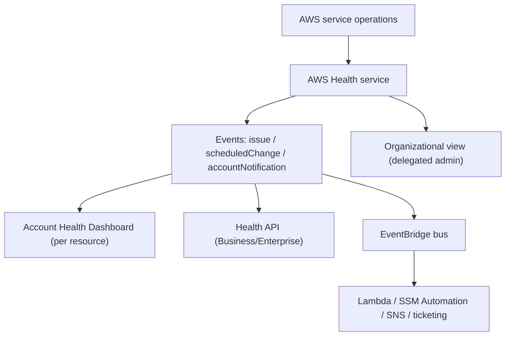

# AWS Health Dashboard - Deep Dive

> Architecture, event types & lifecycle, the Health API, organizational view & delegated admin, EventBridge automation, limits, integrations, comparisons, best practices.

See also: [01 - AWS Health Dashboard Intro bits & bytes](01%20-%20AWS%20Health%20Dashboard%20Intro%20bits%20%26%20bytes.md) · [03 - AWS Health Dashboard Exam Scenarios](03%20-%20AWS%20Health%20Dashboard%20Exam%20Scenarios.md) · [04 - AWS Health Dashboard SRE Operations](04%20-%20AWS%20Health%20Dashboard%20SRE%20Operations.md) · [01 - EventBridge Governance Integrations Intro bits & bytes](01%20-%20EventBridge%20Governance%20Integrations%20Intro%20bits%20%26%20bytes.md)

---

## Table of Contents

- [1. Architecture](#1-architecture)
- [2. Event Types and Lifecycle](#2-event-types-and-lifecycle)
- [3. The AWS Health API](#3-the-aws-health-api)
- [4. Organizational View and Delegated Administrator](#4-organizational-view-and-delegated-administrator)
- [5. EventBridge Automation](#5-eventbridge-automation)
- [6. Service Limits and Quotas](#6-service-limits-and-quotas)
- [7. Integration Matrix](#7-integration-matrix)
- [8. Comparisons](#8-comparisons)
- [9. Best Practices by Pillar](#9-best-practices-by-pillar)

---

---

## 1. Architecture

AWS Health is a managed, AWS-published feed of events about service operations and your resources. The **Service Health Dashboard** is the public status page; the **Account Health Dashboard** filters to events impacting _your_ account/resources and adds **proactive notifications** and **required actions** with affected resource identifiers. Events also flow to **EventBridge** and are retrievable via the **Health API**.

[⬆ Back to top](#table-of-contents)

---

## 2. Event Types and Lifecycle

| Type                    | Meaning                          | Example                                               |
| :---------------------- | :------------------------------- | :---------------------------------------------------- |
| **issue**               | An AWS service problem           | Elevated API errors in a region                       |
| **scheduledChange**     | Planned maintenance/change       | RDS maintenance window; network maintenance           |
| **accountNotification** | Informational or action-required | Certificate rotation, EC2 retirement, EOL deprecation |

- Events have a **lifecycle** (open → upcoming → closed) and an **event ARN**, affected entities (resource IDs), regions, and start/end times.
- Proactive events give **lead time** to act before impact.

[⬆ Back to top](#table-of-contents)

---

## 3. The AWS Health API

- Operations like `DescribeEvents`, `DescribeEventDetails`, `DescribeAffectedEntities` let you query events and the specific resources affected.
- **Requires Business / Enterprise On-Ramp / Enterprise Support.**
- Used to build custom dashboards, sync to ITSM, or drive automation beyond EventBridge.

[⬆ Back to top](#table-of-contents)

---

## 4. Organizational View and Delegated Administrator

- **Organizational view** aggregates Health events across **all member accounts** (enable via the management account; supports a **delegated administrator**).
- A central ops team sees, in one place, every account's issues/scheduled changes/required actions.
- Organization-level Health events can be consumed on the **organization's EventBridge** for centralized automation.

[⬆ Back to top](#table-of-contents)

---

## 5. EventBridge Automation

Common automated responses to Health events:

- **issue** affecting a region → notify on-call (SNS), update a status page, fail over (Route 53).
- **scheduledChange** for RDS/EC2 → schedule the maintenance handling, notify owners.
- **accountNotification** (EC2 retirement) → SSM Automation to stop/start (move to new hardware) or drain+replace via the ASG.

> The retirement pattern is a classic: Health event → EventBridge rule → SSM Automation / Lambda that gracefully replaces the affected instance before the retirement date.

[⬆ Back to top](#table-of-contents)

---

## 6. Service Limits and Quotas

| Aspect          | Detail                                                |
| :-------------- | :---------------------------------------------------- |
| Dashboards      | Free                                                  |
| Health API      | Business/Enterprise support                           |
| Org view        | Organizations + (optional) delegated admin            |
| Event retention | Events available for a period (e.g. ~90 days via API) |
| EventBridge     | Health events delivered to default/org bus            |

[⬆ Back to top](#table-of-contents)

---

## 7. Integration Matrix

| Service             | Integration                                                                                                   |
| :------------------ | :------------------------------------------------------------------------------------------------------------ |
| **EventBridge**     | Health events → automation/alerts → [01 - EventBridge Governance Integrations Intro bits & bytes](01%20-%20EventBridge%20Governance%20Integrations%20Intro%20bits%20%26%20bytes.md)           |
| **Organizations**   | Org-wide aggregation + delegated admin → [06 - IAM Identity Center & Organizations](06%20-%20IAM%20Identity%20Center%20%26%20Organizations.md)                         |
| **Systems Manager** | Automation runbooks to remediate (e.g. instance retirement) → [01 - AWS Systems Manager Intro bits & bytes](01%20-%20AWS%20Systems%20Manager%20Intro%20bits%20%26%20bytes.md) |
| **SNS**             | Notifications to on-call/email                                                                                |
| **CloudWatch**      | Complementary: app metrics vs AWS-side events → [01 - Amazon CloudWatch Intro bits & bytes](01%20-%20Amazon%20CloudWatch%20Intro%20bits%20%26%20bytes.md)                 |
| **Route 53 / ELB**  | Failover in response to regional issues                                                                       |
| **Support API**     | Health API access tier                                                                                        |

[⬆ Back to top](#table-of-contents)

---

## 8. Comparisons

### AWS Health vs CloudWatch vs CloudTrail

|           | AWS Health                                           | CloudWatch           | CloudTrail     |
| :-------- | :--------------------------------------------------- | :------------------- | :------------- |
| Source    | AWS service operations + your resource events        | Your metrics/logs    | API activity   |
| Answers   | "AWS issue/maintenance/required action affecting me" | "Is my app healthy"  | "Who did what" |
| Proactive | Yes (scheduled changes)                              | Alarms on thresholds | After-the-fact |

### Account Health Dashboard vs Service Health Dashboard

|              | Account/Personal   | Service (public)       |
| :----------- | :----------------- | :--------------------- |
| Scope        | Your resources     | All customers, general |
| Action items | Yes (resource IDs) | No                     |

[⬆ Back to top](#table-of-contents)

---

## 9. Best Practices by Pillar

**Operational Excellence** — wire Health events to **EventBridge** → SNS/ticketing; org view for central ops; automate retirement/maintenance handling.

**Reliability** — act on **scheduledChange** and retirements ahead of time; use issue events to trigger failover (multi-AZ/region).

**Security** — restrict who can view org-wide health; treat security-relevant notifications promptly.

**Cost Optimization** — proactive handling avoids emergency, costly remediation; org view reduces monitoring overhead.

[⬆ Back to top](#table-of-contents)

---

> Continue to [03 - AWS Health Dashboard Exam Scenarios](03%20-%20AWS%20Health%20Dashboard%20Exam%20Scenarios.md).
