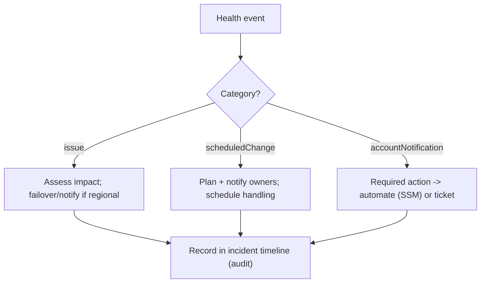

# AWS Health Dashboard - SRE Operations

> Operational reality: turning Health events into automated, audited action; real EventBridge/API examples; org patterns; and DR alignment.

See also: [01 - AWS Health Dashboard Intro bits & bytes](01%20-%20AWS%20Health%20Dashboard%20Intro%20bits%20%26%20bytes.md) · [02 - AWS Health Dashboard Deep Dive](02%20-%20AWS%20Health%20Dashboard%20Deep%20Dive.md) · [03 - AWS Health Dashboard Exam Scenarios](03%20-%20AWS%20Health%20Dashboard%20Exam%20Scenarios.md) · [01 - AWS Systems Manager Intro bits & bytes](01%20-%20AWS%20Systems%20Manager%20Intro%20bits%20%26%20bytes.md)

---

## Table of Contents

- [1. Common Issues (Symptom → Root Cause → Fix → Prevention)](#1-common-issues-symptom--root-cause--fix--prevention)
- [2. Operational Workflow](#2-operational-workflow)
- [3. What to Monitor](#3-what-to-monitor)
- [4. Runbooks](#4-runbooks)
- [5. Real Examples](#5-real-examples)
- [6. Production Patterns by Org Size](#6-production-patterns-by-org-size)
- [7. DR & Reliability Alignment](#7-dr--reliability-alignment)

---

## 1. Common Issues (Symptom → Root Cause → Fix → Prevention)

### Missed a scheduled retirement → unplanned outage

- **Cause:** No automation/notification on Health events.
- **Fix:** Wire Health → EventBridge → SNS/ticket; handle before the deadline.
- **Prevention:** Standing automation for accountNotification/scheduledChange.

### Health API calls fail

- **Cause:** Basic/Developer support.
- **Fix:** Upgrade to Business/Enterprise for API/org view.
- **Prevention:** Match support tier to ops needs.

### Org view empty

- **Cause:** Organizations trusted access / delegated admin not set.
- **Fix:** Enable org view; assign delegated admin.
- **Prevention:** Configure during landing-zone build.

### Alert fatigue from informational events

- **Cause:** Routing all event types/severities to paging.
- **Fix:** Filter EventBridge rules by event type/category/service; page only on actionable.
- **Prevention:** Tiered routing (page vs ticket vs digest).

[⬆ Back to top](#table-of-contents)

---

## 2. Operational Workflow



[⬆ Back to top](#table-of-contents)

---

## 3. What to Monitor

| Signal                                      | Why                                |
| :------------------------------------------ | :--------------------------------- |
| Open issue events for your regions/services | Active impact                      |
| Upcoming scheduledChange / retirements      | Lead-time planning                 |
| accountNotification action items            | Compliance/SLA on required actions |
| Org-view hotspots per account               | Where to focus                     |

[⬆ Back to top](#table-of-contents)

---

## 4. Runbooks

### Runbook: automate retirement handling

1. EventBridge rule: source `aws.health`, detail-type "AWS Health Event", filter EC2 retirement.
2. Target SSM Automation: stop/start the instance (moves to new hardware) or trigger ASG instance replacement.
3. Notify owner (SNS); record action + timestamp.

### Runbook: regional issue response

1. EventBridge rule on `issue` events for your regions.
2. Notify on-call; if customer-impacting, initiate Route 53 failover and status-page update.
3. Track in the incident record; close when the issue clears.

[⬆ Back to top](#table-of-contents)

---

## 5. Real Examples

### EventBridge rule for Health events

```json
{
  "source": ["aws.health"],
  "detail-type": ["AWS Health Event"],
  "detail": {
    "service": ["EC2"],
    "eventTypeCategory": ["scheduledChange", "accountNotification"]
  }
}
```

### Query events via the Health API

```bash
aws health describe-events --filter "eventStatusCodes=open,upcoming" \
  --query "events[].{Arn:arn,Service:service,Type:eventTypeCode,Region:region}"

aws health describe-affected-entities --filter "eventArns=<event-arn>" \
  --query "entities[].entityValue"
```

### SSM Automation target (concept)

```text
EventBridge rule (EC2 retirement) -> SSM Automation document
  Step 1: stop instance
  Step 2: start instance (lands on healthy hardware)
  Step 3: verify status checks pass; notify via SNS
```

[⬆ Back to top](#table-of-contents)

---

## 6. Production Patterns by Org Size

| Context          | Pattern                                                                                  |
| :--------------- | :--------------------------------------------------------------------------------------- |
| **Startup**      | Account dashboard + EventBridge → SNS for retirements/issues.                            |
| **SMB**          | Filtered routing (page vs ticket); SSM automation for retirements.                       |
| **Enterprise**   | Org view + delegated admin; org EventBridge → central ITSM; Health API custom dashboard. |
| **Regulated**    | Tracked closure of required actions with retained records; audit timeline integration.   |
| **Multi-Region** | Issue events drive Route 53 failover; per-region routing.                                |

[⬆ Back to top](#table-of-contents)

---

## 7. DR & Reliability Alignment

- Treat **issue** events as a failover signal in your DR runbooks (complement, not replace, health-check-based failover).
- Handle **scheduledChange/retirement** proactively so maintenance never becomes an outage.
- Keep the **automation (EventBridge rules, SSM docs)** defined as IaC and present in all regions/accounts.
- Feed Health events into the **incident/postmortem** record alongside CloudWatch and CloudTrail for accurate timelines.

[⬆ Back to top](#table-of-contents)

---

Related: [01 - AWS Health Dashboard Intro bits & bytes](01%20-%20AWS%20Health%20Dashboard%20Intro%20bits%20%26%20bytes.md) · [02 - AWS Health Dashboard Deep Dive](02%20-%20AWS%20Health%20Dashboard%20Deep%20Dive.md) · [03 - AWS Health Dashboard Exam Scenarios](03%20-%20AWS%20Health%20Dashboard%20Exam%20Scenarios.md) · [01 - EventBridge Governance Integrations Intro bits & bytes](01%20-%20EventBridge%20Governance%20Integrations%20Intro%20bits%20%26%20bytes.md) · [01 - AWS Systems Manager Intro bits & bytes](01%20-%20AWS%20Systems%20Manager%20Intro%20bits%20%26%20bytes.md) · [01 - Amazon CloudWatch Intro bits & bytes](01%20-%20Amazon%20CloudWatch%20Intro%20bits%20%26%20bytes.md)
