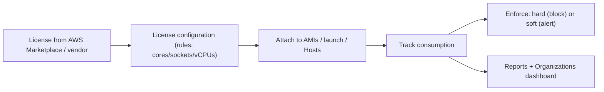

# AWS License Manager - Intro bits & bytes

> AWS License Manager helps you **track, enforce, and report** on software licenses — especially **Bring-Your-Own-License (BYOL)** for commercial software (Windows, SQL Server, Oracle, SAP) bound to cores/sockets/vCPUs. It prevents over-deployment (license breach) and surfaces under-use, across accounts and even on-prem.

See also: [02 - AWS License Manager Deep Dive](02%20-%20AWS%20License%20Manager%20Deep%20Dive.md) · [03 - AWS License Manager Exam Scenarios](03%20-%20AWS%20License%20Manager%20Exam%20Scenarios.md) · [04 - AWS License Manager SRE Operations](04%20-%20AWS%20License%20Manager%20SRE%20Operations.md) · [06 - IAM Identity Center & Organizations](06%20-%20IAM%20Identity%20Center%20%26%20Organizations.md) · [01 - AWS Systems Manager Intro bits & bytes](01%20-%20AWS%20Systems%20Manager%20Intro%20bits%20%26%20bytes.md)

---

## Table of Contents

- [1. The Problem It Solves](#1-the-problem-it-solves)
- [2. Core Concepts](#2-core-concepts)
- [3. License-Bound Constraints and Enforcement](#3-license-bound-constraints-and-enforcement)
- [4. Dedicated Hosts and Host Resource Groups](#4-dedicated-hosts-and-host-resource-groups)
- [5. When To Use It / When NOT To Use It](#5-when-to-use-it--when-not-to-use-it)
- [6. Cost Considerations](#6-cost-considerations)
- [7. Mini-Quiz](#7-mini-quiz)

---

---

## 1. The Problem It Solves

Commercial software is often licensed by **physical cores, sockets, or vCPUs**, with strict rules (e.g. Oracle/SQL Server). In the cloud it's easy to **accidentally over-deploy** and breach your license (audit risk, big penalties) or **over-buy** and waste money. License Manager lets you encode license **rules** once, **track consumption** automatically as instances launch, and **enforce** limits — so you stay compliant and optimize spend.

> Mental model: License Manager is a **license meter + guardrail**. You define "I own 64 cores of SQL Server"; it counts usage against that and can **block** launches that would exceed it.

[⬆ Back to top](#table-of-contents)

---

## 2. Core Concepts

| Concept                       | Meaning                                                                    |
| :---------------------------- | :------------------------------------------------------------------------- |
| **License configuration**     | Rules for a license (counting type: vCPUs/cores/sockets/instances; limits) |
| **Associate**                 | Attach a config to AMIs, launch templates, instances, or Dedicated Hosts   |
| **Consumption tracking**      | Automatic count of usage against the limit                                 |
| **Enforcement**               | **Hard** (prevent launch beyond limit) or **soft** (allow + alert)         |
| **Seller-issued licenses**    | Licenses purchased via AWS Marketplace tracked here                        |
| **Organizations integration** | Cross-account tracking/sharing of license configs                          |

[⬆ Back to top](#table-of-contents)

---

## 3. License-Bound Constraints and Enforcement

- A license configuration sets the **counting basis** (vCPUs, physical cores, sockets, or number of instances) matching the vendor's metric and a **limit**.
- **Hard enforcement**: launches that would exceed the limit are **blocked** — guarantees compliance.
- **Soft enforcement**: launches are allowed but you're **alerted** when over — visibility without blocking.
- Rules can also enforce **dedicated tenancy** or specific host affinity required by some licenses.

[⬆ Back to top](#table-of-contents)

---

## 4. Dedicated Hosts and Host Resource Groups

- Some BYOL licenses (e.g. certain Windows/SQL/Oracle terms) require **Dedicated Hosts** (physical isolation, visibility into sockets/cores).
- License Manager can manage **Host Resource Groups** and **automate Dedicated Host allocation/management** so license-bound workloads land on compliant hosts automatically.
- This pairs license rules with the **tenancy** the license demands.

[⬆ Back to top](#table-of-contents)

---

## 5. When To Use It / When NOT To Use It

**Use it when:** you run **BYOL** commercial software, must prove **license compliance** (audits), want to prevent over-deployment, track usage **across accounts/on-prem**, or manage **Dedicated Hosts** for license-bound workloads.

**Don't reach for it when:**

- Software is **license-included** (AWS-provided licensing) with no BYOL → no tracking needed.
- It's purely **open-source**/no license metric.
- You need **right-sizing/cost** (Compute Optimizer/Cost Explorer) — License Manager is about _licenses_, not performance/cost sizing.

[⬆ Back to top](#table-of-contents)

---

## 6. Cost Considerations

- License Manager itself is **free**; you pay for the underlying resources (e.g. **Dedicated Hosts**, which can be costly) and any Marketplace licenses.
- Big savings come from **avoiding over-deployment penalties** and **right-buying** licenses (track under-utilization to reclaim/avoid renewing unused entitlements).
- **Dedicated Hosts** for BYOL are a notable cost — ensure the license actually requires them vs license-included options.

[⬆ Back to top](#table-of-contents)

---

## 7. Mini-Quiz

**Q1:** What does License Manager primarily manage?
_A:_ Software **licenses** (esp. BYOL by cores/sockets/vCPUs), tracking + enforcement.

**Q2:** Guarantee you never breach a license limit on launch.
_A:_ **Hard enforcement** (block launches over the limit).

**Q3:** A BYOL license requires physical core visibility/isolation.
_A:_ Use **Dedicated Hosts** (License Manager can automate via Host Resource Groups).

**Q4:** Track license usage across all org accounts.
_A:_ **Organizations integration** with License Manager.

---

> Continue to [02 - AWS License Manager Deep Dive](02%20-%20AWS%20License%20Manager%20Deep%20Dive.md).
